**Application: beyond attack and defense**  
Initiated from paper "A Unified Anomaly Synthesis Strategy with Gradient Ascent for Industrial Anomaly Detection and Localization", a higher-level of Adversarial Robustness, which can also be called as Gradient-based generation, emersed out of my mind.
And the attack and defense are only the mean to find direction of generation, i.e. gradient.
Using attack as example, we try to transform a normal instance in sample space to a poison one that behaves bad in the decision space defined by objective. Since all normal instances are those have smallest loss under our target function, also, good behave boys, poison one the naughty one will stay in where it doesn’t belong, results in high loss.
The gradient of objective exactly tells us where to find such bad boy.
There are few basic elements can be extracted from the example
1.  A decision space tells the distribution of samples under specific objective
2.  A objective who's gradient can point out generation direction

One more example: Style transfer
To generate an image has specific content while under some art style means the generated instance shares similar content feature to provided content image while so as to the art image.
Such objective can be mathematically described by distance between embedding vectors and its gradient can lead us to such generation meets requirements

Two more example: Watermark
The watermark issue is similar to the attack example but a safe-guard instance instead of a poison one.
This also answer the question:
Why the same schema of adding gradient can lead to total paradox instances, one is for attack while the other one is for defense ?

Last example: anomaly detection
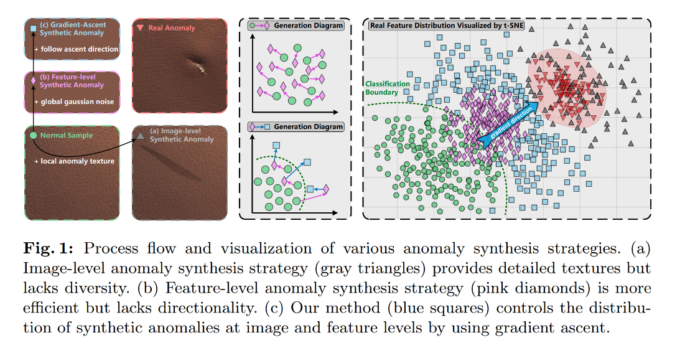
Gradient of objective for finding good explanation of normal instance tells the direction toward abnormal one.

**What's is the Adversarial sample ?**  
The classification task's target for a **input space** is to find best decision plane that can tell it from different classes.
Take Binary Bayesian Classifier as example, the best decision plane is found at the intersection between classes'
conditional probability distribution
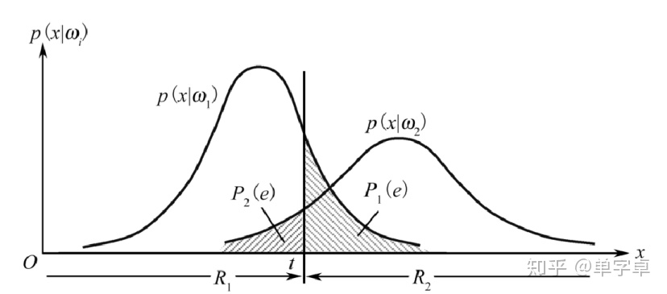
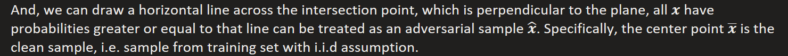
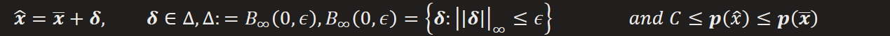

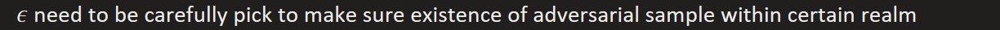
Note: introducing probabilistic model can turn discrete **input space** into continuous one, that can help us build a more soft model

**How does perturbation works ?**  
In fact, perturbation is more than a random noise applied on clean sample, it is trying to drag clean sample toward a condition that may confuse with other class but still recognizable. Here we can take same informal example to get some compact insight.
**Mixup**: it's an augment strategy that do convex combination on two samples. If applied with mild enough overlap of other class's sample, we can take it as an case of perturbation, and we can visually see the draging(adversarial) direction.
**Autoencoder**: By decoding on continuous configuration of mean and variance, we can also visually see continuous transformation between differen samples on **input space**, that shows a dynamic process of draging action. But only few parts of the transformation close to clean samples at begin and end can be seen as perturbation.
**Linear model**:

this shows a perturbation for a binary linear classifier, the gray plot is the perturbation, we can see that perturbation for 1 has white region similar to 0, while for 0 has gray region similar to 1, that again prove our speculation that perturbation is an dragging direction on **input space**, which leads clean sample to its adversarial direction.
**Target attack**: this attack strategy is aim at fooling classifier for specific label. e.g. we may want model missclassify all sample in **input space** as label 0 for number recognition
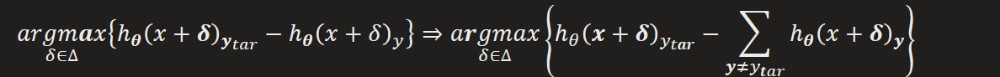
using infinity norm
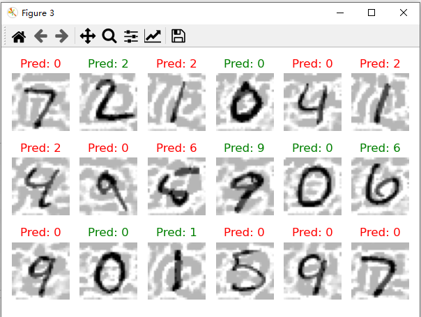
using 2-order norm
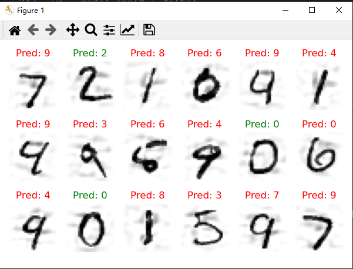
here we tried to fool model classifying all sample with label 0, but some are failed with other results, that is due to multi-intersection of sample's class conditional probability distributions, i.e. take the figure with number 1 as example, the perturbation brought missclassification to 2, instead of 0, that's because there is an intersection of **input space** belong to label 0, 1, and 2, so the adding perturbation is dragging sample toward 0's and 2's direction at the same time.
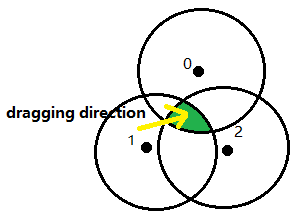

**Why our regular hypothesis fail on adversarial sample ?**  
Since the limitness of data, we can not train a desired hypothesis, that is our model may fail on adversarial sample
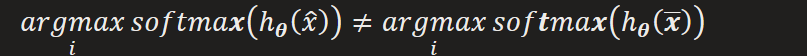
That is quite weird, since the adding perturbation almost change nothing against the original sample, but model totally miss the correct answer.
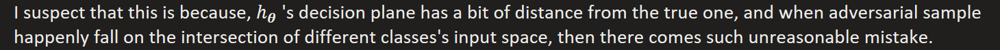

**How do we get Adversarial sample ?**  
According to Maxilikelihood Assumption, point with higher probability has lower loss, so we can get Adversarial sample by finding points that have higher loss with same class label.
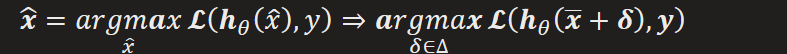
So we can get adversarial sample by applying **gradient ascent** on clean sample
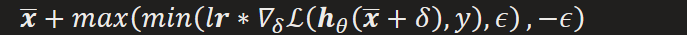
Note that we should clip the perturbation so adversarial sample is still a valid sample, and also
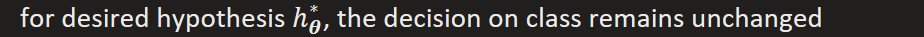
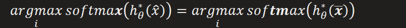
e.g. if take human's classification capacity as the desired hypothesis, then the adversarial sample should have same appearance as non one

**How do we approximate to desired hypothesis ?**  
If we can optimize our model on hardest adversarial sample, then we can really approch the best one, that is
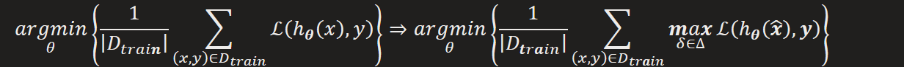
In contrast to traditional risk, we need to optimize on adversarial risk, which become a **min-max** problem, i.e.
iteratively doing the follow steps
According to **Danskin's theorem**, if we can find global optimal in the inner maximization, then we can simplify it into a minimization problem, same as the way solving SVM.
1.  
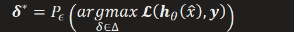

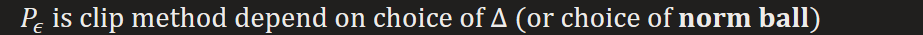

**Strategy for solving it:**  

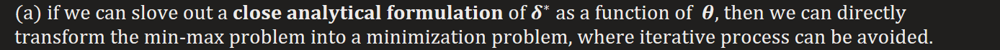

e.g. for binary classification

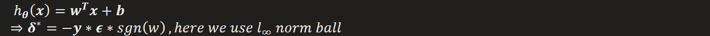

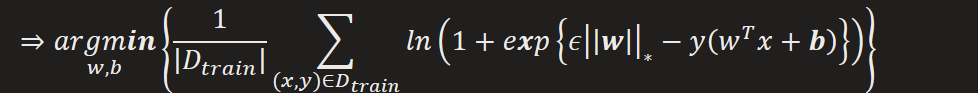

or optimize it exactly by turning it into combinatorial optimization problem on specific network

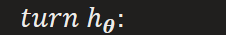

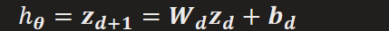

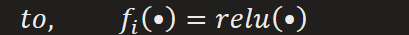

Linear programming

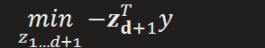

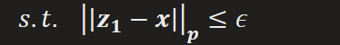

\(b\) even if close solution can not be satisfied, with convexity provided, we can still indirectly transform the min-max problem into a minimization one by finding its **lower bound**(not the worst)

e.g.

FGSM

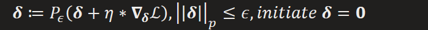

PGD: iterative FGSM

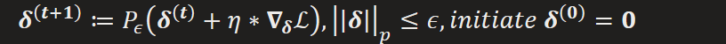

plus with steepest descent, get rid of influence from scale of gradient

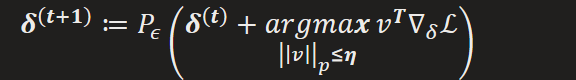

\(c\) or solving its **upper bound** objective (i.e. solving network's convex relaxation).

2.  
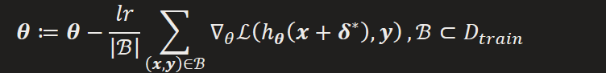

**Corresponding Strategy for solving it:**  

\(a\) Not a pratical approach, both exact solution on min and max problem are too complex and too time consuming

\(b\) Using lower bounds, train empirically an robust classifier with adversarial samples

\(c\) Using convex upper bound, train provably robust classifier

The method may only lead to a local optimal of original problem, in order to find better solution, we need
1.  find as worse adversarial sample as possible, i.e. make defense as difficult as possible
2.  worse case may cause osscilations while training, so multiple perturbation with different random initialization should be considered. And also, an un-balance training procedure should be introduced where Defense has more learning steps than Attack
3.  some bound optimization can be used to non-iteratively solve the inner max problem.

Note that there is a trade-off between robust accuracy and clean accuracy

==对抗训练概念的提出==

==对抗训练（Adversarial Training）的概念最早由 Ian Goodfellow 等人在 2015 年的论文《Explaining and Harnessing Adversarial Examples》中提出。该论文提出了快速梯度符号法（Fast Gradient Sign Method，FGSM）来生成对抗样本，并首次将对抗训练作为一种防御对抗攻击的方法，将生成的对抗样本加入到训练集中，以增强模型对对抗样本的鲁棒性。==

==经典讨论对抗攻击和训练的论文==
1.  ==《Explaining and Harnessing Adversarial Examples》==
- ==作者：Ian J. Goodfellow, Jonathon Shlens, Christian Szegedy==
- ==发表时间：2015 年==
- ==核心内容：提出了 FGSM 攻击方法，用于快速生成对抗样本，并介绍了对抗训练的基本思想，即通过在训练过程中加入对抗样本，提高模型对对抗攻击的鲁棒性。==
2.  ==《Towards Deep Learning Models Resistant to Adversarial Attacks》==
- ==作者：Aleksander Madry, Aleksandar Makelov, Ludwig Schmidt, Dimitris Tsipras, Adrian Vladu==
- ==发表时间：2018 年==
- ==核心内容：提出了投影梯度下降法（Projected Gradient Descent，PGD）对抗训练，将对抗训练表述为一个 min-max 优化问题，并证明了 PGD 对抗训练可以获得更稳健的模型。该论文深入探讨了对抗训练的原理和有效性，成为对抗训练领域的经典之作。==
3.  ==《Adversarial Examples Are Not Easily Detected: Bypassing Ten Detection Methods》==
- ==作者：Anish Athalye, Nicholas Carlini, David Wagner==
- ==发表时间：2018 年==
- ==核心内容：评估了多种对抗样本检测方法，发现许多方法存在梯度混淆（Gradient Masking）的问题，而基于对抗训练的防御方法相对更有效。该论文强调了对抗训练在对抗防御中的重要性。==
4.  ==《Theoretically Principled Trade-off between Robustness and Accuracy》==
- ==作者：Hongyang Zhang, Yaodong Yu, Jiantao Jiao, Eric P. Xing, Laurent El Ghaoui, Michael I. Jordan==
- ==发表时间：2019 年==
- ==核心内容：提出了 TRADES 算法，在模型的鲁棒性和准确性之间进行了理论上的权衡。该论文深入分析了对抗训练中鲁棒性和准确性的关系，为后续的研究提供了重要的理论基础。==
5.  ==《Adversarial Training for Free!》==
- ==作者：Ali Shafahi, Mahyar Najibi, Amin Ghiasi, Zheng Xu, John Dickerson, Christoph Studer, Larry S. Davis, Gavin Taylor, Tom Goldstein==
- ==发表时间：2019 年==
- ==核心内容：提出了一种高效的对抗训练方法，在不显著增加训练时间的情况下，实现了与标准对抗训练相当的鲁棒性。该论文解决了对抗训练计算成本高的问题，推动了对抗训练在实际应用中的发展。==

*来自 \< <https://yiyan.baidu.com/chat/MTIwNjU4MDU0MTo0OTk3MTIyNDI1>\>*

