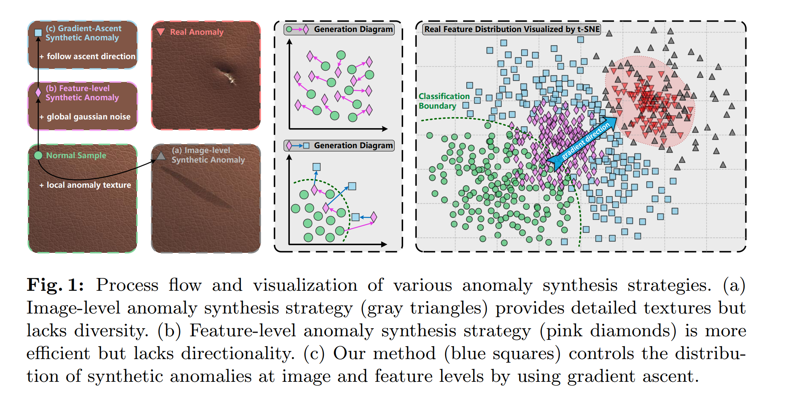
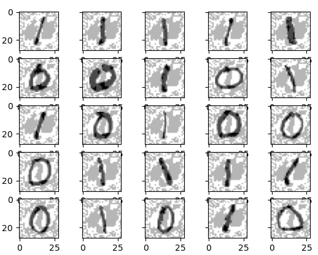

**Application: beyond attack and defense**  
Initiated from paper "A Unified Anomaly Synthesis Strategy with Gradient Ascent for Industrial Anomaly Detection and Localization", a higher-level of Adversarial Robustness, which can also be called as Gradient-based generation, emersed out of my mind.
And the attack and defense are only the mean to find direction of generation, i.e. gradient.
Using attack as example, we try to transform a normal instance in sample space to a poison one that behaves bad in the decision space defined by objective. Since all normal instances are those have smallest loss under our target function, also, good behave boys, poison one the naughty one will stay in where it doesn’t belong, results in high loss.
The gradient of objective exactly tells us where to find such bad boy.
There are few basic elements can be extracted from the example
1. A decision space tells the distribution of samples under specific objective
2. A objective who's gradient can point out generation direction
One more example: Style transfer
To generate an image has specific content while under some art style means the generated instance shares similar content feature to provided content image while so as to the art image.
Such objective can be mathematically described by distance between embedding vectors and its gradient can lead us to such generation meets requirements
Two more example: Watermark
The watermark issue is similar to the attack example but a safe-guard instance instead of a poison one.
This also answer the question:
Why the same schema of adding gradient can lead to total paradox instances, one is for attack while the other one is for defense ?
Last example: anomaly detection

Gradient of objective for finding good explanation of normal instance tells the direction toward abnormal one.  
**What's is the Adversarial sample ?**  
The classification task's target for a **input space** is to find best decision plane that can tell it from different classes.
Take Binary Bayesian Classifier as example, the best decision plane is found at the intersection between classes'
conditional probability distribution

And, we can draw a horizontal line across the intersection point, which is perpendicular to the plane, all $\bm{x}$ have probabilities greater or equal to that line can be treated as an adversarial sample $\widehat{\bm{x}}$. Specifically, the center point $\stackrel{-}{\bm{x}}$ is the clean sample, i.e. sample from training set with i.i.d assumption.

$$
\widehat{\bm{x}}=\stackrel{-}{\bm{x}}+\bm{\delta},\ \ \bm{\delta}\in \Delta,\ \Delta:={B}_{\infty}\left(0,\mathit{\epsilon}\right),{B}_{\infty}\left(0,\mathit{\epsilon}\right)=\left\{\bm{\delta}:{\left|\left|\bm{\delta}\right|\right|}_{\infty}\le \mathit{\epsilon}\right\}\ \ \ \ \ \ \ \ \ \ \ \ \ \ \ \ \mathrm{and}\ \mathrm{C}\le \mathrm{p}\left(\widehat{\bm{x}}\right)\le p\left(\stackrel{-}{\bm{x}}\right)
$$

Note: there may be other definition of $\Delta$, different $\Delta$ using different clip method
   $\mathit{\epsilon}$ need to be carefully pick to make sure existence of adversarial sample within certain realm
Note: introducing probabilistic model can turn discrete **input space** into continuous one, that can help us build a more soft model  
**How does perturbation works ?**  
In fact, perturbation is more than a random noise applied on clean sample, it is trying to drag clean sample toward a condition that may confuse with other class but still recognizable. Here we can take same informal example to get some compact insight.
**Mixup**: it's an augment strategy that do convex combination on two samples. If applied with mild enough overlap of other class's sample, we can take it as an case of perturbation, and we can visually see the draging(adversarial) direction.
**Autoencoder**: By decoding on continuous configuration of mean and variance, we can also visually see continuous transformation between differen samples on **input space**, that shows a dynamic process of draging action. But only few parts of the transformation close to clean samples at begin and end can be seen as perturbation.
**Linear model**:  

this shows a perturbation for a binary linear classifier, the gray plot is the perturbation, we can see that perturbation for 1 has white region similar to 0, while for 0 has gray region similar to 1, that again prove our speculation that perturbation is an dragging direction on **input space**, which leads clean sample to its adversarial direction.
**Target attack**: this attack strategy is aim at fooling classifier for specific label. e.g. we may want model missclassify all sample in **input space** as label 0 for number recognition

$$
\underset{\bm{\delta}\in \Delta}{\mathrm{argmax}}\left\{{h}_{\bm{\theta}}{\left(\bm{x}+\bm{\delta}\right)}_{{\bm{y}}_{\bm{t}\bm{a}\bm{r}}}-{h}_{\bm{\theta}}{\left(\bm{x}+\bm{\delta}\right)}_{\bm{y}}\right\}\Rightarrow \underset{\bm{\delta}\in \Delta}{\mathrm{argmax}}\left\{{h}_{\bm{\theta}}{\left(\bm{x}+\bm{\delta}\right)}_{{\bm{y}}_{\bm{t}\bm{a}\bm{r}}}-{\sum}_{\bm{y}\ne {\bm{y}}_{\bm{t}\bm{a}\bm{r}}}{h}_{\bm{\theta}}{\left(\bm{x}+\bm{\delta}\right)}_{\bm{y}}\right\}
$$

using infinity norm  

using 2-order norm  

here we tried to fool model classifying all sample with label 0, but some are failed with other results, that is due to multi-intersection of sample's class conditional probability distributions, i.e. take the figure with number 1 as example, the perturbation brought missclassification to 2, instead of 0, that's because there is an intersection of **input space** belong to label 0, 1, and 2, so the adding perturbation is dragging sample toward 0's and 2's direction at the same time.  
  
**Why our regular hypothesis fail on adversarial sample ?**  
Since the limitness of data, we can not train a desired hypothesis, that is our model may fail on adversarial sample
That is quite weird, since the adding perturbation almost change nothing against the original sample, but model totally miss the correct answer.
I suspect that this is because, ${h}_{\bm{\theta}}$ 's decision plane has a bit of distance from the true one, and when adversarial sample happenly fall on the intersection of different classes's input space, then there comes such unreasonable mistake.

**How do we get Adversarial sample ?**  
According to Maxilikelihood Assumption, point with higher probability has lower loss, so we can get Adversarial sample by finding points that have higher loss with same class label.

$$
\widehat{\bm{x}}=\underset{\widehat{\bm{x}}}{\mathrm{argmax}}\mathcal{L}\left({h}_{\bm{\theta}}\left(\widehat{\bm{x}}\right),\bm{y}\right)\Rightarrow \underset{\bm{\delta}\in \Delta}{\mathrm{argmax}}\mathcal{L}\left({h}_{\bm{\theta}}\left(\stackrel{-}{\bm{x}}+\bm{\delta}\right),\bm{y}\right)
$$

So we can get adversarial sample by applying **gradient ascent** on clean sample

$$
\stackrel{-}{\bm{x}}+\mathrm{max}\left(\mathrm{min}\left(lr\ast {\nabla}_{\bm{\delta}}\mathcal{L}\left({h}_{\bm{\theta}}\left(\stackrel{-}{\bm{x}}+\bm{\delta}\right),\bm{y}\right),\mathit{\epsilon}\right),-\mathit{\epsilon}\right)
$$

Note that we should clip the perturbation so adversarial sample is still a valid sample, and also
for desired hypothesis ${h}_{\bm{\theta}}^{\ast}$, the decision on class remains unchanged

$$
\underset{i}{\mathrm{argmax}}softmax\left({h}_{\bm{\theta}}^{\ast}\left(\widehat{\bm{x}}\right)\right)=\underset{i}{\mathrm{argmax}}softmax\left({h}_{\bm{\theta}}^{\ast}\left(\stackrel{-}{\bm{x}}\right)\right)
$$

e.g. if take human's classification capacity as the desired hypothesis, then the adversarial sample should have same appearance as non one  
**How do we approximate to desired hypothesis ?**  
If we can optimize our model on hardest adversarial sample, then we can really approch the best one, that is

$$
\underset{\mathit{\theta}}{\mathrm{argmin}}\left\{\frac{1}{\left|{\mathrm{D}}_{train}\right|}{\sum}_{\left(\bm{x},\bm{y}\right)\in {\mathrm{D}}_{train}}\mathcal{L}\left({h}_{\bm{\theta}}\left(\bm{x}\right),\bm{y}\right)\right\}\Rightarrow \underset{\mathit{\theta}}{\mathrm{argmin}}\left\{\frac{1}{\left|{\mathrm{D}}_{train}\right|}{\sum}_{\left(\bm{x},\bm{y}\right)\in {\mathrm{D}}_{train}}\underset{\bm{\delta}\in \Delta}{\mathrm{max}}\mathcal{L}\left({h}_{\bm{\theta}}\left(\widehat{\bm{x}}\right),\bm{y}\right)\right\}
$$

In contrast to traditional risk, we need to optimize on adversarial risk, which become a **min-max** problem, i.e.
iteratively doing the follow steps
According to **Danskin's theorem**, if we can find global optimal in the inner maximization, then we can simplify it into a minimization problem, same as the way solving SVM.
1. Attack: given $\bm{\theta}$, find the worse-case adversarial sample

$$
{\bm{\delta}}^{\ast}={P}_{\mathit{\epsilon}}\left(\underset{\mathit{\delta}\in \Delta}{\mathrm{argmax}}\mathcal{L}\left({h}_{\bm{\theta}}\left(\widehat{\bm{x}}\right),\bm{y}\right)\right)
$$

 ${P}_{\mathit{\epsilon}}$ is clip method depend on choice of $\Delta$ (or choice of **norm ball**)  
**Strategy for solving it:**  
(a) if we can slove out a **close analytical formulation** of ${\bm{\delta}}^{\ast}$ as a function of $\bm{\theta}$, then we can directly transform the min-max problem into a minimization problem, where iterative process can be avoided.
e.g. for binary classification

$$
{h}_{\bm{\theta}}\left(\bm{x}\right)={\bm{w}}^{\bm{T}}\bm{x}+\bm{b}
$$

$$
\Rightarrow {\bm{\delta}}^{\ast}=-\bm{y}\ast \bm{\epsilon}\ast \mathrm{sgn}\left(\bm{w}\right),\mathrm{here}\ \mathrm{we}\ \mathrm{use}\ {l}_{\infty}\ norm\ ball
$$

$$
\Rightarrow \underset{\bm{w},\bm{b}}{\mathrm{argmin}}\left\{\frac{1}{\left|{D}_{train}\right|}{\sum}_{\left(\bm{x},\bm{y}\right)\in {\mathrm{D}}_{train}}\mathrm{ln}\left(1+\mathrm{exp}\left\{\mathit{\epsilon}{\left|\left|\bm{w}\right|\right|}_{\ast}-\bm{y}\left({\bm{w}}^{\bm{T}}\bm{x}+\bm{b}\right)\right\}\right)\right\}
$$

or optimize it exactly by turning it into combinatorial optimization problem on specific network

$$
{\bm{z}}_{1}=\bm{x}
$$

$$
{\bm{z}}_{i+1}={f}_{i}\left({\bm{W}}_{\bm{i}}{\bm{z}}_{\bm{i}}+{\bm{b}}_{\bm{i}}\right),\ \ i=1\dots d-1
$$

$$
{h}_{\bm{\theta}}={\bm{z}}_{d+1}={\bm{W}}_{\bm{d}}{\bm{z}}_{\bm{d}}+{\bm{b}}_{\bm{d}}
$$

$$
to,\ \ \ {f}_{i}\left(.\right)=relu\left(.\right)
$$

Linear programming

$$
\underset{{z}_{1\dots d+1}}{\mathrm{min}}-{\mathbf{z}}_{\bm{d}+1}^{T}\bm{y}
$$

$$
s.t.\ \ \ \ {\left|\left|{\bm{z}}_{1}-\bm{x}\right|\right|}_{\bm{p}}\le \mathit{\epsilon}
$$

$$
{\bm{z}}_{\bm{i}+1}=\mathrm{max}\left\{0,{\bm{W}}_{\bm{i}}{\bm{z}}_{\bm{i}}+{\bm{b}}_{\bm{i}}\right\},\ \ i=1\dots d-1
$$

$$
{\bm{z}}_{\bm{d}+1}={\bm{W}}_{\bm{d}}{\bm{z}}_{\bm{d}}+{\bm{b}}_{\bm{d}}
$$

(b) even if close solution can not be satisfied, with convexity provided, we can still indirectly transform the min-max problem into a minimization one by finding its **lower bound**(not the worst)
e.g.
FGSM

$$
\bm{\delta}:={P}_{\mathit{\epsilon}}\left(\bm{\delta}+\mathit{\eta}\ast {\mathbf{\nabla}}_{\bm{\delta}}\mathcal{L}\right),{\left|\left|\bm{\delta}\right|\right|}_{p}\le \mathit{\epsilon},\ initiate\ \bm{\delta}={\left[0\right]}_{d}
$$

PGD: iterative FGSM

$$
{\bm{\delta}}^{\left(t+1\right)}:={P}_{\mathit{\epsilon}}\left({\bm{\delta}}^{\left(\bm{t}\right)}+\mathit{\eta}\ast {\mathbf{\nabla}}_{\bm{\delta}}\mathcal{L}\right),{\left|\left|\bm{\delta}\right|\right|}_{p}\le \mathit{\epsilon},\ initiate\ {\bm{\delta}}^{\left(0\right)}={\left[0\right]}_{d}
$$

  plus with steepest descent, get rid of influence from scale of gradient

$$
{\bm{\delta}}^{\left(t+1\right)}:={P}_{\mathit{\epsilon}}\left({\bm{\delta}}^{\left(\bm{t}\right)}+\underset{{\left|\left|\bm{v}\right|\right|}_{p}\le \mathit{\eta}}{\mathrm{argmax}}{\bm{v}}^{T}{\mathbf{\nabla}}_{\bm{\delta}}\mathcal{L}\right)
$$

(c) or solving its **upper bound **objective (i.e. solving network's convex relaxation).
2. Defense: update $\bm{\theta}$ so as to correctly classify the worse case

$$
\bm{\theta}:=\bm{\theta}-\frac{lr}{\left|\mathcal{B}\right|}{\sum}_{\left(\bm{x},\bm{y}\right)\in \mathcal{B}}{\nabla}_{\mathit{\theta}}\mathcal{L}\left({h}_{\bm{\theta}}\left(\bm{x}+{\bm{\delta}}^{\ast}\right),\bm{y}\right),\mathcal{B}\subset {D}_{train}
$$

**Corresponding Strategy for solving it:**  
(a) Not a pratical approach, both exact solution on min and max problem are too complex and too time consuming
(b) Using lower bounds, train empirically an robust classifier with adversarial samples
(c) Using convex upper bound, train provably robust classifier

The method may only lead to a local optimal of original problem, in order to find better solution, we need
1. find as worse adversarial sample as possible, i.e. make defense as difficult as possible
2. worse case may cause osscilations while training, so multiple perturbation with different random initialization should be considered. And also, an un-balance training procedure should be introduced where Defense has more learning steps than Attack
3. some bound optimization can be used to non-iteratively solve the inner max problem.
Note that there is a trade-off between robust accuracy and clean accuracy
