**Conclusion**

1. **Style of CUDA programming**

!Important: codes in kernel function will be executed by every thread in same block. So you have to make sure the code will not collide with itself when running on multi-threads.

Each thread consumes its own isolated part.


2. **layout of memory, distribution on threads**

Kernel function often involve IO operation on memory, each thread will handle an isolated area of memory by its indices mapping. Generally, threads following its incremental indices iterativily consume memory units in row-major order, i.e.

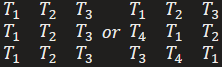

To avoid bank conflicts, we can also take hierarchical layout of memory and its mapping threads, i.e. split memory into small blocks, and do the same linear distribution on that block.


3. **key elements of indices mapping**

To retrive each memory units from a thread's coverage, we need to provide:

(1) start position of this piece of memory region

(2) stride(offset) to next unit

But most of important is to figure out the unit of coordinate system, and make all indices be calculated under same unit. e.g.

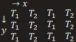
```
start position = (a, b), threadX = 2, threadY=3 strideX = 2, strideY = 1, traverse:

for i in 0…threadY:
    for j in 0…threadX:
        x = i \* strideX;
        y = j \* strideY;
        …..
(a+x, b+y) is the position of memory element
```


4. **strategy for dealing with out of boundary elements**

Such case happens when data size can not even divided by number of threads, then there are threads on data border have part of their thread tiles cross the effective data

see more detail at [https://nichijou.co/cuda3-thread-divergence/](https://nichijou.co/cuda3-thread-divergence/)

So the most important thing is to mark out which part of thread's tile is ineffective.

We can first imagine a virtual memory block is larger than real data, which is evenly divided by number of threads, then the rest is to mark memory positions which overcross the edge of real data. i.e. we generate a bit map, cell with value 1 indicates effective, while 0 indicates out of boundary which is ineffective.

Further, we can split the map into thread tile map to hold the information of each thread's effective about data.


**Source codes**


block\_loader\_wmma.h

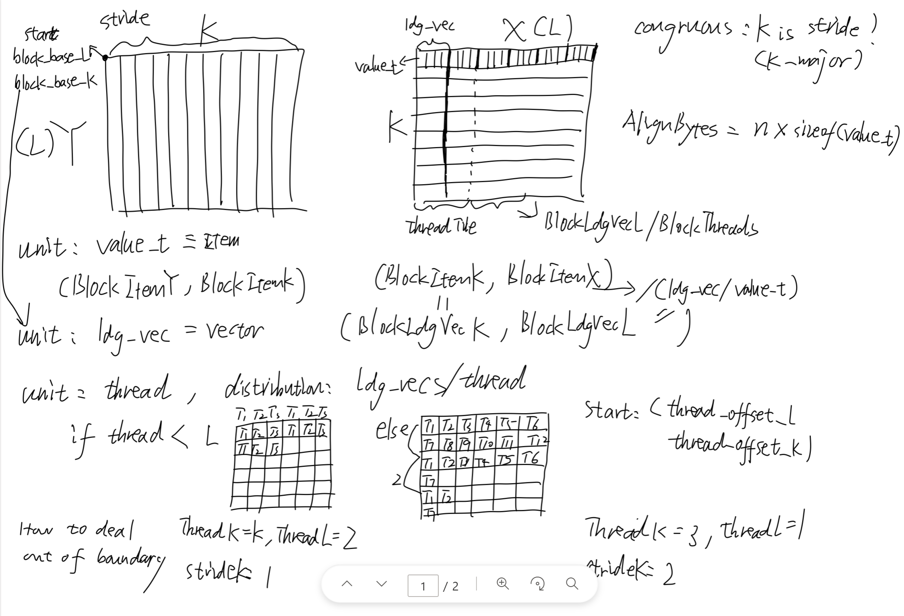

Load block tile from global memory, and store them into shared memory


**keypoints explanation**

1. congruous : whether the block tile is k-major (K axis is stride axis ?)

congruousA = {TransformA = NonTranspose ?}

congruousB = {TransformB = Transpose ?}

2. MatrixAlignBytes: n X sizeof(value\_t)
3. coordinate system unit

there exist 2 type of units

(1) value\_t (alas: item), also unit of matrix, including

BlockItemsL, BlockItemsK, block\_begin\_item\_coords


(2) ldg\_vector\_t (alas: ldgVectors), = n X value\_t, including

Blcok tile size: BlockLdgVectorsL, BlockLdgVecorsK = BlockItemsX / n,


Blcok start: block\_base\_l = block\_begin\_item\_coords.x / n, block\_base\_k


thread relevant (block threads are 1-dim)

Thread start: thread\_offset\_l = tid % BlockLdgVectorsL,

  thread\_offset\_k = tid / BlockLdgVectorsL


Thread tile size: ThreadLdgVectorsL (distribution : Conculsion 3)

  ThreadLdgVectorsK


Thread stride:

ThreadLdgVectorsL (stride on axis L, strip-mining distance between two elements of thread along L-axis) , e.g.

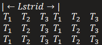

BlockLdgVectorStrideK = max(1, BlockThreads / BlockLdgVectosL)(stride on axis K, strip-mining distance between two elements of thread along K-axis), e.g.

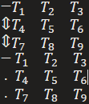


**Processing frame**

1. Constructor

Calculate start position from block id and thread id

Generate data effective bit map

2. request

According to data effective flag, each thread request its thread tile from source memory, all threads parallely request the block tile from source memory

3. next

Advance to the next block tile, offset is the number of items in block

4. commit

store each thread tile from global memory into shared memory


**wmma\_accumulator.h**

Compute warp-wide output tile by using wmma api, since wmma supports matrix multiplication of 16 X {16 X 16} X {16 X 16} X 16, i.e. per warp thread

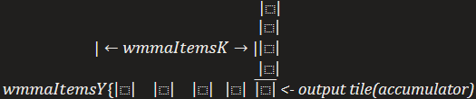

wmmaItemsK = 16 X wmmaItemsX

so wmma will automatically do 16 times {16 X 16} X {16 X 16} matrix multiplications, then sum them into output tile of 16 X 16


**keypoints explanation**

unit is value\_t, also can be seen from suffix of "items"

literally, it can be showed as

fragment\_a \* fragment\_b = accumulator

fragment = {X × Y × K}, accumulator = {X × Y} = wmmaBlock


unit is wmmaBlock, how many wmma blocks inside a warp tile

wmmaBlocksY = WarpItemsY / WmmaItemsY

wmmaBlocksX = WarpItemsX / WmmaItemsX


**block\_task\_wmma.h**

Compute block output tile warp by warp, or wmmaBlock by wmmaBlock

also, store computing results from shared memory into global memory warp by warp, or wmmaBlock by wmmaBlock


**keypoints explanation**

1. PadItems =16

since wmma's calculation unit is 16 x 16, so a pad of 16 is added to leading dimension (i.e. non-stride axis) for alignment

2. page\_storage\_t

block tile occupation on shared memory, with size StridedSmem x LdmSmem, i.e. BlockItemsK x (BlockItemsY(X) + PadItems)

PS, if UseDoubleScrathTiles = 1, there will be dual occupation on shared memory to plays as double-buffers-style of IO

3. wmma api∷ load\_matrix\_sync(fragment, value\*, LdmSmem)

Notify that the third argument is the stride information of next wmmaBlock inside fragment, i.e.(column-major)

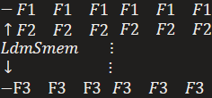

*so the second F1's position is first F1's position + LdmSmem, so as Fi*


**Processing frame**

1. Constructor

Configurate all parameters "block\_loader\_wmma.h" and "wmma\_accumulator.h" need into <block\_task\_policy>

2. run

(1) request first global prefectch by loaders

(2) commit first global prefectch into shared memory by loaders

(3) load fragment slice from shared memory, used for multiplication

each slice is a fragment it can be told from third argument of function∷request\_local\_prefetch,

tile\_offset\_k = (iteration \* WmmaItemsK + WmmaItemsK) % BlockItemsK,

which means its stride is wmmaItemsK, so an element of

local\_slices\_a\[WmmaBlocksY\] is exactly a fragment (see more detail in Keypoints explanation 3), and WmmaBlocksY times of loading forms a fragment slice.


So each fragment slice's stride along K axis is WmmaItemsK, but WmmaItemsY at Y axis, and each fragment is a row in the slice, i.e

so start of a fragement is (tile\_offset\_k, block\_warp\_item\_coords.y + WmmaItemsX \* i) = (fk, fy)

since tile\_offset\_k includes % operation, so it can automatically handle mult-rows of warps. i.e

fk indicates K axis of warp, fy indicates Y axis of warp


(4) (dimK + BlockItemsK) / BlockItemsK times consumption

each consumption deals BlockItemsK / WmmaItemsK times multiplication, and all these results are added to corresponding accumulators. i.e, each grid is a warp, WmmaItemsK long at K axis


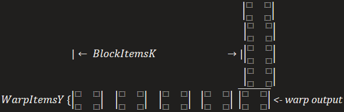

tile(accumulator)

*different row of warp is indicated by fy*

  if UseDoubleScratchTiles is set, then multiplication and prefetch next fragment slice will run parallel.

  PS: commit next block tile into shared memory will execute in the last warp.

  

  (5) epilogue, store accumulator tile to global memory, for each wmmaBlock in warp output tile, read and write data by thread lane id

  lane\_id = threadIdx.x % 32, column(K)-major

  lane start = (lane\_id / WmmaItemsY, lane\_id % WmmaItemsY)=(lx, ly)

  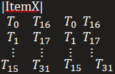

  ItemX = 32 / WmmaItemsY, IterationX = WmmaItemsX / ItemX

  IterationX indicates thread i's iteration on wmmaBlock

  and stride on K is dim\_m \* ItemsX, i.e. elements count by column-major between first $T_i$ to next $T_i$

  

  by the same start-stride method, item of unit accumulator's postion in the matrix C(in global memory, c\_ptr) can be achieved

  

  **PS: k\_slpit\_control.h**

  this module add parallel along K axis,

  

  shortage of original

  primary strategy directly makes threadblock do dim\_k / BlockItemsK iteration along K axis of matrix, the concurrency will not be fully used when dim\_k is huge.

  

  advance

  k\_split\_control instead split dim\_k into couples of smaller slices, each slices with length split\_k at K axis, and apply original strategy on this split\_k slices with different threadblocks. This add concurrency factor with dim\_k / split\_k, i.e.

  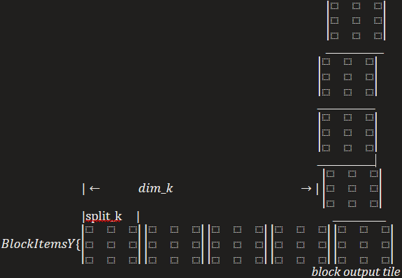

  *from here, we ****surprisily found out**** this strategy is ****hierachically**** used in different tile level, from block to warp to wmmablock!*

  

  *But in block level, we need to manually update accumulator from different threadblocks, since threads only share same shared memory in same threadblock, so here k\_split\_control apply machnism of signals to synchronizing accumulators from different threadblocks, i.e.*

  

  *after each threadblock concurrently generate their results,*

  *predecessor threadblcok's result will be loaded from global memory as addend to next one to update its result, then updated result will be stored into global memory, repeat this process til the last threadblock, see the picture below:*

  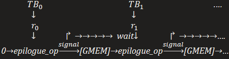


