**Issue & Target**
Representation learning from supervised work always hard to transfer to downstream task, especially to different domain, and the result representation is weak at robustness or generalization, what's worse, domain adaptation requires lots domain-specific data, which is always unavailable.
So a task-agnostic way of learning is the answer for robust and generic representation which can easily transfer to any domain with highly data efficiency.

But how can we find such perfect way of learning ?
Actually, task-specific learning always involve specific labels, take classification for example, the induced features focus on conception related features, which are embedded into high-level latent space discarding low-level information that are irrelevant for classification but relevant for, e.g. image captioning.
In more general way, any label can be treated as a feature of data, but a task-specific one, so in turn, the data itself can be a kind of label, but a task-agnostic one. In that sense, representation learning from data itself can fully embed data into a compact property-invariant latent space. And when transferred to downstream task, small amount of task-specific labels are enough to extract or transform appropriate properties for domain adaption

So the basic idea is to learn **Consistent Identity Mapping**
i.e. we are trying to learn a mapping from (sparse/discrete) local representation to (dense/continuous) distributed representation embedded in latent space while keeping consistent identity.
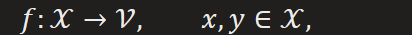
\(1\) distance between similar samples' embedding are small, large for dissimilar one.
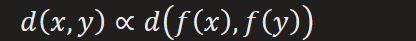

Contrastive learning: Incorporated with probability(optimization on probabilistic distance), this may lead to NCE, GAN
\(2\) Any transformations applied on samples have their homogeneous effects on samples' embedding but distinguishability is not change
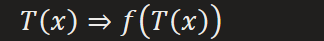

Augment learning: like STM
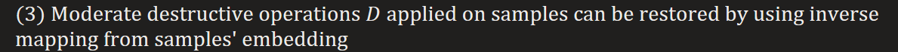
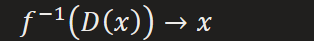

Predictive learning: Incorporated with probability, this may lead to generative model, like, VAE, Diffusion
**Cornerstone**
"The selection of appropriate positive and negative samples are the cornerstone of contrastive learning" from paper "SEMPPL"
There's a framework we can borrow from **Chapter 2 of "Machine Learning Tom. Mitchell"** to make a good explanation.
The learning process is to find hypothesis that maximally matches given samples, following the similar procedure of Candidate-elimination algorithm, contrastive learning is equivalent to process gradually narrowing down search space of hypotheses by keeping those success on positives while discarding failed on negatives.
Provided with hypotheses space containing the target hypothesis and infinite samples, optima is guaranteed. But it's elusive in practical condition where a local optima is best we can get, so the bottleneck is shed on the selection of positive and negative samples.
Now Let's specialize hypotheses as feature representation
Good positive samples:
Can guide to more significant feature(related to positives) representation learning

Can help models learn semantic positive representation where similar samples have

their embedding similarity maximized .

Can accelerate process of learning
Good negative samples(similar to positive one):
Can guide to more robust feature(for all) representation learning

Can help models learn semantic negative representation where dissimilar samples

have their embedding similarity minimized.

Also, can accelerate process of learning
Relate works: SEMPPL, hard mining, CLIP, NCE, triple loss, negative sampling
Actually, many works with contrastive objectives can be seen as a special case of contrastive learning.

**Inspiration in design of objective**
Actually, you will find out that terms in most effective objective functions always against each other, e.g. increase of one term results decrease of the other, the both may confine to a constant constraint, or some relationship(functional) constraint. Softmax is the former, score matching is the latter.
This property sometimes may quite throughout the model, e.g. GAN
The effectiveness of such methodology lies in its fight against laziness of neural network, as we all known, neural network is good at finding shortcut resulting chance-level performance, to avoid such degenerate case, adversarial or contrastive way of learning is introducing in the guidance of training process, by measuring model's representation capability from multiple angles that against with each other.
What's more, the idea also plays vital role in evaluation where indicators always try to catch model's performance from angles with subtle adversarial relation

**NCE**
[NCE bridges the gap between generative models and discriminative models, rather than simply speedup the softmax layer. With NCE, you can turn almost anything into posterior with less effort](https://github.com/Stonesjtu/Pytorch-NCE)

More detail introduction please refer to paper "**Noise-Contrastive Estimation of Unnormalized Statistical Models, with Applications to Natural Image Statistics**"

**How did NCE was designed ?**
actually, it didn't jump out of blank, it follows some good properties of MLE, like, consistency and Asymptotic normality, in other words, MLE is a blueprint, and NCE adapted it to its own need, which is easing the trouble of calculating normalization constant. it figures out a way that can embed the normalization constraint as an intrinsic property in objective where normalization can be automatically performed instead by hard constraint.

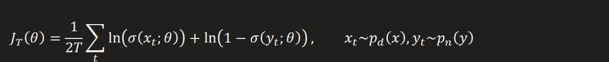
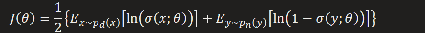
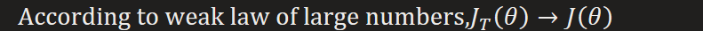
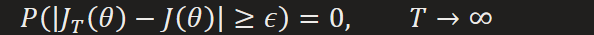

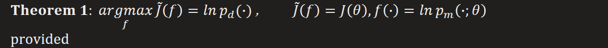
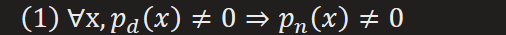

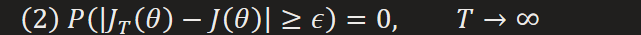
Proof:
Using (1), ignore 1/2 for simplicity

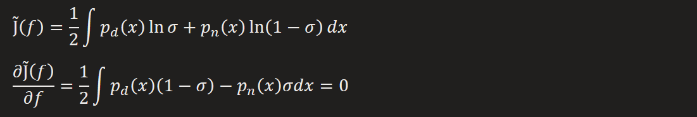

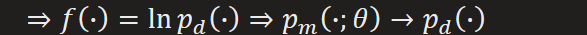

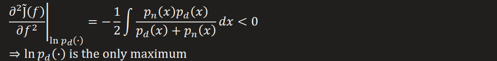

That means

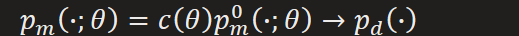

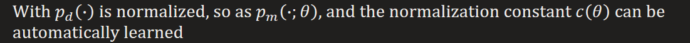

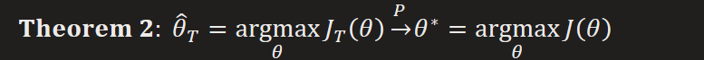
provided

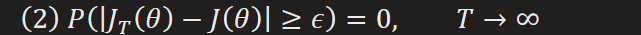

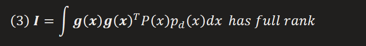

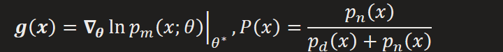

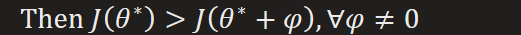

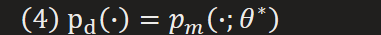
Proof of (3):
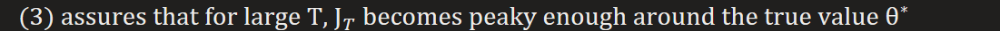

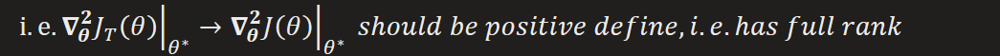

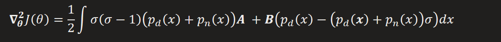

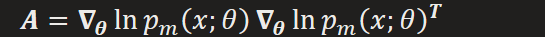

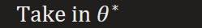

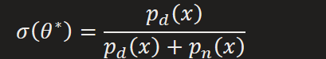

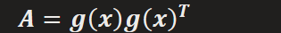

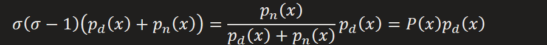

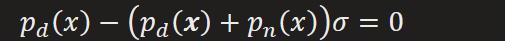

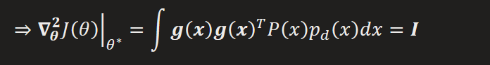

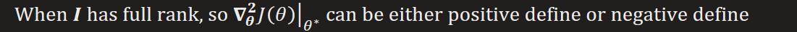

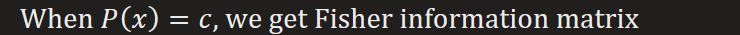

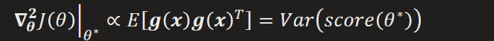

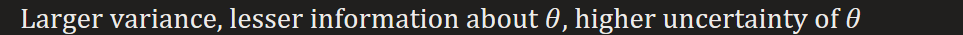

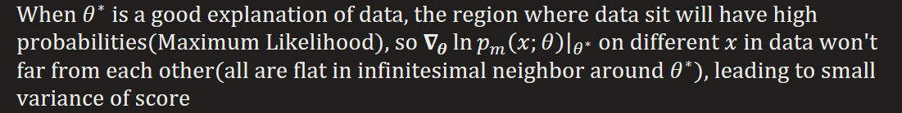
Proof:
That equivalent to prove

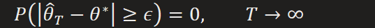

The basic idea is to prove its upper bound convergent to 0 in probability too

In order to make (2) come into handy, we also need to transform the predicate into similar form

**Application on Logistic Regression**
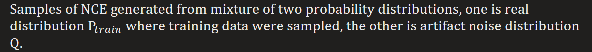

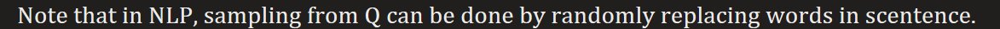

**Sampling process**
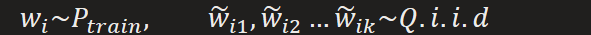

Joint distribution conditioned on label
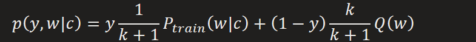
Objective: log-likelihood
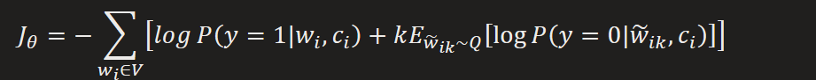
According to Monte Carlo
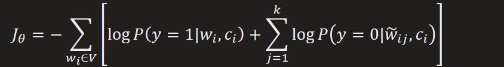
where
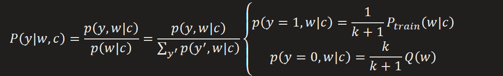

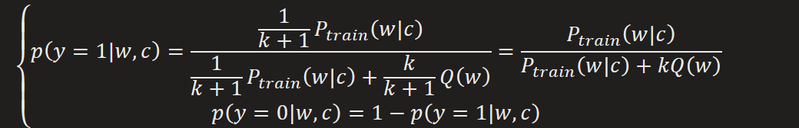

where

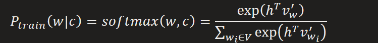
Normalization factor can be automatically learned though optimization
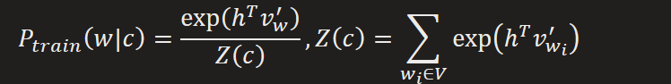
[Since auto-normalize is assured by NCE, there is no need of introduction of normalization factor, i.e. normalization will be automatically fulfilled by weights](https://www.ruder.io/word-embeddings-softmax/#noisecontrastiveestimation)
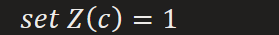

Gradient of NCE will converge to Softmax, as k approaching to size of vocabulary

**Comparison between NCE and GAN**
From paper "ON DISTINGUISHABILITY CRITERIA FOR ESTIMATING GENERATIVE MODELS"
1.  A modified version of NCE with dynamic generator is equivalent to MLE
That was proved by considering extreme case where the model is copied as new noise distribution at each step of learning, which was called SCE, and results show that SCE has same expected gradient as MLE

2.  The existing theoretical work on GANs does not guarantee convergence on practical applications
That is mainly a results from optimizing in non-convex case

\(i\) mechanism of min-max optimization fails in [non-convex case](onenote:#Convex%20Optimization&section-id={7C05A5A2-335F-4120-B309-F2C7D1ABD289}&page-id={EC2F328D-F4C1-4EE8-B893-8EE9ACD0103F}&object-id={05C97FFE-A206-0ED5-2623-1BE375DBAAEE}&D&base-path=https://d.docs.live.net/276cf4f2e18c3166/文档/寿枫%20的笔记本/Blog.one) where minimizing lower bound is not guarantee minimization of its supreme.

\(ii\) Non-convergence of gradient-based learning (waiting for more testify)

3.  Because GANs do the model estimation in the generator network, they cannot recover maximum likelihood using same objective of NCE
MLE form of gradient

Adjust GAN gradient into MLE form

Turn into maximum likelihood derivatives

The discriminator can provide necessary information for computing maximum likelihood derivatives

But this is different from the value given by distinguishability game

Preliminary:

Both method are primarily driven by *distinguishability game value function:*

Where

But they have different learning targets
For NCE:

Convergent on optimal where

i.e. NCE works by learning in the discriminator(via a generative model that is used to implicitly define the generator), maximizing acceptance rate of samples sampled from target distribution
For GAN:

Convergent on optimal where

i.e. GAN works by learning in the generator, minimizing rejection rate of samples generated from generator
