**The key to understand Convex Optimization**  
There are many definition decorated with obscure and abstract description that is extremely hard to understand. Nor can it be understanded in geometric way, which will rack our brain to imagine the extension cases in high dimension, or pure mathematical symbols, which benefits nothing for the learning purpose.
1\. Wiring the practical issues
As the name of it is telling, we should connect the abstract definition with practical optimization problem. All its definitions and methods have its deep root in better optimization. So we can analyze the acts of objects related to optimization, e.g. target functions, gradient, under such definitions or methods
2\. Extent from real number system
In fact, lots definitions have its special form in real number system, and for that, they share lots similarity of their counterpart in the real number system.
e.g. matrix can have its analog to real number
Positive matrix similar to positive number
3\. Catch the property which can be abstracted from geometrical explanation
Geometric explanation can anchor a graphical understand for these definition, but we need to extract some properties related to optimization and can live independent without these planes or lines. Those properties are intuitive and simple enough in geometrical form and can be extent to more abstract forms
4\. Motivation behind these definitions
To describe some rules in language of math, we can just simply create a function that satisfies those axioms of it, but it can be obscure and too abstract, like, we are only define it for the definition itself.
e.g. summation of all elements in a matrix, that won't do much help in practice
So in the perspective of utility, we need to attach the definition with meaningful stuff, like, geometrical meaning or behavior of operator

**Definition of Vector Space**  
Vector space is space made of vectors, which are linear combination of basis

If basis is function, then the vector in space represents a function, since it's a combination of basis functions, e.g. polynomial function, triangle function  
**An informal connection between real number space and function space: discrete to continuous**  

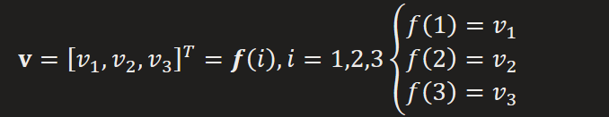
That brings summation of its inner product
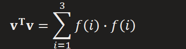
So the continuous function is generally what we so called function vector
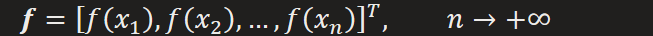
That brings integration of its inner product
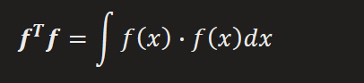

The most important one is inner product, it's the building block of metric and orthogonality
In the process of generalization, the consistent rules a property(operation) should follow weight more than the exact form of property(operation)

**Relationship between inner product and orthogonality**  
Definition of perpendicular:
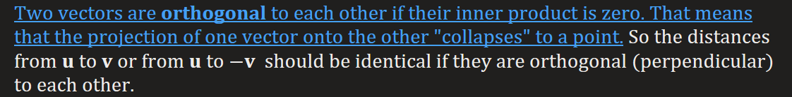
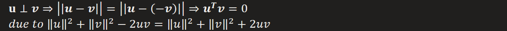

The second one is orthogonal basis vectors, which is the fundamental bricks building any vector in the vector space. All can be derived from a simple equation
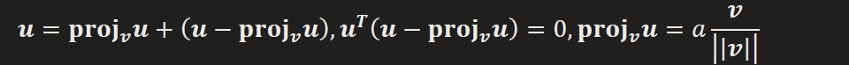
Cauchy-Schwarz Inequality

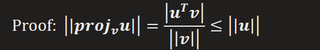
General form: Holder Inequality (with weighted norm)
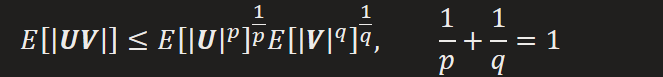
*Weighted inner product \<= weighted norm \* weighted norm*

**Definition of Inner Product Space**  
Any vector in a vector space follows the rule of inner product
Inner Product Space = vector space + inner product applied

**What is Norm**  

we can see that definition of norm always involve sup, such a norm defines a constraint on a set
e.g. for a vector, its norm defines its length, we can turn it into a sup-form (rough)
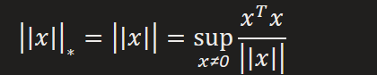
if we treat x as a set of point forming the x line, then the sup achieved exactly at x

from the unit ball case, we can also find that the definition is searching the max ratio number t from origin to C's edge, e.g.
if C is a ellipisoid, then t must define on the longest line from C's edge to origin, then this sup gives a bound for the set

and the following cases with sup definition, all define a constriant or bound for set that all element in the set satisfy, or in a more abstract way, we can say:

norm define a constraint(constantly, \<=) on a set so that this set can be a convex set w.r.t the constraint, i.e. all elements in conv(set) are satisfied. and this constraint follows as least three basic properties.

**Distinguishment between close set and fully bounded set**  
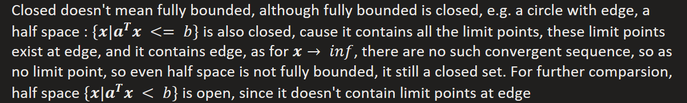

**Equivalence between quadratic norm and weighted inner product**  

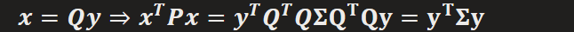

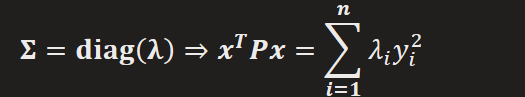
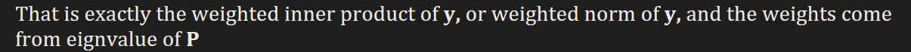

**Norm of matrix**  
A matrix represents relationship between two vector spaces, or a mapping from one vector space to another, so it would make more sense when defining its norm with objects it is operating on, that's exactly the operator norm where matrix is taken as a operator: operator norm

It simply tells the maximum transformation that a matrix can apply on the element from b-norm ball. That can attach to the behavior of an operator
There is another norm for matrix called kernel norm which is the summation of all non-zero singular values
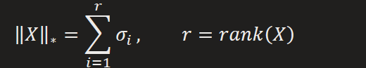
Such definition strongly tells the sparsity of structure(magnitude and direction of axis) of basis space that forms the matrix

**Analog from real number to matrix**  
Lots definition of matrix can be seen as an extent version of its counterpart in real number system, e.g.
Positive defined matrix to positive real number(that can also give inspiration for definition of general inequality)

Gradient w.r.t matrix has similar rules as gradient for real variable

Hessian matrix describes similar property for the **curvature** of specific point as second order derivative did, instead the former is in multi-dimension case where the **curvature** extents to a super ball or super ellipse that has its border plane **perpendicular** to gradient.
So a Hessian matrix has its curvature approximates to a ball tells that we can pick any gradient as the optimization direction since they are all good enough, a elliptic case will be a bit of thorny since different gradients are diverse in magnitudes where a good enough gradient can be hard to choose.
Such a property can be defined by **conditional number** of Hessian matrix, which carves the gap between largest singular value and the smallest one. A ball case, obviously, will have same singular value in all direction

**Equivalence of norms**  
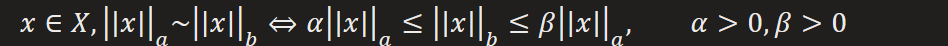
They define the same set of open sets, i.e. in the form of [metric space](https://byjus.com/maths/metric-spaces/)(set + metric, e.g. norm space)

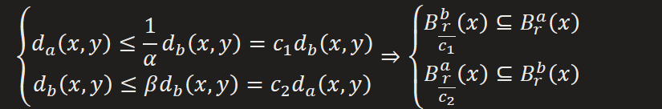
e.g. Imagine that we can always find a pair of stretching coefficients for L1 norm to enclose L2 norm, so as L2 norm
Since their open set includes each other, so they define same set of open sets.
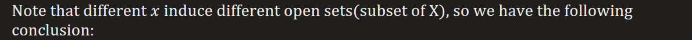
Equivalent norms(metric spaces) induce same topology(set of open sets)

1.  
2.  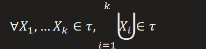
3.  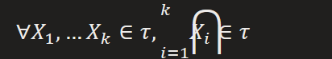

**Definition of Banach Space**  
Complete norm vector space or complete metric space
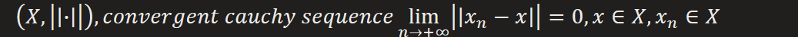
Norm, a function, applied on vector space has its Cauchy sequence limit still in the same space
[Example of non-complete norm](https://math.stackexchange.com/questions/1948207/example-of-a-non-complete-normed-vector-space)

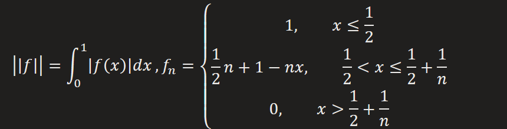
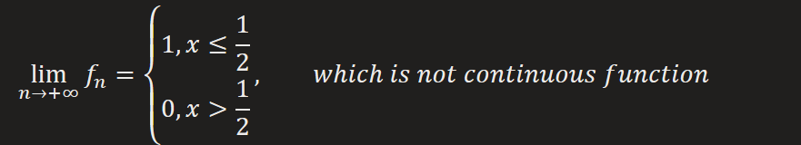

**General Clue**  
**Optimization target: Mathematical optimization problem**  

Application [SVM](onenote:#SVM&section-id={7C05A5A2-335F-4120-B309-F2C7D1ABD289}&page-id={11A9696D-1BFF-4700-8B1D-CF78A9E2CCFA}&end&base-path=https://d.docs.live.net/276cf4f2e18c3166/文档/寿枫%20的笔记本/Blog.one)

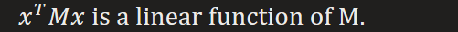

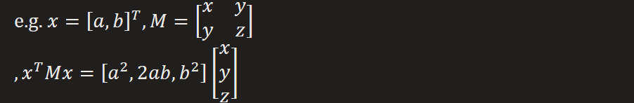

Properties to mark out function's convexity

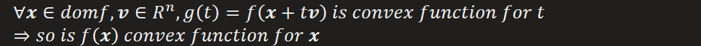

Relationship between convex set and function

Gradient conditions

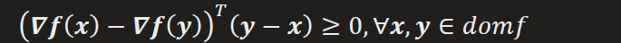

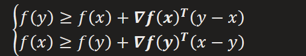

Operation that gain convexity

Operation that preserve convexity

Affine function;

[Conjugate](https://math.stackexchange.com/questions/2700835/understanding-the-conjugate-of-a-function)

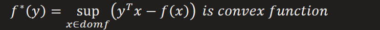

Note: Using these ops as unit to construct powerful function that can approximate lots intractable functions, e.g. neural network is the repetition of Affine function +nonlinear activation

Brick to build optimization target
Norm is a generalization of physical length, it's a function that

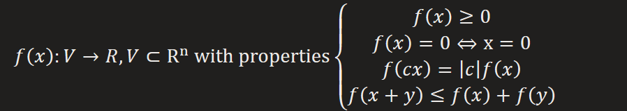

Lots definition involving norm contains "**sup**", so it can be informally treated as a bound that an operation can obtain, in other words, all consequence of the operation are bounded inside this norm.

Generalized inequalities
Think in a programming way that comparison between instance of custom class requires partial order definition, so we can compare them as we did with real numbers. Generalized inequality is a bit taste of it.
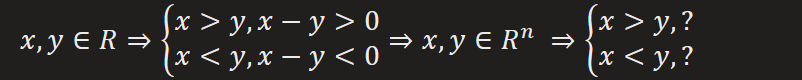
By introducing generalized inequality, we define the behavior of optimization, since optimization problem is equivalent to finding a partial ordering sequence base on specific rule of inequality.
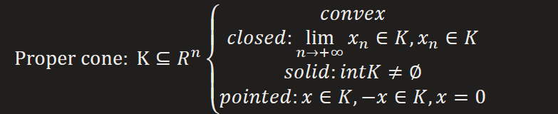
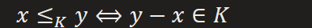

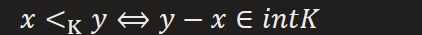

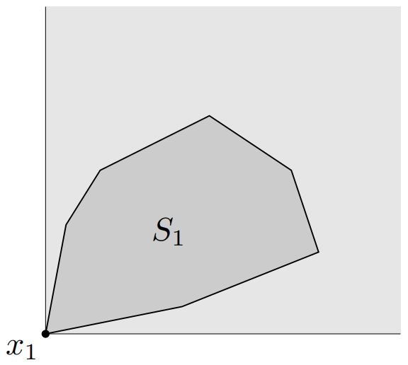

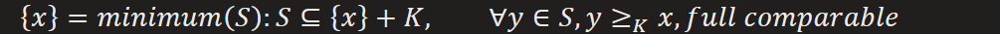

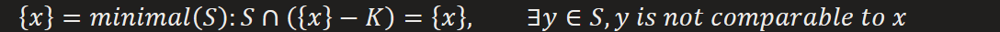
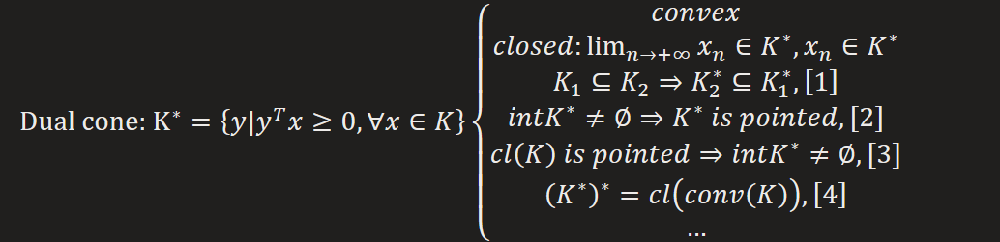

\[1\]: with smaller cone, the more hyperplane can enclose this cone

\[2\]: if K has empty interior

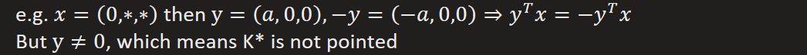

Note :if K is closed convex(proper cone), then dual cone on dual cone return to original cone

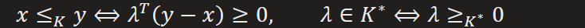

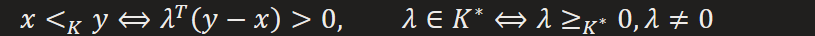

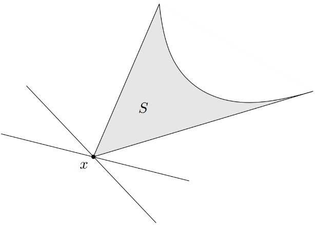

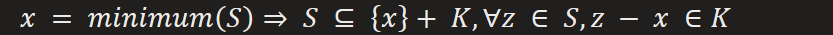

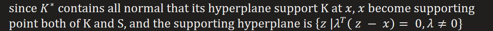

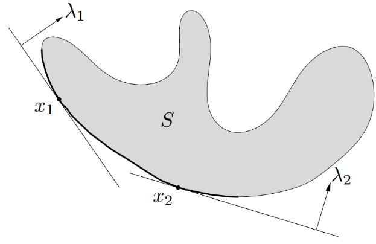

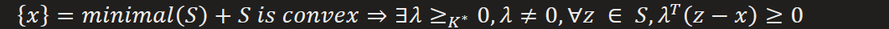

Proof:

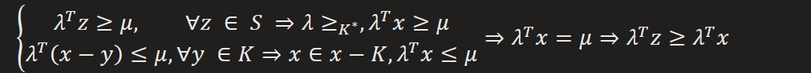

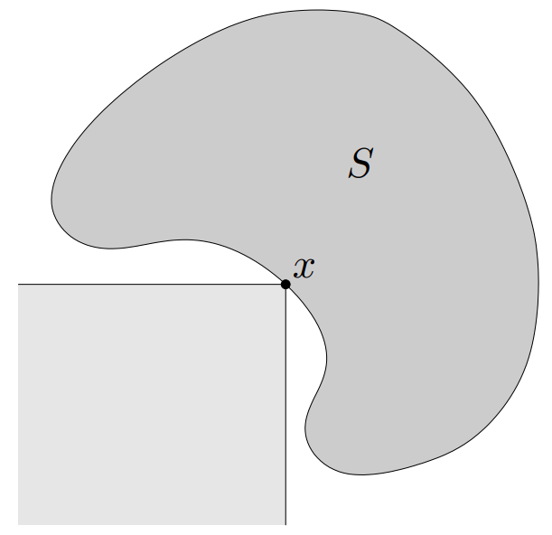

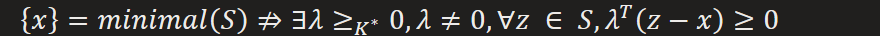

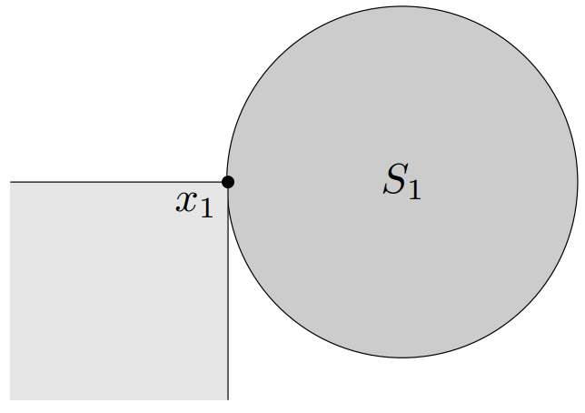

**The importance of convexity in optimization**  
Convexity means global optimal and convergence to it, since a convex function satisfies

The optimization of a target function maybe hard to achieve, e.g. there may lack of analytical solution, like objective in Variational Inference

Instead, the optimization can be equivalently be done by a lower bound of the target objective, given they are convex functions.

Why ?
Imagine that in convex case, both lower bound and its supreme are convex, so a point in lower bound has lower value, so is it in supreme.

But in non-convex case, the same point may has higher value in supreme, since supreme is not convex function, so there may be lots peaks in it

**Lagrange Multiplier & KKT: Chapter 5.4**  

We map a minimization problem in original space into its bounded problem, in here bounding it above, in dual space, which is a convex function with respect to original space and can be solved easier if provided with appropriate Lagrange multipliers.
In general
1.  Find assistant function that below target function over its domain
2.  Maximize assistant function so that it bounds target function tightest by adjusting Lagrange multipliers

since we are trying to find its maximum that bounds target function tightest, i.e.

Informal explanation for the sign of Lagrange multiplier is that for a minimization function, its Lagrange function always bound it above, Lagrange multipliers must be chosen so that:

Which implies the sign of Lagrange multiplier

But a deeper inspection can relate to gradients
The core question is when do we reach optimal ? That is when we cannot find a feasible direction that can reach to smaller or bigger function value.
For constraint-free problem, optimal reaches when gradient is 0.

And a feasible direction satisfies(for minimization)

Or equivalently

Tangent cone defines on geometric properties, which is unanalytical, we use its linear approximation as replacement

For equalities constraint, available field is made of points satisfy

Which means all tangent vectors in tangent cone also perpendicular to gradients

And optimization along such direction won't violate the equalities constraint, i.e.

Proof:

For inequalities constraint, available field is made of points satisfy

Which is solid region with equalities as edge, so we need to analyze points at border and internal respectively
Tangent cone of points at border were bounded by their tangents along the surface, which is perpendicular to gradients, so angles between any tangent vectors and gradients are greater or equal to 90, since a feasible direction must stay in constraint region.

And optimization along such direction won't violate the inequalities constraint, i.e.

Proof:

Now we apply the same scheme to internal points

Actually, such point has its feasible direction any vector in real space, since we are in internal available field, an appropriate movement will still stay in available field. And we can always find a feasible direction that can lead us to better function value.

Proof:

We find out that a feasible direction for target function requires

And allowed directions provided by available field are

Equivalently, it can transform to

Yielding two infinitesimal half spaces

According to strict hyperplane separating theorem

So optimal reaches only when the two half spaces share parallel norms

That's exactly the extended form of solving optimal with constraint in 1-d case

So in conclusion, a stationary points reaches when

Note that the KKT conditions only states that no existence of descent direction, but not equivalent to solution of local optimal  

**Purpose for defining feasible optimization issues**  
What kind of properties the set of target of interest should have ? This is exactly the constraint applied on the set of target.
All these definition are for compatibility beyond real space, or even, to infinite space

Convexity
The consistency and continuity between any two points ensure the optimization is meaningful.
To illustrate its importance, we can consider a extreme case where one point, which is the optimal point, is missing in the set, so it’s out of the consideration for a feasible optimization problem.

Cone
From perspective of optimization, a cone set stands for sub gradients of non-differentiable point.
And dual cone defines a set of directions have degree less than 90 with these sub gradients, so in a constraint optimization problem, a optimal point reaches when feasible region has no intersection with these directions, otherwise directions in the intersection can slowly lead to sub gradients and then to the optimal.

Support hyperplane
Support hyperplane has simple and straight geometrical explanation but illustrates a extreme useful property of optimization that a support point exclusively tells its update direction which also yield its optimal when has no intersection with region defined by constraint
The word "support" can make an graphical analogy to gravity in physics where any points beside support point in set have force support them up while the opposite case exists points drop downward

Generalized inequalities
Let's first take a look on inequality in real number system

Now if we extent it to elements of unknown vector space

Base on generalized inequalities, we can define partial order relationship, e.g.
How can we compare between matrixes ?
Follow the frame provided from Generalized inequalities, we need to find a cone of matrix to satisfy the inequality

Generalized inequalities is a fundamental and essential definition for defining good optimization problem, since the essence of best solution is that it is bigger or smaller than other solution in some measurable space, which means a partial must exist between these solutions, that in turn depends on the definition of generalized inequalities

Operation that preserve convexity
Max function

Application for max function can be related to alternating optimization problem, e.g. EM algorithm

We fix one component of parameters, then optimize the other, and then switch them while doing same process.
Conjugate

The most familiar application is regularization for cost function.

**Gradient-descent-based methods**  

1.  
2.  Search step size according to some principle
3.  Accept or reject updated state according to belief field

Classical gradient descent
Large magnitude gap in different directions of gradient =\> "Z" descent trajectory(with optimal step size)

Proof:

Assume the step size is optimal

So gradients from current step and next step are perpendicular, results in "Z" descent trajectory

Newton method
Rectify the magnitude of gradients by using second order information

Using taylor expansion (to 2-ord) to get new function has gradient = 0

Simulated-Newton method

Cannot guarantee positive definite

Sub gradient

Any gradient in sub-gradients may not be the descent direction

Search of step size
Assistant function

Brute-force

Armijo principle:

1.  Require descent each step motonomically, or
2.  Require descent after M steps, to jump out of local optimal

Goldstein principle

May result missing local optima

Wolfe principle

Convergence premise
Gradient satisfies Lipsic continuous

Approximate
Low frequent information -\> high frequent information (by high-ord derivative)

Vicinity gradient for solving non-smooth part, e.g. regularization part
Vicinity operator

Approximate gradient

1.  Gradient descent on smooth part
2.  Vicinity operator on non-smooth part after updating smooth part

Composed optimization
Split descent and constraint
1.  Do descent without constraint
2.  Project back into constrint space (by updating parameters in control of constrint)

Augmented Lagrange

For optimal

Should be consistent with Lagrange solution, for large k

ADMM

Non constraint to constraint

Lagrange to augmented Lagrange with panty function

Update target arguments and Lagrange multipliers

Update alternatively

