**Problem&Analysis**  

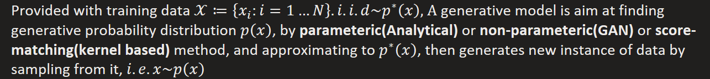

Base on **Maximum Likelihood Assumption**, we may try some following **solutions**  

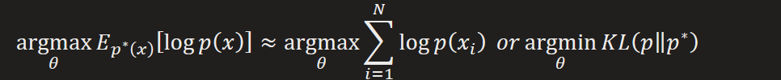
1.  
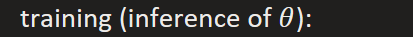

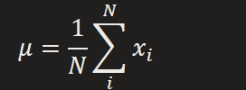

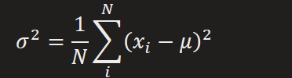

generation:

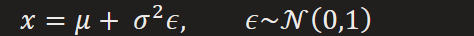

drawbacks&generalization:

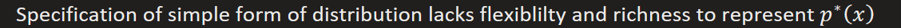

we may need more complicate hypothese on form of distribution
2.  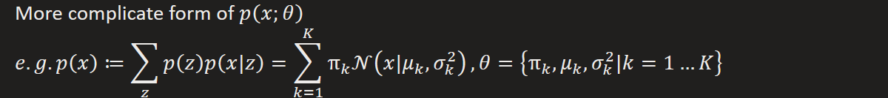
There's two ways leading to its lower bound

\(1\) using Importance Sampling

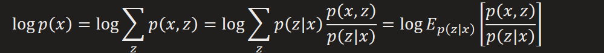

using Jensen's inequality

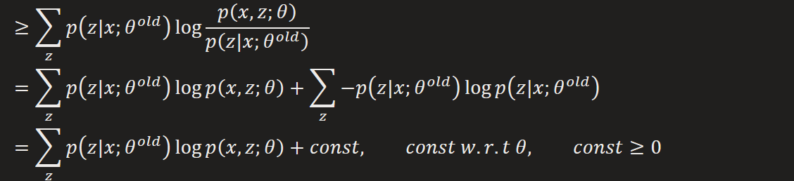

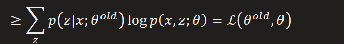

\(2\) *Using Bayesian rule*

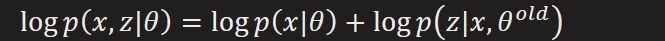

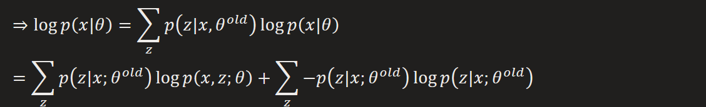

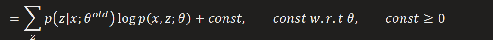

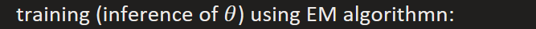

iteratively

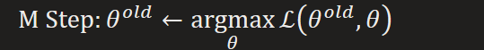

generation:

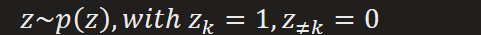

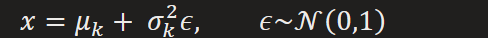

drawbacks&generalization:

here we introduce a latent variable Z for our generative model, so we can extend it to more general case where data generation following a process on a directed probabilistic model

General view of EM algorithm:

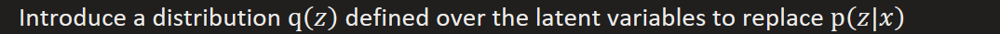

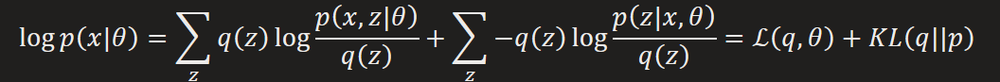

iteratively

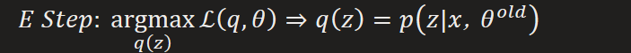

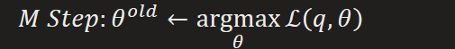

generation:

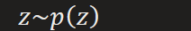

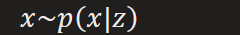

drawbacks&generalization:

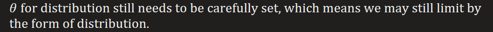

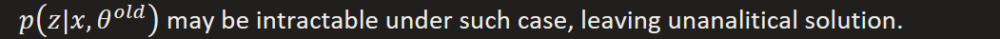

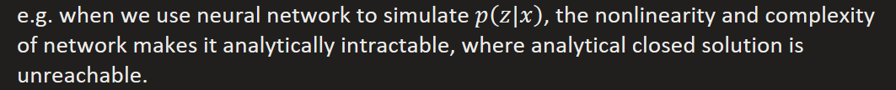

3.  
Note : there has another way to approximate posterior named stochastic approximation (e.g. MCEM, by using sampling method to draw samples z from posterior distribution Bishop 11.1.6)

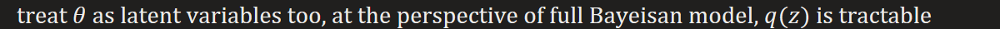

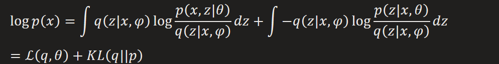

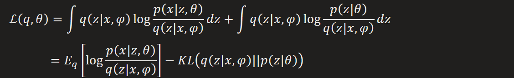

That brings the basic structure of variational autoencoder

encoder

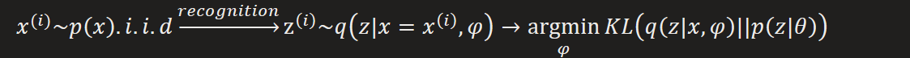

*decoder*

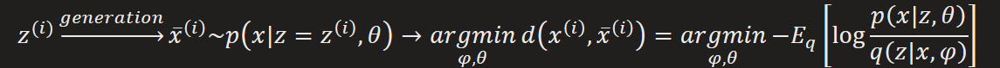

Note that VI often [underestimate variance](https://www.quora.com/Why-and-when-does-mean-field-variational-Bayes-underestimate-variance), this can date back from forms of KL-divergence which has detailed explanation in "Pattern recognition and machine learning. Bishop"

4.  Diffusion probability model : sequential latent variable
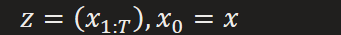

*That means we use Markov chain to extend the VAE structure into*

forward trajectory : diffusion process, slowly destroy data's distribution

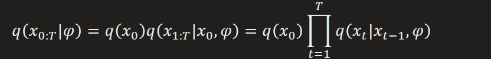

reversal trajectory : generation process, slowly recover data's distribution

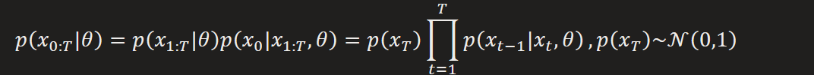

*Training objective:*

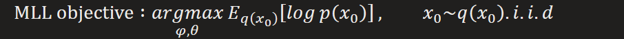

Apply the same technique in VI

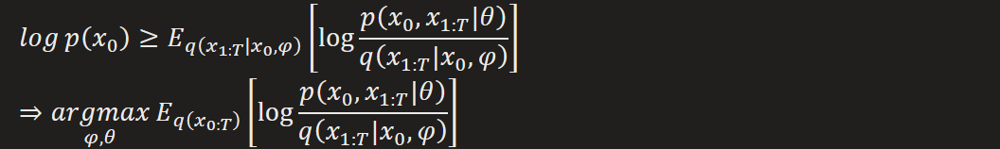

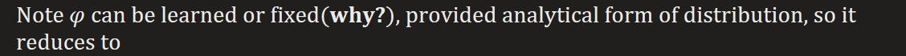

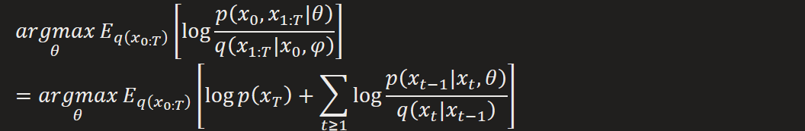

Base on **Markov Assumption**, this objective can be decomposed into summation of multiplication of each time's objective

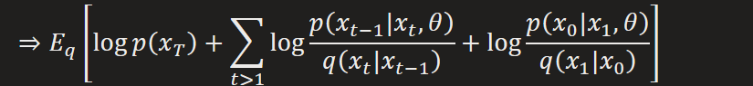

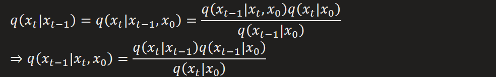

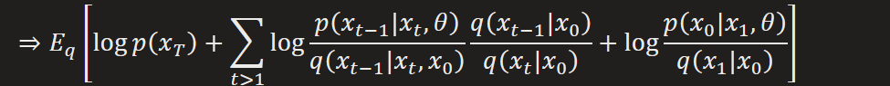

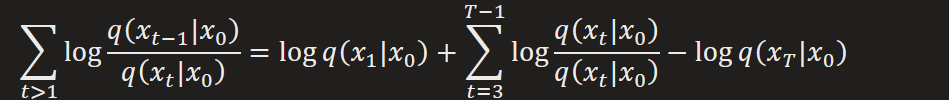

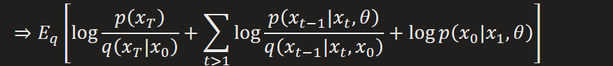

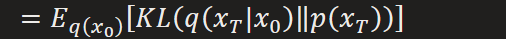

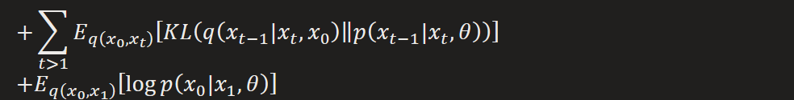

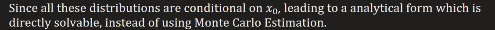

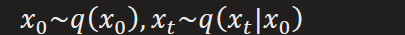

[Calculation of KL divergence](https://stats.stackexchange.com/questions/7440/kl-divergence-between-two-univariate-gaussians)

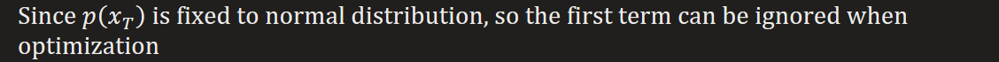

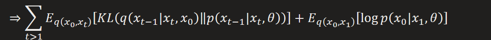

Same as the last phase of VAE, we then do reconstruction error between generated one and data sample.

In such perspective, we can take the optimization at each step as a special VAE, resulting in total T mini VAEs, instead, they estimate probabilistic distributions rather than real value

By using same variance, we have

[Training](https://github.com/hojonathanho/diffusion/):

If t \> 1

Else

generation:

**Connection to MCMC**  

The aforemention introduction proceeds at the perspective of optimization. But there has another view which can date back from core idea of MCMC.
1.  Diffusion process -- staionary distribution of Markov Chain
Provided with weak restriction(ergodic) on transition probability and stationary distribution, the target distribution recurrently diffused alone a MC can converge to a simple stationary distribution, e.g. Normal Gaussian

Note that the forward process in diffusion can also be called as process of random walk,

2.  Reversal process -- recovery from stationary distribution
The key that we can recover from stationary distribution is that the Markov Chain is reversible, that requirement satisfied when detailed balance is met

Also, a sufficient condition for stationary distribution is detailed balance, that brings guarantee for the Diffusion process.

And, detailed balance established when transition is symmetric -- Metropolis Algorithm

Here we may get some inspiration of where the final regression loss function in the paper comes from

i.e. we are reconstructing a reversible Markov Chain that holds the symmetry between forward transition and reversal transition at each time step, which is also showed in KL-divergence between reversed forward transition kernel and predicated backward transition kernel in objective.

3.  Difference to MCMC
In M-H algorithm, the sampling is done by analytically computing move probability

Since the move probability is a key element to hold the detailed balance

While in Diffusion, the MC already satisfied the detailed balance after training, so a recursive process of sampling can directly apply on MC to generate sample from target distribution (see generation of Diffusion)

**Connection to GAN**  

DDPM and GAN are classical instance of describe probabilistic model and implicit probabilistic model, respectively.

To estimate potential distribution of data, DDPM, learning under maximum likelihood assumption, approaches it by simulating the hierarchical process of generation, while GAN, learning in a contrastive way, directly sampling from it without obviously reconstructing its analytical form. So the performance of DDPM was naturally endowed with diversity, but lack of fidelity, while GAN does the opposite. But there are ways we can bridge gap between them.
1.  The diversity edge of DDPM
Actually, we can find out it for both of them, sampling is started from a random noise, but such randomness was added at every step of sampling in DDPM, resulting in high diversity of generation, but also brought with low efficiency of sampling.

So by reducing such randomness while keep optimization objective intact, we can modify its sampling process close to GAN's.

Issues of DDPM: slow and inefficient inference
1.  Large inference time steps

The analytical form of target reverse distribution was based on Markov Assumption

So in order to unlock sampling process from forward(diffusion) process, a non-Markovian forward process is needed

DDIM: faster sampling process by altering forward process from Markovian to non-Markovian

The estimated reverse distribution can be induced using the same structure

Which is a generalized form of DDPM(one special solution), and specialized to DDPM when

And forward process becomes Markovian

Which has the same form as the noisy process

That means each operation in sampling process is also a noisy process but output noisy result from last time step, which is relatively a denoising result compare to current one, so the whole procedure becomes a denoising process.

From such perspective, an inverse process(i.e. generated sample to noise) can also be yielded using model's estimation, which can benefits lots downstream task by transferring image into potential latent space.

Note that the forward(diffusion) process no longer being a diffusion, but with marginal distribution fixed, the noisy process remains the same

In principle, this implies that forward steps can be way larger than sampling step, or even a continuous time step both for forward and backward

Further, we can prove that [DDIM is discretized case of continuous ODE](https://zhuanlan.zhihu.com/p/645665386)

2.  Pixel-level inference
LDM: forward and backward processes in latent space, instead of in pixel-level

paper "**Denoising Diffusion Probabilistic Model**"  

Derivation of formula (4)

basic proof

Follow the induction, the predicate can be proved !

Derivation of formula (6)

Proof: using formula (4)

[According to product of two Gaussian PDF is a Gaussian PDF](https://davmre.github.io/blog/statistics/2015/03/27/gaussian_quotient)

[According to product of two Gaussian PDF is a Gaussian PDF](https://davmre.github.io/blog/statistics/2015/03/27/gaussian_quotient)

[Score matching](https://andrewcharlesjones.github.io/journal/21-score-matching.html) + diffusion

4.3 Progressive coding
