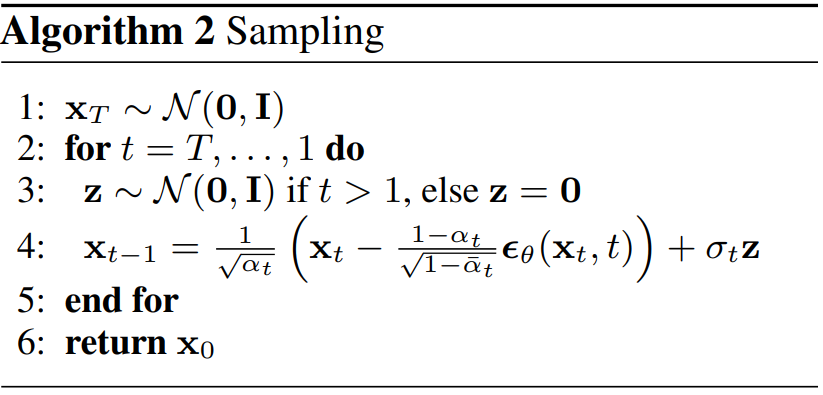
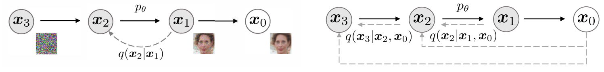

**Problem&Analysis**  
Provided with training data $\mathrm{X}:=\left\{{x}_{i}:i=1\dots N\right\}.i.i.d\sim {p}^{\ast}\left(x\right)$, A generative model is aim at finding generative probability distribution $p\left(x\right)$, by **parameteric(Analytical)** or **non-parameteric(GAN)** or **score-matching(kernel based)** method, and approximating to ${p}^{\ast}\left(x\right)$, then generates new instance of data by sampling from it, $i.e.x\sim p\left(x\right)$

Base on** Maximum Likelihood Assumption**, we may try some following **solutions**

$$
\underset{\mathit{\theta}}{\mathrm{argmax}}{E}_{{p}^{\ast}\left(x\right)}\left[\mathrm{log}p\left(x\right)\right]\approx \underset{\mathit{\theta}}{\mathrm{argmax}}{\sum}_{i=1}^{N}\mathrm{log}p\left({x}_{i}\right)\ or\underset{\mathit{\theta}}{\mathrm{argmin}}KL\left(p\Vert {p}^{\ast}\right)
$$

1. Specify form of $p\left(x;\mathit{\theta}\right),\ e.g.\ p\left(x\right):=\mathcal{N}\left(x;\mathit{\mu},{\mathit{\sigma}}^{2}\right),\ \mathit{\theta}=\left\{\mathit{\mu},{\mathit{\sigma}}^{2}\right\}$
training (inference of $\mathit{\theta}$):

$$
\mathit{\mu}=\frac{1}{N}{\sum}_{i}^{N}{x}_{i}
$$

$$
{\mathit{\sigma}}^{2}=\frac{1}{N}{\sum}_{i}^{N}{\left({x}_{i}-\mathit{\mu}\right)}^{2}
$$

generation:

$$
x=\mathit{\mu}+\ {\mathit{\sigma}}^{2}\mathit{\epsilon},\ \ \mathit{\epsilon}\sim \mathcal{N}\left(0,1\right)
$$

drawbacks&generalization:
  Specification of simple form of distribution lacks flexiblilty and richness to represent ${p}^{\ast}\left(x\right)$
  we may need more complicate hypothese on form of distribution
2. More complicate form of $p\left(x;\mathit{\theta}\right)$

$$
e.g.p\left(x\right):={\sum}_{z}p\left(z\right)p\left(x|z\right)={\sum}_{k=1}^{K}{\pi}_{k}\mathcal{N}\left(x|{\mathit{\mu}}_{k},{\mathit{\sigma}}_{k}^{2}\right),\mathit{\theta}=\left\{{\pi}_{k},{\mathit{\mu}}_{k},{\mathit{\sigma}}_{k}^{2}|k=1\dots K\right\}
$$

There's two ways leading to its lower bound
(1) using Importance Sampling

$$
\mathrm{log}p\left(x\right)=\mathrm{log}{\sum}_{z}p\left(x,z\right)=\mathrm{log}{\sum}_{z}p\left(z|x\right)\frac{p\left(x,z\right)}{p\left(z|x\right)}=\mathrm{log}{E}_{p\left(z|x\right)}\left[\frac{p\left(x,z\right)}{p\left(z|x\right)}\right]
$$

  using Jensen's inequality

$$
\ge {\sum}_{z}p\left(z|x;{\mathit{\theta}}^{old}\right)\mathrm{log}\frac{p\left(x,z;\mathit{\theta}\right)}{p\left(z|x;{\mathit{\theta}}^{old}\right)}
$$

$$
={\sum}_{z}p\left(z|x;{\mathit{\theta}}^{old}\right)\mathrm{log}p\left(x,z;\mathit{\theta}\right)+{\sum}_{z}-p\left(z|x;{\mathit{\theta}}^{old}\right)\mathrm{log}p\left(z|x;{\mathit{\theta}}^{old}\right)
$$

$$
={\sum}_{z}p\left(z|x;{\mathit{\theta}}^{old}\right)\mathrm{log}p\left(x,z;\mathit{\theta}\right)+const,\ \ const\ w.r.t\ \mathit{\theta},\ \ const\ge 0
$$

$$
\ge {\sum}_{z}p\left(z|x;{\mathit{\theta}}^{old}\right)\mathrm{log}p\left(x,z;\mathit{\theta}\right)=\mathcal{L}\left({\mathit{\theta}}^{old},\mathit{\theta}\right)
$$

(2) *Using Bayesian rule*

$$
\mathrm{log}p\left(x,z|\mathit{\theta}\right)=\mathrm{log}p\left(x|\mathit{\theta}\right)+\mathrm{log}p\left(z|x,{\mathit{\theta}}^{old}\right)
$$

$$
\Rightarrow \mathrm{log}p\left(x|\mathit{\theta}\right)=\mathrm{log}p\left(x,z|\mathit{\theta}\right)-\mathrm{log}p\left(z|x,{\mathit{\theta}}^{old}\right)
$$

$$
\Rightarrow \mathrm{log}p\left(x|\mathit{\theta}\right)={\sum}_{z}p\left(z|x,{\mathit{\theta}}^{old}\right)\mathrm{log}p\left(x|\mathit{\theta}\right)
$$

$$
={\sum}_{z}p\left(z|x;{\mathit{\theta}}^{old}\right)\mathrm{log}p\left(x,z;\mathit{\theta}\right)+{\sum}_{z}-p\left(z|x;{\mathit{\theta}}^{old}\right)\mathrm{log}p\left(z|x;{\mathit{\theta}}^{old}\right)
$$

$$
={\sum}_{z}p\left(z|x;{\mathit{\theta}}^{old}\right)\mathrm{log}p\left(x,z;\mathit{\theta}\right)+const,\ \ const\ w.r.t\ \mathit{\theta},\ \ const\ge 0
$$

$$
\ge {\sum}_{z}p\left(z|x;{\mathit{\theta}}^{old}\right)\mathrm{log}p\left(x,z;\mathit{\theta}\right)=\mathcal{L}\left({\mathit{\theta}}^{old},\mathit{\theta}\right)
$$

training (inference of $\mathit{\theta}$) using EM algorithmn:
  iteratively
    E Step: Evaluate 

$$
p\left(z|x;{\mathit{\theta}}^{old}\right)
$$

$$
\mathrm{M}\ \mathrm{Step}:{\mathit{\theta}}^{old}\leftarrow \underset{\mathit{\theta}}{\mathrm{argmax}}\mathcal{L}\left({\mathit{\theta}}^{old},\mathit{\theta}\right)
$$

generation:

$$
z\sim p\left(z\right),\ with\ {z}_{k}=1,{z}_{\ne k}=0
$$

$$
x={\mathit{\mu}}_{k}+\ {\mathit{\sigma}}_{k}^{2}\mathit{\epsilon},\ \ \mathit{\epsilon}\sim \mathcal{N}\left(0,1\right)
$$

drawbacks&generalization:
  Specification of form of distribution still limits represent ability for ${p}^{\ast}\left(x\right)$
  here we introduce a latent variable Z for our generative model, so we can extend it to more general case where data generation following a process on a directed probabilistic model
General view of EM algorithm:
  Introduce a distribution $\mathrm{q}\left(z\right)$ defined over the latent variables to replace $\mathrm{p}\left(z|x\right)$

$$
\mathrm{log}p\left(x|\mathit{\theta}\right)={\sum}_{z}q\left(z\right)\mathrm{log}\frac{p\left(x,z|\mathit{\theta}\right)}{q\left(z\right)}+{\sum}_{z}-q\left(z\right)\mathrm{log}\frac{p\left(z|x,\mathit{\theta}\right)}{q\left(z\right)}=\mathcal{L}\left(q,\mathit{\theta}\right)+KL\left(q\left|\right|p\right)
$$

  training (inference of $\mathit{\theta}$):
    iteratively

$$
E\ Step:\ \underset{q\left(z\right)}{\mathrm{argmax}}\mathcal{L}\left(q,\mathit{\theta}\right)\Rightarrow q\left(z\right)=p\left(z|x,{\mathit{\theta}}^{old}\right)
$$

$$
M\ Step:{\mathit{\theta}}^{old}\leftarrow \underset{\mathit{\theta}}{\mathrm{argmax}}\mathcal{L}\left(q,\mathit{\theta}\right)
$$

  generation:

$$
z\sim p\left(z\right)
$$

$$
x\sim p\left(x|z\right)
$$

  drawbacks&generalization:
     $\mathit{\theta}$ for distribution still needs to be carefully set, which means we may still limit by the form of distribution.
     $p\left(z|x,{\mathit{\theta}}^{old}\right)$ may be intractable under such case, leaving unanalitical solution.
    e.g. when we use neural network to simulate $p\left(z|x\right)$, the nonlinearity and complexity of network makes it analytically intractable, where analytical closed solution is unreachable.  
3. Variational Inference : deterministic approximation to the posterior : $q\left(z\right)\to p\left(z\right|x)$
Note : there has another way to approximate posterior named stochastic approximation (e.g. MCEM, by using sampling method to draw samples z from posterior distribution Bishop 11.1.6)
treat $\mathit{\theta}$ as latent variables too, at the perspective of full Bayeisan model, $q\left(z\right)$ is tractable

$$
\mathrm{log}p\left(x\right)=\int q\left(z|x,\mathit{\phi}\right)\mathrm{log}\frac{p\left(x,z|\mathit{\theta}\right)}{q\left(z|x,\mathit{\phi}\right)}dz+\int -q\left(z|x,\mathit{\phi}\right)\mathrm{log}\frac{p\left(z|x,\mathit{\theta}\right)}{q\left(z|x,\mathit{\phi}\right)}dz=\mathcal{L}\left(q,\mathit{\theta}\right)+KL\left(q\left|\right|p\right)
$$

$$
\mathcal{L}\left(q,\mathit{\theta}\right)=\int q\left(z|x,\mathit{\phi}\right)\mathrm{log}\frac{p\left(x|z,\mathit{\theta}\right)}{q\left(z|x,\mathit{\phi}\right)}dz+\int q\left(z|x,\mathit{\phi}\right)\mathrm{log}\frac{p\left(z|\mathit{\theta}\right)}{q\left(z|x,\mathit{\phi}\right)}dz\ \ \ 
$$

$$
\ \ \ \ \ \ \ \ \ \ \ \ \ \ ={E}_{q}\left[\mathrm{log}\frac{p\left(x|z,\mathit{\theta}\right)}{q\left(z|x,\mathit{\phi}\right)}\right]-KL\left(q\left(z|x,\mathit{\phi}\right)\left|\right|p\left(z|\mathit{\theta}\right)\right)
$$

That brings the basic structure of variational autoencoder
encoder

$$
{x}^{\left(i\right)}\sim p\left(x\right).i.i.d\stackrel{recognition}{\to}{\mathrm{z}}^{\left(i\right)}\sim q\left(z|x={x}^{\left(i\right)},\mathit{\phi}\right)\to \underset{\mathit{\phi}}{\mathrm{argmin}}KL\left(q\left(z|x,\mathit{\phi}\right)\left|\right|p\left(z|\mathit{\theta}\right)\right)
$$

*decoder*

$$
{z}^{\left(i\right)}\stackrel{generation}{\to}{\stackrel{-}{x}}^{\left(i\right)}\sim p\left(x|z={z}^{\left(i\right)},\mathit{\theta}\right)\to \underset{\mathit{\phi},\mathit{\theta}}{argmin}d\left({x}^{\left(i\right)},{\stackrel{-}{x}}^{\left(i\right)}\right)=\underset{\mathit{\phi},\mathit{\theta}}{argmin}-{E}_{q}\left[\mathrm{log}\frac{p\left(x|z,\mathit{\theta}\right)}{q\left(z|x,\mathit{\phi}\right)}\right]
$$

Note that VI often [underestimate variance](https://www.quora.com/Why-and-when-does-mean-field-variational-Bayes-underestimate-variance), this can date back from forms of KL-divergence which has detailed explanation in "Pattern recognition and machine learning. Bishop"
4. Diffusion probability model : sequential latent variable

$$
z=\left({x}_{1:T}\right),{x}_{0}=x
$$

*That means we use Markov chain to extend the VAE structure into*
forward trajectory : diffusion process, slowly destroy data's distribution

$$
q\left({x}_{0:T}|\mathit{\phi}\right)=q\left({x}_{0}\right)q\left({x}_{1:T}|{x}_{0},\mathit{\phi}\right)=q\left({x}_{0}\right){\prod}_{t=1}^{T}q\left({x}_{t}|{x}_{t-1},\mathit{\phi}\right)
$$

reversal trajectory : generation process, slowly recover data's distribution

$$
p\left({x}_{0:T}|\mathit{\theta}\right)=p\left({x}_{1:T}|\mathit{\theta}\right)p\left({x}_{0}|{x}_{1:T},\mathit{\theta}\right)=p\left({x}_{T}\right){\prod}_{t=1}^{T}p\left({x}_{t-1}|{x}_{t},\mathit{\theta}\right),\ p\left({x}_{T}\right)\sim \mathcal{N}\left(0,1\right)
$$

*Training objective:*

$$
\mathrm{MLL}\ \mathrm{objective}\ :\underset{\mathit{\phi},\mathit{\theta}}{argmax}{E}_{q\left({x}_{0}\right)}\left[logp\left({x}_{0}\right)\right],\ \ {x}_{0}\sim q\left({x}_{0}\right).i.i.d
$$

  Apply the same technique in VI

$$
logp\left({x}_{0}\right)\ge {E}_{q\left({x}_{1:T}|{x}_{0},\mathit{\phi}\right)}\left[\mathrm{log}\frac{p\left({x}_{0},{x}_{1:T}|\mathit{\theta}\right)}{q\left({x}_{1:T}|{x}_{0},\mathit{\phi}\right)}\right]
$$

$$
\Rightarrow \underset{\mathit{\phi},\mathit{\theta}}{argmax}{E}_{q\left({x}_{0:T}\right)}\left[\mathrm{log}\frac{p\left({x}_{0},{x}_{1:T}|\mathit{\theta}\right)}{q\left({x}_{1:T}|{x}_{0},\mathit{\phi}\right)}\right]
$$

  Note $\mathit{\phi}$ can be learned or fixed(**why?**), provided analytical form of distribution, so it reduces to

$$
\underset{\mathit{\theta}}{argmax}{E}_{q\left({x}_{0:T}\right)}\left[\mathrm{log}\frac{p\left({x}_{0},{x}_{1:T}|\mathit{\theta}\right)}{q\left({x}_{1:T}|{x}_{0},\mathit{\phi}\right)}\right]
$$

$$
=\underset{\mathit{\theta}}{argmax}{E}_{q\left({x}_{0:T}\right)}\left[\mathrm{log}p\left({x}_{T}\right)+{\sum}_{t\ge 1}\mathrm{log}\frac{p\left({x}_{t-1}|{x}_{t},\mathit{\theta}\right)}{q\left({x}_{t}|{x}_{t-1}\right)}\right]
$$

  Base on **Markov Assumption**, this objective can be decomposed into summation of multiplication of each time's objective

$$
\Rightarrow {E}_{q}\left[\mathrm{log}p\left({x}_{T}\right)+{\sum}_{t>1}\mathrm{log}\frac{p\left({x}_{t-1}|{x}_{t},\mathit{\theta}\right)}{q\left({x}_{t}|{x}_{t-1}\right)}+\mathrm{log}\frac{p\left({x}_{0}|{x}_{1},\mathit{\theta}\right)}{q\left({x}_{1}|{x}_{0}\right)}\right]
$$

$$
q\left({x}_{t}|{x}_{t-1}\right)=q\left({x}_{t}|{x}_{t-1},{x}_{0}\right)=\frac{q\left({x}_{t-1}|{x}_{t},{x}_{0}\right)q\left({x}_{t}|{x}_{0}\right)}{q\left({x}_{t-1}|{x}_{0}\right)}
$$

$$
\Rightarrow q\left({x}_{t-1}|{x}_{t},{x}_{0}\right)=\frac{q\left({x}_{t}|{x}_{t-1}\right)q\left({x}_{t-1}|{x}_{0}\right)}{q\left({x}_{t}|{x}_{0}\right)}
$$

$$
\Rightarrow {E}_{q}\left[\mathrm{log}p\left({x}_{T}\right)+{\sum}_{t>1}\mathrm{log}\frac{p\left({x}_{t-1}|{x}_{t},\mathit{\theta}\right)}{q\left({x}_{t-1}|{x}_{t},{x}_{0}\right)}\frac{q\left({x}_{t-1}|{x}_{0}\right)}{q\left({x}_{t}|{x}_{0}\right)}+\mathrm{log}\frac{p\left({x}_{0}|{x}_{1},\mathit{\theta}\right)}{q\left({x}_{1}|{x}_{0}\right)}\right]
$$

$$
{\sum}_{t>1}\mathrm{log}\frac{q\left({x}_{t-1}|{x}_{0}\right)}{q\left({x}_{t}|{x}_{0}\right)}=\mathrm{log}q\left({x}_{1}|{x}_{0}\right)+{\sum}_{t=3}^{T-1}\mathrm{log}\frac{q\left({x}_{t}|{x}_{0}\right)}{q\left({x}_{t}|{x}_{0}\right)}-\mathrm{log}q\left({x}_{T}|{x}_{0}\right)
$$

$$
\Rightarrow {E}_{q}\left[\mathrm{log}\frac{p\left({x}_{T}\right)}{q\left({x}_{T}|{x}_{0}\right)}+{\sum}_{t>1}\mathrm{log}\frac{p\left({x}_{t-1}|{x}_{t},\mathit{\theta}\right)}{q\left({x}_{t-1}|{x}_{t},{x}_{0}\right)}+\mathrm{log}p\left({x}_{0}|{x}_{1},\mathit{\theta}\right)\right]
$$

$$
={E}_{q\left({x}_{0}\right)}\left[KL\left(q\left({x}_{T}|{x}_{0}\right)\Vert p\left({x}_{T}\right)\right)\right]
$$

$$
+{\sum}_{t>1}{E}_{q\left({x}_{0},{x}_{t}\right)}\left[KL\left(q\left({x}_{t-1}|{x}_{t},{x}_{0}\right)\Vert p\left({x}_{t-1}|{x}_{t},\mathit{\theta}\right)\right)\right]
$$

$$
+{E}_{q\left({x}_{0},{x}_{1}\right)}\left[\mathrm{log}p\left({x}_{0}|{x}_{1},\mathit{\theta}\right)\right]
$$

  Since all these distributions are conditional on ${x}_{0}$*, *leading to a analytical form which is directly solvable, instead of using Monte Carlo Estimation.
  Note that sampling from $q\left({x}_{0},{x}_{t}\right)$ can be decomposition into

$$
{x}_{0}\sim q\left({x}_{0}\right),{x}_{t}\sim q\left({x}_{t}|{x}_{0}\right)
$$

[Calculation of KL divergence](https://stats.stackexchange.com/questions/7440/kl-divergence-between-two-univariate-gaussians)
  Since $p\left({x}_{T}\right)$ is fixed to normal distribution, so the first term can be ignored when optimization

$$
\Rightarrow {\sum}_{t>1}{E}_{q\left({x}_{0},{x}_{t}\right)}\left[KL\left(q\left({x}_{t-1}|{x}_{t},{x}_{0}\right)\Vert p\left({x}_{t-1}|{x}_{t},\mathit{\theta}\right)\right)\right]+{E}_{q\left({x}_{0},{x}_{1}\right)}\left[\mathrm{log}p\left({x}_{0}|{x}_{1},\mathit{\theta}\right)\right]
$$

  Last term need to be set to match discrete form of image by converting to discrete log likelihood, i.e. $\left[-1,1\right]\to \left\{0,\ 1,\ 2,\dots ,255\right\}$

$$
p\left({x}_{0}|{x}_{1},\mathit{\theta}\right)={\prod}_{i=1}^{D}\underset{{\mathit{\delta}}_{-}\left({x}_{0}^{i}\right)}{\overset{{\mathit{\delta}}_{+}\left({x}_{0}^{i}\right)}{\int}}\mathcal{N}\left(x;{\mathit{\mu}}_{\mathit{\theta}}^{i}\left({x}_{1},1\right),{\mathit{\sigma}}_{1}^{2}\right)dx
$$

$$
\mathrm{where}\ {\mathit{\delta}}_{+}\left({x}_{0}^{i}\right)=\left\{\begin{array}{c}\infty ,\ \ x=1\\ x+\frac{1}{255},x<1\end{array}\right.,\ \ {\mathit{\delta}}_{-}\left({x}_{0}^{i}\right)=\left\{\begin{array}{c}-\infty ,\ \ x=-1\\ x-\frac{1}{255},x>-1\end{array}\right.
$$

$$
D=H\times W
$$

  This is equivalent to cumulate probabilities of bin centering at $x$ with width 2/255
  Same as the last phase of VAE, we then do reconstruction error between generated one and data sample.
  In such perspective, we can take the optimization at each step as a special VAE, resulting in total T mini VAEs, instead, they estimate probabilistic distributions rather than real value

$$
p\left({x}_{t-1}|{x}_{t},\mathit{\theta}\right)=\left\{\begin{array}{c}\mathcal{N}\left({f}_{\mathit{\theta}}\left({x}_{1}\right),{\mathit{\sigma}}_{1}^{2}\bm{I}\right),\ \ \ t=1\\ q\left({x}_{t-1}|{x}_{t},{\widehat{x}}_{0}^{t}\right)\sim \mathcal{N}\left({x}_{t-1};{\bm{\mu}}_{\mathit{\theta}}\left({x}_{t},{\widehat{x}}_{0}^{t}\right),{\mathit{\sigma}}_{t}^{2}\bm{I}\right),\ \ t>1\end{array}\right.
$$

$$
{\widehat{x}}_{0}^{t}={f}_{\mathit{\theta}}\left({x}_{t}\right)=\frac{{x}_{t}-\sqrt{1-{\stackrel{-}{\mathit{\alpha}}}_{t}}\bullet {\mathit{\epsilon}}_{\mathit{\theta}}\left({x}_{t}\right)}{\sqrt{{\stackrel{-}{\mathit{\alpha}}}_{t}}}\ is\ predicted\ {x}_{0}\ by\ using
$$

$$
{x}_{t}\sim q\left({x}_{t}|{x}_{0}\right)=\mathcal{N}\left(\sqrt{{\stackrel{-}{\mathit{\alpha}}}_{t}}{x}_{0},1-{\stackrel{-}{\mathit{\alpha}}}_{t}\right)
$$

$$
\underset{\mathit{\theta}}{\mathrm{argmin}}{E}_{q\left({x}_{0},{x}_{t}\right)}\left[KL\left(q\left({x}_{t-1}|{x}_{t},{x}_{0}\right)\Vert p\left({x}_{t-1}|{x}_{t},\mathit{\theta}\right)\right)\right]
$$

$$
q\left({x}_{t-1}|{x}_{t},{x}_{0}\right)=\mathcal{N}\left({x}_{t-1};{\stackrel{\sim }{\bm{\mu}}}_{t}\left({x}_{t},{x}_{0}\right),{\stackrel{\sim }{\mathit{\beta}}}_{t}\bm{I}\right)
$$

$$
\mathrm{where}\ {\stackrel{\sim }{\bm{\mu}}}_{t}\left({x}_{t},{x}_{0}\right):=\frac{\sqrt{{\stackrel{-}{\mathit{\alpha}}}_{t-1}}{\mathit{\beta}}_{t}}{1-{\stackrel{-}{\mathit{\alpha}}}_{t}}{x}_{0}+\frac{\sqrt{{\mathit{\alpha}}_{t}}\left(1-{\stackrel{-}{\mathit{\alpha}}}_{t-1}\right)}{1-{\stackrel{-}{\mathit{\alpha}}}_{t}}{x}_{t}\ \ \ and\ \ \ {\stackrel{\sim }{\mathit{\beta}}}_{t}:=\frac{1-{\stackrel{-}{\mathit{\alpha}}}_{t-1}}{1-{\stackrel{-}{\mathit{\alpha}}}_{t}}{\mathit{\beta}}_{t}
$$

$$
{x}_{0}=\frac{{x}_{t}-\sqrt{1-{\stackrel{-}{\mathit{\alpha}}}_{t}}\bullet {\mathit{\epsilon}}_{t}}{\sqrt{{\stackrel{-}{\mathit{\alpha}}}_{t}}},{\mathit{\epsilon}}_{t}\sim \mathcal{N}\left(0,\bm{I}\right)
$$

$$
\Rightarrow {\stackrel{\sim }{\bm{\mu}}}_{t}\left({x}_{t},{x}_{0}\left({x}_{t},{\mathit{\epsilon}}_{t}\right)\right)={\stackrel{\sim }{\bm{\mu}}}_{t}\left({x}_{t},{\mathit{\epsilon}}_{t}\right)=\frac{1}{\sqrt{{\stackrel{-}{\mathit{\alpha}}}_{t}}}\left({x}_{t}-\frac{{\mathit{\beta}}_{t}}{\sqrt{1-{\stackrel{-}{\mathit{\alpha}}}_{t}}}{\mathit{\epsilon}}_{t}\right)
$$

${\stackrel{\sim }{\bm{\mu}}}_{t}$ and ${\bm{\mu}}_{\mathit{\theta}}$ share same form with different ${x}_{0}$ and ${\mathit{\epsilon}}_{t}$

$$
{\bm{\mu}}_{\mathit{\theta}}\left({x}_{t},{\widehat{x}}_{0}^{t}\right)=\frac{1}{\sqrt{{\stackrel{-}{\mathit{\alpha}}}_{t}}}\left({x}_{t}-\frac{1-{\mathit{\alpha}}_{t}}{\sqrt{1-{\stackrel{-}{\mathit{\alpha}}}_{t}}}{\mathit{\epsilon}}_{\mathit{\theta}}\left({x}_{t}\right)\right)
$$

By using same variance, we have

$$
\underset{\mathit{\theta}}{\mathrm{argmin}}KL\left(q\left|\right|p\right)\equiv \underset{\mathit{\theta}}{\mathrm{argmin}}{\Vert {\stackrel{\sim }{\bm{\mu}}}_{t}\left({x}_{t},{\mathit{\epsilon}}_{t}\right)-{\bm{\mu}}_{\mathit{\theta}}\left({x}_{t},{\widehat{x}}_{0}^{t}\right)\Vert}_{2}^{2}\equiv \underset{\mathit{\theta}}{\mathrm{argmin}}{\Vert {\mathit{\epsilon}}_{\mathit{\theta}}\left({x}_{t},t\right)-{\mathit{\epsilon}}_{t}\Vert}_{2}^{2}
$$

$$
\Rightarrow \underset{\mathit{\theta}}{\mathrm{argmin}}{E}_{{x}_{0},{\mathit{\epsilon}}_{t}}\left[{\Vert {\mathit{\epsilon}}_{\mathit{\theta}}\left({x}_{t},t\right)-{\mathit{\epsilon}}_{t}\Vert}_{2}^{2}\right]
$$

  **Actually, the objective is fixed as long as we fixed **$\bm{q}\left({\bm{x}}_{\bm{t}}|{\bm{x}}_{0}\right)$** for any t**
[Training](https://github.com/hojonathanho/diffusion/):
  

$$
{x}_{0}\sim q\left(x\right)
$$

$$
\mathrm{t}\sim \mathrm{Uniform}\left(\left\{1,\dots ,T\right\}\right)
$$

$$
{x}_{t}\sim q\left({x}_{t}|{x}_{0}\right),\u03f5\sim N\left(0,\ I\right)
$$

  If t > 1

$$
{\stackrel{\sim }{\mathit{\mu}}}_{t},{\stackrel{\sim }{\mathit{\sigma}}}_{t}^{2}\leftarrow q\left({x}_{t-1}|{x}_{t},{x}_{0}\right)
$$

$$
{\mathit{\mu}}_{\mathit{\theta}},{\mathit{\sigma}}_{\mathit{\theta}}^{2}=model\left({x}_{t},t\right),without\ knowledge\ of\ {x}_{0}
$$

$$
\mathrm{KL}\left({\stackrel{\sim }{\mathit{\mu}}}_{t},{\stackrel{\sim }{\mathit{\sigma}}}_{t}^{2}\Vert {\mathit{\mu}}_{\mathit{\theta}},{\mathit{\sigma}}_{\mathit{\theta}}^{2}\right)
$$

  Else

$$
{\mathit{\mu}}_{\mathit{\theta}},{\mathit{\sigma}}_{\mathit{\theta}}^{2}=model\left({x}_{t},t\right)
$$

Discretized(${\mathit{\mu}}_{\mathit{\theta}},{\mathit{\sigma}}_{\mathit{\theta}}^{2},{x}_{0}\ $)<equation>
generation:
  

$$
{x}_{T}\sim p\left({x}_{T}\right)
$$

$$
{x}_{t}\sim p\left({x}_{t}|{x}_{t+1}\right)\ :{x}_{t}=g\left(z,{x}_{t+1},\mathit{\theta}\right),\left\{\begin{array}{c}z\sim p\left(z\right),\ \ t>1\\ z=0,\ \ t=1\end{array}\right.
$$

**Connection to MCMC**  
  The aforemention introduction proceeds at the perspective of optimization. But there has another view which can date back from core idea of MCMC.
1) Diffusion process -- staionary distribution of Markov Chain
Provided with weak restriction(ergodic) on transition probability and stationary distribution, the target distribution recurrently diffused alone a MC can converge to a simple stationary distribution, e.g. Normal Gaussian

$$
{\pi}_{j}={\sum}_{k}{\pi}_{k}{p}_{kj}
$$

Note that the forward process in diffusion can also be called as process of random walk,
instead it repeatedly **adds** Gaussian random variable, so $q\left({x}_{t}|{x}_{t-1}\right)$ can also be called random walk kernel
2) Reversal process -- recovery from stationary distribution
The key that we can recover from stationary distribution is that the Markov Chain is reversible, that requirement satisfied when detailed balance is met

$$
{\pi}_{j}{p}_{ji}={\pi}_{i}{p}_{ij}
$$

Also, a sufficient condition for stationary distribution is detailed balance, that brings guarantee for the Diffusion process.

$$
{\sum}_{j}{\pi}_{j}{p}_{ji}={\sum}_{j}{\pi}_{i}{p}_{ij}={\pi}_{i}
$$

And, detailed balance established when transition is symmetric -- Metropolis Algorithm

$$
{q}_{ij}={q}_{ji}={p}_{ji}
$$

Here we may get some inspiration of where the final regression loss function in the paper comes from
i.e. we are reconstructing a reversible Markov Chain that holds the symmetry between forward transition and reversal transition at each time step, which is also showed in KL-divergence between reversed forward transition kernel and predicated backward transition kernel in objective.

$$
{E}_{q}\left[\frac{1}{2{\mathit{\sigma}}_{t}^{2}}{\left|\left|{\stackrel{\sim }{\mathit{\mu}}}_{t}\left({x}_{t},{x}_{0}\right)-{\mathit{\mu}}_{\mathit{\theta}}\left({x}_{t},t\right)\right|\right|}^{2}\right],\ \ with\left\{\begin{array}{c}q\left({x}_{t-1}|{x}_{t},{x}_{0}\right)=\mathcal{N}\left({x}_{t-1};{\stackrel{\sim }{\mathit{\mu}}}_{t}\left({x}_{t},{x}_{0}\right),{\stackrel{\sim }{\mathit{\beta}}}_{t}I\right)\\ {p}_{\mathit{\theta}}\left({x}_{t-1}|{x}_{t}\right)=\mathcal{N}\left({x}_{t-1};{\stackrel{\sim }{\mathit{\mu}}}_{\mathit{\theta}}\left({x}_{t},t\right),{\stackrel{\sim }{\mathit{\beta}}}_{t}I\right)\end{array}\right.\ 
$$

  or

$$
{E}_{t,{x}_{0},\mathit{\epsilon}}\left[{\left|\left|\mathit{\epsilon}-{\mathit{\epsilon}}_{\mathit{\theta}}\left(\sqrt{{\stackrel{-}{\mathit{\alpha}}}_{t}}{x}_{0}+\sqrt{{1-\stackrel{-}{\mathit{\alpha}}}_{t}}\mathit{\epsilon},t\right)\right|\right|}^{2}\right],\ \ by\ reparameter\ trick
$$

3) Difference to MCMC
In M-H algorithm, the sampling is done by analytically computing move probability

$$
\alpha \left(x,y\right)=\mathrm{min}\left\{1,\frac{\mathit{\pi}\left(y\right)q\left(y,x\right)}{\mathit{\pi}\left(x\right)q\left(x,y\right)}\right\}\Rightarrow u\sim U\left(0,1\right)\left\{\begin{array}{c}u\le \alpha \left(x,y\right),accept\ y\\ u>\alpha \left(x,y\right),reject\ y,\ reuse\ x\end{array}\right.
$$

Since the move probability is a key element to hold the detailed balance

$$
\pi \left(x\right)q\left(x,y\right)\alpha \left(x,y\right)=\pi \left(y\right)q\left(y,x\right)\alpha \left(y,x\right)
$$

  While in Diffusion, the MC already satisfied the detailed balance after training, so a recursive process of sampling can directly apply on MC to generate sample from target distribution (see generation of Diffusion)  
**Connection to GAN**  
  DDPM and GAN are classical instance of describe probabilistic model and implicit probabilistic model, respectively.
  To estimate potential distribution of data, DDPM, learning under maximum likelihood assumption, approaches it by simulating the hierarchical process of generation, while GAN, learning in a contrastive way, directly sampling from it without obviously reconstructing its analytical form. So the performance of DDPM was naturally endowed with diversity, but lack of fidelity, while GAN does the opposite. But there are ways we can bridge gap between them.
1) The diversity edge of DDPM
Actually, we can find out it for both of them, sampling is started from a random noise, but such randomness was added at every step of sampling in DDPM, resulting in high diversity of generation, but also brought with low efficiency of sampling.
So by reducing such randomness while keep optimization objective intact, we can modify its sampling process close to GAN's.

Issues of DDPM: slow and inefficient inference
1. Large inference time steps
In order to approaching requirement $\ p\left({x}_{T}\right)\sim \mathcal{N}\left(0,1\right)$, a large T was needed

$$
q\left({x}_{T}|{x}_{0}\right)=\mathcal{N}\left({\bm{x}}_{\bm{T}};\sqrt{{\stackrel{-}{\mathit{\alpha}}}_{T}}{\bm{x}}_{0},\left(1-{\stackrel{-}{\mathit{\alpha}}}_{T}\right)\bm{I}\right)
$$

$$
\Rightarrow {x}_{T}=\sqrt{{\stackrel{-}{\mathit{\alpha}}}_{T}}{\bm{x}}_{0}+\left(1-{\stackrel{-}{\mathit{\alpha}}}_{T}\right)\mathit{\epsilon},\mathit{\epsilon}\sim \mathcal{N}\left(0,1\right)
$$

$$
{x}_{T}\to \mathit{\epsilon}\Rightarrow {\stackrel{-}{\mathit{\alpha}}}_{T}\to 0\Rightarrow T\to +\infty 
$$

The analytical form of target reverse distribution was based on Markov Assumption

$$
q\left({x}_{t-1}|{x}_{t},{x}_{0}\right)=\frac{q\left({x}_{t}|{x}_{t-1}\right)q\left({x}_{t-1}|{x}_{0}\right)}{q\left({x}_{t}|{x}_{0}\right)}
$$

So as the estimated reverse distribution $p\left({x}_{t-1}|{x}_{t}\right)$, resulting in alignment in time step between forward and backward process, i.e. same T steps for sampling

$$
p\left({x}_{t-1}|{x}_{t},\mathit{\theta}\right)=\left\{\begin{array}{c}\mathcal{N}\left({f}_{\mathit{\theta}}\left({x}_{1}\right),{\mathit{\sigma}}_{1}^{2}\bm{I}\right),\ \ \ t=1\\ q\left({x}_{t-1}|{x}_{t},{\widehat{x}}_{0}^{t}\right),\ \ t>1\end{array}\right.
$$

$$
{\widehat{x}}_{0}^{t}={f}_{\mathit{\theta}}\left({x}_{t}\right)=\frac{{x}_{t}-\sqrt{1-{\stackrel{-}{\mathit{\alpha}}}_{t}}\bullet {\mathit{\epsilon}}_{\mathit{\theta}}\left({x}_{t}\right)}{\sqrt{{\stackrel{-}{\mathit{\alpha}}}_{t}}}
$$

So in order to unlock sampling process from forward(diffusion) process, a non-Markovian forward process is needed
DDIM: faster sampling process by altering forward process from Markovian to non-Markovian

$$
{q}_{\mathit{\sigma}}\left({x}_{t-1}|{x}_{t},{x}_{0}\right)=\frac{{q}_{\mathit{\sigma}}\left({x}_{t}|{x}_{t-1},{x}_{0}\right){q}_{\mathit{\sigma}}\left({x}_{t-1}|{x}_{0}\right)}{{q}_{\mathit{\sigma}}\left({x}_{t}|{x}_{0}\right)},{q}_{\mathit{\sigma}}\left({x}_{t}|{x}_{t-1},{x}_{0}\right)\ne {q}_{\mathit{\sigma}}\left({x}_{t}|{x}_{t-1}\right)
$$

The paper found that objective of DDPM is based on $q\left({x}_{t}|{x}_{0}\right)$, so as long as the marginal distribution $q\left({x}_{t}|{x}_{0}\right)$ is fixed, objective of DDPM incluing the training procedure can be reused. That means we can not only learn a generative process from the Markovian inference process as defined in DDPM, but alson that for many non-Markovian ones parameterized by $\sigma $, all of which represent the solution space fulfilling fixed marginal distribution.*
*

$$
{q}_{\mathit{\sigma}}\left({x}_{t-1}|{x}_{t},{x}_{0}\right)=\mathcal{N}\left(s{x}_{t}+m{x}_{0},{\mathit{\sigma}}_{t}^{2}\bm{I}\right)
$$

$$
{x}_{t-1}=s{x}_{t}+m{x}_{0}+{\mathit{\sigma}}_{t}{\mathit{\epsilon}}_{1},\ \ {x}_{t}=\sqrt{{\stackrel{-}{\mathit{\alpha}}}_{t}}{\bm{x}}_{0}+\sqrt{1-{\stackrel{-}{\mathit{\alpha}}}_{t}}{\mathit{\epsilon}}_{2}
$$

$$
\Rightarrow {x}_{t-1}=\left(s\sqrt{{\stackrel{-}{\mathit{\alpha}}}_{t}}+m\right){x}_{0}+{\mathit{\sigma}}_{t}{\mathit{\epsilon}}_{1}+s\sqrt{1-{\stackrel{-}{\mathit{\alpha}}}_{t}}{\mathit{\epsilon}}_{2}
$$

$$
\ \ \ \ \ \ \ \ \ \ \ \ \ \ \ =\left(s\sqrt{{\stackrel{-}{\mathit{\alpha}}}_{t}}+m\right){x}_{0}+\sqrt{{\mathit{\sigma}}_{t}^{2}+{s}^{2}\left(1-{\stackrel{-}{\mathit{\alpha}}}_{t}\right)}\mathit{\epsilon}
$$

  Using $q\left({x}_{t-1}|{x}_{0}\right)$

$$
\Rightarrow x_{t-1} = \sqrt{\bar{\alpha}_{t-1}} \bm{x}_0 + \sqrt{1 - \bar{\alpha}_{t-1}} \bm{\epsilon}
$$

$$
\Rightarrow \left\{\begin{array}{c}s\sqrt{{\stackrel{-}{\mathit{\alpha}}}_{t}}+m=\sqrt{{\stackrel{-}{\mathit{\alpha}}}_{t-1}}\\ \sqrt{{\mathit{\sigma}}_{t}^{2}+{s}^{2}\left(1-{\stackrel{-}{\mathit{\alpha}}}_{t}\right)}=\sqrt{1-{\stackrel{-}{\mathit{\alpha}}}_{t-1}}\end{array}\right.\Rightarrow \left\{\begin{array}{c}s=\sqrt{\frac{1-{\stackrel{-}{\mathit{\alpha}}}_{t-1}-{\mathit{\sigma}}_{t}^{2}}{1-{\stackrel{-}{\mathit{\alpha}}}_{t}}}\\ m=\sqrt{{\stackrel{-}{\mathit{\alpha}}}_{t-1}}-\frac{\sqrt{1-{\stackrel{-}{\mathit{\alpha}}}_{t-1}-{\mathit{\sigma}}_{t}^{2}}}{\sqrt{1-{\stackrel{-}{\mathit{\alpha}}}_{t}}}\sqrt{{\stackrel{-}{\mathit{\alpha}}}_{t}}\end{array}\right.
$$

$$
\Rightarrow {q}_{\mathit{\sigma}}\left({x}_{t-1}|{x}_{t},{x}_{0}\right)=\mathcal{N}\left(\sqrt{\frac{1-{\stackrel{-}{\mathit{\alpha}}}_{t-1}-{\mathit{\sigma}}_{t}^{2}}{1-{\stackrel{-}{\mathit{\alpha}}}_{t}}}\left({x}_{t}-\sqrt{{\stackrel{-}{\mathit{\alpha}}}_{t}}{x}_{0}\right)+\sqrt{{\stackrel{-}{\mathit{\alpha}}}_{t-1}}{x}_{0},{\mathit{\sigma}}_{t}^{2}\bm{I}\right)
$$

The estimated reverse distribution can be induced using the same structure

$$
{p}_{\mathit{\sigma}}\left({x}_{t-1}|{x}_{t},\mathit{\theta}\right)={q}_{\mathit{\sigma}}\left({x}_{t-1}|{x}_{t},{\widehat{x}}_{0}^{t}\right)
$$

$$
=\mathcal{N}\left(\sqrt{1-{\stackrel{-}{\mathit{\alpha}}}_{t-1}-{\mathit{\sigma}}_{t}^{2}}{\mathit{\epsilon}}_{\mathit{\theta}}\left({x}_{t}\right)+\sqrt{{\stackrel{-}{\mathit{\alpha}}}_{t-1}}{\widehat{x}}_{0}^{t},{\mathit{\sigma}}_{t}^{2}\bm{I}\right)
$$

Which is a generalized form of DDPM(one special solution), and specialized to DDPM when

$$
{\mathit{\sigma}}_{t}=\sqrt{\frac{1-{\stackrel{-}{\mathit{\alpha}}}_{t-1}}{1-{\stackrel{-}{\mathit{\alpha}}}_{t}}}\sqrt{1-\frac{{\stackrel{-}{\mathit{\alpha}}}_{t}}{{\stackrel{-}{\mathit{\alpha}}}_{t-1}}},{q}_{\mathit{\sigma}}\left({x}_{t-1}|{x}_{t},{x}_{0}\right)=q\left({x}_{t-1}|{x}_{t},{x}_{0}\right)
$$

  And forward process becomes Markovian
Therefore, a better sampling process can be found by changing $\mathit{\sigma}$
e.g. when ${\mathit{\sigma}}_{t}=0$, the randomness at each time step can be eliminated, resulting in implicit sampling process, and bringing in sample consistency (similar ${x}_{T}$ produce similar ${x}_{0}$)

$$
{x}_{t-1}=\sqrt{{\stackrel{-}{\mathit{\alpha}}}_{t-1}}{\widehat{x}}_{0}^{t}+\sqrt{1-{\stackrel{-}{\mathit{\alpha}}}_{t-1}}{\mathit{\epsilon}}_{\mathit{\theta}}\left({x}_{t}\right)
$$

Here $\sqrt{{\stackrel{-}{\mathit{\alpha}}}_{t-1}}$ and $\sqrt{1-{\stackrel{-}{\mathit{\alpha}}}_{t-1}}$ can be seen as signal rate and noise rate respectively, just actting similarly in the forward process

$$
\sqrt{{\stackrel{-}{\mathit{\alpha}}}_{t}}\to signal\ rate
$$

$$
\sqrt{1-{\stackrel{-}{\mathit{\alpha}}}_{t}}\to noise\ rate
$$

Which has the same form as the noisy process

$$
{x}_{t}=\sqrt{{\stackrel{-}{\mathit{\alpha}}}_{t}}{x}_{0}+\sqrt{1-{\stackrel{-}{\mathit{\alpha}}}_{t}}{\mathit{\epsilon}}_{t}
$$

That means each operation in sampling process is also a noisy process but output noisy result from last time step, which is relatively a denoising result compare to current one, so the whole procedure becomes a denoising process.
From such perspective, an inverse process(i.e. generated sample to noise) can also be yielded using model's estimation, which can benefits lots downstream task by transferring image into potential latent space.
Note that the forward(diffusion) process no longer being a diffusion, but with marginal distribution fixed, the noisy process remains the same

Provided with non-Markovian forward process, acceleration during inference can be applied by generalizing ${q}_{\mathit{\sigma}}\left({x}_{t-1}|{x}_{t},{f}_{\mathit{\theta}}\left({x}_{t}\right)\right)$ to ${q}_{\mathit{\sigma}}\left({x}_{{\mathit{\tau}}_{i-1}}|{x}_{{\mathit{\tau}}_{i}},{f}_{\mathit{\theta}}\left({x}_{{\mathit{\tau}}_{i}}\right)\right),\left\{{\mathit{\tau}}_{1},\dots ,{\mathit{\tau}}_{s}\right\}\subseteq \left\{1,\dots ,T\right\}$, i.e. considering forward processes with lengths smaller than $T$ and corresponding accelerated sampling(reverse) process under (non-markovian) **assumption** that the graphical model ${\left\{{x}_{{\mathit{\tau}}_{i}}\right\}}_{i=1}^{S}$ and ${x}_{0}$ form a chain, whereas its complement part ${\left\{{x}_{t}\right\}}_{t\in \left\{1,\dots ,T\right\}\backslash \mathit{\tau}}$ forms a star graph

e.g. $T=5,\mathit{\tau}=\left\{1,\ 3,\ 5\right\}$

$$
{q}_{\mathit{\sigma}}\left({x}_{1:5}|{x}_{0}\right)={q}_{\mathit{\sigma}}\left({x}_{2,4}|{x}_{1,3,5},{x}_{0}\right){q}_{\mathit{\sigma}}\left({x}_{1,3,5}|{x}_{0}\right)
$$

 ${x}_{2},{x}_{4}$ are independent given ${x}_{0}$

$$
{q}_{\mathit{\sigma}}\left({x}_{1:5}|{x}_{0}\right)={q}_{\mathit{\sigma}}\left({x}_{2}|{x}_{0}\right){q}_{\mathit{\sigma}}\left({x}_{4}|{x}_{0}\right){q}_{\mathit{\sigma}}\left({x}_{1,3,5}|{x}_{0}\right)
$$

 ${x}_{{\mathit{\tau}}_{i-1}}$ only condition on ${x}_{{\mathit{\tau}}_{i}},{x}_{0}$

$$
{q}_{\mathit{\sigma}}\left({x}_{1:5}|{x}_{0}\right)={q}_{\mathit{\sigma}}\left({x}_{2}|{x}_{0}\right){q}_{\mathit{\sigma}}\left({x}_{4}|{x}_{0}\right){q}_{\mathit{\sigma}}\left({x}_{1}|{x}_{3},{x}_{0}\right){q}_{\mathit{\sigma}}\left({x}_{3}|{x}_{5},{x}_{0}\right){q}_{\mathit{\sigma}}\left({x}_{5}|{x}_{0}\right)
$$

The same factorization can be applied to ${p}_{\mathit{\theta}}\left({x}_{0:5}\right)$

$$
{p}_{\mathit{\theta}}\left({x}_{0:5}\right)=\ \ \ \ \ \ {p}_{\mathit{\theta}}\left({x}_{0}|{x}_{2}\right){p}_{\mathit{\theta}}\left({x}_{0}|{x}_{4}\right)\ \ \ \ \ {p}_{\mathit{\theta}}\left({x}_{1}|{x}_{3}\right)\ \ \ \ {p}_{\mathit{\theta}}\left({x}_{3}|{x}_{5}\right)\ \ \ \ \ \ {p}_{\mathit{\theta}}\left({x}_{5}\right)
$$

In principle, this implies that forward steps can be way larger than sampling step, or even a continuous time step both for forward and backward
Further, we can prove that [DDIM is discretized case of continuous ODE](https://zhuanlan.zhihu.com/p/645665386)

$$
{x}_{t-1}=\sqrt{{\stackrel{-}{\mathit{\alpha}}}_{t-1}}{\widehat{x}}_{0}^{t}+\sqrt{1-{\stackrel{-}{\mathit{\alpha}}}_{t-1}}{\mathit{\epsilon}}_{\mathit{\theta}}\left({x}_{t}\right)
$$

$$
\ \ \ \ \ \ \ \ \ \ =\sqrt{{\stackrel{-}{\mathit{\alpha}}}_{t-1}}\frac{{x}_{t}-\sqrt{1-{\stackrel{-}{\mathit{\alpha}}}_{t}}\bullet {\mathit{\epsilon}}_{\mathit{\theta}}\left({x}_{t}\right)}{\sqrt{{\stackrel{-}{\mathit{\alpha}}}_{t}}}+\sqrt{1-{\stackrel{-}{\mathit{\alpha}}}_{t-1}}{\mathit{\epsilon}}_{\mathit{\theta}}\left({x}_{t}\right)
$$

$$
\Rightarrow \sqrt{\frac{1}{{\stackrel{-}{\mathit{\alpha}}}_{t-1}}}{x}_{t-1}=\sqrt{\frac{1}{{\stackrel{-}{\mathit{\alpha}}}_{t}}}{x}_{t}+\left(\sqrt{\frac{1-{\stackrel{-}{\mathit{\alpha}}}_{t-1}}{{\stackrel{-}{\mathit{\alpha}}}_{t-1}}}-\sqrt{\frac{1-{\stackrel{-}{\mathit{\alpha}}}_{t}}{{\stackrel{-}{\mathit{\alpha}}}_{t}}}\right){\mathit{\epsilon}}_{\mathit{\theta}}\left({x}_{t}\right)
$$

$$
\Rightarrow \sqrt{\frac{1}{{\stackrel{-}{\mathit{\alpha}}}_{t-1}}}{x}_{t-1}-\sqrt{\frac{1}{{\stackrel{-}{\mathit{\alpha}}}_{t}}}{x}_{t}=\left(\sqrt{\frac{1-{\stackrel{-}{\mathit{\alpha}}}_{t-1}}{{\stackrel{-}{\mathit{\alpha}}}_{t-1}}}-\sqrt{\frac{1-{\stackrel{-}{\mathit{\alpha}}}_{t}}{{\stackrel{-}{\mathit{\alpha}}}_{t}}}\right){\mathit{\epsilon}}_{\mathit{\theta}}\left({x}_{t}\right)
$$

$$
\Rightarrow \frac{d}{ds}\left(\frac{x\left(s\right)}{\sqrt{\stackrel{-}{\mathit{\alpha}}\left(s\right)}}\right)={\mathit{\epsilon}}_{\mathit{\theta}}\left(x\left(s\right),s\right)\frac{d}{ds}\left(\sqrt{\frac{1-\stackrel{-}{\mathit{\alpha}}\left(s\right)}{\stackrel{-}{\mathit{\alpha}}\left(s\right)}}\right),s\in \left[0,1\right]\left\{\begin{array}{c}s=0,t=0\\ s=1,t=T\end{array}\right.,x\left(1\right)\sim \mathcal{N}\left(0,I\right)
$$

With the help of Euler Method or R-K method, our target, $x\left(0\right)$, can be solved
Also, the reverse ODE can also be solved (${x}_{0}\to {x}_{T}$)
2. Pixel-level inference
LDM: forward and backward processes in latent space, instead of in pixel-level

paper "**Denoising Diffusion Probabilistic Model**"
Derivation of formula (4)
"**A notable property of the forward process is that it admits sampling **${\bm{x}}_{\bm{t}}$ **at an arbitrary timestep t in closed form"**

$$
{\bm{\alpha}}_{\bm{t}}=1-{\mathit{\beta}}_{t},\ \ {\stackrel{-}{\mathit{\alpha}}}_{t}={\prod}_{s=1}^{t}{\mathit{\alpha}}_{s},\ \ p\left({\bm{x}}_{\bm{t}}|{\bm{x}}_{\bm{t}-1}\right):=\mathcal{N}\left({\bm{x}}_{\bm{t}};\sqrt{{\mathit{\alpha}}_{t}}{\bm{x}}_{\bm{t}-1},{\mathit{\beta}}_{t}\bm{I}\right)
$$

$$
q\left({\bm{x}}_{\bm{t}}|{\bm{x}}_{0}\right)=\mathcal{N}\left({\bm{x}}_{\bm{t}};\sqrt{{\stackrel{-}{\mathit{\alpha}}}_{t}}{\bm{x}}_{0},\left(1-{\stackrel{-}{\mathit{\alpha}}}_{t}\right)\bm{I}\right)
$$

Basic prove idea

$$
{x}_{t}\sim \mathcal{N}\left({x}_{t-1},1\right)\iff {x}_{t}=\mathcal{N}\left(0,1\right)+{x}_{t-1}
$$

basic proof

$$
p\left({x}_{t}\right)=\int p\left({x}_{t}|{x}_{t-1}\right)p\left({x}_{t-1}\right)d{x}_{t-1}
$$

$$
=\int \mathcal{N}\left({x}_{t}-{x}_{t-1};0,1\right)p\left({x}_{t-1}\right)d{x}_{t-1}
$$

$$
=\left(\mathcal{N}\left(0,1\right)\ast {p}_{{x}_{t-1}}\right)\left({x}_{t}\right),\ \ convolution
$$

$$
\Rightarrow {x}_{t}=\mathcal{N}\left(0,1\right)+{x}_{t-1}
$$

  set $t=2$

$$
q\left({\bm{x}}_{2}|{\bm{x}}_{0}\right)=\int q\left({\bm{x}}_{2}|{\bm{x}}_{1}\right)q\left({\bm{x}}_{1}|{\bm{x}}_{0}\right)d{\bm{x}}_{1}\ \ should\ be\ \mathcal{N}\left({\bm{x}}_{2};\sqrt{{\mathit{\alpha}}_{2}{\mathit{\alpha}}_{1}}{\bm{x}}_{0},\left(1-{\mathit{\alpha}}_{2}{\mathit{\alpha}}_{1}\right)\bm{I}\right)
$$

$$
\left\{\begin{array}{c}q\left({\bm{x}}_{2}|{\bm{x}}_{1}\right):=\mathcal{N}\left({\bm{x}}_{2};\sqrt{{\mathit{\alpha}}_{2}}{\bm{x}}_{1},{\mathit{\beta}}_{2}\bm{I}\right)=\mathcal{N}\left({\bm{x}}_{2}-\sqrt{{\mathit{\alpha}}_{2}}{\bm{x}}_{1};0,{\mathit{\beta}}_{2}\bm{I}\right)\\ q\left({\bm{x}}_{1}|{\bm{x}}_{0}\right):=\mathcal{N}\left({\bm{x}}_{1};\sqrt{{\mathit{\alpha}}_{1}}{\bm{x}}_{0},{\mathit{\beta}}_{1}\bm{I}\right)=\mathcal{N}\left(\sqrt{{\mathit{\alpha}}_{2}}{\bm{x}}_{1};\sqrt{{\mathit{\alpha}}_{2}{\mathit{\alpha}}_{1}}{\bm{x}}_{0},{\mathit{\alpha}}_{2}{\mathit{\beta}}_{2}\bm{I}\right)\end{array}\right.
$$

$$
\Rightarrow q\left({\bm{x}}_{2}|{\bm{x}}_{0}\right)=\int \mathcal{N}\left({\bm{x}}_{2}-\sqrt{{\mathit{\alpha}}_{2}}{\bm{x}}_{1};0,{\mathit{\beta}}_{2}\bm{I}\right)\ast \mathcal{N}\left(\sqrt{{\mathit{\alpha}}_{2}}{\bm{x}}_{1};\sqrt{{\mathit{\alpha}}_{2}{\mathit{\alpha}}_{1}}{\bm{x}}_{0},{\mathit{\alpha}}_{2}{\mathit{\beta}}_{2}\bm{I}\right)d{\bm{x}}_{1}
$$

$$
=\left(\mathcal{N}\left(0,{\mathit{\beta}}_{2}\bm{I}\right)\ast \mathcal{N}\left(\sqrt{{\mathit{\alpha}}_{2}{\mathit{\alpha}}_{1}}{\bm{x}}_{1},{\mathit{\alpha}}_{2}{\mathit{\beta}}_{2}\bm{I}\right)\right)\left({x}_{2}\right),\ \ convolution
$$

$$
marked\ as\ Z=\ X+Y,\left\{\begin{array}{c}X={\bm{x}}_{2}-\sqrt{{\mathit{\alpha}}_{2}}{\bm{x}}_{1}\\ Y=\sqrt{{\mathit{\alpha}}_{2}}{\bm{x}}_{1}\end{array}\right.
$$

$$
E\left[Z\right]=E\left[X+Y\right]=0+\sqrt{{\mathit{\alpha}}_{2}{\mathit{\alpha}}_{1}}{\bm{x}}_{0}=\sqrt{{\mathit{\alpha}}_{2}{\mathit{\alpha}}_{1}}{\bm{x}}_{0}
$$

$$
Var\left(Z\right)=E\left[{\left(X+Y-E\left[Z\right]\right)}^{2}\right]=E\left[{X}^{2}\right]+2E\left[XY\right]+E\left[{Y}^{2}\right]-{E}^{2}\left[Z\right]=\left(1-{\mathit{\alpha}}_{2}{\mathit{\alpha}}_{1}\right)\bm{I}
$$

Follow the induction, the predicate can be proved !
- [ ] Derivation of formula (6)

$$
q\left({x}_{t-1}|{x}_{t},{x}_{0}\right)=\mathcal{N}\left({x}_{t-1};{\stackrel{\sim }{\bm{\mu}}}_{t}\left({x}_{t},{x}_{0}\right),{\stackrel{\sim }{\mathit{\beta}}}_{t}\bm{I}\right)
$$

$$
\mathrm{where}\ {\stackrel{\sim }{\bm{\mu}}}_{t}\left({x}_{t},{x}_{0}\right):=\frac{\sqrt{{\stackrel{-}{\mathit{\alpha}}}_{t-1}}{\mathit{\beta}}_{t}}{1-{\stackrel{-}{\mathit{\alpha}}}_{t}}{x}_{0}+\frac{\sqrt{{\mathit{\alpha}}_{t}}\left(1-{\stackrel{-}{\mathit{\alpha}}}_{t-1}\right)}{1-{\stackrel{-}{\mathit{\alpha}}}_{t}}{x}_{t}\ \ \ and\ \ \ {\stackrel{\sim }{\mathit{\beta}}}_{t}:=\frac{1-{\stackrel{-}{\mathit{\alpha}}}_{t-1}}{1-{\stackrel{-}{\mathit{\alpha}}}_{t}}{\mathit{\beta}}_{t}
$$

Proof: using formula (4)

$$
q\left({x}_{t-1}|{x}_{0}\right)=\int q\left({x}_{t-1}|{x}_{t},{x}_{0}\right)q\left({x}_{t}|{x}_{0}\right)d{x}_{t}
$$

[According to product of two Gaussian PDF is a Gaussian PDF](https://davmre.github.io/blog/statistics/2015/03/27/gaussian_quotient)  
  Assume that $q\left({x}_{t-1}|{x}_{t},{x}_{0}\right)=\mathcal{N}\left({x}_{t-1};{\stackrel{\sim }{\bm{\mu}}}_{t}\left({x}_{t},{x}_{0}\right),{\stackrel{\sim }{\mathit{\beta}}}_{t}\bm{I}\right)$

$$
\Rightarrow \mathcal{N}\left( \sqrt{\bar{\alpha}_{t-1}} \bm{x}_0, \left(1 - \bar{\alpha}_{t-1}\right) \bm{I} \right) 
= \left( \mathcal{N}\left( \tilde{\bm{\mu}}_t(x_t, x_0), \tilde{\beta}_t \bm{I} \right) 
* \mathcal{N}\left( \sqrt{\bar{\alpha}_t} \bm{x}_0, \left(1 - \bar{\alpha}_t\right) \bm{I} \right) \right)(x_t)
$$

$$
q\left({x}_{t-1}|{x}_{t},{x}_{0}\right)=\frac{q\left({x}_{t-1},{x}_{t}|{x}_{0}\right)}{q\left({x}_{t}|{x}_{0}\right)}=\frac{q\left({x}_{t}|{x}_{t-1}\right)q\left({x}_{t-1}|{x}_{0}\right)}{q\left({x}_{t}|{x}_{0}\right)}
$$

$$
\mathrm{where}\ \left\{\begin{array}{c}q\left({x}_{t-1}|{x}_{0}\right)=\mathcal{N}\left({x}_{t-1};\sqrt{{\stackrel{-}{\mathit{\alpha}}}_{t-1}}{\bm{x}}_{0},\left(1-{\stackrel{-}{\mathit{\alpha}}}_{t-1}\right)\bm{I}\right)\\ q\left({x}_{t}|{x}_{0}\right)=\mathcal{N}\left({x}_{t};\sqrt{{\stackrel{-}{\mathit{\alpha}}}_{t}}{\bm{x}}_{0},\left(1-{\stackrel{-}{\mathit{\alpha}}}_{t}\right)\bm{I}\right)\\ q\left({x}_{t}|{x}_{t-1}\right)=\mathcal{N}\left({x}_{t};\sqrt{{\mathit{\alpha}}_{t}}{\bm{x}}_{t-1},\left(1-{\mathit{\alpha}}_{t}\right)\bm{I}\right)\end{array}\right.
$$

[According to product of two Gaussian PDF is a Gaussian PDF](https://davmre.github.io/blog/statistics/2015/03/27/gaussian_quotient)  

$$
\mathcal{N}\left(x;a,A\right)\times \mathcal{N}\left(x;b,B\right)=\mathit{\alpha}\mathcal{N}\left(x;c,C\right)
$$

$$
\mathrm{where}\ \left\{\begin{array}{c}C={\left({A}^{-1}+{B}^{-1}\right)}^{-1}\\ c=C\left({A}^{-1}a+{B}^{-1}b\right)\\ \mathit{\alpha}=\mathcal{N}\left(a;b,A+B\right)\end{array}\right.
$$

$$
\frac{\mathcal{N}\left(x;a,A\right)}{\mathcal{N}\left(x;b,B\right)}=\mathit{\beta}\mathcal{N}\left(x;d,D\right)
$$

$$
\mathrm{where}\ \left\{\begin{array}{c}D={\left({A}^{-1}-{B}^{-1}\right)}^{-1}\\ d=D\left({A}^{-1}a-{B}^{-1}b\right)\\ \mathit{\beta}=\frac{\left|B\right|}{\left|B-A\right|}\frac{1}{\mathcal{N}\left(a;b,B-A\right)}\end{array}\right.
$$

[Score matching](https://andrewcharlesjones.github.io/journal/21-score-matching.html) + diffusion

- [ ] 4.3 Progressive coding
