**Introduction**  

Real world processes -\> observable output -\> signal -\> characterized&modeled by signal models {Deterministic Model, Statistic Model(Parameteric Random Process)} determined by the properties and the way of describing properties of signal
Three fundamental problems for HMM design:
1.  Evaluation of probability of a sequence of observation given a specific HMM
2.  Determination of a best sequence of model (hidden)states
3.  Adjustment of model parameters so as to best account for the observed signal

Markov Models -\> Hidden Markov Models by extending observation(state in Markov Models) to a probabilistic function of state, from single stochastic process of state to double embed stochastic process of observation and underlying hidden state, the stochastic process of hidden state can only be observed through stochastic process of observation which is observable to outside world

Elements of HMM:
1.  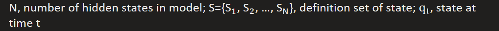
2.  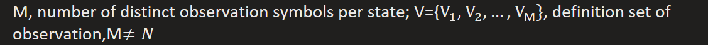
3.  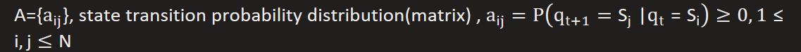
4.  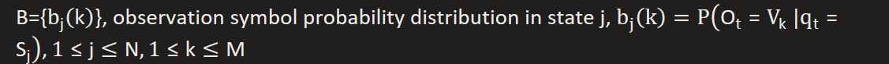
5.  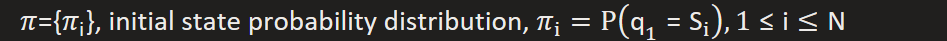
Notice! when N=M and each state uniquely associated with observation, then HMM degenerate to MM

Procedure of HMM:How observation sequence was generated

1.  
2.  Set time t = 1
3.  
4.  
5.  Set time t += 1, return to step 3 if t \< T else end, T is length of observation sequence and total time passed
6.  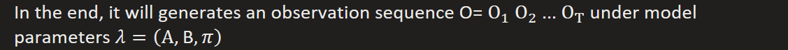

3 Basic problems for HMM:

1.  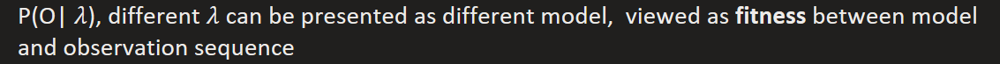
2.  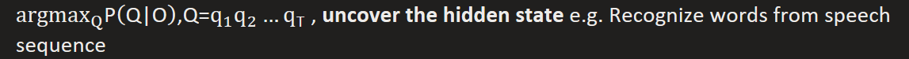
3.  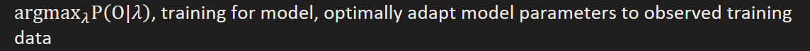

e.g. Speech Recognizer
When given training observation sequence set
1.  Segment each of the word training sequences into states according to Problem 2
2.  Find best model fit training set according to Problem 3
3.  Test new unknown observation sequence according to Problem 1

Solutions for 3 basic problems:

Solution for problem 1: sequence score
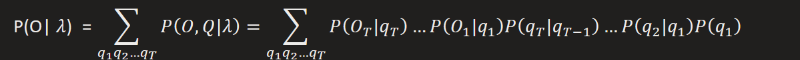
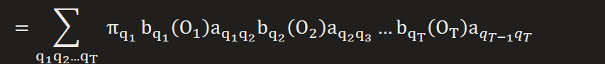

Forward-Backward Algorithm

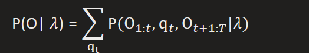
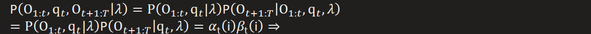
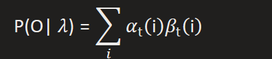
Matrix form:

**By induction**  
Forward:
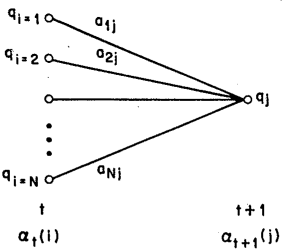
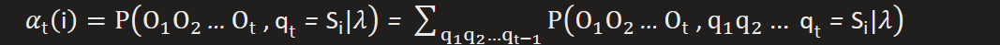
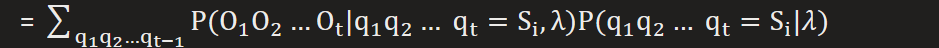
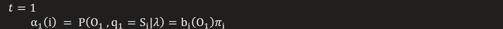

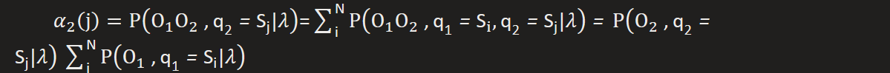
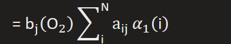
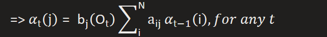
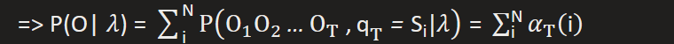
Matrix form:
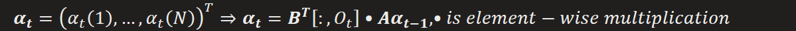

Backward:
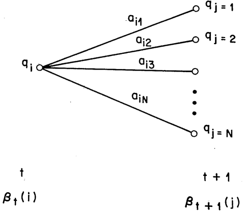
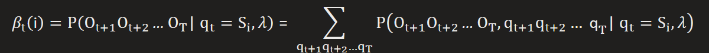

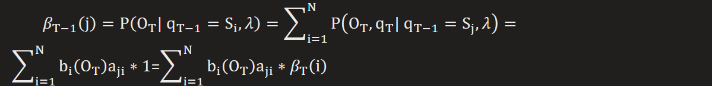
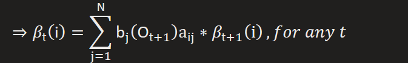
Matrix form:
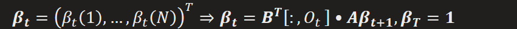

Solution for problem 2:  
**Maxlikelihood**  
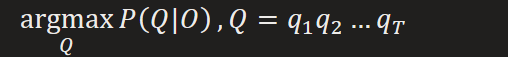

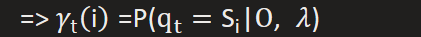
According to solution of problem 1
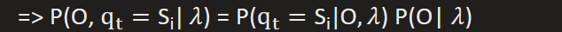
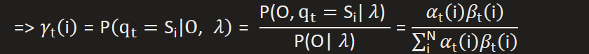

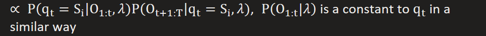

If we take such greedy strategy at each t, the resulting state path may not be the optimal state sequence,
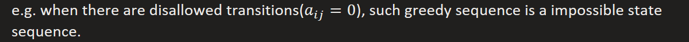
Since it misses the detail: (1) global structure, is it a resonable generation process ?
\(2\) condition on neighbor state

\(3\) the length of observable sequence may not always be T

To get most likely states sequence, we need to find out the desired state path that
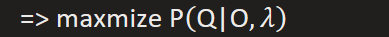

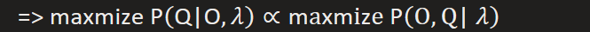

**Viterbi Algorithm**  
Base on the simple idea: state at t condition on maxlikeli state at t - 1, similar to forward algorithm
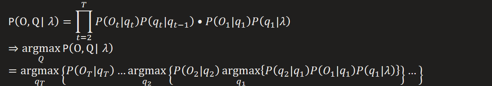
**By Induction**  
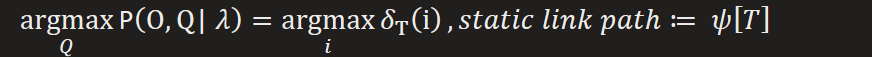
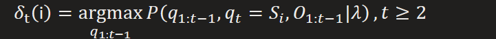

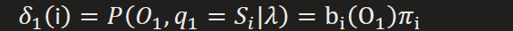

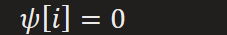

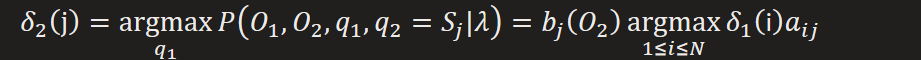

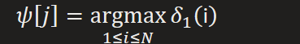
*…*

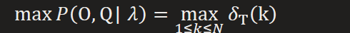

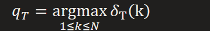
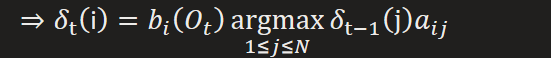

Solution for problem 3:
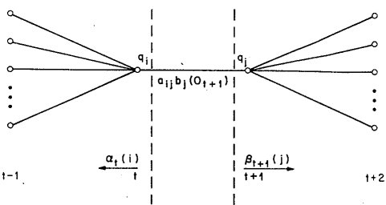
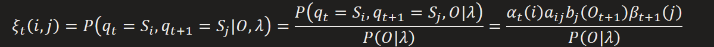
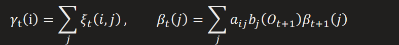

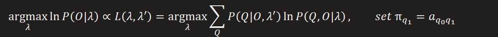

[CTC](https://distill.pub/2017/ctc/)  
**Introduction**  
Fundamental problems for CTC
1.  How to align input sequence with label sequence (auto-segment and repeat)
2.  How to find the most likely label sequence
3.  How to train CTC networks(calculation of gradient)

Basic idea: Interpret the network outputs as a probability distribution over all label sequences, conditioned on a given input sequence

Definition:

[Solution to problem 1](https://distill.pub/2017/ctc/):
By introducing the prediction for "blank", model can automatically segment label sequence

Also, alignment can be done by combining repetition of character at the same time, but only same characters with blank in middle will be kept when inference, those without it will be deduplicated

Solution to problem 2(decoding):
Base on solution 1, each label sequences may corresponding to multiple aligning sequences
aligning sequences → original label sequence

  
We want to find the **desired temporal classifier**  

Method 1:
Assume that the most probable path will correspond to most probable labelling

Since there are multiple alignments equivalent to target label, it is not guaranteed to find the most probable labelling

Luckily, most of the probability mass is alloted to single alignment, so method 1 is works well at most cases.
Method 2:
Prefix Search Decoding
The total probability is split recursively depth by depth

Modifying forward-backward algorithm
Our target is to maximize probability of target label sequence which is equal to maximize summation of probabilities of all its aligned path.

At each time step, merging path with same output, that yieds the following graph

Actually, it is a modification of network outputs

Initialization

By induction

*…*

*that yields*

*where*

In case of underflow problem, normalization is applied at each time step

*…*

*that yieds*

By induction

*…*

*that yields*

*where*

In case of underflow problem, normalization is applied at each time step

*…*

*that yields*

Solution to problem 3:
From the principle of maxium likelihood

replaced with normalized forward backward

