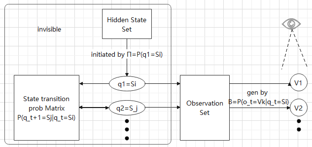
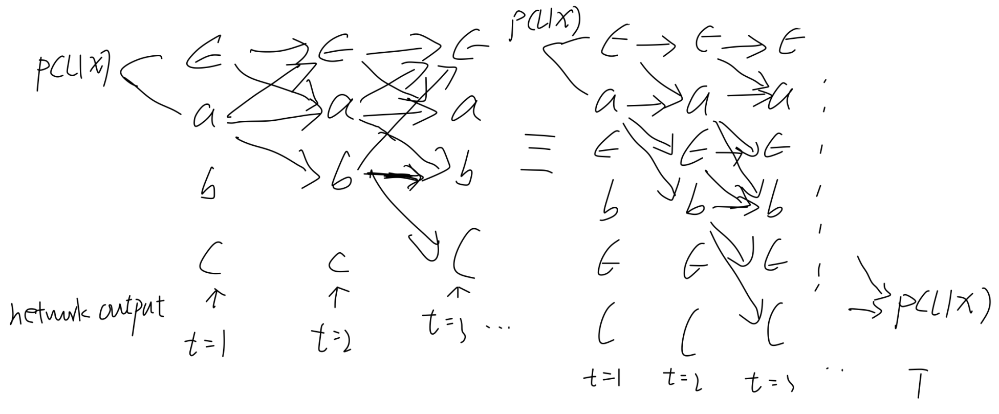

**Introduction**  
Real world processes -> observable output -> signal -> characterized&modeled by signal models {Deterministic Model, Statistic Model(Parameteric Random Process)} determined by the properties and the way of describing properties of signal
Three fundamental problems for HMM design:
1. Evaluation of probability of a sequence of observation given a specific HMM
2. Determination of a best sequence of model (hidden)states
3. Adjustment of model parameters so as to best account for the observed signal
Markov Models -> Hidden Markov Models by extending observation(state in Markov Models) to a probabilistic function of state, from single stochastic process of state to double embed stochastic process of observation and underlying hidden state, the stochastic process of hidden state can only be observed through stochastic process of observation which is observable to outside world

Elements of HMM:
1. N, number of hidden states in model; $S=\{S_1, S_2, \dots, S_N\}$, definition set of state; $q_t$, state at time t
2. M, number of distinct observation symbols per state; $V=\{V_1,V_2,\dots,V_M\}$, definition set of observation,$M \ne N$
3. $A=\{a_{ij}\}$, state transition probability distribution(matrix) , $a_{ij}=P(q_{t+1}=S_j|q_t=S_i)\ge 0, 1\le i,j\le N$
4. $B=\{b_j(k)\}$, observation symbol probability distribution in state $j, b_j(k)=P(O_t=V_k|q_t=S_j), 1\le j\le N, 1\le k\le M$
5. $\pi=\{\pi_i\}$, initial state probability distribution, $\pi_i=P(q_1=S_i), 1\le i\le N$

Notice! when N=M and each state uniquely associated with observation, then HMM degenerate to MM  
**Procedure of HMM**  
How observation sequence was generated  
  
1. Choose initial state $q_1=S_i$  according to $\pi$
2. Set time t = 1  
3. Choose $O_t=V_k$ according to B, i.e. $b_i(k), O_t$ is observation unit in time t
4. Transit to a new state $q_{t+1}=S_j$  according to A, i.e. $a_{ij}$
5. Set time t += 1, return to step 3 if t < T else end, T is length of observation sequence and total time passed  
6. In the end, it will generates an observation sequence $O=O_1,O_2,…,O_T$  under model parameters $λ=(A, B, \pi)$

**3 Basic problems for HMM:**  
When given O an observation sequence $O=O_1,O_2,…,O_T$
1. $P(O|\lambda)$,different $\lambda$ can be presented as different model,viewed as fitness between model and observation sequence
2. $\underset{Q}{\arg\max} \; P(Q \mid O), \quad Q = q_1 q_2 \ldots q_T$, uncover the hidden state e.g. Recognize words from speech sequence
3. $\underset{\lambda}{\arg\max} \; P(O \mid \lambda)$, training for model, optimally adapt model parameters to observed training data
 

e.g. Speech Recognizer
When given training observation sequence set
1. Segment each of the word training sequences into states according to Problem 2
2. Find best model fit training set according to Problem 3
3. Test new unknown observation sequence according to Problem 1

**Solutions for 3 basic problems:**  
When given O an observation sequence $O=O_1 O_2…O_T$  
Assum $O_1,O_2,…,O_T$ i.i.d, given fixed state sequence $Q=q_1q_2…q_T$

**Solution for problem 1**  
sequence score

$$
\mathrm{P}\left(\mathrm{O}\right|\mathit{\lambda})\ ={\sum}_{{q}_{1}{q}_{2}\dots {q}_{T}}P\left(O,Q|\mathit{\lambda}\right)={\sum}_{{q}_{1}{q}_{2}\dots {q}_{T}}P\left({O}_{T}|{q}_{T}\right)\dots P\left({O}_{1}|{q}_{1}\right)P\left({q}_{T}|{q}_{T-1}\right)\dots P\left({q}_{2}|{q}_{1}\right)P\left({q}_{1}\right)
$$

$$
=\sum _{{\mathrm{q}}_{1}{\mathrm{q}}_{2}...{\mathrm{q}}_{\mathrm{T}}}\ {\pi}_{{\mathrm{q}}_{1}}{\mathrm{b}}_{{\mathrm{q}}_{1}}\left({\mathrm{O}}_{1}\right){\mathrm{a}}_{{\mathrm{q}}_{1}{\mathrm{q}}_{2}}{\mathrm{b}}_{{\mathrm{q}}_{2}}\left({\mathrm{O}}_{2}\right){\mathrm{a}}_{{\mathrm{q}}_{2}{\mathrm{q}}_{3}}\dots {\mathrm{b}}_{{\mathrm{q}}_{\mathrm{T}}}\left({\mathrm{O}}_{\mathrm{T}}\right){\mathrm{a}}_{{q}_{T-1}{q}_{T}}
$$

Forward-Backward Algorithm  
**Split **$\mathit{\lambda}$ into observation before and after t

$$
\mathrm{P}\left(\mathrm{O}\right|\mathit{\lambda})=\sum _{{\mathrm{q}}_{\mathrm{t}}}\mathrm{P}({\mathrm{O}}_{1:t},{\mathrm{q}}_{t},{\mathrm{O}}_{t+1:T}|\mathit{\lambda})
$$

$$
\mathrm{P}\left({\mathrm{O}}_{1:t},{\mathrm{q}}_{t},{\mathrm{O}}_{t+1:T}|\mathit{\lambda}\right)=\mathrm{P}\left({\mathrm{O}}_{1:t},{\mathrm{q}}_{t}|\mathit{\lambda}\right)\mathrm{P}\left({\mathrm{O}}_{t+1:T}|{\mathrm{O}}_{1:t},{\mathrm{q}}_{t},\mathit{\lambda}\right)
$$

$$
=\mathrm{P}\left({\mathrm{O}}_{1:t},{\mathrm{q}}_{t}|\mathit{\lambda}\right)\mathrm{P}\left({\mathrm{O}}_{t+1:T}|{\mathrm{q}}_{t},\mathit{\lambda}\right)={\mathit{\alpha}}_{\mathrm{t}}\left(\mathrm{i}\right){\mathit{\beta}}_{\mathrm{t}}\left(\mathrm{i}\right)\Rightarrow 
$$

$$
\mathrm{P}\left(\mathrm{O}\right|\mathit{\lambda})=\sum _{i}{\mathit{\alpha}}_{\mathrm{t}}\left(\mathrm{i}\right){\mathit{\beta}}_{\mathrm{t}}\left(\mathrm{i}\right)
$$

Matrix form:

$$
P\left(\bm{O}|\mathit{\lambda}\right)={\bm{\alpha}}_{\bm{t}}^{\bm{T}}{\bm{\beta}}_{\bm{t}},1\le t\le T
$$

*By induction*

Forward:  

$$
{\mathit{\alpha}}_{\mathrm{t}}\left(\mathrm{i}\right)=\mathrm{P}\left({\mathrm{O}}_{1}{\mathrm{O}}_{2}\dots {\mathrm{O}}_{\mathrm{t}},\ {\mathrm{q}}_{\mathrm{t}}={\mathrm{S}}_{\mathrm{i}}|\mathit{\lambda}\right)=\sum _{{\mathrm{q}}_{1}{\mathrm{q}}_{2}\dots {\mathrm{q}}_{\mathrm{t}-1}}\mathrm{P}\left({\mathrm{O}}_{1}{\mathrm{O}}_{2}\dots {\mathrm{O}}_{\mathrm{t}},{\mathrm{q}}_{1}{\mathrm{q}}_{2}\dots \ {\mathrm{q}}_{\mathrm{t}}={\mathrm{S}}_{\mathrm{i}}|\mathit{\lambda}\right)
$$

$$
=\sum _{{\mathrm{q}}_{1}{\mathrm{q}}_{2}\dots {\mathrm{q}}_{\mathrm{t}-1}}\mathrm{P}({\mathrm{O}}_{1}{\mathrm{O}}_{2}\dots {\mathrm{O}}_{\mathrm{t}}|{\mathrm{q}}_{1}{\mathrm{q}}_{2}\dots \ {\mathrm{q}}_{\mathrm{t}}={\mathrm{S}}_{\mathrm{i}},\lambda \left)\mathrm{P}\right({\mathrm{q}}_{1}{\mathrm{q}}_{2}\dots \ {\mathrm{q}}_{\mathrm{t}}={\mathrm{S}}_{\mathrm{i}}\left|\mathit{\lambda}\right)
$$

t=1

$$
\ \ \ \ \ \ \ \ {\alpha}_{1}\left(\mathrm{i}\right)\ =\ \mathrm{P}\left({\mathrm{O}}_{1},\ {\mathrm{q}}_{1}={\mathrm{S}}_{\mathrm{i}}|\mathit{\lambda}\right)={\mathrm{b}}_{\mathrm{i}}\left({\mathrm{O}}_{1}\right){\mathit{\pi}}_{\mathrm{i}}
$$

t=2

$$
\ \ \ \ \ \ \ \ {\mathit{\alpha}}_{2}\left(\mathrm{j}\right)=\mathrm{P}\left({\mathrm{O}}_{1}{\mathrm{O}}_{2},\ {\mathrm{q}}_{2}={\mathrm{S}}_{\mathrm{j}}|\mathit{\lambda}\right)=\sum _{\mathrm{i}}^{\mathrm{N}}\mathrm{P}\left({\mathrm{O}}_{1}{\mathrm{O}}_{2}\ ,\ {\mathrm{q}}_{1}={\mathrm{S}}_{\mathrm{i}},{\mathrm{q}}_{2}={\mathrm{S}}_{\mathrm{j}}|\mathit{\lambda}\right)=\mathrm{P}\left({\mathrm{O}}_{2}\ ,\ {\mathrm{q}}_{2}={\mathrm{S}}_{\mathrm{j}}|\mathit{\lambda}\right)\sum _{\mathrm{i}}^{\mathrm{N}}\mathrm{P}\left({\mathrm{O}}_{1},\ {\mathrm{q}}_{1}={\mathrm{S}}_{\mathrm{i}}|\mathit{\lambda}\right)
$$

$$
{\mathrm{b}}_{\mathrm{j}}\left({\mathrm{O}}_{2}\right)\sum _{\mathrm{i}}^{\mathrm{N}}{\mathrm{a}}_{\mathrm{i}\mathrm{j}}{\mathit{\alpha}}_{1}\left(\mathrm{i}\right)
$$

$$
\Rightarrow {\mathit{\alpha}}_{\mathrm{t}}\left(\mathrm{j}\right)=\ {\mathrm{b}}_{\mathrm{j}}\left({\mathrm{O}}_{\mathrm{t}}\right)\sum _{\mathrm{i}}^{\mathrm{N}}{\mathrm{a}}_{\mathrm{i}\mathrm{j}}{\mathit{\alpha}}_{\mathrm{t}-1}\left(\mathrm{i}\right),\ for\ any\ t
$$

$$
\Rightarrow P\left(O\right|\ \mathit{\lambda})=\sum _{\mathrm{i}}^{\mathrm{N}}\mathrm{P}\left({\mathrm{O}}_{1}{\mathrm{O}}_{2}\dots {\mathrm{O}}_{\mathrm{T}},\ {\mathrm{q}}_{\mathrm{T}}={\mathrm{S}}_{\mathrm{i}}|\mathit{\lambda}\right)=\ \sum _{\mathrm{i}}^{\mathrm{N}}{\mathit{\alpha}}_{\mathrm{T}}\left(\mathrm{i}\right)
$$

Matrix form:

$$
{\bm{\alpha}}_{\bm{t}}={\left({\mathit{\alpha}}_{t}\left(1\right),\dots ,{\mathit{\alpha}}_{t}\left(N\right)\right)}^{T}\Rightarrow {\bm{\alpha}}_{\bm{t}}={\bm{B}}^{\bm{T}}\left[:,{O}_{t}\right]\cdot \bm{A}{\bm{\alpha}}_{\bm{t}-1},\ \cdot is\ element-wise\ multiplication
$$

$$
{\bm{\alpha}}_{1}={\bm{B}}^{\bm{T}}\left[{:,O}_{1}\right]\cdot \pi 
$$

$$
\bm{P}\left(\bm{O}|\bm{\lambda}\right)={\left[1\right]}^{\bm{T}}{\bm{\alpha}}_{\bm{T}}
$$

Backward:  

$$
{\mathit{\beta}}_{\mathrm{t}}\left(\mathrm{i}\right)=\mathrm{P}\left({\mathrm{O}}_{\mathrm{t}+1}{\mathrm{O}}_{\mathrm{t}+2}\dots {\mathrm{O}}_{\mathrm{T}}|\ {\mathrm{q}}_{\mathrm{t}}={\mathrm{S}}_{\mathrm{i}},\ \mathit{\lambda}\right)=\sum _{{\mathrm{q}}_{\mathrm{t}+1}{\mathrm{q}}_{\mathrm{t}+2}\dots {\mathrm{q}}_{\mathrm{T}}}\mathrm{P}\left({\mathrm{O}}_{\mathrm{t}+1}{\mathrm{O}}_{\mathrm{t}+2}\dots {\mathrm{O}}_{\mathrm{T}},\ {\mathrm{q}}_{\mathrm{t}+1}{\mathrm{q}}_{\mathrm{t}+2}\dots \ {\mathrm{q}}_{\mathrm{T}}|\ {\mathrm{q}}_{\mathrm{t}}={\mathrm{S}}_{\mathrm{i}},\ \mathit{\lambda}\right)
$$

$$
=\sum _{{\mathrm{q}}_{\mathrm{t}+1}{\mathrm{q}}_{\mathrm{t}+2}\dots {\mathrm{q}}_{\mathrm{T}}}\mathrm{P}({\mathrm{O}}_{\mathrm{t}+1}{\mathrm{O}}_{\mathrm{t}+2}\dots {\mathrm{O}}_{\mathrm{T}}|{\mathrm{q}}_{\mathrm{t}}={\mathrm{S}}_{\mathrm{i}},{\mathrm{q}}_{\mathrm{t}+1}{\mathrm{q}}_{\mathrm{t}+2}\dots \ {\mathrm{q}}_{\mathrm{T}},\lambda \left)\mathrm{P}\right({\mathrm{q}}_{\mathrm{t}+1}{\mathrm{q}}_{\mathrm{t}+2}\dots \ {\mathrm{q}}_{\mathrm{T}}\left|\mathit{\lambda}\right)
$$

t=T

$$
{\mathit{\beta}}_{\mathrm{T}}\left(\mathrm{i}\right)=1
$$

t=T-1

$$
\ \ \ \ \ \ \ \ {\mathit{\beta}}_{T-1}\left(j\right)=P\left({O}_{T}|\ {q}_{T-1}={S}_{i},\ \mathit{\lambda}\right)=\sum _{i=1}^{N}P\left({O}_{T},\ {q}_{T}|\ {q}_{T-1}={S}_{j},\ \mathit{\lambda}\right)
$$

$$
=\sum _{i=1}^{N}{b}_{i}\left({O}_{T}\right){a}_{ji}\ast 1=\sum _{i=1}^{N}{b}_{i}\left({O}_{T}\right){a}_{ji}\ast {\mathit{\beta}}_{T}\left(i\right)
$$

$$
\Rightarrow {\mathit{\beta}}_{\mathrm{t}}\left(\mathrm{i}\right)=\sum _{\mathrm{j}=1}^{\mathrm{N}}{\mathrm{b}}_{\mathrm{j}}\left({\mathrm{O}}_{\mathrm{t}+1}\right){\mathrm{a}}_{\mathrm{i}\mathrm{j}}\ast {\mathit{\beta}}_{\mathrm{t}+1}\left(\mathrm{i}\right),\ for\ any\ t
$$

Matrix form:

$$
{\bm{\beta}}_{\bm{t}}={\left({\mathit{\beta}}_{t}\left(1\right),\dots ,{\mathit{\beta}}_{t}\left(N\right)\right)}^{T}\Rightarrow {\bm{\beta}}_{\bm{t}}={\bm{B}}^{\bm{T}}\left[{:,O}_{t}\right]\cdot \bm{A}{\bm{\beta}}_{\bm{t}+1},{\bm{\beta}}_{\bm{T}}={\left[1\right]}_{N}
$$

**Solution for problem 2:**  
**Maxlikelihood**  

$$
\underset{Q}{\mathrm{argmax}}P\left(Q|O\right),Q={q}_{1}{q}_{2}\dots {q}_{T}
$$

This problem can be simplified as choosing the state $q_t$  which are individually most likely

$$
\Rightarrow {\mathit{\gamma}}_{\mathrm{t}}\left(\mathrm{i}\right)=P({\mathrm{q}}_{\mathrm{t}}={\mathrm{S}}_{\mathrm{i}}|\mathrm{O},\ \mathit{\lambda})
$$

According to solution of problem 1

$$
P(O,\ {\mathrm{q}}_{\mathrm{t}}={\mathrm{S}}_{\mathrm{i}}|\ \mathit{\lambda})\ =\ P({\mathrm{q}}_{\mathrm{t}}={\mathrm{S}}_{\mathrm{i}}|\mathrm{O},\ \mathit{\lambda})\ P\left(O\right|\mathit{\lambda})
$$

$$
\Rightarrow \gamma_t(i) = P(q_t = S_i \mid O, \lambda) = \frac{P(O, q_t = S_i \mid \lambda)}{P(O \mid \lambda)} = \frac{\alpha_t(i) \beta_t(i)}{\sum_{i=1}^N \alpha_t(i) \beta_t(i)}
$$

$$
\Rightarrow {\mathrm{q}}_{\mathrm{t}}=\ \underset{1\le i\le N}{\mathrm{argmax}}\left\{{\mathit{\gamma}}_{\mathrm{t}}\left(\mathrm{i}\right)\right\}
$$

$$
\Rightarrow \mathrm{P}\left({\mathrm{q}}_{\mathrm{t}}={\mathrm{S}}_{\mathrm{i}}|\mathrm{O},\ \mathit{\lambda}\right)\propto \mathrm{P}\left(O,{\mathrm{q}}_{\mathrm{t}}={\mathrm{S}}_{\mathrm{i}}|\ \mathit{\lambda}\right)
$$

$$
\Rightarrow \ \ \ \ \ \ \ \ \ \ \ \ \ \ \ \ \ \ \ \ \ \ \ \ \ \ \ \ \ \ \propto \mathrm{P}\left({\mathrm{O}}_{1:\mathrm{t}},\ {\mathrm{q}}_{\mathrm{t}}={\mathrm{S}}_{\mathrm{i}}\right|,\ \mathit{\lambda})\mathrm{P}\left({\mathrm{O}}_{\mathrm{t}+1:\mathrm{T}}\right|{\mathrm{q}}_{\mathrm{t}}={\mathrm{S}}_{\mathrm{i}},\ \mathit{\lambda})
$$

$$
\propto \ P\left({q}_{t}={S}_{i}\right|{O}_{1:t},\ \mathit{\lambda})P\left({O}_{1:t}|\mathit{\lambda}\right)P\left({O}_{t+1:T}\right|{q}_{\mathrm{t}}={\mathrm{S}}_{\mathrm{i}},\ \mathit{\lambda})
$$

$$
\propto \ P\left({q}_{t}={S}_{i}\right|{O}_{1:t},\ \mathit{\lambda})P\left({O}_{t+1:T}\right|{q}_{t}={S}_{i},\ \mathit{\lambda})
$$

$P\left({O}_{1:t}|\mathit{\lambda}\right)$ is a constant to q\_t in a similar way  
so state at t depends (1) the posterior bases on ${O}_{1:t}$ and (2) the posterior that yields ${O}_{t+1:T}$  
If we take such greedy strategy at each t, the resulting state path may not be the optimal state sequence,  
e.g. when there are disallowed transitions(${a}_{ij}=0$), such greedy sequence is a impossible state sequence.  
Since it misses the detail:  
(1) global structure, is it a resonable generation process ?  
(2) condition on neighbor state  
(3) the length of observable sequence may not always be T  

To get most likely states sequence, we need to find out the desired state path that  
=> maxmize P(Q|O,λ)  
In a similiar way,  P(Q|O,λ)∝P(O,Q|λ)  
=> maxmize P(Q|O,λ)∝maxmize P(O,Q|λ)

**Viterbi Algorithm**  
Base on the simple idea: state at t condition on maxlikeli state at t - 1, similar to forward algorithm

$$
\mathrm{P}\left(\mathrm{O},\mathrm{Q}|\mathit{\lambda}\right)={\prod}_{t=2}^{T}P\left({O}_{t}|{q}_{t}\right)P\left({q}_{t}|{q}_{t-1}\right)\cdot P\left({O}_{1}|{q}_{1}\right)P\left({q}_{1}|\mathit{\lambda}\right)
$$

$$
\Rightarrow \underset{Q}{\mathrm{argmax}}\mathrm{P}\left(\mathrm{O},\mathrm{Q}|\mathit{\lambda}\right)
$$

$$
=\underset{{q}_{T}}{\mathrm{argmax}}\left\{P\left({O}_{T}|{q}_{T}\right)\dots \underset{{q}_{2}}{\mathrm{argmax}}\left\{P\left({O}_{2}|{q}_{2}\right)\underset{{q}_{1}}{\mathrm{argmax}}\left\{P\left({q}_{2}|{q}_{1}\right)P\left({O}_{1}|{q}_{1}\right)P\left({q}_{1}|\mathit{\lambda}\right)\right\}\right\}\dots \right\}
$$

*By Induction*

$$
\underset{Q}{\mathrm{argmax}}\mathrm{P}\left(\mathrm{O},\mathrm{Q}|\ \mathit{\lambda}\right)=\underset{i}{\mathrm{argmax}}{\mathit{\delta}}_{\mathrm{T}}\left(\mathrm{i}\right),\ static\ link\ path\u2254\ \mathit{\psi}\left[T\right]
$$

$$
{\mathit{\delta}}_{\mathrm{t}}\left(\mathrm{i}\right)=\underset{{q}_{1:t-1}}{\mathrm{argmax}}P\left({q}_{1:t-1},{q}_{t}={S}_{i},{O}_{1:t-1}|\mathit{\lambda}\right),t\ge 2
$$

t=1

$$
{\mathit{\delta}}_{1}\left(\mathrm{i}\right)=P\left({O}_{1},{q}_{1}={S}_{i}|\mathit{\lambda}\right)={\mathrm{b}}_{\mathrm{i}}\left({\mathrm{O}}_{1}\right){\mathit{\pi}}_{\mathrm{i}}
$$

$$
\mathit{\psi}\left[i\right]=0
$$

t=2

$$
{\mathit{\delta}}_{2}\left(\mathrm{j}\right)=\underset{{q}_{1}}{\mathrm{argmax}}P\left({O}_{1},{O}_{2},{q}_{1},{q}_{2}={S}_{j}|\mathit{\lambda}\right)={b}_{j}\left({O}_{2}\right)\underset{1\le i\le N}{\mathrm{argmax}}{\mathit{\delta}}_{1}\left(\mathrm{i}\right){a}_{ij}
$$

$$
\mathit{\psi}\left[j\right]=\underset{1\le i\le N}{\mathrm{argmax}}{\mathit{\delta}}_{1}\left(\mathrm{i}\right)
$$

*…*  
termination

$$
\mathrm{max}P\left(\mathrm{O},\mathrm{Q}|\mathit{\lambda}\right)=\underset{1\le k\le N}{\mathrm{max}}{\mathit{\delta}}_{\mathrm{T}}\left(\mathrm{k}\right)
$$

$$
{q}_{T}=\underset{1\le k\le N}{\mathrm{argmax}}{\mathit{\delta}}_{\mathrm{T}}\left(\mathrm{k}\right)
$$

$$
\Rightarrow {\mathit{\delta}}_{\mathrm{t}}\left(\mathrm{i}\right)={b}_{i}\left({O}_{t}\right)\underset{1\le j\le N}{\mathrm{argmax}}{\mathit{\delta}}_{\mathrm{t}-1}\left(\mathrm{j}\right){a}_{ij}
$$

$$
\Rightarrow Q=\left\{{q}_{T},{q}_{t}|{q}_{t}=\mathit{\psi}\left[{q}_{t+1}\right],\ t=T-1,\ t-=1\right\}
$$

**Solution for problem 3:**  

$$
{\mathit{\xi}}_{t}\left(i,j\right)=P\left({q}_{t}={S}_{i},{q}_{t+1}={S}_{j}|O,\mathit{\lambda}\right)=\frac{P\left({q}_{t}={S}_{i},{q}_{t+1}={S}_{j},O|\mathit{\lambda}\right)}{P\left(O|\mathit{\lambda}\right)}=\frac{{\mathit{\alpha}}_{t}\left(i\right){a}_{ij}{b}_{j}\left({O}_{t+1}\right){\mathit{\beta}}_{t+1}\left(j\right)}{P\left(O|\mathit{\lambda}\right)}
$$

$$
{\mathit{\gamma}}_{\mathrm{t}}\left(\mathrm{i}\right)={\sum}_{j}{\mathit{\xi}}_{t}\left(i,j\right),\ \ {\mathit{\beta}}_{t}\left(j\right)={\sum}_{j}{a}_{ij}{b}_{j}\left({O}_{t+1}\right){\mathit{\beta}}_{t+1}\left(j\right)
$$

Baum-Welch method: base on EM, given $\mathit{\lambda}\prime =\left(A,\ B,\ \pi \right)$

$$
\underset{\mathit{\lambda}}{\mathrm{argmax}}\mathrm{ln}P\left(O|\mathit{\lambda}\right)\propto L\left(\mathit{\lambda},\mathit{\lambda}\prime \right)=\underset{\mathit{\lambda}}{\mathrm{argmax}}{\sum}_{Q}P\left(Q|O,{\mathit{\lambda}}^{\prime}\right)\mathrm{ln}P\left(Q,O|\mathit{\lambda}\right),\ \ set\ {\pi}_{{q}_{1}}={a}_{{q}_{0}{q}_{1}}
$$

$$
L\left(\mathit{\lambda},\mathit{\lambda}\prime \right)={\sum}_{Q}P\left(Q|O,\mathit{\lambda}\prime \right){\sum}_{t=1}^{T}\mathrm{ln}{a}_{{q}_{t-1}{q}_{t}}+{\sum}_{Q}P\left(Q|O,\mathit{\lambda}\prime \right){\sum}_{t=1}^{T}{\mathrm{b}}_{{q}_{t}}\left({O}_{t}\right)
$$

for ${\pi}_{i}$

$$
{\sum}_{Q}P\left({q}_{1}={S}_{i},{Q}_{2:T}|O,\mathit{\lambda}\prime \right)\mathrm{ln}{\pi}_{i}={\sum}_{i}P\left({q}_{1}={S}_{i}|O,\mathit{\lambda}\prime \right)\mathrm{ln}{\pi}_{i}
$$

$$
\frac{\mathit{\partial}L}{\mathit{\partial}{\pi}_{i}}=0,\ s.t.{\sum}_{i}{\pi}_{i}=1
$$

$$
{\bm{\pi}}_{\bm{i}}=\bm{P}\left({\bm{q}}_{1}={\bm{S}}_{\bm{i}}|\bm{O},\bm{\lambda}\right)={\bm{\gamma}}_{1}\left(\mathbf{i}\right)
$$

for ${a}_{ij}$

$$
{\sum}_{t=1}^{T-1}{\sum}_{Q}P\left({q}_{t}={S}_{i},{q}_{t+1}={S}_{j},{Q}_{\backslash \mathrm{t},t+1}|O,\mathit{\lambda}\prime \right)\mathrm{ln}{a}_{ij}={\sum}_{t=1}^{T-1}{\sum}_{i}{\sum}_{j}P\left({q}_{t}={S}_{i},{q}_{t+1}={S}_{j}|O,\mathit{\lambda}\prime \right)\mathrm{ln}{a}_{ij}
$$

$$
\frac{\mathit{\partial}L}{\mathit{\partial}{a}_{ij}}=0,\ s.t.{\sum}_{j}{a}_{ij}=1
$$

$$
\ {\bm{a}}_{\bm{i}\bm{j}}=\frac{{\sum}_{\bm{t}=1}^{\bm{T}-1}\bm{P}\left({\bm{q}}_{\bm{t}}={\bm{S}}_{\bm{i}},{\bm{q}}_{\bm{t}+1}={\bm{S}}_{\bm{j}}|\bm{O},\bm{\lambda}\right)}{{\sum}_{t=1}^{T-1}\bm{P}\left({\bm{q}}_{\bm{t}}={\bm{S}}_{\bm{i}}|\bm{O},\bm{\lambda}\right)}=\frac{{\sum}_{t=1}^{T-1}{\bm{\xi}}_{\bm{t}}\left(\bm{i},\bm{j}\right)}{{\sum}_{t=1}^{T-1}{\bm{\gamma}}_{\mathbf{t}}\left(\mathbf{i}\right)}
$$

for ${b}_{j}\left(k\right)$

$$
{\sum}_{t=1}^{T}{\sum}_{Q}P\left({q}_{t}={S}_{j},{Q}_{\backslash \mathrm{t}}|{O}_{t}={V}_{k},{O}_{\backslash \mathrm{t}},\mathit{\lambda}\prime \right)\mathrm{ln}{b}_{j}\left(k\right)={\sum}_{t=1}^{T}{\sum}_{j}P\left({q}_{t}={S}_{j}|{O}_{t}={V}_{k},{O}_{\backslash \mathrm{t}},\mathit{\lambda}\prime \right)\mathrm{ln}{b}_{j}\left(k\right)
$$

$$
\frac{\mathit{\partial}L}{\mathit{\partial}{b}_{j}\left(k\right)}=0,\ s.t.{\sum}_{k}{b}_{j}\left(k\right)=1
$$

$$
{\bm{b}}_{\bm{j}}\left(\bm{k}\right)=\frac{\bm{P}\left({\bm{q}}_{\bm{t}}={\bm{S}}_{\bm{j}}|{\bm{O}}_{\bm{t}}={\bm{V}}_{\bm{k}},{\bm{O}}_{\backslash \bm{t}},\bm{\lambda}\prime \right)}{\bm{P}\left({\bm{q}}_{\bm{t}}={\bm{S}}_{\bm{j}}|\bm{O},\bm{\lambda}\prime \right)}=\frac{{\sum}_{\begin{array}{c}t=1\\ {\bm{O}}_{\bm{t}}={\bm{V}}_{\bm{k}}\end{array}}^{T}{\bm{\gamma}}_{\mathbf{t}}\left(\mathbf{j}\right)}{{\sum}_{t=1}^{T}{\bm{\gamma}}_{\mathbf{t}}\left(\mathbf{j}\right)}
$$

each iteration will have $P\left(O|\mathit{\lambda}\right)>P\left(O|{\mathit{\lambda}}^{\prime}\right)$  

[**CTC**](https://distill.pub/2017/ctc/)  
**Introduction**  
Fundamental problems for CTC
1. How to align input sequence with label sequence (auto-segment and repeat)
2. How to find the most likely label sequence
3. How to train CTC networks(calculation of gradient)

Basic idea: Interpret the network outputs as a probability distribution over all label sequences, conditioned on a given input sequence  

**Definition:**  
S, set of training examples drawn from  a fixed distribution $D_(X×Z)$  
$X=(R^m)$,input space, set of all sequences of m dimensional real-valued vectors  
$Z=L$, target space, set of all sequences over the alphabet L of labels  
=> training example $(x,z)\in S,z=(z_1,z_2,\dots,z_U ) \in Z,x=(x_1,x_2,\dots,x_T ) \in X, U\le T$
h:X→Z temporal classifier

[**Solution to problem 1**](https://distill.pub/2017/ctc/)**:**  
By introducing the prediction for "blank", model can automatically segment label sequence
e.g. for speech recognition, label can be aligned with input audio sequence by inserting any number of blanks between label, h $\mathit{\epsilon}$ e $\mathit{\epsilon}$ l $\mathit{\epsilon}$ l $\mathit{\epsilon}$ o
Also, alignment can be done by combining repetition of character at the same time, but only same characters with blank in middle will be kept when inference, those without it will be deduplicated  
e.g. $\mathcal{B}\left(aa-abb-\right)=aab$

Let $L^′=L\cup \{blank\}$, decision at each time step will be based on  $L^′$  
Let $y=N_w(x)$  , where $N_w$ is network,$N_w(x):x\rightarrow y$ present a single time map with weights w(e.g. RNN)

  note that $\bm{y}=softmax\left(\bm{u}\right)$, and each time step has $\left|{L}^{\prime}\right|$ output units

Let $\bm{\pi}\in $, where ${\mathrm{L}}^{\prime \mathrm{T}}$ is set of all aligned label sequence from network of length T each time step has $\left|{L}^{\prime}\right|$ output units $\left|{{L}^{\prime}}^{T}\right|={\left|{L}^{\prime}\right|}^{T}$, that means π indicates a path of aligned labeling
  $\bm{\pi}=({y}_{{\mathit{\pi}}_{1}}^{1},{y}_{{\mathit{\pi}}_{2}}^{2},\dots ,{y}_{{\mathit{\pi}}_{\mathrm{T}}}^{\mathrm{T}})$ where ${y}_{\mathrm{k}}^{\mathrm{t}}\ $  is the activation of output unit k at time t

$$
p\left(\bm{\pi}|\mathbf{x}\right)={\prod}_{t=1}^{T}{y}_{{\mathit{\pi}}_{\mathrm{t}}}^{\mathrm{t}},\ \ {y}_{{\mathit{\pi}}_{1}}^{1},{y}_{{\mathit{\pi}}_{2}}^{2},\dots ,{y}_{{\mathit{\pi}}_{\mathrm{T}}}^{\mathrm{T}}.i.d|{N}_{\mathbf{w}}\left(\cdot \right)
$$

**Solution to problem 2(decoding):**  
Base on solution 1, each label sequences may corresponding to multiple aligning sequences
aligning sequences → original label sequence

$$
\mathcal{B}:\mathbf{\pi}\in {{L}^{\prime}}^{\mathrm{T}}\to \mathbf{l}\in {L}^{\le T},\ \ e.g.\mathcal{B}\left(aa-abb-\right)=aab
$$

$$
p\left(\bm{l}|\bm{x}\right)={\sum}_{\bm{\pi}\in {\mathcal{B}}^{-1}\left(\bm{l}\right)}p\left(\bm{\pi}|\bm{x}\right)
$$

We want to find the **desired temporal classifier**

$$
h\left(\bm{x}\right)=\underset{\bm{l}}{\mathrm{argmax}}p\left(\bm{l}|\bm{x}\right)
$$

So we need to figure out method to calculate $p\left(\bm{l}|\bm{x}\right)$, given **target label **$\bm{l}$ while **training**  
Method 1:  
Assume that the most probable path will correspond to most probable labelling

$$
\mathrm{h}\left(\bm{x}\right)\approx \mathrm{B}\left({\bm{\pi}}^{\ast}\right),\ \mathrm{w}\mathrm{h}\mathrm{e}\mathrm{r}\mathrm{e}\ {\bm{\pi}}^{\ast}=\underset{\bm{\pi}\in {N}^{t}}{\mathrm{argmax}}p\left(\bm{\pi}|\mathbf{x}\right)
$$

Since there are multiple alignments equivalent to target label, it is not guaranteed to find the most probable labelling  
[e.g.](https://distill.pub/2017/ctc/) Assume the alignments $\left[a,a,\mathit{\epsilon}\right]$ and $\left[a,a,a\right]$ individually have lower probability than $\left[b,b,b\right]$, but the sum of their probabilities is actually greater than that of $\left[b,b,b\right]$.  
Under method 1, only $\left[b\right]$ will be proposed, while the most probable one should be $\left[a\right]$
Luckily, most of the probability mass is alloted to single alignment, so method 1 is works well at most cases.  
Method 2:  
Prefix Search Decoding  
The total probability is split recursively depth by depth  
  
Modifying forward-backward algorithm  
Our target is to maximize probability of target label sequence which is equal to maximize summation of probabilities of all its aligned path.  
So as $p\left(\bm{l}|\bm{x}\right)$*, *can be splited recursively depth by depth  
At each time step, merging path with same output, that yieds the following graph    
  
Actually, it is a modification of network outputs  
  
Initialization  

$$
\bm{l}\to {\bm{l}}^{\prime},\ {\bm{l}}^{\prime}=\left\{b,{l}_{1},b,{l}_{2},\dots ,b,{l}_{N},b\right\}\ \ e.g.\ C\ A\ T\to \mathit{\epsilon}\ C\ \mathit{\epsilon}\ A\ \mathit{\epsilon}\ T\ \mathit{\epsilon}
$$

  Every path in the graph is an aligned label sequence of ${\bm{l}}^{\prime}$

$$
Forward\ direction:\ {\mathit{\alpha}}_{t}\left(s\right)={\sum}_{\begin{array}{c}\bm{\pi}\in {N}^{T}:\\ \mathcal{B}\left({\bm{\pi}}_{1:t}\right)={\bm{l}}_{1:\bm{s}}\end{array}}{\prod}_{{t}^{\prime}=1}^{t}{y}_{{\pi}_{{t}^{\prime}}}^{{t}^{\prime}}
$$

Hint: If we treat the path graph as a matrix $\bm{A}$, the t is the column axis, s is the row axis
   ${\mathit{\alpha}}_{t}\left(s\right)$ indicates summation of all paths end at $\bm{A}\left[s,t\right]$
By induction
t=1

$$
{\mathit{\alpha}}_{1}\left(1\right)={y}_{b}^{1}
$$

$$
{\mathit{\alpha}}_{1}\left(2\right)={y}_{{l}_{1}}^{1}
$$

$$
{\mathit{\alpha}}_{1}\left(>2\right)=0
$$

t=2

$$
{\mathit{\alpha}}_{2}\left(1\right)={\mathit{\alpha}}_{1}\left(1\right)\ast {y}_{b}^{2}
$$

$$
{\mathit{\alpha}}_{2}\left(2\right)=\left({\mathit{\alpha}}_{1}\left(1\right)+{\mathit{\alpha}}_{1}\left(2\right)\right)\ast {y}_{{l}_{1}}^{2}
$$

$$
{\mathit{\alpha}}_{2}\left(3\right)={\mathit{\alpha}}_{1}\left(2\right)\ast {y}_{b}^{2}
$$

$$
{\mathit{\alpha}}_{2}\left(4\right)={\mathit{\alpha}}_{1}\left(2\right)\ast {y}_{{l}_{2}}^{2}
$$

…

t=T

$$
{\mathit{\alpha}}_{T}\left(\left|{\bm{l}}^{\prime}\right|-1\right)=\left({\mathit{\alpha}}_{T-1}\left(\left|{\bm{l}}^{\prime}\right|-3\right)+{\mathit{\alpha}}_{T-1}\left(\left|{\bm{l}}^{\prime}\right|-2\right)+{\mathit{\alpha}}_{T-1}\left(\left|{\bm{l}}^{\prime}\right|-1\right)\right)\ast {y}_{{l}_{\left|\bm{l}\right|}}^{T}
$$

$$
{\mathit{\alpha}}_{T}\left(\left|{\bm{l}}^{\prime}\right|\right)=\left({\mathit{\alpha}}_{T-1}\left(\left|{\bm{l}}^{\prime}\right|\right)+{\mathit{\alpha}}_{T-1}\left(\left|{\bm{l}}^{\prime}\right|-1\right)\right)\ast {y}_{b}^{T}
$$

*that yields*

$$
{\mathit{\alpha}}_{t}\left(s\right)=\left\{\begin{array}{c}{\stackrel{-}{\mathit{\alpha}}}_{t}\left(s\right)\ast {y}_{{l}_{s}^{\prime}}^{t},\ \ {l}_{s}^{\prime}=b\ or\ {l}_{s}^{\prime}={l}_{s-2}^{\prime}\\ \left({\stackrel{-}{\mathit{\alpha}}}_{t}\left(s\right)+{\mathit{\alpha}}_{t-1}\left(s-2\right)\right)\ast {y}_{{l}_{s}^{\prime}}^{t},\ \ otherwise\end{array}\right.
$$

  *where*

$$
{\stackrel{-}{\mathit{\alpha}}}_{t}\left(s\right)={\mathit{\alpha}}_{t-1}\left(s\right)+{\mathit{\alpha}}_{t-1}\left(s-1\right)
$$

$$
p\left(\bm{l}|\bm{x}\right)={\mathit{\alpha}}_{T}\left(\left|{\bm{l}}^{\prime}\right|-1\right)+{\mathit{\alpha}}_{T}\left(\left|{\bm{l}}^{\prime}\right|\right)
$$

In case of underflow problem, normalization is applied at each time step

$$
{\widehat{\mathit{\alpha}}}_{t}\left(s\right)=\frac{{\mathit{\alpha}}_{t}\left(s\right)}{{\sum}_{s}{\mathit{\alpha}}_{t}\left(s\right)}=\frac{{\mathit{\alpha}}_{t}\left(s\right)}{{C}_{t}},\ \ also\ by\ induction
$$

$$
p\left(\bm{l}|\bm{x}\right)={\widehat{\mathit{\alpha}}}_{T}\left(\left|{\bm{l}}^{\prime}\right|-1\right)+{\widehat{\mathit{\alpha}}}_{T}\left(\left|{\bm{l}}^{\prime}\right|\right)
$$

t=1

$$
{N}_{1}={\sum}_{s}{\mathit{\alpha}}_{1}\left(s\right)
$$

t=2

$$
{N}_{2}=\frac{1}{{N}_{1}}{\sum}_{s}{\mathit{\alpha}}_{2}\left(s\right)
$$

*…*  
t=T-1

$$
{N}_{T-1}=\frac{1}{{N}_{T-2}}{\sum}_{s}{\mathit{\alpha}}_{T-1}\left(s\right)
$$

t=T

$$
{N}_{T}=\frac{1}{{N}_{T-1}}{\sum}_{s}{\mathit{\alpha}}_{T}\left(s\right)
$$

*that yields*

$$
p\left(\bm{l}|\bm{x}\right)={N}_{T}={\prod}_{t=1}^{T}{C}_{t}
$$

$$
backward\ direction:\ {\mathit{\beta}}_{t}\left(s\right)={\sum}_{\begin{array}{c}\bm{\pi}\in {N}^{T}:\\ \mathcal{B}\left({\bm{\pi}}_{\bm{t}:\bm{T}}\right)={\bm{l}}_{\bm{s}:\left|\bm{l}\right|}\end{array}}{\prod}_{{t}^{\prime}=t}^{T}{y}_{{\pi}_{{t}^{\prime}}}^{{t}^{\prime}}
$$

Hint: If we treat the path graph as a matrix $\bm{A}$, the t is the column axis, s is the row axis
   ${\mathit{\beta}}_{t}\left(s\right)$ indicates summation of all path start at $\bm{A}\left[s,t\right]$
By induction
t=T

$$
{\mathit{\beta}}_{T}\left(\left|{\bm{l}}^{\prime}\right|-1\right)={y}_{{l}_{\left|\bm{l}\right|}}^{T}
$$

$$
{\mathit{\beta}}_{T}\left(\left|{\bm{l}}^{\prime}\right|\right)={y}_{b}^{T}
$$

$$
{\mathit{\beta}}_{T}\left(<\left|{\bm{l}}^{\prime}\right|-1\right)=0
$$

t=T-1

$$
{\mathit{\beta}}_{T-1}\left(\left|{\bm{l}}^{\prime}\right|-3\right)={\mathit{\beta}}_{T}\left(\left|{\bm{l}}^{\prime}\right|-1\right)\ast {y}_{{l}_{\left|\bm{l}\right|-1}}^{T-1}
$$

$$
{\mathit{\beta}}_{T-1}\left(\left|{\bm{l}}^{\prime}\right|-2\right)={\mathit{\beta}}_{T}\left(\left|{\bm{l}}^{\prime}\right|-1\right)\ast {y}_{b}^{T-1}
$$

$$
{\mathit{\beta}}_{T-1}\left(\left|{\bm{l}}^{\prime}\right|-1\right)=\left({\mathit{\beta}}_{T}\left(\left|{\bm{l}}^{\prime}\right|-1\right)+{\mathit{\beta}}_{T}\left(\left|{\bm{l}}^{\prime}\right|\right)\right)\ast {y}_{{l}_{\left|\bm{l}\right|}}^{T-1}
$$

$$
{\mathit{\beta}}_{T-1}\left(\left|{\bm{l}}^{\prime}\right|\right)={\mathit{\beta}}_{T}\left(\left|{\bm{l}}^{\prime}\right|\right)\ast {y}_{b}^{T-1}
$$

$$
{\mathit{\beta}}_{T-1}\left(<\left|{\bm{l}}^{\prime}\right|-3\right)=0
$$

*…*
t=1

$$
{\mathit{\beta}}_{1}\left(1\right)=\left({\mathit{\beta}}_{2}\left(1\right)+{\mathit{\beta}}_{2}\left(2\right)\right)\ast {y}_{b}^{1}
$$

$$
{\mathit{\beta}}_{1}\left(2\right)=\left({\mathit{\beta}}_{2}\left(2\right)+{\mathit{\beta}}_{2}\left(3\right)+{\mathit{\beta}}_{2}\left(4\right)\right)\ast {y}_{{l}_{1}}^{1}
$$

*that yields*

$$
{\mathit{\beta}}_{t}\left(s\right)=\left\{\begin{array}{c}{\stackrel{-}{\mathit{\beta}}}_{t}\left(s\right)\ast {y}_{{l}_{s}^{\prime}}^{t},\ \ {l}_{s}^{\prime}=b\ or\ {l}_{s}^{\prime}={l}_{s+2}^{\prime}\\ \left({\mathit{\beta}}_{t}\left(s\right)+{\mathit{\alpha}}_{t+1}\left(s+2\right)\right)\ast {y}_{{l}_{s}^{\prime}}^{t},\ \ otherwise\end{array}\right.
$$

  *where*

$$
{\stackrel{-}{\mathit{\beta}}}_{t}\left(s\right)={\mathit{\beta}}_{t+1}\left(s\right)+{\mathit{\beta}}_{t+1}\left(s+1\right)
$$

In case of underflow problem, normalization is applied at each time step

$$
{\widehat{\mathit{\beta}}}_{t}\left(s\right)=\frac{{\mathit{\beta}}_{t}\left(s\right)}{{\sum}_{s}{\mathit{\beta}}_{t}\left(s\right)}=\frac{{\mathit{\beta}}_{t}\left(s\right)}{{D}_{t}},\ \ also\ by\ induction
$$

t=T

$$
{N}_{T}={\sum}_{s}{\mathit{\beta}}_{T}\left(s\right)
$$

t=T-1

$$
{N}_{T-1}=\frac{1}{{N}_{T}}{\sum}_{s}{\mathit{\beta}}_{T-1}\left(s\right)
$$

*…*
t=2

$$
{N}_{2}=\frac{1}{{N}_{3}}{\sum}_{s}{\mathit{\beta}}_{2}\left(s\right)
$$

t=1

$$
{N}_{1}=\frac{1}{{N}_{2}}{\sum}_{s}{\mathit{\beta}}_{1}\left(s\right)
$$

*that yields*

$$
{N}_{1}={\prod}_{t=1}^{T}{D}_{t},\ and\ {N}_{t}={\prod}_{{t}^{\prime}=t}^{T}{D}_{{t}^{\prime}}
$$

**Solution to problem 3:**  
From the principle of maxium likelihood

$$
{O}^{ML}\left(S,{N}_{\bm{w}}\right)=-{\sum}_{\left(\bm{x},\bm{z}\right)\in S}\mathrm{ln}p\left(\bm{z}|\bm{x}\right)\Rightarrow {O}^{ML}\left(\left(\bm{x},\bm{z}\right),{N}_{w}\right)=-\mathrm{ln}p\left(\bm{z}|\bm{x}\right),\ since\ S.i.i.d
$$

*By chain rule, we can get the gradient w.r.t each time step's output unit u\_k^t*

$$
and\ {y}_{k}^{t}=\frac{\mathrm{exp}{u}_{k}^{t}}{{\sum}_{j}\mathrm{exp}{u}_{j}^{t}}\Rightarrow \left\{\begin{array}{c}\frac{\mathit{\partial}{y}_{k}^{t}}{\mathit{\partial}{u}_{k}^{t}}={y}_{k}^{t}\left(1-{y}_{k}^{t}\right)\\ \frac{\mathit{\partial}{y}_{i}^{t}}{\mathit{\partial}{u}_{k}^{t}}=-{y}_{i}^{t}{y}_{k}^{t},\ \ i\ne k\end{array}\right.
$$

Similar to picture in HMM's solution for problem 3, we split all $\bm{l}$ 's aligments (picture of matrix **A**) into part before t and after t, and has label ${l}_{s}$ at time t

$$
{\mathit{\alpha}}_{t}\left(s\right){\mathit{\beta}}_{t}\left(s\right)={\sum}_{\begin{array}{c}\bm{\pi}\in {\mathcal{B}}^{-1}\left(\bm{l}\right):\\ {\mathit{\pi}}_{t}={l}_{s}\end{array}}{y}_{{l}_{s}}^{t}{\prod}_{{t}^{\prime}=1}^{T}{y}_{{\pi}_{{t}^{\prime}}}^{{t}^{\prime}}={\sum}_{\begin{array}{c}\bm{\pi}\in {\mathcal{B}}^{-1}\left(\bm{l}\right):\\ {\mathit{\pi}}_{t}={l}_{s}\end{array}}{y}_{{l}_{s}}^{t}p\left(\bm{\pi}|\bm{x}\right)
$$

$$
\Rightarrow {\sum}_{\begin{array}{c}\bm{\pi}\in {\mathcal{B}}^{-1}\left(\bm{l}\right):\\ {\mathit{\pi}}_{t}={l}_{s}\end{array}}p\left(\bm{\pi}|\bm{x}\right)=\frac{{\mathit{\alpha}}_{t}\left(s\right){\mathit{\beta}}_{t}\left(s\right)}{{y}_{{l}_{s}}^{t}}
$$

So the full probability of $\bm{l}$ comes from marginalization

$$
p\left(\bm{z}|\bm{x}\right)=p\left(\bm{l}|\bm{x}\right)=\ {\sum}_{t=1}^{T}{\sum}_{s}^{\left|\bm{l}\right|}\frac{{\mathit{\alpha}}_{t}\left(s\right){\mathit{\beta}}_{t}\left(s\right)}{{y}_{{l}_{s}}^{t}}
$$

$$
\frac{\mathit{\partial}p\left(\bm{l}|\bm{x}\right)}{\mathit{\partial}{y}_{k}^{t}}=-\frac{1}{{\left({y}_{k}^{t}\right)}^{2}}{\sum}_{s\in lab\left(l,k\right)}{\mathit{\alpha}}_{t}\left(s\right){\mathit{\beta}}_{t}\left(s\right),\ \ lab\left(\bm{l},k\right)=\left\{s|{l}_{s}=k\right\}
$$

Finally, we can get the gradient w.r.t ${u}_{k}^{t}$

$$
\frac{\mathit{\partial}{O}^{ML}\left(\left(\bm{x},\bm{z}\right),{N}_{w}\right)}{\mathit{\partial}{u}_{k}^{t}}=\frac{\mathit{\partial}{O}^{ML}\left(\left(\bm{x},\bm{z}\right),{N}_{w}\right)}{\mathit{\partial}{y}_{k}^{t}}\frac{\mathit{\partial}{y}_{k}^{t}}{\mathit{\partial}{u}_{k}^{t}}+{\sum}_{i\ne k}\frac{\mathit{\partial}{O}^{ML}\left(\left(\bm{x},\bm{z}\right),{N}_{w}\right)}{\mathit{\partial}{y}_{i}^{t}}\frac{\mathit{\partial}{y}_{i}^{t}}{\mathit{\partial}{u}_{k}^{t}}
$$

replaced with normalized forward backward

$$
{\sum}_{s\in lab\left(l,k\right)}{\mathit{\alpha}}_{t}\left(s\right){\mathit{\beta}}_{t}\left(s\right)={D}_{t}{\prod}_{{t}^{\prime}=1}^{t}{C}_{{t}^{\prime}}{\prod}_{{t}^{\prime}=t}^{T}{D}_{{t}^{\prime}}{\sum}_{s\in lab\left(l,k\right)}{\widehat{\mathit{\alpha}}}_{t}\left(s\right){\widehat{\mathit{\beta}}}_{t}\left(s\right)
$$

$$
\frac{\mathit{\partial}{O}^{ML}\left(\left(\bm{x},\bm{z}\right),{N}_{w}\right)}{\mathit{\partial}{u}_{k}^{t}}={y}_{k}^{t}-\frac{{Q}_{t}}{{y}_{k}^{t}}{\sum}_{s\in lab\left(l,k\right)}{\widehat{\mathit{\alpha}}}_{t}\left(s\right){\widehat{\mathit{\beta}}}_{t}\left(s\right),\ \ {Q}_{t}=\frac{{D}_{t}{\prod}_{{t}^{\prime}=1}^{t}{C}_{{t}^{\prime}}{\prod}_{{t}^{\prime}=t}^{T}{D}_{{t}^{\prime}}}{{\prod}_{t=1}^{T}{C}_{t}}
$$

