Given a query image, we need to find out its matching images from database.
This was done by doing KNN matching on feature descriptors between query image and database images.
So the Image Retrieval System's core job is gather close item into cluster, let each item close to its nearest neighbor. Then scope of search can be narrowed down so as to locate matching item more quickly. This is constructing structural index of vectors.

Description Framwork  

1.  Covariant regions of interest are detected and described by a local d-dimension descriptor.(e.g. SIFT)

2.  Quantize these local descriptors by coarse quantizer.

3.  Histogram of descriptors falling in different(total K) Voronoi cells yields the global descriptor with dimension K(count in each cell). Then weighted it with [inverse document frequency](https://www.jianshu.com/p/f70d3dba74cc).  

4.  Normalization  
  
From paper "**Negative evidences and co-occurrences in image retrieval: the benefit of PCA and whitening**"
Advance 1: dimensionality reduction using PCA  
co-occurrence cause Dim1 has intersection with Dim2, i.e. there exist data only depend on Dim 1, but when we treat each dim as independent, we will over-counting the intersection region. That's why de-correlation is important with the role that PCA plays.
Advance 2: co-missing also matters  


vectors with component both 0 also provide useful information when matching. By centralizing vectors, 0 term turns into negative, then becomes positive term in dot product.


Advance 3: enhance vector's represent richness by concatenate multiple quantization  


after concatenation, PCA is applied to get rid of high correlation among quantizers.

Retrival Framework
represent vector as (coarse quantizer, fine quantizer)
1.  coarse quantizer
Divide database into different clusters(Voronoi cells) by k-mean

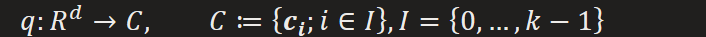


K centroids will be store in Inverted file


2.  for each cluster, do fine quantizer
(Or hierarchically)Split Voronoi cell into many small blocks and code them

1.  From paper "**Hamming embedding and weak geometric consistency for large scale image search**"  
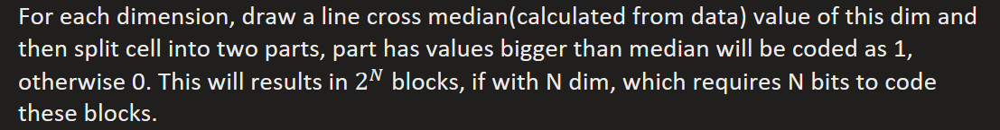


Step 1: Orthogonal Projection


Step 2: median divider for each dimension k


Step 3: computing the code for dimension k

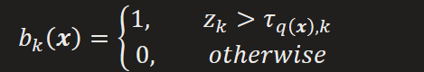

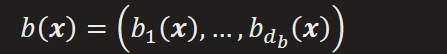

Step 4: compute Hamming distance

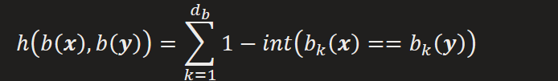

Question: there exist the case NNs in the Euclidean space have its Hamming distance is not small, e.g. 2 dim, we can divide a cell into 4 quadrants according to median, so only points fall in the same quadrant are NNs.

since we can not ensure point (0, 0) in data, so there may be NNs scatter on diagonal line, resulting in falling into different quadrants.

Briefly, similar issue to k-mean, NNs in Euclidean space fall on the two side of border become non-NN. Which can be solved by searching multiple cells at same time, nprobe parameter in faiss

2.  From paper "**Product quantization for nearest neighbor search**"  
In contrast to method 1), which is a flat way of finer quantization, the method here is a hierarchical one.

Do product quantization on residual vector (vector - centroid), that is doing vector quantization for each sub vector of residual vector. Then represent each sub vector with its sub voronoi cell code.

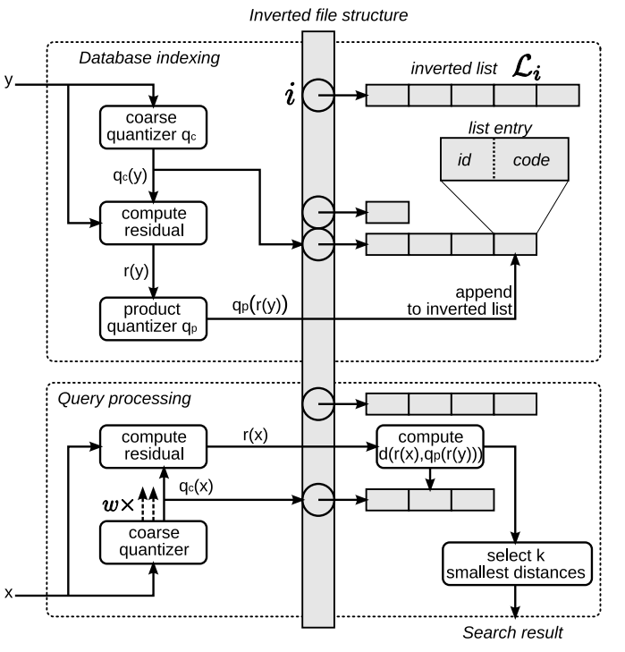


Database indexing

Get residual vector and its m sub vectors, d % m=0


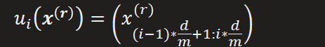

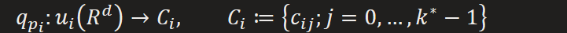

Finer quantizer

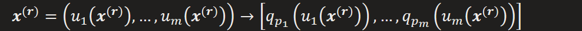


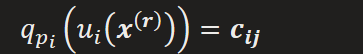

Represent in binary form


indexed vector

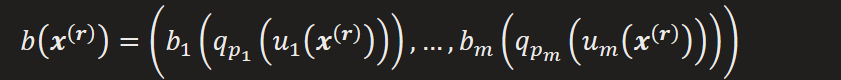


Query process


3.  From paper "**Large-Scale Image Retrieval with Attentive Deep Local Features**", i.e. 1) + 2)  
Step 1: Voronoi cell partition

This was done by applying **K-D Tree** algorithm to hierarchically split Voronoi cell into blocks

Step 2: Locally optimized **Product Quantizer**

Then apply **Product Quantizer** for each sub tree of K-D Tree

Provided: dim sequence DS (which dim should be first split)

This dim sequence was built base on picking dimension with maximum variance at each depth.

Then it can filter lots points that are quite far from query from the start, since the gap on that dimension is sufficiently large to be distinguished.

Search processing of K-D Tree:
```
Pseudocode:

\# following the searching trajectory from coarse to finer cell hierarchically,

\# ordered by dim sequence, we'll finally reach the nearest point

min = d(root, query); i = 1 \# record current minimum distance

dim = DS\[i\]

if (query\[dim\] \< root\[dim\]) \# go to which branch

dim = DS\[i+1\]

if (\|query\[dim\] - root.lchid\[dim\]\| \> min)

return root

else

tmp = d(query, root.lchid)

if (tmp \> min) return root

min = tmp

root = root.lchild; i += 1

repeat this process

else

dim = DS\[i+1\]

if (\|query\[dim\] - root.rchid\[dim\]\| \> min)

return root

else

tmp = d(query, root.rchid)

if (tmp \> min) return root

min = tmp

root = root.rchild; i += 1

repeat this process
```
3.  search  


From Step 1 to 2, we quickly narrow down search scope, and then at Step 3, we accurately locate matching items.

e.g. For Face Recognition, we may narrow search scope by coarse quantization such as style of face, then exactly matching between face feature vectors in an efficiency small realm.
