**Faster self-attention**  
[Reformer](https://www.pragmatic.ml/reformer-deep-dive/)
1.  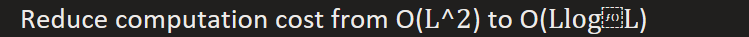  
Block QQV self-attention using LSH(Locality Sensitivity Hashing) to distribute key into different blocks(buckets)

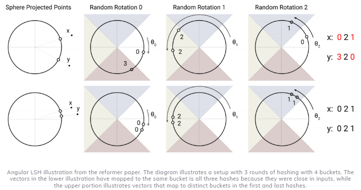

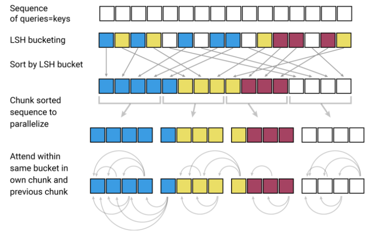  
2.  Activation Checkpoints: Avoid storing key and values which cost quantity of memory consumption (when backpropagate)
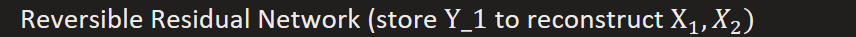


```
def forward_pass(x1, x2, Wf, Wg):

""" Need an extra node in the computational graph because the gradient of the loss with respect to z1 \# differs from the gradient of loss with respect to y1 x1: one half of layer input x2: other half of layer input Wf: weights that parameterize function f Wg: weights that parameterize function g """

z1 = x1 + f(Wf, x2)

y2 = x2 + g(Wg, z1)

y1 = z1
```

```
def backward_pass(y1, y2, d_y1, d_y2, Wf, Wg):

""" Pseudocode for RevNet of backward pass y1: one half of layer output y2: second half of layer output d_y1: derivative of y1 d_y2: derivative of y2 Wf: weights that parameterize function f Wg: weights that parameterize function g """

z1 = y1 # middle checkpoint to reconstruct input(key and value)

# Extra computation -- the price we pay for memory \# complexity that doesn't scale with n_layers \# Importantly this means we don't have to store x1 or x2!

x2 = y2 - g(Wg, z1)

x1 = y1 - f(Wf, x2)

# Standard backprop: # vjp --\> Vector Jacobian Product

d_Wf, partial_x2 = jax.vjp(f, Wf, x2)(d_z1)

d_Wg, partial_z1 = jax.vjp(g, Wg, z1)(d_y2)

d_z1 = d_y1 + partial_z1 \# d_x1 also follows reisudal connection

d_x2 = d_y2 + partial_x2 \# d_x2 also follows residual connection

d_x1 = d_z1

return x1, x2, d_x1, d_x2, d_Wf, d_Wg
```

3.  Avoid large memory consumption with long positional encoding  


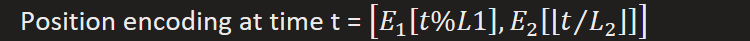

Longformer
Reduce computation cost from O(L^2) to O(wL), w is window size
1.  Local attention (Dilated Conv-style attention)  
For each token in sequence, only compute attentions with tokens within fixed window center around it.

Similar to Convolutional network, deeper layer can have larger vision field  
2.  Global attention  
Only allow few specific tokens (e.g. CLS token) have global attention to other tokens

MQA(Muti-query attention)
Keep all attention heads share same key and value matrixes, but different query matrixes
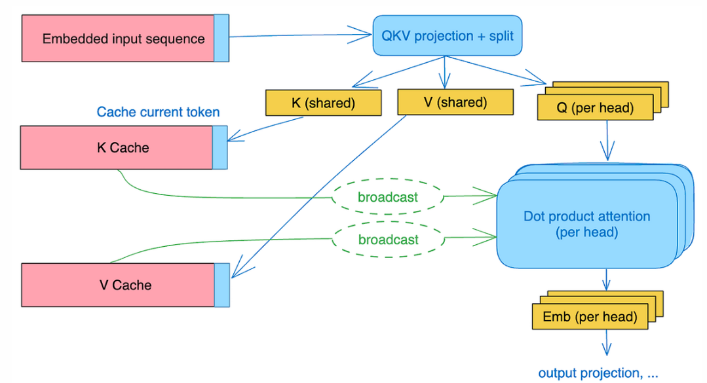
Goods:  
1.  Reduce consumption of memory of KV-cache
2.  Less I/O for Key/Value matrixes
Bads:
1.  Performance drop due to loss of representation capability, can be amended by increase scale of FFN or do further training
2.  Unstable training, requiring hyperparameter tuning

GQA(Group query attention)
It can be seem as multi-group MQA, heads in same group share same Key/Value matrixes
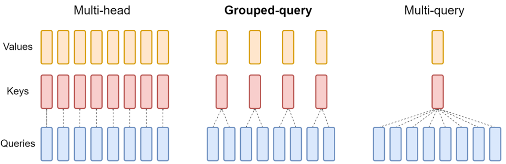

Attention with prior structure to cut computation
1.  Sparse attention, sparse correlate relationship between Q and K
2.  Sliding window attention, fixed attention in small scope by defining sliding mask (note it is similar to convolutional network, the receptive field will be expanded as depth increasing)
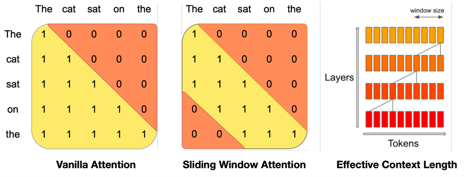
3.  Interleave 'full' and 'LR' attention, e.g. every 4th layer is a full attention, others are sliding window attention

**Details when do LLM Inference**
1.  [Tokenization](https://huggingface.co/docs/transformers/tokenizer_summary#wordpiece) (BPE, Byte-BPE, WordPiece)
Mostly used is subword tokenization which rely on the principle that frequently used words should not be split into smaller subwords, but rare words should be decomposed into meaningful subwords. In this way, a reasonable vocabulary won't cause huge token embedding and quantity computation of softmax.

Thus in general, tokenization contains two phase
1.  First, train a vocabulary containing the smallest subwords, which are also most common one according to some statistical metrics
Take BPE as example:

\(1\) pre-tokenization: split training data into words and count their frequencies

SentencePiece (+Unigram(remove rule) ) for languages use different separation rules

\(2\) create a base vocabulary consisting of symbols that occur in unique words

\(3\) learn merge rules to expand vocabulary by merging two unique symbold with highest frequency til reaching expected vocabulary size or the new merged subword has frequency below certain threshold.

WordPiece take similar steps as BPE, but with likelihood as metric

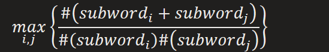  
2.  Encode a string into token ids or decode them back to human readable string.
Encode: Split sentence into subwords according vocabulary, and then convert them to token ids

Note: for a long word splitting into couple subwords, there will be special token for their connection

e.g. transformer -\> trans form, er\</w\> which means er\</w\> should join its all predecessors to form a complete word. And then \</w\> will be replaced with space

Decode: token ids were reversed to subwords, and them merge subwords should form a complete word.
2.  Autoregressive Inference process(Ignore residual and FFN, LN)


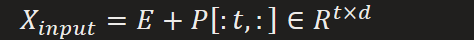

we calculate Q, K, V by

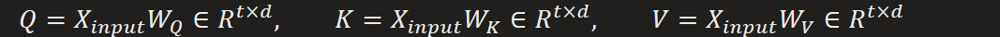

Applying self-attention, we get final output sequence

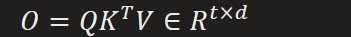

And then we get logits for next token

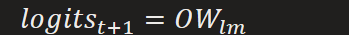

To sample next token, we may apply a sampling pipeline including  
1.  Temperature Scaling (high temperature, more diverse generation, vice versa)
2.  Top-p Sampling or Top-K Filtering (Only look most likely choice add up to certain probability threshold, e.g. 90%)
3.  Beam search, this is for full output sequence generation
During each generation step, we maintain k best generation path with highest probability summation. And we choose the highest one when meet end.
3.  How to handle increased positional encoding for new generated token
    1.  Static Positional Encoding
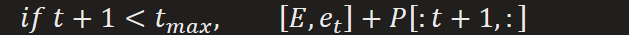

Else

For Sliding Window Attention, with window size w

Mask out attention exceeds \[t-w,t\], right shift positional encoder by one offset

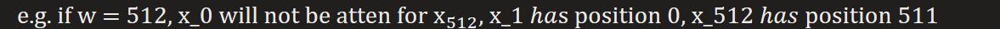

For Interpolation, expand original positional encoding with longer length (more dense)
2.  Relative Positional Encoding
Using relative positional bias, with no constraint of max length


It was added directly to attention: 〖QK〗^T+P (prior of nearby closer)
3.  RoPE (Rotary Positional Embedding)
Encoding relative position as rotation
4.  [K-V cache (Why not cache Q ?)](https://medium.com/@joaolages/kv-caching-explained-276520203249)
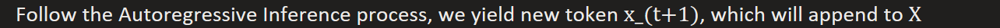

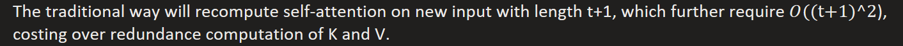

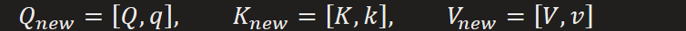

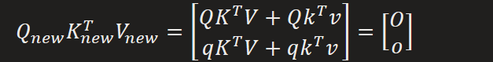

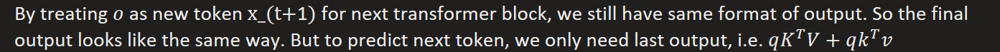


So why don't we pre-cache K, V of each block and only compute their last output ? Also, since the last output independent of Q, we don't need to cache Q.

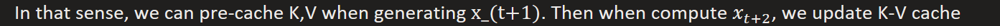


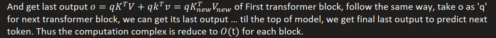

Also, the left-to-right connection (attention mask) makes output of t can only rely on that smaller or equal than t. Thus, there's no way O can have access to k and v, changing the decision already being made.

**[Bottleneck: Memory and Communication](https://zhuanlan.zhihu.com/p/663517415) (ZeRO-DP&R)**  

Issues:
1.  Huge memory consumption of LLM, including:
    1.  Model States Memory
        1.  Optimizer States (e.g. first and second FP32 moments of Adam, takes most of memory ! FP32 parameter backup (avoid error accumulation of FP16))
        2.  Mix precision: FP16 parameters and gradients
    2.  Residual States Memory
        1.  Activations used for gradient computation. (Can be cut by activation checkpoint, only store activations of high computation cost but with consume small memory, recompute others during backward.)
        2.  Temporary Buffers(FP32) which store all middle results and then do computation altogether (averaging gradients from different devices).
        3.  Memory Fragmentation: too much small discrete memory fragmentation caused by deleting activations, which makes memory allocation failed even the rest is enough.
2.  Data Parallelisms will copy model to all devices, cause redundance memory consumption
3.  Model partition splits model over different devices, but cost lots of communication
4.  DP and MP stores all model state during the whole training process, but not any of them are required during the whole time.
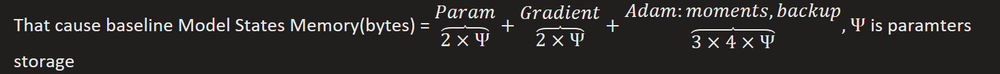

Solutions of ZeRO: Partition + ReduceScatter&AllGather

Combine edges of DP and MP, while avoiding their disadvantages. For N_d devices, follow DP training process, we input different data into different devices and gather their averaged gradient to update parameters. Since update for paramters only execute onces, we can slice and dispatch it into different devices in charge of update of different parameters slice. Also, we still need to compute gradient w.r.t all parameters in each device, but in a stream way we don't need to store all of them, instead only the slice need to update parameters slice.

Optimizer State Partitioning, distribute optimizer state into different devices
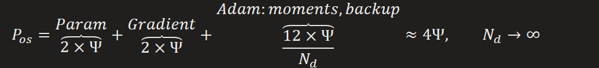
Communication process (After calculating gradient of each devices)
1.  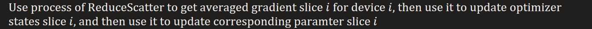
2.  Use AllGather process to broadcast updated parameters to other devices
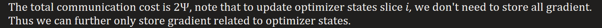

+Gradient Partitioning, distribute gradient into different devices
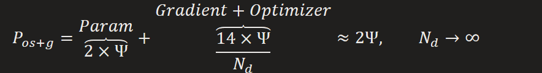
Communication process (After calculating gradient of each devices in a stream manner)
1.  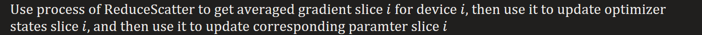
2.  Use AllGather process to broadcast updated parameters to other devices
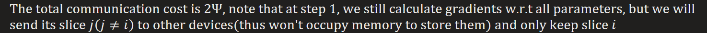

+Parameter Partitioning, distribute parameter into different devices
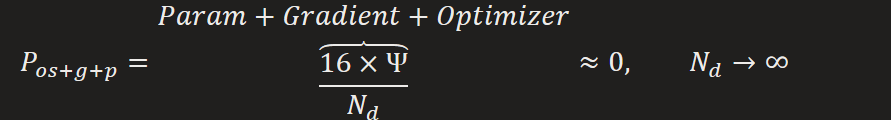  
Communication process  
1.  AllGather process for forward (Communication follow order of forward): since different devices need complete parameter to get loss, thus it needs other parameter slices from other devices. But note that once it finish computing middle activations, which will be stored, it will send the parameter slice to other devices and clean occupied memory space for receiving next layer's parameter from other device. So it will only takes 2 parameter slices of space at most.
2.  AllGather process for backward, similar to step 1 (use activations from step 1).
3.  
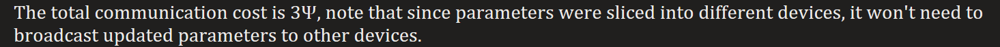

[ZeRO-R](https://medium.com/@e0928021388/%E5%84%AA%E5%8C%96%E4%BD%A0%E7%9A%84-training-deepspeed-a-deep-learning-optimization-library-%E4%BB%8B%E7%B4%B9-b409eb4c9436)
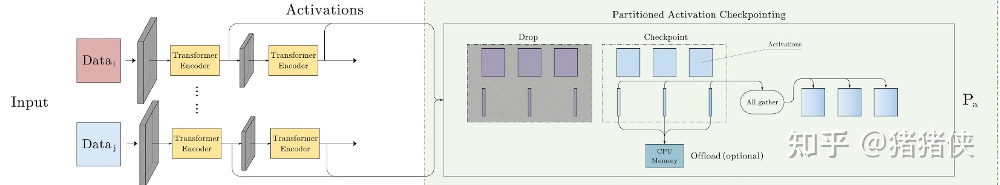
Partitioned Activation Checkpointing, distributed activation checkpoints into different MP process(devices). For extreme large activation or limit device memory, they will be offload to CPU memory in trade of extra communication cost.
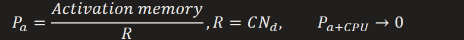  
Communication process
(optional) load activation slices from CPU memory
1.  AllGather process for forward: activations act as input to deeper layers which sit in different devices
2.  AllGather process for backward: when activations was required to compute corresponding gradient, it will be replicated to different devices.
Note that in MP, model was split into different devices, thus we can dispatch and gather activation, as they belong to same model. (In contrast, DP has multiple model replica, thus we can not dispatch activation in that way.)

Constant Size Buffers, avoiding buffer size grow with model size.

Memory Defragmentation, long life circle of activation and gradient interleaving with short one cause lots memory fragmentation. Thus it is necessary to pre-allocate them in continuous memory blocks and organize memory fragment in time (e.g. activation.continuous() or gradient.continuous() )  
[**Why do we need positional encoding**](https://huggingface.co/blog/designing-positional-encoding)  
Self-attention is a set operation, which means it is Permutation Equivariant
It operate on a set and calculate their relationship without considering their presented order.
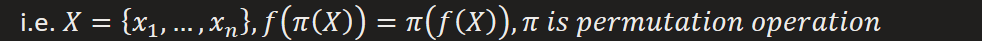  
It means output has consistent order with permuted input, but no change in values
Proof:


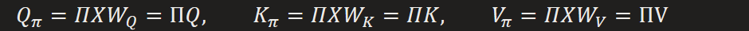

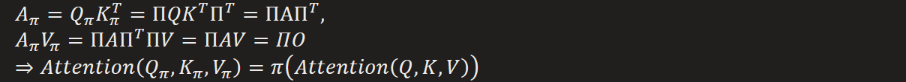  
So self-attention is not sensitive to order of input, that's why a positional embedding was need.

RoPE (Encoding relative position as rotation)  
Intuition: Relative position information already hidden as rotation in Sinusoidal Encoding
Sinusoidal Encoding

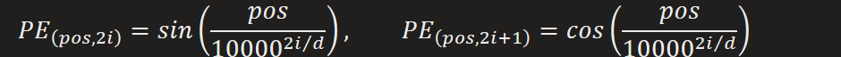

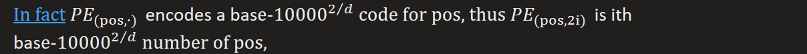

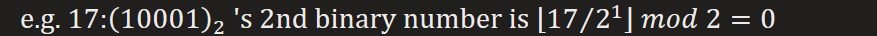

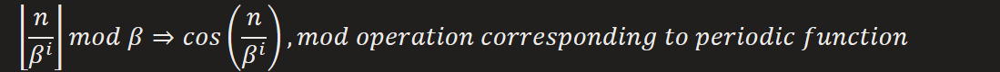

NTK-Aware RoPE: [High frequency interpolation, Low extrapolation](https://zhuanlan.zhihu.com/p/8306958113)
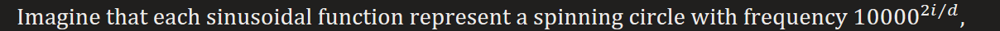

Thus smaller i, faster spinning. Take clock as a concrete example, second hand spins faster, hour hand spins lowest. Their combination makes a 60-based 3 digits code. One movement of hour hand requires 60 times spins of minute hand.

In that way, we can also take binary as 2-scale clock.

During training, every spot in circle of high frequency has been seen by model, thus for OOD input, we can directly extrapolate it instead of interpolation (which will higher the frequency, making model hard to distinguish nearby positions), but interpolate it for low frequent digit, as their slow motion makes mass spots unexplored so that model can not handle OOD spots.

Thus low frequent digit becomes lower so to keep position in explored region.

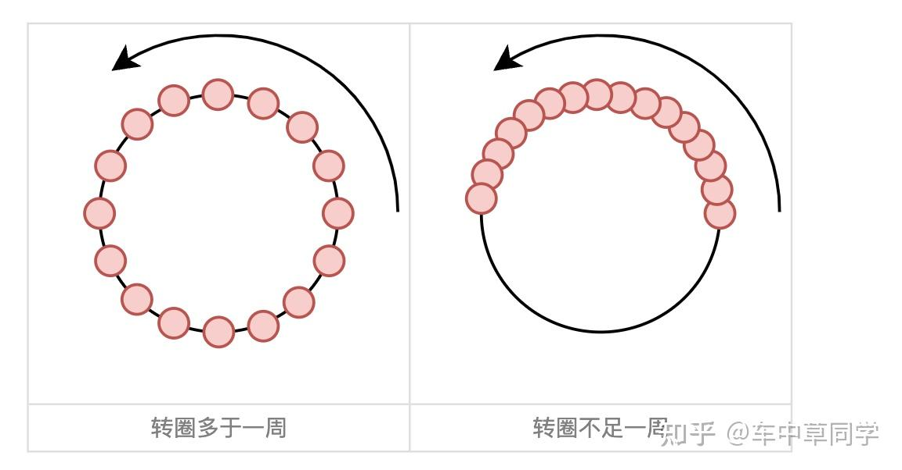

Relative position: Relation between position p and p+k
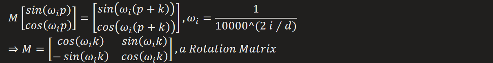
Insights
1.  Relative information matters much, as we care more about relationship to the words around a specific word
2.  Simply adding positional embedding to token embedding pollution the intrinsic sematic information (by modifying its norm and decreasing SNR)
3.  Prior of attention: nearby words should have more influence than distant one
Attention weight calculated by dot product

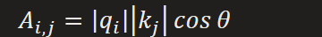

We can find that Sinusoidal Encoding violates Insights due to destruction of long-term decay after applying linear transformation. Further, addition makes it worser.
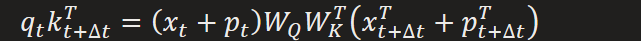
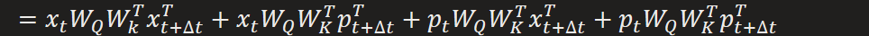
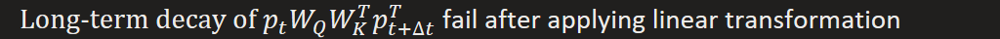
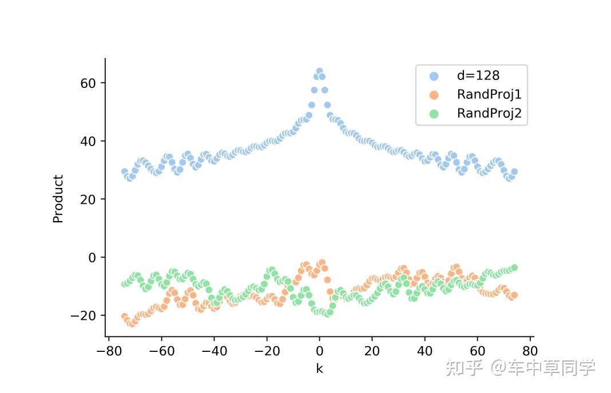

Thus we can encode the prior(relative position) as rotation apply to token embedding, without changing its norm, nearby words have relatively small rotation angle.
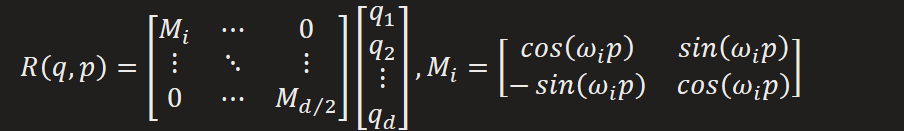
For N-D inputs, RoPE can be applied to each dimension independently.
As for the posterior attention pattern (e.g. high correlation between object and its distant pronoun) will learn through training.

[**Flash Attention**](https://zhuanlan.zhihu.com/p/642962397)
Most efficient transformer focus on reduction of FLOPS, while the bottleneck rest in memory access cost. Flash attention aims at cutting MAC by **chunking huge matrix into small blocks** which can be accessed through SRAM (which has fastest IO speed).

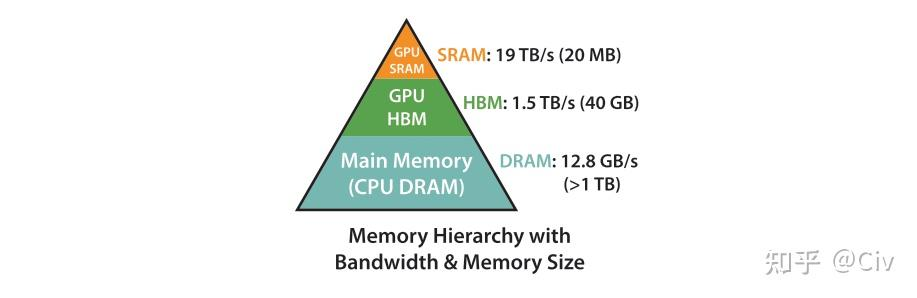

IO of self-attention conduct in HBM, which has high IO delay than SRAM


Dynamic Incrementally Update Softmax  
Since the softmax operation involves summation of all elements, the main issue is to also chunking computation of softmax into blocks.

The traditional way of softmax

In case of overflow, subtraction to maximum will be applied


The same update rule for block 2

And then update global maximum and summation, and store them into SRAM

For case of more blocks, such update rule can be iteratively executed till getting global softmax result.
Also, in Flash Attention V2, divide to summation when calculate local softmax was cancelled since the denominator will be cancelled out in each update. Assume that in t update round,

It causes redundant computation, thus we can modify it to no-divide-softmax, and only apply division until we get the global summation

During the updating, we only need to store 2 scalars in SRAM instead of a full vector.


Further, in Flash Attention V2, calculation of blocks of being masked will be skipped.

**Collective Operations**  

Distributed training of LLM can be abstract as collective operations. i.e. Split training computation into different GPUs, results of which will be gathered into a main site and reducing to final result, which in turn will be broadcasted to different GPUs to continue the collective circle. Thus the bottleneck rests in communication.

Such process is called All Reduce.
1.  Reduce(N to 1): reduce(sum) multiple computation from different sites results into one main site
2.  Broadcast(1 to N): Main site broadcasts reduced results to other sites
Generally, main site maybe the bottleneck since it takes too much word load.
Scatter-version of All Reduce: split computation into different slices, different sites handle All Reduce for different slices, i.e. every site share burden of main site.
1.  
2.  AllGather(N to 1):
    1.  
    2.  Broadcast: main site broadcast complete result to other sites

Ring-ReduceScatter / Ring-AllGather: High efficiency implementation
Core: Ring communication
1.  
2.  
Computation of communication consumption = sending communication + receive communication


Total duration is

Duration of ring-based communication almost independent to number of devices, but its total communication correlates with number of devices.


**MoE (Mixture of Expert): Router + Multi-FFN**  

1.  Routing function (choose top K and fusion) How to choose ? How to fusion ?
    1.  Top-K according to logits: calculate correlation between expert and token


Note that the Topk operation makes the factor summation less than 1, which shrinks the input, but such scale variant will be scaled back in later layers (Layer Norm)
2.  Hashing: map token to expert(FFN)
3.  RL-guided gating polices learning
4.  Solve a matching problem (Linear Assignment)
b,c,d have too much computation cost
2.  Expert sizes
Smaller( with smaller hidden dim), larger number of experts + a few shared experts(always activated), but too many fine-grained experts may cause more communication
3.  Training objectives: How to efficiently train a sparsity gating policy ? Considering that sparse decisions are not differentiable.
    1.  Reinforcement learning to optimize gating policies
    2.  Stochastic perturbations: competition mechanism
Shazeer et al 2017 – routing decisions are stochastic with gaussian perturbations.


Stochastic jitter in Fedus et al 2022


Such perturbation method can gain robust(conservative) expert, but also make them less profession (less sensitive to token), causing loss of efficiency.
3.  Heuristic 'balancing' losses: system efficiency requires that use experts evenly. We hope the decision panel won't only rely on few experts.
Switch Transformer \[Fedus et al 2022\] : auxiliary loss


Thus loss measure of Expectation of tokens handle by an expert, since we want them used evenly, thus leading to each expert handle as less token as possible, the optimal reach when each expert only handle T/N tokens


Such load balancing can also be extented to different expert groups in different devices to make sure even utilization on different devices

DeepSeek v3: per-expert biases, topk frequent, Set up a per-expert bias (making it more likely to get tokens) and use **online learning** (not necessarialy even, dynamic balancing during inference)


Complementary sequence-wise balance loss (used in training)


Normalized decision fusion from Topk experts


  
4.  Training/finetuning stability
Using float32 for router and add aux z-loss (constraint denominator of softmax close to 1)

  
5.  Communication cost loss (DeepSeek v2)
Top-M devices select(touting), then do Top-K experts select on each selected device


  
4.  System side: parallel MoE on more devices
Experts on different decices choose token: load balancing across devices  
5.  Up-cycling: turn dense model (with one FFN) to sparse one (add MoE)

