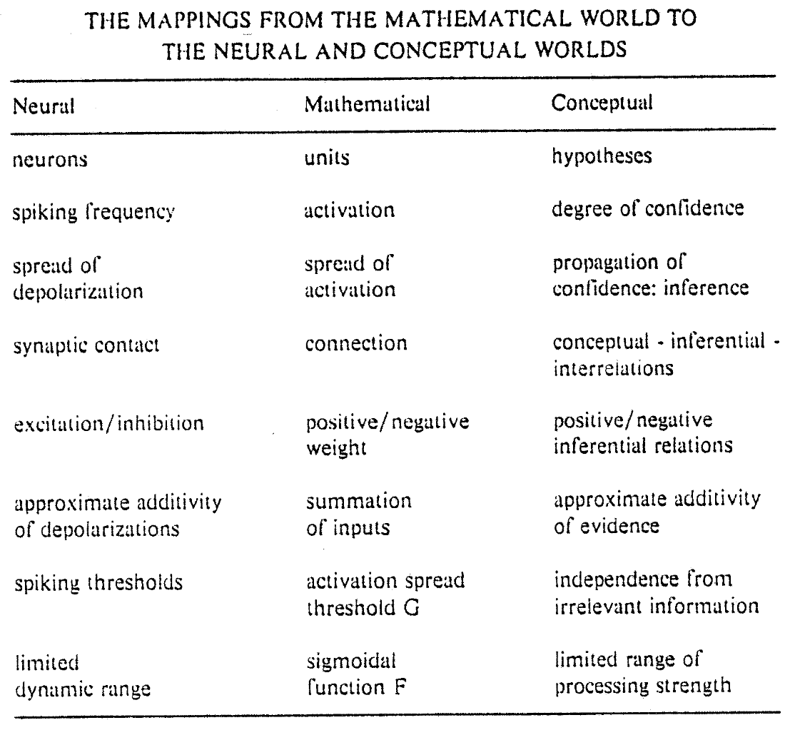
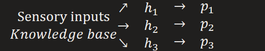
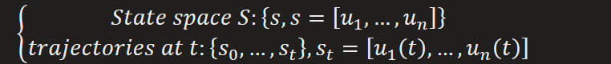
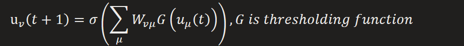
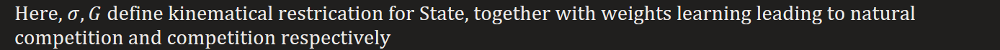
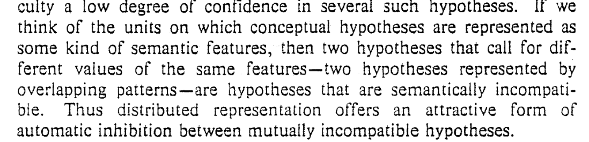
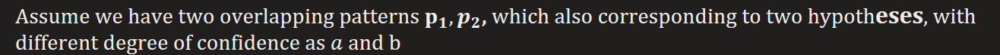

PDP models of cognitive processing divide broadly into two classes
Local models (low-level model)

Unit(activation) 1-to-1 mapping to conceptual entity

Distributed models (high-level model)

Units(strength of patterns) n-to-n mapping to conceptual entit**ies**

Quasi-local

Unit group (non-overlapping patterns) n-to-1 mapping to conceptual enti**ties**

Main question
How are distributed and local PDP models related ?

How to relate distributed to local models ?

Neural and conceptual interpretations (Cognitive behavior)
Assignment of confidence to different hypotheses (Inference):

Isomorphism between neural and conceptual description, also between local and distributed models (linear)
Local, unit coordinate

Distributed, pattern coordinate

Existence of basis transformation, but the properties doesn't hold when linearity was involved

Perspective of dynamical system for PDP models

s.t. mathematical equations

Dynamics leads to learning of weights

Kinematical leads to inhibition(competition) between hypotheses (overlapping patterns)

i.e. two hypotheses represented by overlapping patterns are incompatible, so only one hypoth**eses** will take dominant

