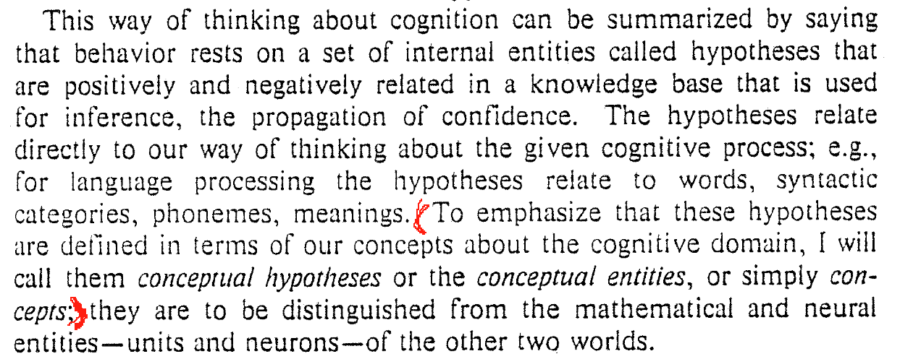
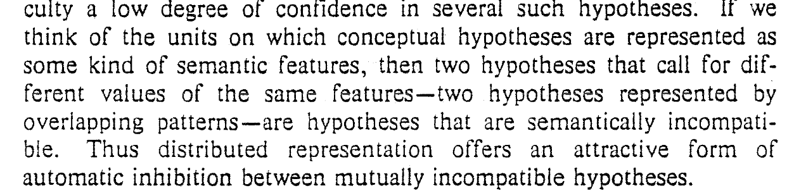

  
PDP models of cognitive processing divide broadly into two classes
  Local models (low-level model)
    Unit(activation) 1-to-1 mapping to conceptual entity
  Distributed models (high-level model)
    Units(strength of patterns) n-to-n mapping to conceptual entit**ies**
  Quasi-local
    Unit group (non-overlapping patterns) n-to-1 mapping to conceptual enti**ties**

Main question
  How are distributed and local PDP models related ?

How to relate distributed to local models ?
  Distributed models (neural, vector form) $\overset{linear algebra}{\Longrightarrow}$ distributed models (conceptual form) $\Rightarrow $ local models

Neural and conceptual interpretations (Cognitive behavior)
  Assignment of confidence to different hypotheses (Inference):

$$
\begin{array}{c}\mathrm{Sensory}\ \mathrm{inputs}\\ Knowledge\ base\end{array}\begin{array}{ccc}\nearrow & {h}_{1}& \begin{array}{cc}\to & {p}_{1}\end{array}\\ \to & {h}_{2}& \begin{array}{cc}\to & {p}_{2}\end{array}\\ \searrow & {h}_{3}& \begin{array}{cc}\to & {p}_{3}\end{array}\end{array}
$$

Isomorphism between neural and conceptual description, also between local and distributed models (linear)
  Local, unit coordinate

$$
\mathbf{v}={\mathrm{v}}_{1}{\bm{e}}_{1}+{\mathrm{v}}_{1}{\bm{e}}_{2}+\dots +{\mathrm{v}}_{1}{\bm{e}}_{n}
$$

  Distributed, pattern coordinate

$$
\mathbf{v}=\mathrm{k}\mathbf{p},\mathbf{p}={\mathrm{p}}_{1}{\bm{u}}_{1}+{\mathrm{p}}_{1}{\bm{u}}_{2}+\dots +{\mathrm{p}}_{n}{\bm{u}}_{n}
$$

  Existence of basis transformation, but the properties doesn't hold when linearity was involved  

Perspective of dynamical system for PDP models

$$
\left\{\begin{array}{c}State\ space\ S:\left\{s,s=\left[{u}_{1},\dots ,{u}_{n}\right]\right\}\\ trajectories\ at\ t:\left\{{s}_{0},\dots ,{s}_{t}\right\},\ {s}_{t}=\left[{u}_{1}\left(t\right),\dots ,{u}_{n}\left(t\right)\right]\end{array}\right.
$$

  s.t. mathematical equations

$$
{\mathrm{u}}_{v}\left(t+1\right)=\mathit{\sigma}\left({\sum}_{\mathit{\mu}}{W}_{v\mathit{\mu}}G\left({u}_{\mathit{\mu}}\left(t\right)\right)\right),G\ is\ thresholding\ function
$$

  Here, $\mathit{\sigma},G$ define kinematical restrication for State, together with weights learning leading to natural competition and competition respectively
  Dynamics leads to learning of weights
  Kinematical leads to inhibition(competition) between hypotheses (overlapping patterns)
  
  
    i.e. two hypotheses represented by overlapping patterns are incompatible, so only one hypoth**eses** will take dominant
    Assume we have two overlapping patterns ${\mathbf{p}}_1,{\bm{p}}_2$**, **which also corresponding to two hypoth**eses**, with different degree of confidence as $a$ and $\mathrm{b}$
    So the linear pattern coordinate is $\left[a,b\right]$
    After applying non-linearity function, we will have $a$*/*$\mathrm{b}$ increase or decrease, which means one hypotheses were amplified, while the other were inhibited
  
PDP models of cognitive processing divide broadly into two classes
  Local models (low-level model)
    Unit(activation) 1-to-1 mapping to conceptual entity
  Distributed models (high-level model)
    Units(strength of patterns) n-to-n mapping to conceptual entit**ies**
  Quasi-local
    Unit group (non-overlapping patterns) n-to-1 mapping to conceptual enti**ties**

Main question
  How are distributed and local PDP models related ?

How to relate distributed to local models ?
  Distributed models (neural, vector form) $\overset{linear algebra}{\Longrightarrow}$ distributed models (conceptual form) $\Rightarrow $ local models

Neural and conceptual interpretations (Cognitive behavior)
  Assignment of confidence to different hypotheses (Inference):

$$
\begin{array}{c}\mathrm{Sensory}\ \mathrm{inputs}\\ Knowledge\ base\end{array}\begin{array}{ccc}\nearrow & {h}_{1}& \begin{array}{cc}\to & {p}_{1}\end{array}\\ \to & {h}_{2}& \begin{array}{cc}\to & {p}_{2}\end{array}\\ \searrow & {h}_{3}& \begin{array}{cc}\to & {p}_{3}\end{array}\end{array}
$$

Isomorphism between neural and conceptual description, also between local and distributed models (linear)
  Local, unit coordinate

$$
\mathbf{v}={\mathrm{v}}_{1}{\bm{e}}_{1}+{\mathrm{v}}_{1}{\bm{e}}_{2}+\dots +{\mathrm{v}}_{1}{\bm{e}}_{n}
$$

  Distributed, pattern coordinate

$$
\mathbf{v}=\mathrm{k}\mathbf{p},\mathbf{p}={\mathrm{p}}_{1}{\bm{u}}_{1}+{\mathrm{p}}_{1}{\bm{u}}_{2}+\dots +{\mathrm{p}}_{n}{\bm{u}}_{n}
$$

  Existence of basis transformation, but the properties doesn't hold when linearity was involved  

Perspective of dynamical system for PDP models

$$
\left\{\begin{array}{c}State\ space\ S:\left\{s,s=\left[{u}_{1},\dots ,{u}_{n}\right]\right\}\\ trajectories\ at\ t:\left\{{s}_{0},\dots ,{s}_{t}\right\},\ {s}_{t}=\left[{u}_{1}\left(t\right),\dots ,{u}_{n}\left(t\right)\right]\end{array}\right.
$$

  s.t. mathematical equations

$$
{\mathrm{u}}_{v}\left(t+1\right)=\mathit{\sigma}\left({\sum}_{\mathit{\mu}}{W}_{v\mathit{\mu}}G\left({u}_{\mathit{\mu}}\left(t\right)\right)\right),G\ is\ thresholding\ function
$$

  Here, $\mathit{\sigma},G$ define kinematical restrication for State, together with weights learning leading to natural competition and competition respectively
  Dynamics leads to learning of weights
  Kinematical leads to inhibition(competition) between hypotheses (overlapping patterns)
  
  
    i.e. two hypotheses represented by overlapping patterns are incompatible, so only one hypoth**eses** will take dominant
    Assume we have two overlapping patterns ${\mathbf{p}}_1,{\bm{p}}_2$**, **which also corresponding to two hypoth**eses**, with different degree of confidence as $a$ and $\mathrm{b}$
    So the linear pattern coordinate is $\left[a,b\right]$
    After applying non-linearity function, we will have $a$*/*$\mathrm{b}$ increase or decrease, which means one hypotheses were amplified, while the other were inhibited
