**Reflection-Ask more, Simbolic description, be more patient, be more fun**
1.  What is exactly we trying to solve and the ideal result ? or What is it look like, before solution and after solution ?
2.  How does the solution do to solve it ? (the general process, not the parsed detail)
3.  How does the solution come out ? (peel it out the simple core idea)
4.  How does the idea behind adapt on this problem ? Are there any generalized way ?
It's indeed hard to remember all the complex detail of the solution, also it's boring to do so, so why not just to figure out the simple idea or theorim behind it and its adaption on real problem, and further, how to generalize it to more universal conditions.

[**Set VS Space**](https://math.stackexchange.com/questions/4362803/set-vs-space-in-definitions)
In general, set is a concept with wider generalization than space, or we can say that space is equivalent to a set equipped with some operations.
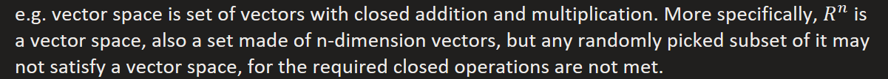

[**Probability Space**](https://bjlkeng.io/posts/an-introduction-to-stochastic-calculus/)
What support us to measure an event, a group of samples, with a quantity is the main story of measure theoretic definition of probability which can be extent to infinite sample space.

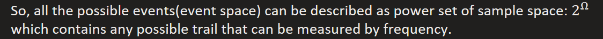

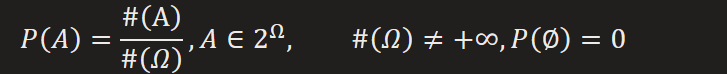

And event space defines a closed set that:
1.  
2.  
3.  
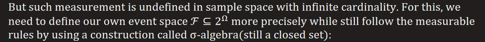
1.  
2.  
3.  

It lists out the measurable events we can take as we do in finite sample space where measurable events are implicitly the power set of sample space.
Measurable space + measure rules
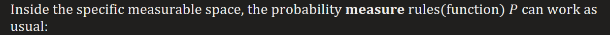
1.  
2.  
3.  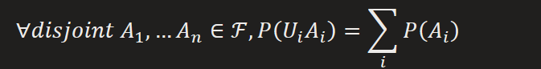

1.  It maps measurable space on sample space into that on real space
For finite sample space

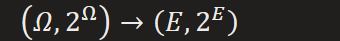

For infinite sample space

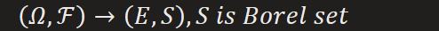
2.  

**Gradient&Derivative on Specific Direction**
**Basic thoughts:**
Multivariant

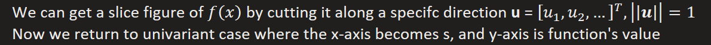
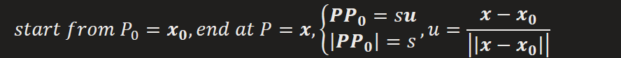

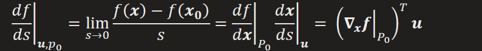
**Confusion between Gradient and Normal of plane**

What's different is in multivariant case tangent line turns into tangent plane, and its normal is marked as
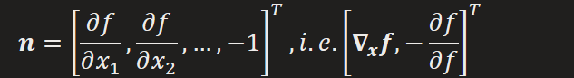

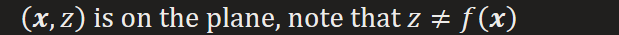
This can be verified as an analog to a line in x-y coordinate system
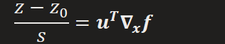
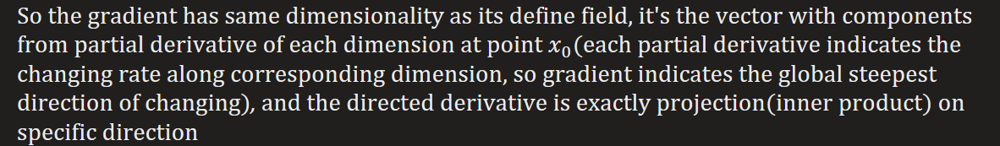
[Why gradient indicates the direction of increasing](https://math.stackexchange.com/questions/223252/why-is-gradient-the-direction-of-steepest-ascent) ?
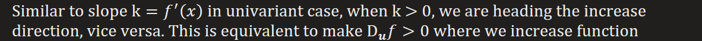
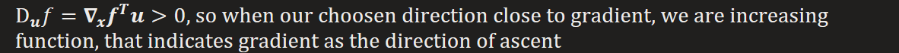

[**Calculus of Variations**](https://bjlkeng.io/posts/the-calculus-of-variations/)
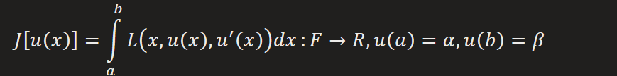
F is infinite-dimensional function space
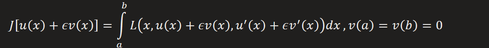
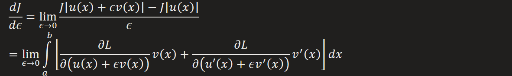
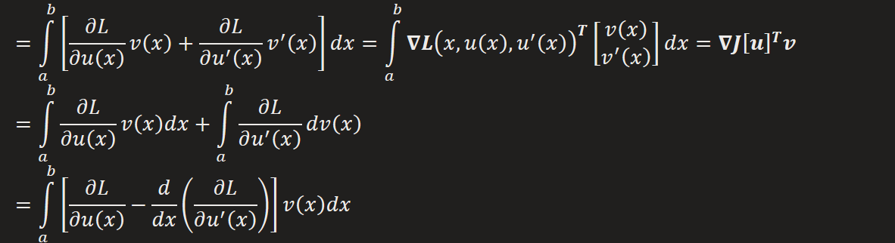

To find stationary, a functional must satisfy
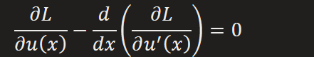
Which is known as the Euler-Lagrange equations

[**Calculate vector's derivative w.r.t vector**](https://zhuanlan.zhihu.com/p/36448789)

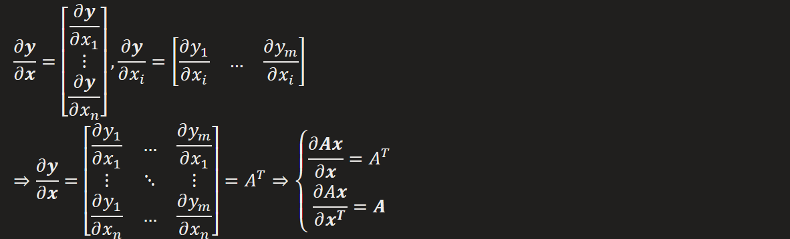

**The Exponiential Family**
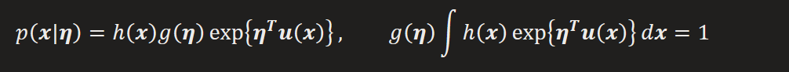
conjugate priors

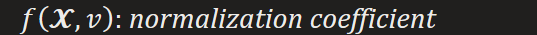

*The posterior has same form as its conjugate prior*

**Notes of Analysis \[Tenrece Tao\]**

Lemma 5.3.14
Prove keypoint: for a non-zero real number, its corresponding Cauchy sequence must exists an element having arbitray distance away from 0

Proposition 5.4.14
Prove idea: Usage of Archimedes property (Deduction 5.4.13) and Proposition 5.4.12(bounding real number by ratio number)

Theorem 5.5.9
Prove idea: prove that E has at most one supreme and at least one supreme
By definition of supreme, we find supreme by keeping looking smaller upper bound until the smallest one, that will generate a sequence of upper bound, which can be proved as a Cauchy sequence, then its limit number is supreme.
Archimedes property (Deduction 5.4.13) can be used to construct the desired upper bound sequence
The uniqueness is based on Proposition 4.4.1

