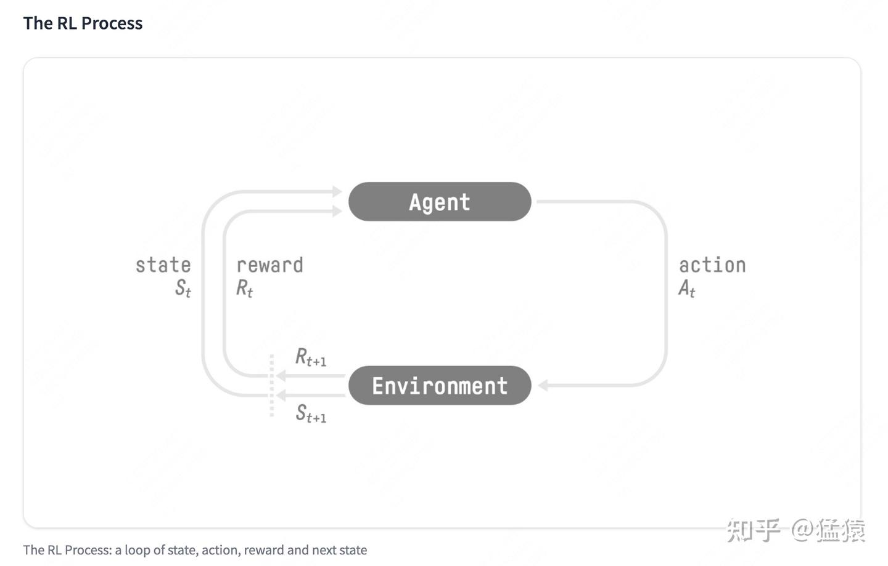
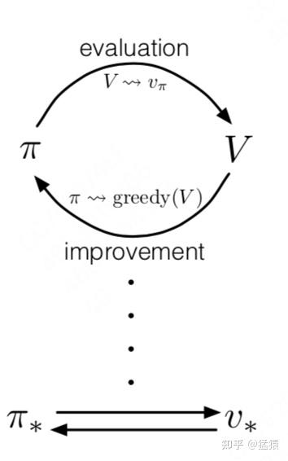
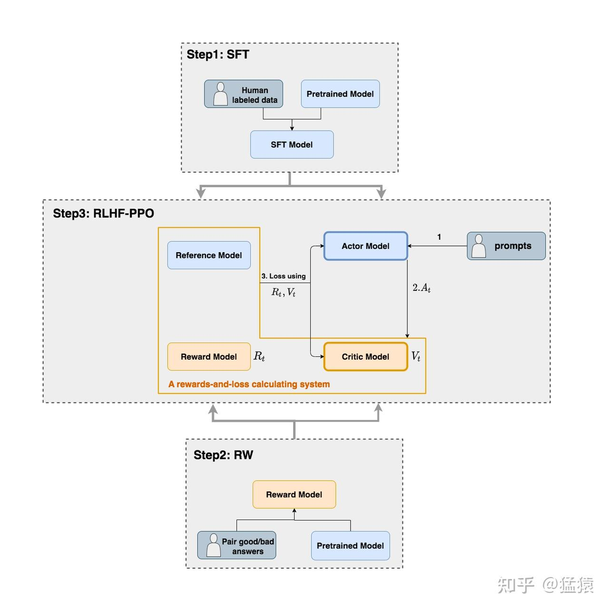
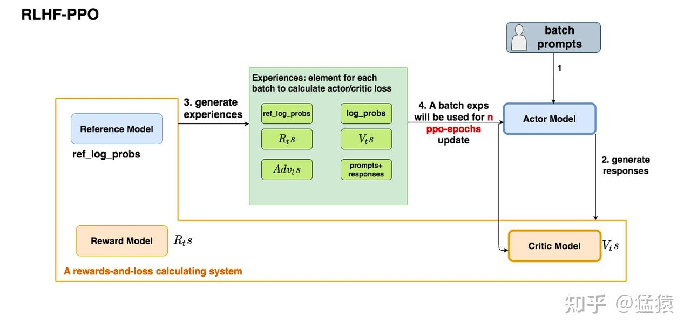
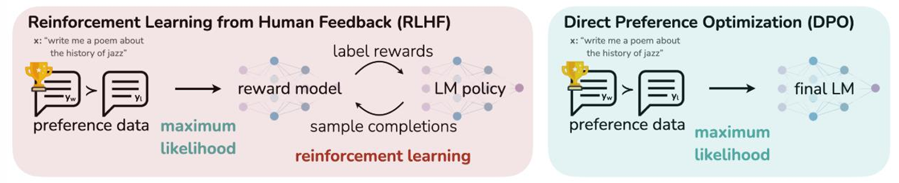

## [The RL Process](https://zhuanlan.zhihu.com/p/7461863937)  
  
Sample initial state from a prior distribution

$$
{s}_{0} \sim {p}_{0}\left(s\right)
$$

According to current env state, sample an action from a policy

$$
{\mathit{\alpha}}_{t} \sim {\mathit{\pi}}_{\mathit{\theta}}\left(s|{s}_{t}\right)
$$

Apply action on env, yielding new env state and corresponding reward. Since the process is a Markov decision process, next state only depends on previous state (Markov property)

$$
{s}_{t+1} \sim p\left(s|{\mathit{\alpha}}_{t},{s}_{t}\right)
$$

$$
{r}_{t}=R\left({s}_{t},{\mathit{\alpha}}_{t},{s}_{t+1}\right)
$$

After a rollout of interaction, the process outputs a trajectory of state-action and corresponding return

$$
\mathit{\tau}=\left({s}_{0},{\mathit{\alpha}}_{0},{s}_{1},{\mathit{\alpha}}_{1},\dots ,{s}_{T},{\mathit{\alpha}}_{T}\right)
$$

$$
R\left(\mathit{\tau}\right)=\sum _{t=0}^{T}{r}_{t}
$$

Avoid divergent return and control degree of reward across time, we use discount return

$$
R\left(\mathit{\tau}\right)=\sum _{t=0}^{T}{\mathit{\gamma}}^{t}{r}_{t},\ \ \mathit{\gamma}\in \left(0,\ 1\right)
$$

Also, the probability of such trajectory conditional on given policy

$$
p\left(\mathit{\tau}|{\mathit{\pi}}_{\mathit{\theta}}\right)={p}_{0}\left({s}_{0}\right)\prod _{t=0}^{T}p\left({s}_{t+1}|{s}_{t},{\mathit{\alpha}}_{t}\right)p\left({\mathit{\alpha}}_{t}|{s}_{t}\right)
$$

To learn a good policy, we want to maximize the total expected reward of policy on any trajectory

$$
\underset{{\mathit{\pi}}_{\mathit{\theta}}}{argmax}J\left({\mathit{\pi}}_{\mathit{\theta}}\right)
$$

$$
J\left({\mathit{\pi}}_{\mathit{\theta}}\right)={E}_{\mathit{\tau} \sim {\mathit{\pi}}_{\mathit{\theta}}}\left[R\left(\mathit{\tau}\right)\right]=\sum _{\mathit{\tau}}R\left(\mathit{\tau}\right)p\left(\mathit{\tau}|{\mathit{\pi}}_{\mathit{\theta}}\right)
$$

Following gradient ascend, it can be simplified as

$$
J\left({\mathit{\pi}}_{\mathit{\theta}}\right)={E}_{\mathit{\tau} \sim {\mathit{\pi}}_{\mathit{\theta}}}\left[\sum _{t=0}^{T}R\left(\mathit{\tau}\right)log{\mathit{\pi}}_{\mathit{\theta}}\left({\mathit{\alpha}}_{t}|{s}_{t}\right)\right]
$$

The optimization process involves adjust policy so that yielding larger return, but it's hard to catch the influence of return on each single step's decision, as  
  A good return doesn't mean each action performs perfectly. (similar to beam-search)  
  Simply maximize probability of action leading to largest immediate reward won't guarantee maximized return thus fail to promise good policy.  
A naïve idea is to find another measurement (Value Function) to estimate return of action at time step t, in such way can we maximize probability of action bringing **Expected** larger "return"

$$
J\left({\mathit{\pi}}_{\mathit{\theta}}\right)={E}_{\mathit{\tau} \sim {\mathit{\pi}}_{\mathit{\theta}}}\left[\sum _{t=0}^{T}{\mathrm{\Psi}}_{t}log{\mathit{\pi}}_{\mathit{\theta}}\left({\mathit{\alpha}}_{t}|{s}_{t}\right)\right]
$$

According to MDP property, the discount return at time step t can be (given determined trajectory)

$$
{G}_{t}=\sum _{{t}^{\prime}=t}^{T}{\mathit{\gamma}}^{t-{t}^{\prime}}{r}_{{t}^{\prime}}
$$

The Expected larger "return" means that across different trajectories, return of preferred action often greater than mean of that across different actions (with greater advantage)

$$
{\mathrm{\Psi}}_{t}={A}_{\mathit{\pi}}\left({s}_{t},{\mathit{\alpha}}_{t}\right)={Q}_{\mathit{\pi}}\left({s}_{t},{\mathit{\alpha}}_{t}\right)-{V}_{\mathit{\pi}}\left({s}_{t}\right)
$$

Action / value function is Expectation of discount return across trajectories

$$
{V}_{\mathit{\pi}}\left({s}_{t}\right)={E}_{\mathit{\pi}}\left[{G}_{t}|{s}_{t}\right]={E}_{{\mathit{\alpha}}_{t} \sim \mathit{\pi}\left(a|{s}_{t}\right)}\left[{E}_{{s}_{t+1} \sim p\left(s|{s}_{t},{a}_{t}\right)}\left[{r}_{t}+{V}_{\mathit{\pi}}\left({s}_{t+1}\right)\right]\right]
$$

$$
{Q}_{\mathit{\pi}}\left({s}_{t},{\mathit{\alpha}}_{t}\right)={E}_{\mathit{\pi}}\left[{G}_{t}|{s}_{t},{\mathit{\alpha}}_{t}\right]={E}_{{s}_{t+1} \sim p\left(s|{s}_{t},{a}_{t}\right)}\left[{r}_{t}+\mathit{\gamma}{V}_{\mathit{\pi}}\left({s}_{t+1}\right)\right]
$$

$$
{V}_{\mathit{\pi}}\left({s}_{t}\right)={E}_{{\mathit{\alpha}}_{t} \sim \mathit{\pi}\left(a|{s}_{t}\right)}\left[Q\left({s}_{t},{\mathit{\alpha}}_{t}\right)\right]
$$

$$
{A}_{\mathit{\pi}}\left({s}_{t},{\mathit{\alpha}}_{t}\right)={E}_{{s}_{t+1} \sim p\left(s|{s}_{t},{a}_{t}\right)}\left[{r}_{t}+\mathit{\gamma}{V}_{\mathit{\pi}}\left({s}_{t+1}\right)-{V}_{\mathit{\pi}}\left({s}_{t}\right)\right]
$$

Here, ${r}_{t}+\mathit{\gamma}{V}_{\mathit{\pi}}\left({s}_{t+1}\right)-{V}_{\mathit{\pi}}\left({s}_{t}\right)$ stands estimation of advantage, which is a random variable. ${r}_{t}+\mathit{\gamma}{V}_{\mathit{\pi}}\left({s}_{t+1}\right)$ is effective return at time step t (immediate reward + discount future return, both current and future reward were considered), ${V}_{\mathit{\pi}}\left({s}_{t}\right)$ is estimated return at time step t. [Advantage has smaller variance, good at stablizing training.](https://www.zhihu.com/question/344367451/answer/1891095552030115567)

$$
J\left({\mathit{\pi}}_{\mathit{\theta}}\right)=\underset{{\mathit{\pi}}_{\mathit{\theta}}}{argmax}{E}_{\mathit{\tau} \sim {\mathit{\pi}}_{\mathit{\theta}}}\left[\sum _{t=0}^{T}\left({r}_{t}+\mathit{\gamma}{V}_{\mathit{\pi}}\left({s}_{t+1}\right)-{V}_{\mathit{\pi}}\left({s}_{t}\right)\right)log{\mathit{\pi}}_{\mathit{\theta}}\left({\mathit{\alpha}}_{t}|{s}_{t}\right)\right]
$$

Maximization over different time step can be simplified as maximization on each time step (extra average over time, 1/T)

$$
\Rightarrow J\left({\mathit{\pi}}_{\mathit{\theta}}\right)=\underset{{\mathit{\pi}}_{\mathit{\theta}}}{argmax}{E}_{t}\left[\left({r}_{t}+\mathit{\gamma}{V}_{\mathit{\pi}}\left({s}_{t+1}\right)-{V}_{\mathit{\pi}}\left({s}_{t}\right)\right)log{\mathit{\pi}}_{\mathit{\theta}}\left({\mathit{\alpha}}_{t}|{s}_{t}\right)\right]
$$

To get its gradient , we need to model its function with learnable parameters (e.g. using Neural Network)  
  If only policy was modeled, it's a policy-based method, return can be evaluated after multi-round of trajectory sampling  
  If only value function was modeled, it's a value-based method, action can be chosen according to its value,  
  If both were modeled, it’s an actor-critic(value) method, return of action sampled from policy can be evaluated by value function, which in turn will be used to update policy, further new policy will required updated value function.  
  
Optimization objectives
Actor, learning policy, given fixed value function

$$
\underset{{\mathit{\pi}}_{\mathit{\theta}}}{argmax}J\left({\mathit{\pi}}_{\mathit{\theta}}\right)
$$

$$
J\left({\mathit{\pi}}_{\mathit{\theta}}\right)={E}_{t}\left[\left({r}_{t}+\mathit{\gamma}{V}_{\mathit{\phi}}\left({s}_{t+1}\right)-{V}_{\mathit{\phi}}\left({s}_{t}\right)\right)log{\mathit{\pi}}_{\mathit{\theta}}\left({\mathit{\alpha}}_{t}|{s}_{t}\right)\right]
$$

Critic, learning value function, given fixed policy

$$
\underset{{V}_{\mathit{\phi}}}{argmin}L\left({V}_{\mathit{\phi}}\right)
$$

$$
L\left({V}_{\mathit{\phi}}\right)={E}_{t}\left[{\left({r}_{t}+\mathit{\gamma}{V}_{\mathit{\phi}}\left({s}_{t+1}\right)-{V}_{\mathit{\phi}}\left({s}_{t}\right)\right)}^{2}\right]
$$

### Optimization Issues
1. Each optimization process requires multiple round of trajectory sampling, which is slow and at risk of large variance samples may misguide learning. And the costly sampling only update models once.
2. Generally, return evaluated from value function is biased (variance-bias trade-off)
### Solution: PPO
#### For issue 1: [importance sampling](https://1drv.ms/o/c/276cf4f2e18c3166/EmYxjOHy9GwggCdzAgAAAAAB6fDrDuRs-oHUmzbGW8JBhw?wd=target%28Blog.one%7C7C05A5A2-335F-4120-B309-F2C7D1ABD289%2FSampling%20Method%7C4F341C3A-CF66-4855-B9B3-DA4571AC8699%2F%29&wdpartid=%7b1088E25E-311D-07C3-0397-93DC717CFA97%7d%7b1%7d&wdsectionfileid=276CF4F2E18C3166!4466)  
  Off-policy: Reuse sampled trajectories multiple times to get iteratively updated policies: ${\mathit{\pi}}_{{\mathit{\theta}}_{1}},{\mathit{\pi}}_{{\mathit{\theta}}_{2}},\dots ,{\mathit{\pi}}_{{\mathit{\theta}}_{k}}$
  Since update new policy with old data equivalents to estimate objective with new policy on samples from old one, thus an importance weight was need

$$
{E}_{x \sim p\left(x\right)}\left[f\left(x\right)\right]={E}_{x \sim q\left(x\right)}\left[\frac{p\left(x\right)}{q\left(x\right)}f\left(x\right)\right]
$$

$$
\Rightarrow J\left({\mathit{\pi}}_{\mathit{\theta}}\right)=\underset{\mathit{\tau} \sim {\mathit{\pi}}_{{\mathit{\theta}}_{old}}}{{E}_{t}}\left[\frac{{\mathit{\pi}}_{\mathit{\theta}}\left({a}_{t}|{s}_{t}\right)}{{\mathit{\pi}}_{{\mathit{\theta}}_{old}}\left({a}_{t}|{s}_{t}\right)}\left({r}_{t}+\mathit{\gamma}{V}_{\mathit{\phi}}\left({s}_{t+1}\right)-{V}_{\mathit{\phi}}\left({s}_{t}\right)\right)log{\mathit{\pi}}_{\mathit{\theta}}\left({\mathit{\alpha}}_{t}|{s}_{t}\right)\right]
$$

  But the diversity between new and old policies still necessitate more sampling, a remedy is to keep new policy close to old one
  e.g. add constraint of KL-divergent between old and new policies

$$
J\left({\mathit{\pi}}_{\mathit{\theta}}\right)=\underset{\mathit{\tau} \sim {\mathit{\pi}}_{{\mathit{\theta}}_{old}}}{{E}_{t}}\left[\frac{{\mathit{\pi}}_{\mathit{\theta}}\left({a}_{t}|{s}_{t}\right)}{{\mathit{\pi}}_{{\mathit{\theta}}_{old}}\left({a}_{t}|{s}_{t}\right)}\left({r}_{t}+\mathit{\gamma}{V}_{\mathit{\phi}}\left({s}_{t+1}\right)-{V}_{\mathit{\phi}}\left({s}_{t}\right)\right)log{\mathit{\pi}}_{\mathit{\theta}}\left({\mathit{\alpha}}_{t}|{s}_{t}\right)-\mathit{\beta}KL\left({\mathit{\pi}}_{\mathit{\theta}}\left({a}_{t}|{s}_{t}\right)|{\mathit{\pi}}_{{\mathit{\theta}}_{old}}\left({a}_{t}|{s}_{t}\right)\right)\right]
$$

  Bound new policy and new value function in nearby region of old one

$$
J\left({\mathit{\pi}}_{\mathit{\theta}}\right)={E}_{t}\left[min\left[{r}_{t}\left(\mathit{\theta}\right){A}_{\mathit{\phi}}\left({s}_{t},{\mathit{\alpha}}_{t}\right),clip\left({r}_{t}\left(\mathit{\theta}\right),1-\mathit{\epsilon},1+\mathit{\epsilon}\right){A}_{\mathit{\phi}}\left({s}_{t},{\mathit{\alpha}}_{t}\right)\right]\right]
$$

$$
{r}_{t}\left(\mathit{\theta}\right)=\frac{{\mathit{\pi}}_{\mathit{\theta}}\left({a}_{t}|{s}_{t}\right)}{{\mathit{\pi}}_{{\mathit{\theta}}_{old}}\left({a}_{t}|{s}_{t}\right)}
$$

$$
\nabla f(x) = f(x) \nabla \log f(x), \quad \text{Thus we can remove } \log \pi_\theta(\alpha_t \mid s_t)
$$

$$
L\left({V}_{\mathit{\phi}}\right)={E}_{t}\left[max\left[{\left({V}_{\mathit{\phi}}^{new}\left({s}_{t}\right)-{R}_{t}\right)}^{2},{\left({V}_{\mathit{\phi}}^{CLIP}\left({s}_{t}\right)-{R}_{t}\right)}^{2}\right]\right]
$$

$$
{V}_{\mathit{\phi}}^{CLIP}=clip\left({V}_{\mathit{\phi}}^{new},{V}_{\mathit{\phi}}^{old}-\mathit{\epsilon},{V}_{\mathit{\phi}}^{new}+\mathit{\epsilon}\right)
$$

$$
{R}_{t}={A}_{\mathit{\phi}}\left({s}_{t},{\mathit{\alpha}}_{t}\right)+{V}_{\mathit{\phi}}^{old}={r}_{t}+\mathit{\gamma}{V}_{\mathit{\phi}}^{old}\left({s}_{t+1}\right)+\mathit{\gamma}\mathit{\lambda}{A}_{\mathit{\phi}}\left({s}_{t+1},{\mathit{\alpha}}_{t+1}\right),\ if\ use\ GAE
$$

  Sine ${A}_{\mathit{\phi}}\left({s}_{T+1},{\mathit{\alpha}}_{T+1}\right)=0$ , advantage at different time step can be computed using dynamic programming
#### For issue 2: GAE
  To reduce bias of value function, we may take more sampled reward into account

$$
{r}_{t}+\mathit{\gamma}{V}_{\mathit{\phi}}\left({s}_{t+1}\right)-{V}_{\mathit{\phi}}\left({s}_{t}\right)=\sum _{l=0}^{\infty}{\mathit{\gamma}}^{l}{r}_{t+l}-{V}_{\mathit{\pi}}\left({s}_{t}\right)
$$

  But which will introduce more variance, since ${\mathrm{r}}_{t}$ is random variable

$$
Var\left({r}_{t}\right)\to Var\left({r}_{t}+{r}_{t+1}+\dots \right)
$$

  GAE introduce a balance hyperparameter to control bias-variance trade-off

$$
{A}_{\mathit{\phi}}\left({s}_{t},{\mathit{\alpha}}_{t}\right)=\sum _{l=0}^{\infty}{\left(\mathit{\gamma}\mathit{\lambda}\right)}^{l}{\mathit{\delta}}_{t+l},\ \ {\mathit{\delta}}_{t}={r}_{t}+\mathit{\gamma}{V}_{\mathit{\phi}}\left({s}_{t+1}\right)-{V}_{\mathit{\phi}}\left({s}_{t}\right)
$$

  With smaller $\mathit{\lambda}$, comes greater bias, vice versa
  Recall that return of current time step includes immediate reward and future one, so is GAE advantage, controlled by $\mathit{\lambda}$

$$
{A}_{\mathit{\phi}}\left({s}_{t},{\mathit{\alpha}}_{t}\right)=\left({r}_{t}+\mathit{\gamma}{V}_{\mathit{\phi}}\left({s}_{t+1}\right)-{V}_{\mathit{\phi}}\left({s}_{t}\right)\right)+\mathit{\gamma}\mathit{\lambda}{A}_{\mathit{\phi}}\left({s}_{t+1},{\mathit{\alpha}}_{t+1}\right)
$$

-----  
## [RLHF](https://zhuanlan.zhihu.com/p/677607581)  

### Mapping RL concept on NLP entity  
Action: next predicted token $\alpha_t$, action set = vocabulary  
State: input prompt($s_0$) + generated output (tokens) (${\mathrm{s}}_{t+1}=\left[{s}_{t},{\mathit{\alpha}}_{t}\right]$)  
Agent/policy/actor: (SFT) LLM, ${\mathit{\pi}}_{\mathit{\theta}}\left({a}_{t}|{s}_{t}\right)$  
Reward model: human rank preference, predict immediate reward at time step t

$$
\left\{\begin{array}{c}{r}_{t}=-k{l}_{ctl}log\frac{{\mathit{\pi}}_{\mathit{\theta}}\left({a}_{t}|{s}_{t}\right)}{{\mathit{\pi}}_{{\mathit{\theta}}_{ref}}\left({a}_{t}|{s}_{t}\right)},\ \ t\ne T\\ {r}_{t}=-k{l}_{ctl}log\frac{{\mathit{\pi}}_{\mathit{\theta}}\left({a}_{t}|{s}_{t}\right)}{{\mathit{\pi}}_{{\mathit{\theta}}_{ref}}\left({a}_{t}|{s}_{t}\right)}+{r}_{t},\ \ t=T\end{array}\right.
$$

  Only reward at last time step was used, as it represent reward for complete conversation (prompt + response). While reward at other time step evaluated by reference constraint (deepseed-chat)
  Note that reward at different time step can be customized  
  BT(Bradley-Terry) model: for a given prompt, we generate 2 responses, which will be ranked manually, the reward model should have reward at rank 1 greater than rank 2  
  PT(Plackett-Luce) model reward: the reward model should have greater reward at provided rank than any others    
Reference model: (SFT) LLM constraint actor through KL divergent,
Critic (Value) model: predict return of specific time step t
### Optimization objectives
  
Actor loss

$$
J\left({\mathit{\pi}}_{\mathit{\theta}}\right)={E}_{t}\left[min\left[{r}_{t}\left(\mathit{\theta}\right){A}_{\mathit{\phi}}\left({s}_{t},{\mathit{\alpha}}_{t}\right),clip\left({r}_{t}\left(\mathit{\theta}\right),1-\mathit{\epsilon},1+\mathit{\epsilon}\right){A}_{\mathit{\phi}}\left({s}_{t},{\mathit{\alpha}}_{t}\right)\right]\right]
$$

Critic loss

$$
L\left({V}_{\mathit{\phi}}\right)={E}_{t}\left[max\left[{\left({V}_{\mathit{\phi}}^{new}\left({s}_{t}\right)-{R}_{t}\right)}^{2},{\left({V}_{\mathit{\phi}}^{CLIP}\left({s}_{t}\right)-{R}_{t}\right)}^{2}\right]\right]
$$

### Issues of PPO  
- Complicated implementation
- Memory hungry, search of hyper-param, unstable training
- Additional training of reward model, value model  
## [Advance solution: DPO](https://zhuanlan.zhihu.com/p/721073733)  

Get rid of reward model and on-policy stuff, directly align preferred data in SFT like way
- Gradient ascend on good stuff
- Gradient descend on bad stuff(appropriately weighted)
Alignment goal (both PPO and DPO)

$$
\underset{{\mathit{\pi}}_{\mathit{\theta}}}{max}{E}_{x~D,y~{\mathit{\pi}}_{\mathit{\theta}}}\left[r\left(x,y\right)\right]-\mathit{\beta}{\mathbb{D}}_{KL}\left({\mathit{\pi}}_{\mathit{\theta}}\left(y|x\right)\left|\right|{\mathit{\pi}}_{{\mathit{\theta}}_{ref}}\left(y|x\right)\right)
$$

x is prompt ${\mathrm{s}}_{0}$, y is generated response ${\mathit{\alpha}}_{0},{\mathit{\alpha}}_{1},\dots ;\ $ r(x, y) is trained reward model, which will be turned into a implied model in DPO by link ${\mathit{\pi}}_{\mathit{\theta}},{{\mathit{\pi}}_{\mathit{\theta}}}_{ref},r\left(x,y\right)$ in closed form. (By reorganize objective as a KL divergent between policy and ref policy with specific reward, since we will train policy to align preferred data of it)

$$
{\mathit{\pi}}_{\mathit{\theta}}\left(y|x\right)={\mathit{\pi}}_{\mathit{\theta}}^{\ast}\left(y|x\right)=\frac{1}{Z\left(x\right)}{\mathit{\pi}}_{{\mathit{\theta}}_{ref}}\left(y|x\right)exp\left(\frac{1}{\mathit{\beta}}r\left(x,y\right)\right)
$$

Reward model become an implied model parameterized by policy

$$
r\left(x,y\right)=\mathit{\beta}log\frac{{\mathit{\pi}}_{\mathit{\theta}}\left(y|x\right)}{{\mathit{\pi}}_{{\mathit{\theta}}_{old}}\left(y|x\right)}+\mathit{\beta}logZ\left(x\right)
$$

Next, we replace it back into Alignment goal which later can directly train on preference-ranked data
### Training on BT model

$$
D={\left\{{x}^{i},{y}_{w}^{i},{y}_{l}^{i}\right\}}_{i=1}^{N},w=chosen,\ l=reject
$$

We hope reward on chosen greater than that on reject

$$
loss\left({r}_{\mathit{\theta}}\right)=-{E}_{x,{y}_{w},{y}_{l}~D}\left[log\mathit{\sigma}\left(r\left(x,{y}_{w}\right)-r\left(x,{y}_{l}\right)\right)\right]
$$

Replace implied reward model back in

$$
loss\left({\mathit{\pi}}_{\mathit{\theta}};{\mathit{\pi}}_{{\mathit{\theta}}_{ref}}\right)=-{E}_{x,{y}_{w},{y}_{l}~D}\left[log\mathit{\sigma}\left(\mathit{\beta}log\frac{{\mathit{\pi}}_{\mathit{\theta}}\left({y}_{w}|x\right)}{{\mathit{\pi}}_{{\mathit{\theta}}_{ref}}\left({y}_{w}|x\right)}-\mathit{\beta}log\frac{{\mathit{\pi}}_{\mathit{\theta}}\left({y}_{l}|x\right)}{{\mathit{\pi}}_{{\mathit{\theta}}_{ref}}\left({y}_{l}|x\right)}\right)\right]
$$

### Training on PT model

$$
D={\left\{{x}^{i},{y}_{1}^{i},\dots ,{y}_{K}^{i}\right\}}_{i=1}^{N},\ rank\ combination=\mathit{\tau}
$$

We hope reward on rank combination greater than any others, $\mathit{\tau}\left(k\right)$ is greatest in $\mathit{\tau}\left(k\right)$ to $\mathit{\tau}\left(K\right)$

$$
p\left(\mathit{\tau}|{y}_{1},\dots ,{y}_{K},x\right)=\prod _{k=1}^{K}\frac{exp\left(r\left(x,{y}_{\mathit{\tau}\left(k\right)}\right)\right)}{\sum _{j=k}^{K}exp\left(r\left(x,{y}_{\mathit{\tau}\left(j\right)}\right)\right)}
$$

$$
loss\left({r}_{\mathit{\theta}}\right)=-{E}_{x,{y}_{1},\dots ,{y}_{K}~D}\left[logp\left(\mathit{\tau}|{y}_{1},\dots ,{y}_{K},x\right)\right]
$$

Replace implied reward model back in

$$
loss\left({\mathit{\pi}}_{\mathit{\theta}};{\mathit{\pi}}_{{\mathit{\theta}}_{ref}}\right)=-{E}_{x,{y}_{1},\dots ,{y}_{K}~D}\left[log\prod _{k=1}^{K}\frac{exp\left(\mathit{\beta}log\frac{{\mathit{\pi}}_{\mathit{\theta}}\left({y}_{\mathit{\tau}\left(k\right)}|x\right)}{{\mathit{\pi}}_{{\mathit{\theta}}_{ref}}\left({y}_{\mathit{\tau}\left(k\right)}|x\right)}\right)}{\sum _{j=k}^{K}exp\left(\mathit{\beta}log\frac{{\mathit{\pi}}_{\mathit{\theta}}\left({y}_{\mathit{\tau}\left(j\right)}|x\right)}{{\mathit{\pi}}_{{\mathit{\theta}}_{ref}}\left({y}_{\mathit{\tau}\left(j\right)}|x\right)}\right)}\right]
$$

### Issues of DPO
- Data not inherently pairwise (has obvious partial order), ranking it cost a lot and at risk of overfitting
- Offline
New kid on the block: GRPO, [code](https://github.com/McGill-NLP/nano-aha-moment)
- Start with PPO (many parts are similar)
- Remove the value function / advantage computation
- Calculate the advantage as “z-score within group” (normalized rewards across batch / group)

$$
{A}_{i}^{\left(t\right)}=\frac{{r}_{i}^{\left(t\right)}-mean\left(\left\{{r}_{1}^{\left(t\right)},\dots ,{r}_{G}^{\left(t\right)}\right\}\right)}{std\left(\left\{{r}_{1}^{\left(t\right)},\dots ,{r}_{G}^{\left(t\right)}\right\}\right)}
$$

Has smaller variance of advantage than PPO

Recall that the PPO objective can be generalized to include a comparison of the action value to an arbitrary baseline $\mathrm{b}\left(s\right)$

$$
J\left({\mathit{\pi}}_{\mathit{\theta}}\right)={E}_{\mathit{\tau}~{\mathit{\pi}}_{\mathit{\theta}}}\left[R\left(\mathit{\tau}\right)\right]=\sum _{\mathit{\tau}}\left({Q}_{\mathit{\pi}}\left({s}_{t},{\mathit{\alpha}}_{t}\right)-{V}_{\mathit{\pi}}\left({s}_{t}\right)\right)p\left(\mathit{\tau}|{\mathit{\pi}}_{\mathit{\theta}}\right)
$$

$$
\Rightarrow \sum _{\mathit{\tau}}\left({Q}_{\mathit{\pi}}\left({s}_{t},{\mathit{\alpha}}_{t}\right)-b\left(s\right)\right)p\left(\mathit{\tau}|{\mathit{\pi}}_{\mathit{\theta}}\right)
$$

As long as baseline does not vary with action, and only depend on state, while division by the stdev term in GRPO violating a unbiased baseline by
- Upweights too easy or hard questions, as they both have rewards with small variance (either all high reward or all low)
- Response-level length bias, note that the objective simplified as simple step version will average over length of response.
For positive advantage, this bias results in shorter response, causing policy prefers shorter correct answer

$$
{A}_{i}^{\left(t\right)}>0,T\downarrow \to \frac{{A}_{i}^{\left(t\right)}}{T}\uparrow 
$$

For negative advantage, this bias results in longer response, causing policy chose longer response among incorrect ones

$$
{A}_{i}^{\left(t\right)}<0,T\uparrow \to \frac{{A}_{i}^{\left(t\right)}}{T}\uparrow 
$$

That leads to unbiased-gradient version of GRPO (without normalization along time steps)

$$
{A}_{i}^{\left(t\right)}={r}_{i}^{\left(t\right)}-mean\left(\left\{{r}_{1}^{\left(t\right)},\dots ,{r}_{G}^{\left(t\right)}\right\}\right)
$$

Verifiable reward (more interpretable, rule-based reward, less noise), e.g. math / code format reward, language consistent reward
