**Start Over: Redefinition of Number System**  
It's important to axiomatically define Number System, instead of constructing them.
i.e. we don’t create their physical image or any essence they should connect to the real world, like, what are they made of? are they attachment to physical conception ?
We extract them from the natural world and generalize them to an abstract form by only describing properties and operations related.
As the old quote goes: one is the child of the divine law, after one come two, after two come three, after three come all things. So we can define any complex derivative from its simple origin
The process of redefinition of number system is to slowly fill every spot on the number axis

  
n is result after recursively applying increment on 0

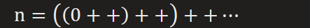

  
So we need to exclude numbers violating properties of natural numbers

  
All natural numbers have their properties **consistently followed** with 0(its predecessor)

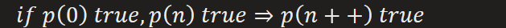

**Addition of Natural Number**  
Base on axioms 1 to 5, we now can recursively define sequence
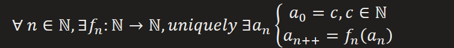

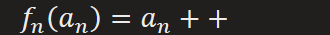

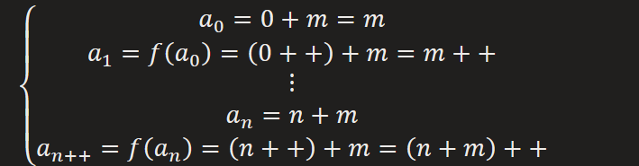  
Definition of addition has same form as induction (Peano axiom 5)
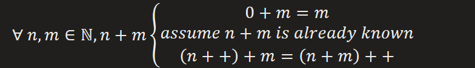  
Properties : All can be proved by following the same pattern as Induction
\(1\) commutative law

Informal Proof

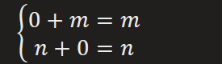

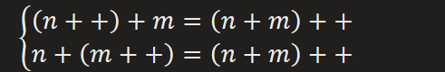  
\(2\) associative law
  
\(3\) elimination law
  
Order built on addition
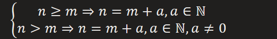

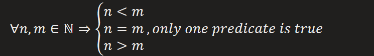  
Note that order is a shared property among entities
i.e. an entity can be ordered only when it can be bounded by other entities
For Natural Number, we can find that:

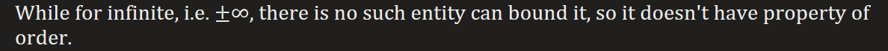  
So it is for the order definition in Integer, proportional number and real number, their order all build on in such way.

Order + Peano axiom 5 = Strong Induction
  
e.g. converge of series

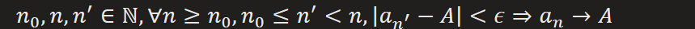

**Multiplication of Natural Number**  
Follow the same thoughts as did in defining addition, we can define multiplication
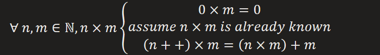
Properties :
\(1\) commutative law

Informal Proof

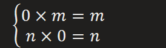

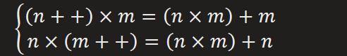  
\(2\) distributive law
  
\(3\) associative law
  
\(4\) order preservation
  
\(5\) elimination law
  
**Euclidean Algorithm**: represent number with combination of addition and multiplication  

  
**Exponential Operation** of Natural Number  
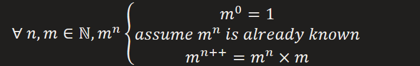

**Set**  
We now can generalize the **natural number set** into more abstract one  
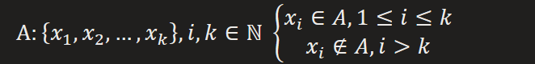  
Axioms of equality on class T
\(1\) reflexive
  
\(2\) symmetric
  
\(3\) transitive
  
\(4\) substitutive

  
**Zermelo-Fraenkel axiom 1**: identity of set  

Note: That means set itself can be an element of another set

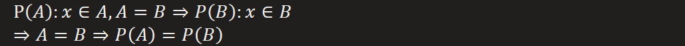

  
**Why? Operation following substitutive is a successfully defined one**  

**Zermelo-Fraenkel axiom 2**: origin of a set, empty set  
Any set exist at the contrast to empty set

**Zermelo-Fraenkel axiom 3**: basic unique sets, for constructing bigger set  

**Zermelo-Fraenkel axiom 4**: Dual Union operation, method for constructing bigger set
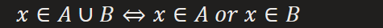

**And it follows substitutive**  

\(1\) commutative ; (2) associative ;

**Subset** can be derived from Dual Union operation  

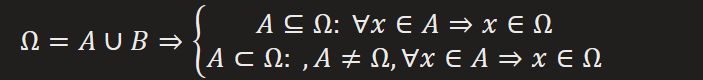

Subset implicates relationship of **order**  

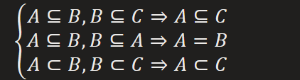

**Zermelo-Fraenkel axiom 5: Separation axiom,** constructing subset from a big set  

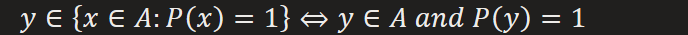

We can use it to define **Intersection** and **Difference**  

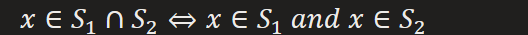

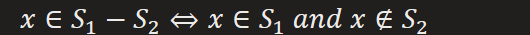

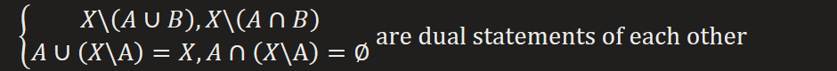

But for now, we are only circle around inside a set, to jump out of a set into another form of set, we need more powerful axiom

**Zermelo-Fraenkel axiom 6: Replacement axiom**  

We use **Separation axiom** to tease out subset and transform its elements into new form by **Replacement axiom**  

Connection between Replacement and Separation

**Replacement axiom** can be seen as **Separation axiom** of Set y belong to

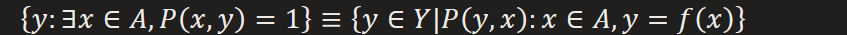

**Zermelo-Fraenkel axiom 7: Infinite Set, Specialize to Natural Number Set**  

Actually, axiom 1 to 7 can generalize to a generalization of Separation Axiom

**Zermelo-Fraenkel axiom 8: axiom comprehension, Universal Separation axiom**  

Russell Paradox: Axiom 8 failed under such property

Proof:

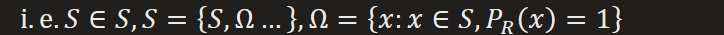

**Zermelo-Fraenkel axiom 9: foundation axiom, regularity, patch for axiom 8**  
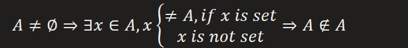

Now function can be defined as mapping between sets

And Again!, it has to follow the **law of substitutive**  

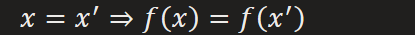

Properties of function can be derived from axioms of set
\(1\) equality
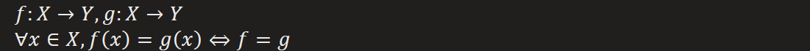
\(2\) compound
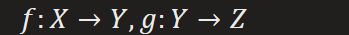

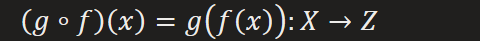
\(3\) injective
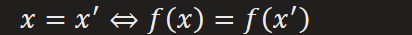
\(4\) surjective

\(5\) bijective = injective & surjective

**How big is a Set**:  
Cardinal of set is defined by a bijective function(it's similar to count number from 1 to n)
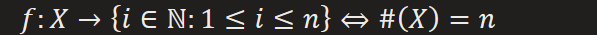

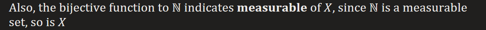

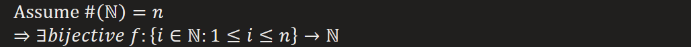

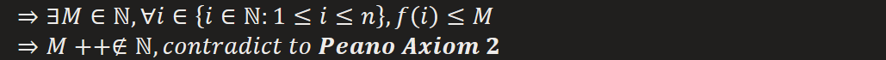
Equality of Cardinal

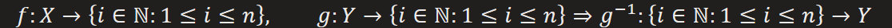

**Zermelo-Fraenkel axiom 10: power set, set of functions**  
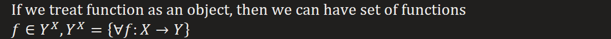

**Zermelo-Fraenkel axiom 11: Union, for constructing way larger set**  
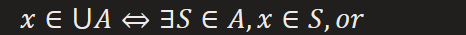

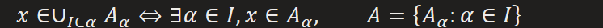

**Integer Set**  
Integer is a generalization of Natural Number, as subtraction result between two natural numbers  

— is a placeholder for subtraction, since subtraction result directly on natural number is problematic--they can not represent as natural number, so it can only be defined on integer.

And we can not define subtraction between integers without firstly declaring it, which is subtraction result between natural numbers. In case of recurrent definition, a placeholder is needed.

Now our simple idea is to define Integer as an analogy to natural number with all the axioms and operations we already testified
\(1\) identity (equality), follow substitutive  
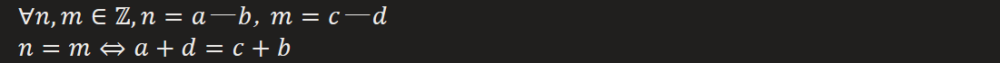  
\(2\) addition, follow substitutive  
  
\(3\) multiplication, follow substitutive  
  
\(4\) negative, follow substitutive  
  
\(5\) trichofomy, if and only one holds  

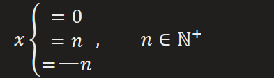  
\(6\) base on definition of **negative**, now we can define subtraction between integers  
  

Generalization of Natural Number  
Order, we can redefine order with subtraction

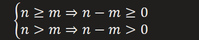

order preservation with negative operation

Integer fill symmetric part for Natural Number on the left side of 0 by subtraction
Now any property of natural number is compatible with integer, so any natural number is a integer, we complete the construction of integer(added with subtraction)

**Proportional Number Set**  
Proportional Number is a generalization of Integer, as division result between two Integers  

// is a placeholder for division, since definition of division base on definition of Proportional number.

And we can not define division between proportional numbers without firstly declaring it, which is division result between integers. In case of recurrent definition, a placeholder is needed.
Now our simple idea is to define Proportional number as an analogy to Integer with all the axioms and operations we already testified
\(1\) identity (equality), follow substitutive  
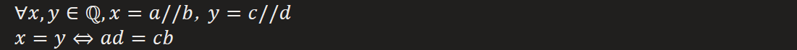  
\(2\) addition, follow substitutive  
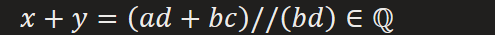  
\(3\) multiplication, follow substitutive  
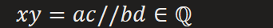  
\(4\) negative, follow substitutive  
  
\(5\) inverse, follow substitutive  

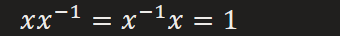  
\(6\) base on definition of **inverse**, now we can define division between proportional numbers  
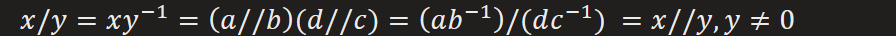

  
\(7\) trichofomy, if and only one holds  

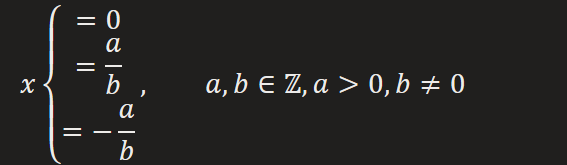  
\(8\) absolute value can be built upon negative operation  

  
Distance can be built upon absolute operation and subtraction  
  
It can be used to measure how close are two proportional numbers  

Generalization of Integer  

exponential operation

order preservation with exponential operation

  
Now any property of integer is compatible with proportional number, so any integer is a proportional number, we complete the construction of proportional number(added with division and absolute operation)

Any two Integers are separated by a proportional number

There's huge empty space between two integers, proportional number fill it by division

Any two proportional numbers are separated by a proportional number

**Is there exist empty space between two proportional numbers** ?  

Void between proportional numbers  

Proof:

But a sequence infinitely decreasing is not exist, since we can always have

**Real Number Set**  
**An instance of complete measure space, the idea behind generalization from Proportional Number to Real Number will be useful when defining a Hilbert Space**  
Real Number is a generalization of Proportional Number, as a limit of a **Cauchy sequence** on Proportional Number
Sequence  
  
Bounded Sequence  

Obviously, Cauchy Sequence is also a Bounded Sequence
Limit of Cauchy Sequence

And we can not define Limit of real number without firstly declaring it, which is limit of a real number sequence. In case of recurrent definition, a placeholder is needed.  
Now our simple idea is to define Real Number as an analogy to Proportional one with all the axioms and operations we've been already testified  
  
\(1\) identity (equality) of Cauchy Sequence, follow substitutive  

  
\(2\) addition, follow substitutive  
  
\(3\) multiplication, follow substitutive  
  
\(4\) negative, follow substitutive  
  
\(5\) subtraction, follow substitutive  
  
\(5\) inverse, follow substitutive  
Constraint away from 0

For detailed proof please refer to **"Tao Real Analysis" 5.3.14**  

  
\(6\) division, follow substitutive  
  
\(7\) trichofomy, if and only one holds  
But first, we need to constraint sequence positive or negative away from 0

We can always extract sub sequence constraint away from 0

Now we can inherent the rest of operations and properties from proportional number without changes  
(8\*) **completeness**  
A complete closed set has its Cauchy sequence and limits inside the set

e.g.

positive real number set is an uncomplete open set

Non-Negative real number set is an complete closed set

Inference

  
\(9\) order  
Real number can be bounded with proportional numbers(proof???)

Inference : archimedean property, order between real numbers

For now, we can confidently say that any type of number in axis can be bounded with arbitrary types of number.

i.e. any number in the axis can be bounded by any type of number in axis, so they all can be ordered.  
\(10\) supremum&infmum  

For proof please refer to **"Tao. Real Analysis 5.5.9"** base on archimedean property

Now we can prove that only real number than proportional number can be solution of

Generalization

Further

  
\(11\) base on definition of **supremum&infmum**, now we can define **limit** of real number sequence
Cauchy Sequence on real number

Since any real number is bounded by proportional numbers, so it is compatible with Cauchy Sequence on proportional number

Proof: assume that

Now any property of proportional number is compatible with real number, so any proportional number is a real number, we complete the construction of real number(added with limit operation)
