***Introduction***  
*Idea of solving linear regression problem*
*Regression problem always require fitting on points, but in reality, fitting the exact point is unfeasible, since the turbulance of noise or random error when sampling.*
*So it's natural to switch to fitting a softer target, an area around the sample points. May yield a better and feasible solution.*
*You may already seen similar thoughts in SVM, which named slack variables. Or a threshold controling convergence on simple method of linear regression, or a probabilistic parameter called precison, i.e. inversion of variance.*
Note : the relationship between x and y may only involve numerical, the cause-and-result may not always true

***Definition***  
  
Estimate (Hypothesis Space)  
  
Assumption

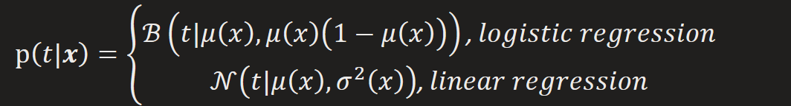  
base on maxilikelihood assumption  

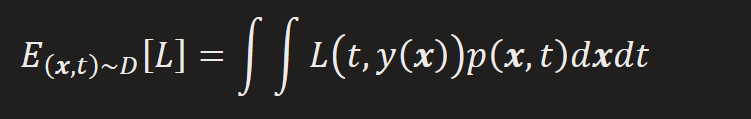

*Question: The idea behind the target form?*
*In classification, loss is a evaluation of decision, i.e a cost of specific behave*  
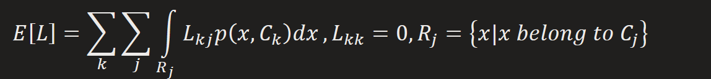  
*The cost when x belong to class k, while was distributed to class j*  
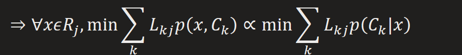

  
*why L2 loss? It's a assumption of Gaussian Distribution*  
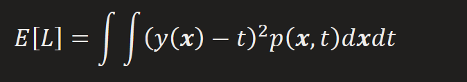
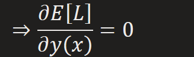
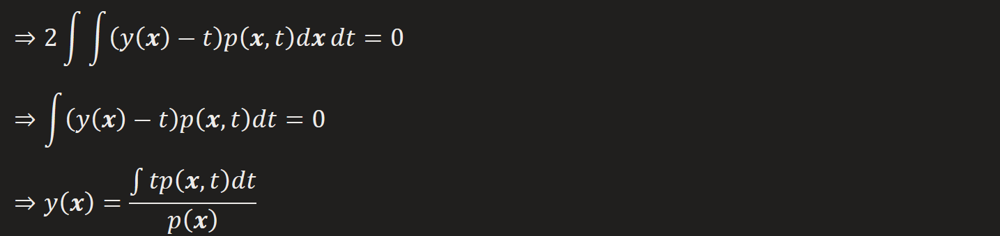
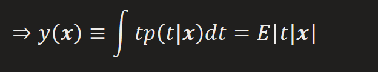
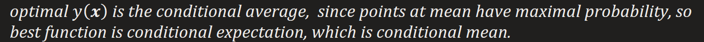

*we can see the component of error*  
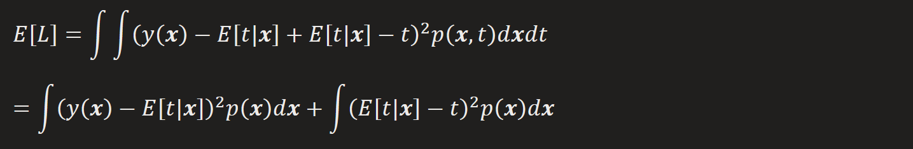

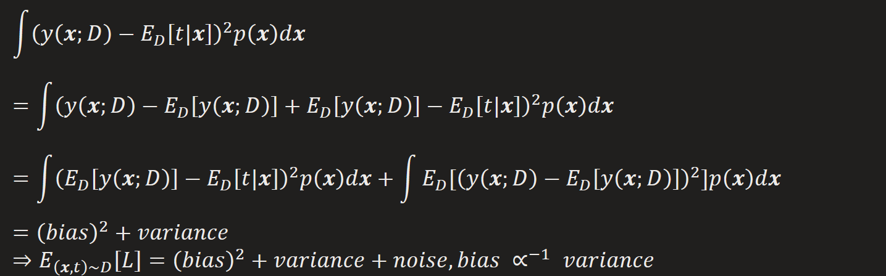  
*bias: the distance between predicted model and desired model*  
|  | *model complexity* | *data storage* |
|----|----|----|
| *bias* |  |  |
| *variance* |  |  |
| *bias -variance* |  |  |
*(1)control by number of basis functions*

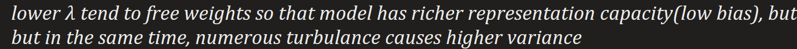
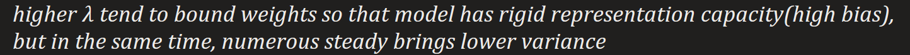  
***But a perfect model, always contains large number of basis function with matched regularization***  

***Linear function(Linear Hypothesis Space)***  
  
Assumption:genration of data  
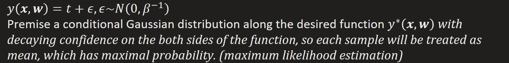

  
*a threshold controling convergence.*  

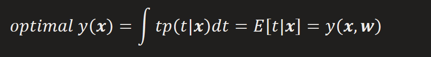

*under log-maxlikelihood*
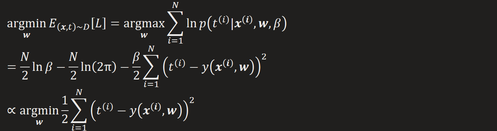

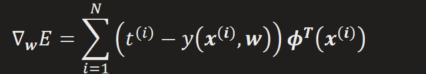  
*(1) batch techniques : least square method*  

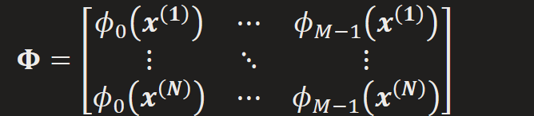

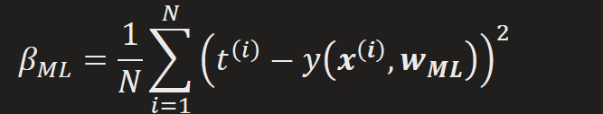

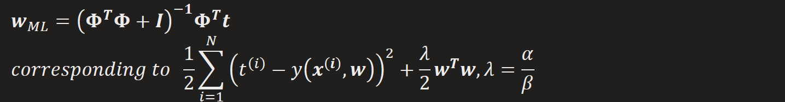
*a [regularization](onenote:#Regularization&section-id={206D0DBC-E353-4C40-ABB7-20922DEC5824}&page-id={74105814-BC3B-473C-908D-0AEB72711C85}&object-id={5DB304C5-ED6B-07BD-3264-4A7AC3D63882}&12&base-path=https://d.docs.live.net/276cf4f2e18c3166/文档/寿枫%20的笔记本/机器学习.one) term was added*  
*Note: In words co-occurence matrix, a assumption that each word at least appear once*
*was introduced, in case of dividing by zero*

*(2) sequential learning : gradient descent for each data point*  
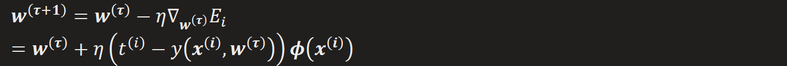

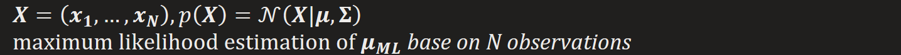
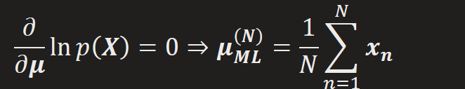  
*convert to a sequential way*  
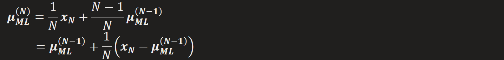

*Stochastic approximation*
*Robbins-Monro Algorithm (todo): a generalization of sequential way aforementioned*
*a sequential estimation to find root point for unknown function*  
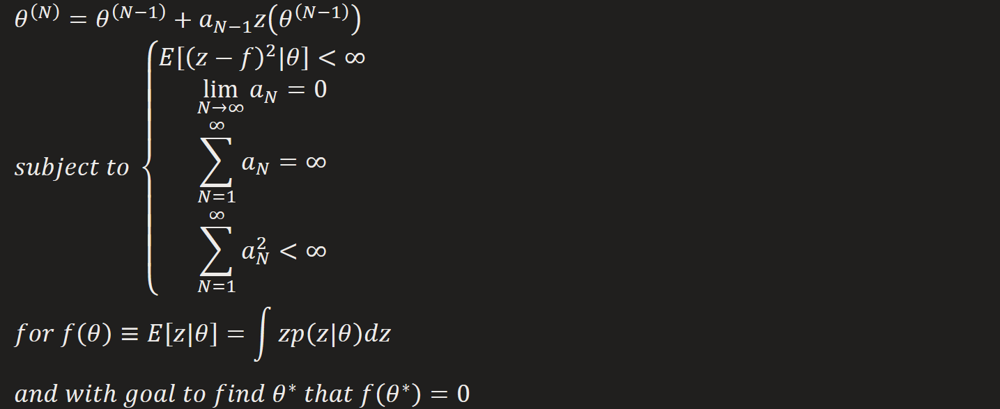
  
*provide a support for convergence with probability one*

***Bayesian Linear Regression***  

Support idea: If two sets of variables are jointly Gaussian——[conjugate prior](https://towardsdatascience.com/conjugate-prior-explained-75957dc80bfb)  
1.  then the conditional distribution of one set conditioned on the other is again Gaussian, and **it's mean is a linear function of prior's mean**  
2.  the marginal distribution of either set is also Gaussian

Key-representation of proof:  
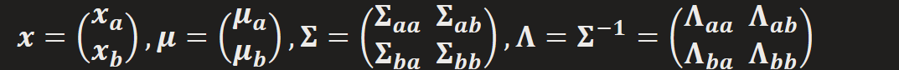
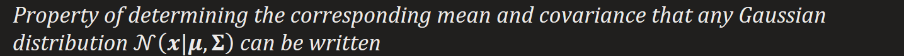
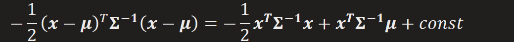

*Result:*  
*Given a marginal Gaussian distribution and a conditional one*  
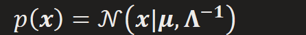
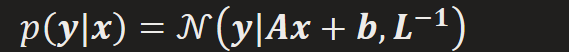  
*Yield the one switching on random variables*  
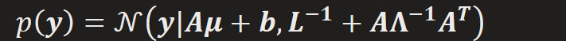
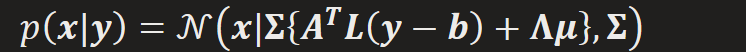

  
*Given*  
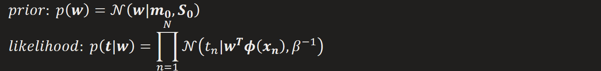  
*Yield*  

  
*Relation to Maximum Likelihood estimation*  

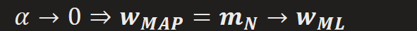

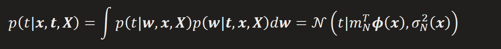  
*proof: analogyous of*

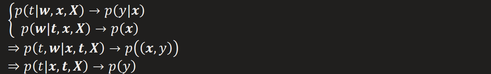

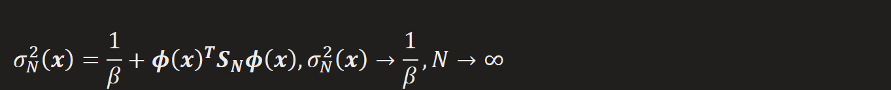

*variance = noise + uncertainty of **w***

*which means, provided enough data, the prediction's variance will be*

*converged as the variance of noise imposed on generation of data*

*proof:*

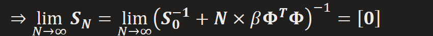

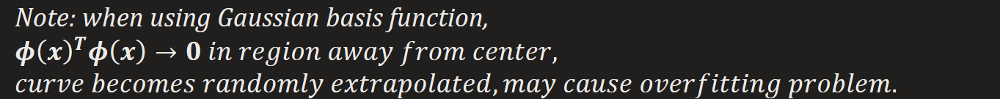

*Training procedure*  
1.  

2.  
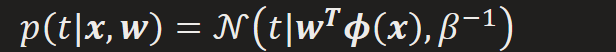

*Note: it works in the same way with dozen data points*

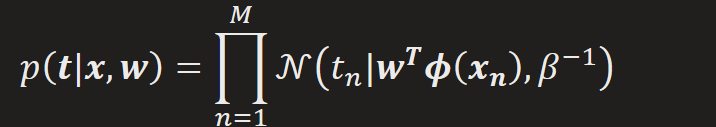
3.  
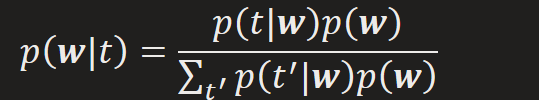

*Note : Complex calculation can be eased by using conjugate prior*

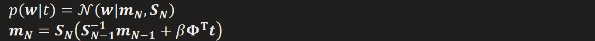

*And use it as prior on **w** on next iteration*

*go to step 1*
