*Bayes MAP on weights*  
*with an regularized term over weights : an introducion of prior knowledge on weights*  
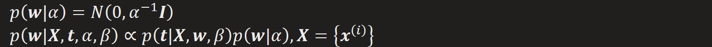  
*Note: In Neural Network, regularization on bias is not considerd, otherwise may cause under-fitting*

*Recall that Bayes classification turn into a max-min estimation when considering prior distribution. Same as regularization, wrapping original optimization problem into a max-min one.*  
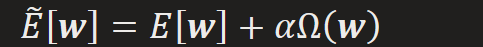
  
*we may solve this formual by iterative optimization (like [SVM](onenote:#SVM&section-id={206D0DBC-E353-4C40-ABB7-20922DEC5824}&page-id={11A9696D-1BFF-4700-8B1D-CF78A9E2CCFA}&object-id={CE2703F7-A70F-0F36-1E79-A95AB13D5E0D}&12&base-path=https://d.docs.live.net/276cf4f2e18c3166/文档/寿枫%20的笔记本/机器学习.one) or EM), but may converge to local minimum*  
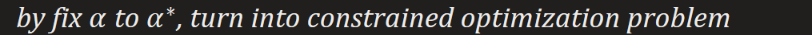

*Q: why do we need regularization ?*  
*Regularization is aim at reducing generalization error, or a trade-off between bias and variance.*
1.  *Reducing overfitting (generalization error)*
2.  *It is providing a premise for model, so when premise is satisfied with desired model, then the predicted model will converge to desired model : A→B, A true → B true. Or we can say, we are introducing some prior knowledge into model.*
3.  [*Unbias hypothesis is useless*](onenote:#Machine%20Learning%20and%20Nerual%20Network&section-id={206D0DBC-E353-4C40-ABB7-20922DEC5824}&page-id={0120613B-6AA7-47C0-ABEE-002AB1B2FB47}&object-id={BA99CE90-478A-4536-B77E-0585FA97E540}&2B&base-path=https://d.docs.live.net/276cf4f2e18c3166/文档/寿枫%20的笔记本/机器学习.one)
4.  *Numeric steady, benifical to optimization*
*Q: How does it work? Or what exectlly is the process of regularization*
*regularization: Weights adjusted by sepcific rules*
*By analysing weights' gradient including **L2 regularization term***
  
*weight with big value will get more punishment*

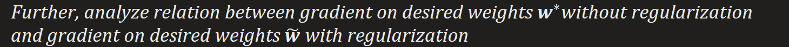

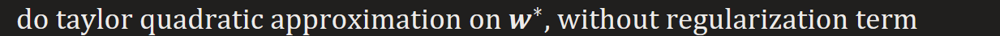
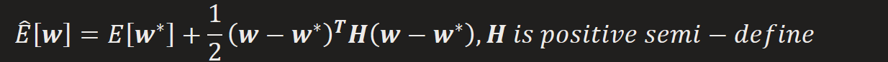

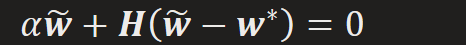
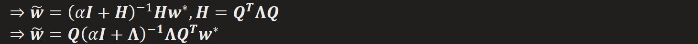
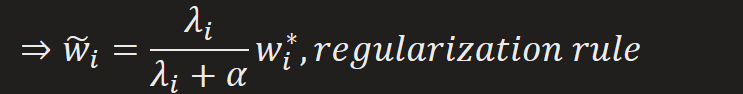
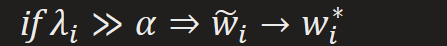  
*since weight aligned with large eigenvalue in **H** contributes most to gradient,*  
*it's better keep it still*
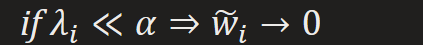
*since weight aligned with small eigenvalue in **H** contributes almost nothing to gradient,*
*it will decay by regularization*

*Same way on L1 regularization will get*  
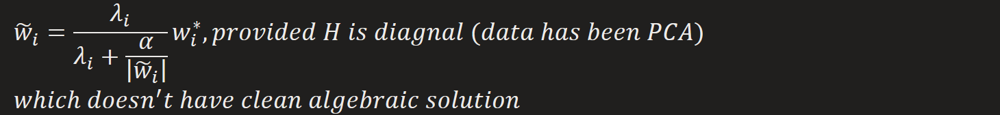
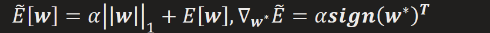

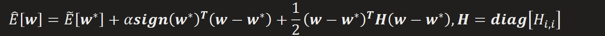
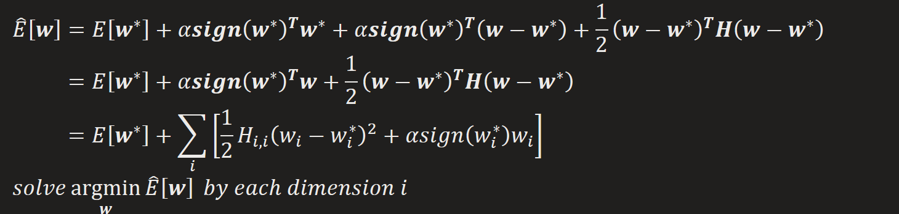

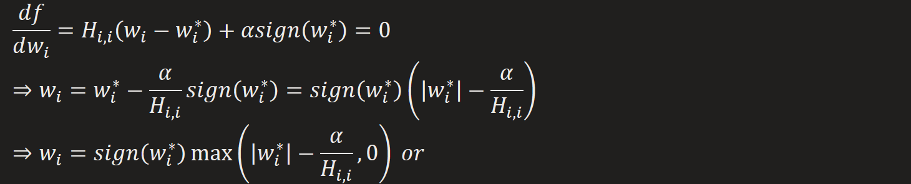
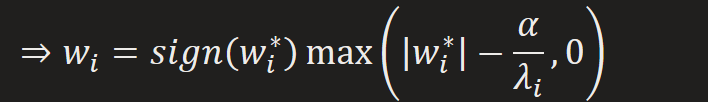
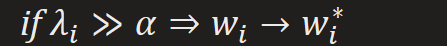  
*since weight aligned with large eigenvalue in **H** contributes most to gradient,*
*it's better keep it still*
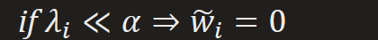
*since weight aligned with small eigenvalue in **H** contributes almost nothing to gradient,*
*it will directly pressed to 0, leading to a sparse solution*

*Same as L2 regularization correspond to **Gaussian prior** on weights, L1 regularization*
*is to the log-form of **isotropic Laplace prior** over weights*  
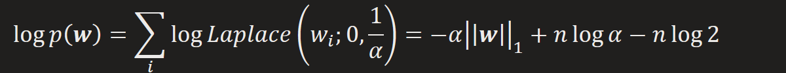
