**Problem&Analysis**  
Provided with two linearly separable datasets, we need to find a hyperplane that exactly divide them apart. i.e. a hyperplane is required that both side of data points are away from it at reverse direction, according to **strict separable hyperplane therom**:  
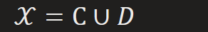
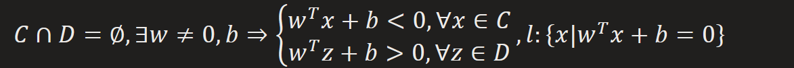
These strict inequalities are not powerful enough in finding desired hyperplane, Since we can get infinity hyperplanes meet the requirements, but any local solution may not lead to good generalization, so we can turn to an equivalent easier one, this is equivalent to induce regularization.
Note that that also has an explanation from [Lagrange Method](onenote:#Preliminary&section-id={7C05A5A2-335F-4120-B309-F2C7D1ABD289}&page-id={FC3FD93B-B8A9-4DAE-B196-0E6AE03017A3}&object-id={7A3C25D5-B74D-0EE0-39CF-E4E230C10B73}&68&base-path=https://d.docs.live.net/276cf4f2e18c3166/文档/寿枫%20的笔记本/Blog.one), where strict inequality constraints are **inactive** in finding optimal, so we need **active** constraints, i.e. equality constraints.
according to **supporting hyperplane theorem**:  
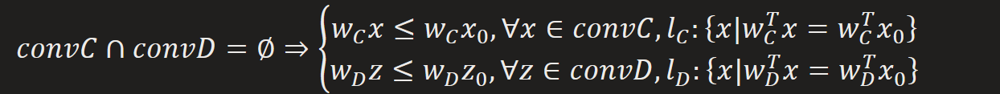
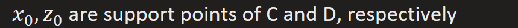

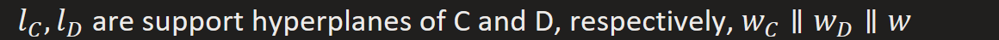

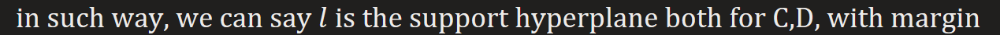

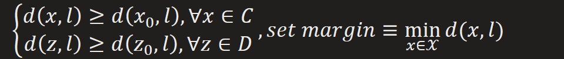  
And margins from both sides reach maximum when they are equal  
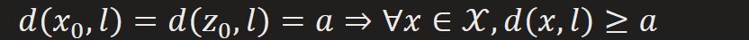
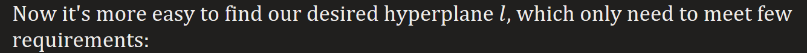
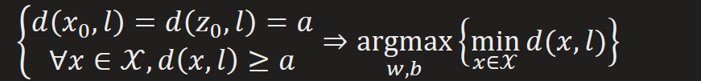  
***Ideas behind***  
1.  ***Find equivalent easier problem***
2.  ***Meet the requirements that solve it***

**Analogy**  
It's bit of taste of KNN, which makes decision based on instances. While SVM only depends on support vectors to make decision.
They both use a **kernel function** to measure similarity between new data and support data, more specificly:
Note: you can take kernel function as a metric function, but in kernel-specific feature space. (In that way you can also treat it as a tranformation between feature spaces)
KNN, kernel function(new data, all data)
SVM, kernel function(new data, support vectors)
actually, when using radial basis function as kernel fucntion, the number of support vectors is in positive relevance with the value of sigma. And once sigma is small enough, SVM will degenerate to KNN

**Adaptation**  

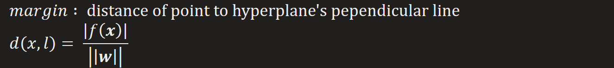

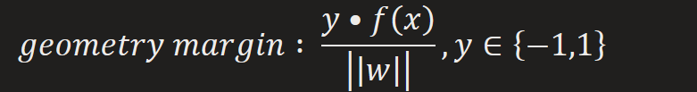
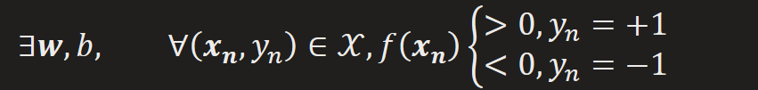

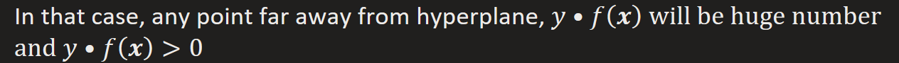

**Optimization**  
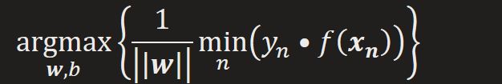
1.  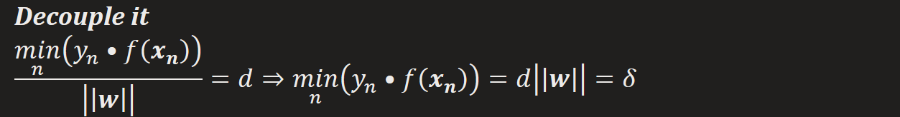
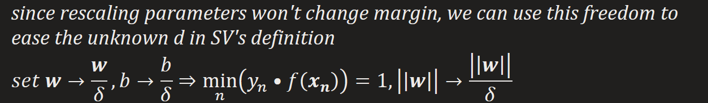

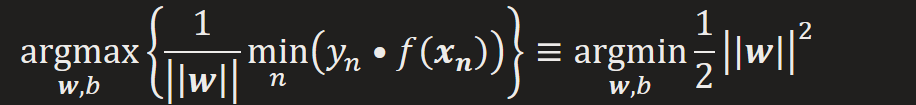

  
2.  ***Optimize it***  

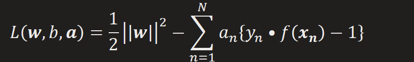

*Note:*  
1.  

2.  the formula tells that the norm of parameters will not be penalized when points far from plane, but they will be if their norm is huge or when points are close to the plane, which results in maximizing on margin.

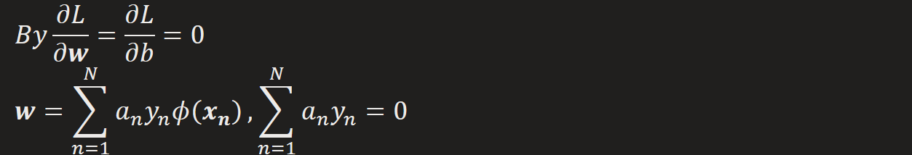

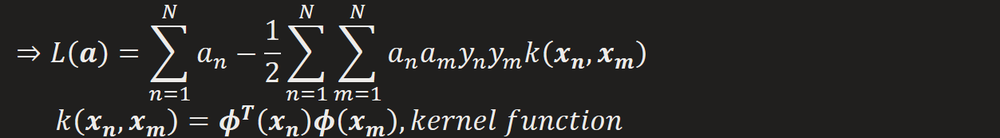

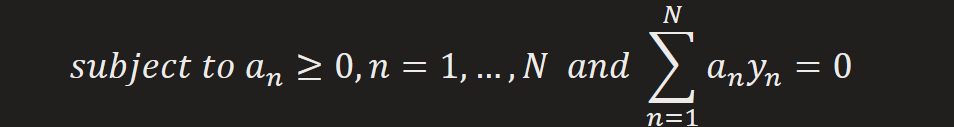

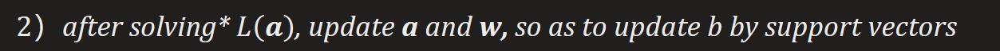

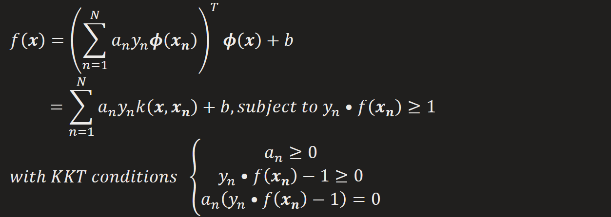

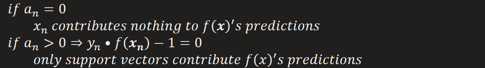

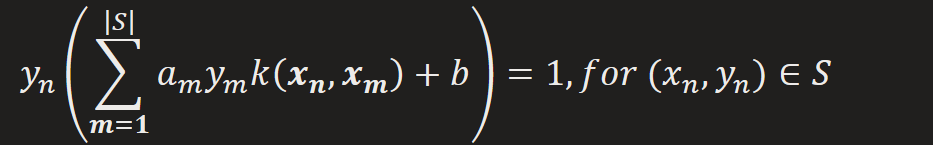

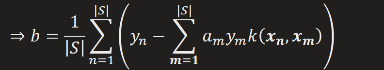

**Overlapping Class Distribution**  
**Problem&Analysis**  
Similar to Bayes classifier, class-conditional distribution may overlap,i.e. datasets are not 100% separable.
  
In that case, an exact separation on the training data may lead to poor generalization. Therefore behavior of misclassifying must be allowed.

If we still use a hyperplane to separate it, then will results each side has data points assign to its counter part.

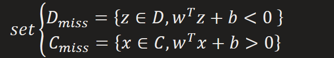  
If we allow missclassification, then we can get new separable sets

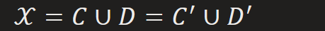  
and  
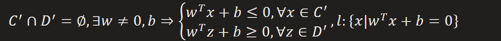  
Now we return to non-overlap case, but how can we find the support points?
We already know the support points can be simplify as
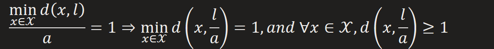
But for overlap condition, we have  
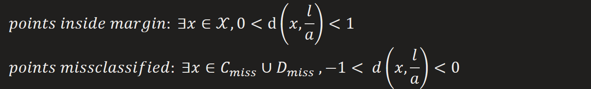  
*Note: for missclassified point, its y has opposite sign to its margin, leading to negative geometry margin*
They both have distance to supporting hyperplane  
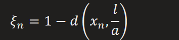  
Inspired by the way that altering inequlity constraint into equlity one:  

  
By introducing a slack variables for each point, played as an offset so as to meet the support points constraint, i.e.
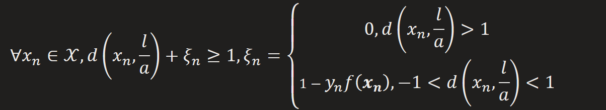  
In other words, we pull all points on the wrong side of margin back to margin, and treat them as support points. Now we can solve it in the old way, plus with a new requirement that the separation must has as less missclassfied points as possible
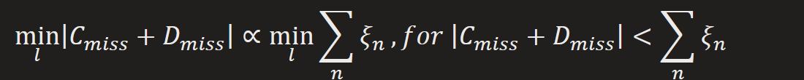  
**Adaptation**  
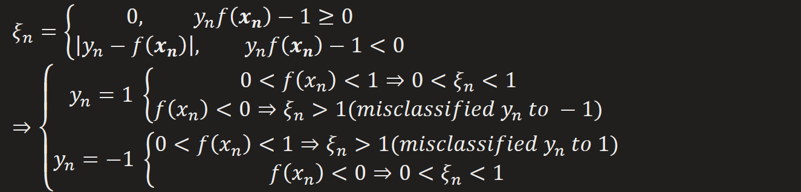
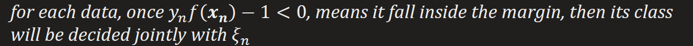

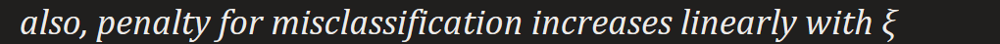
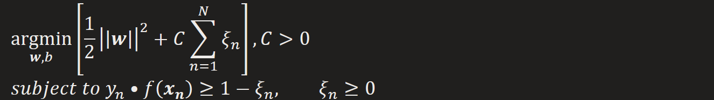

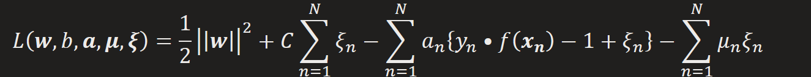
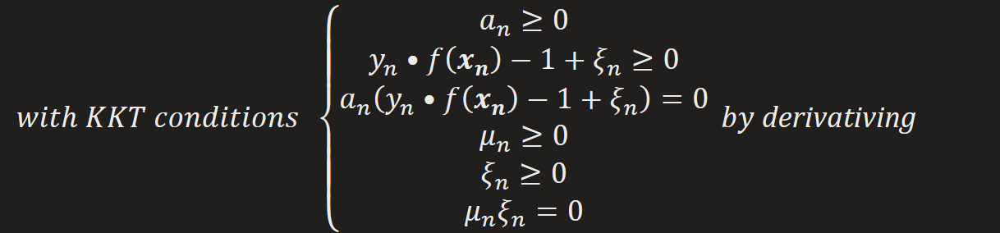
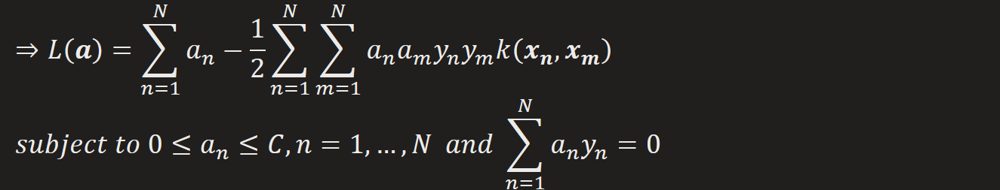
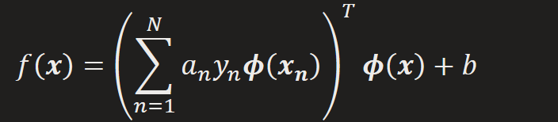
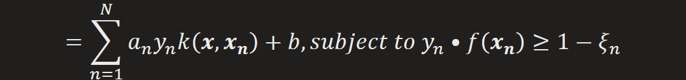
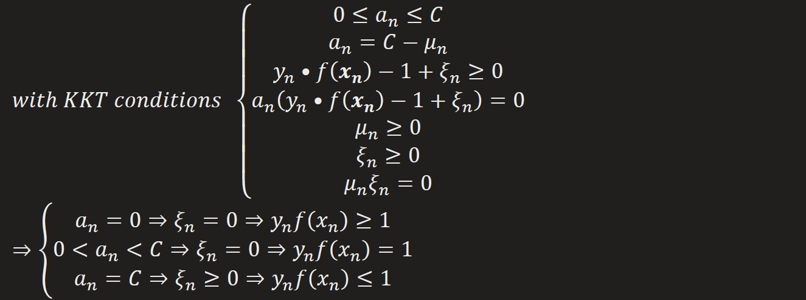
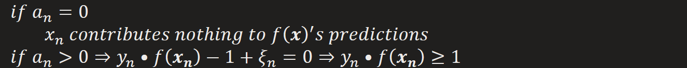  
*data points satisfy the constraint forming support vectors*  

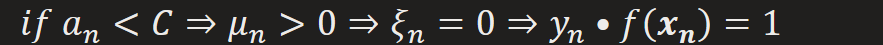

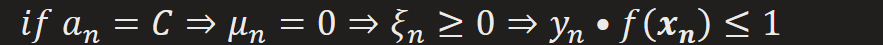

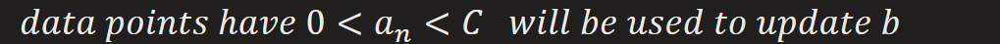

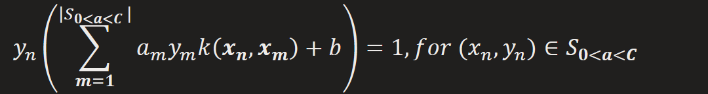

**Relation to logistic regression**  
1.  *Loss function*  

  
proof:  

  
*can be optimized by gradient descent*

*logistic regression's loss function*  

  
*Both can be viewed as continuous approximations to the misclassification error.*
*And strongly weighted at points of misclassification, weighted less on points far*
*away from hyperplane.*
*Both has a similar form in draw line, but the former tends to give less loss when*
*correctly classified, and distribute 0 loss over margin bound, that's why it leads to*
*sparse solutions.*

**SVM for Regression**  
***Find Support Vectors : form a sparse solution***  
*Same as before, only a pile of data points on the margin (tube wrapping the predicted curve) will be at work when predicting new inputs*

*contribute nothing, only those points on the boundary of predicted curve's tube contribute to its adjustment (also, prediction for new inputs)*

*By introducing slack variables, support vectors will be formed by data points on the boundary of tube or outside the tube*

*add slack-variables for each data point*  

*re-express error function*  

*by Lagrange multiplier*  

*after derivativing*  

  
*contribute nothing to prediction*  

data points lies above the upper boundary or lies in the upper

boundary contribute to prediction  

data points lies above the lower boundary or lies in the lower

boundary contribute to prediction  

  
update b by data point on the boundary of tube.  

  
So at every step, SMO choose two Lagrange multipliers to jointly optimize. After few rounds scan on data, all multipliers converge.

Note that two is the minimum number that fulfill the linear euality constraint.

3 components of SMO  
1.  an analytic method to solve for two Lagrange multipliers
• equality constraint in two multipliers

*so one increase, the other one decrease*

*• objective function for two multipliers*

• inequality constraint in two multipliers

after updating, multipler need do clip to fulfill inequality constraint

2.  a heuristic for choosing which multipliers to optimize  

• first Lagrange multiplier

Data violates KKT condition prior to others for the first round

• second Lagrange multiplier

time consuming

Hierarchical strategy for picking second multiplier when both multipliers share same input vector

3.  a method for computing b
select b such that the KKT conditions are satisfied for first and second examples

under optimal value of two multipliers

but now, we only have updated multipliers, not yet optimal, but we can have update share on b

