This topic also has its connection to **Statistical Inference** in **Chapter 5.6**

**Problem & Analysis**  
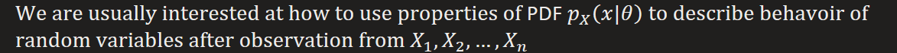
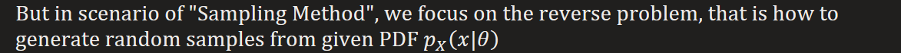

In more specific case, we are doing a series of trial  
  
We want to know the probability of event based on n trials  
  
It would be too difficult to directly do numeric computation
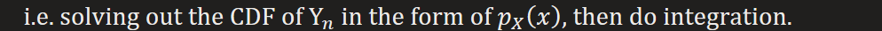  
The more simple way is(Monte Carlo Sampling)  
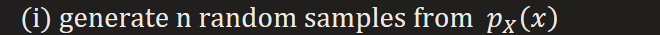
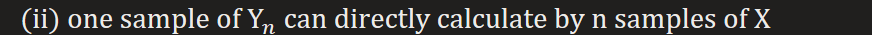
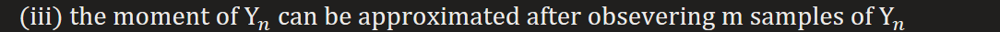
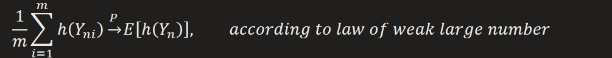

Note that accurate solution for moment is also hard to reach, so some approximation method can be applied, e.g. Taylor series approximation
\(iv\) further, the probability of event could be directly estimated by central limit theorem

So in the core is how to generate random samples. Actually, we already have lots algorithms that can generate random samples from uniform distribution, so now we only need to care about how to get arbitrary random variable from uniform one.
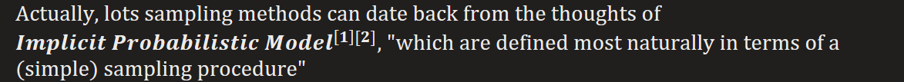
1.  
2.  
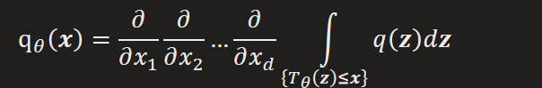

e.g. generator in GAN
Obviously, IPM doesn’t have a tractable likelihood function, so it can only learn in likelihood-free way, like adversarial or contrastive way of learning.

**Directly From uniform to arbitrary distribution**  
Target distribution of Y can be transformed uniform one by a specific function
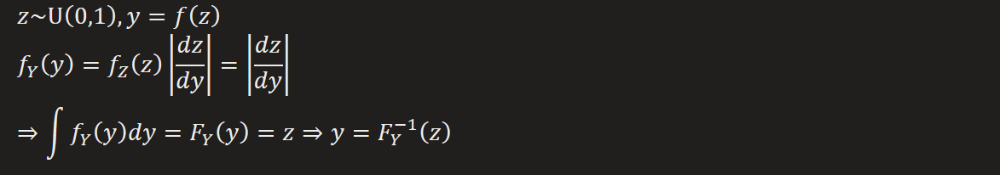
We can get random variable Y transformed from Z with a function which is the inverse of Y's CDF
Also, we see that any random variable has its CDF value a uniform distribution  
  
Note that for multivariant case  
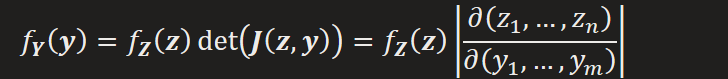  
The sampling process on Y is then  
Continuous Case:  
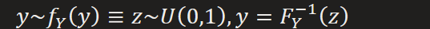  
Discrete Case:  
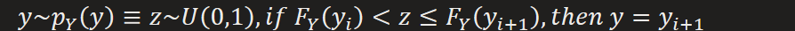

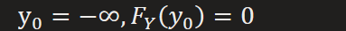

But the above method failed when CDF has no analytical expression

**Indirectly From uniform to arbitrary distribution**  
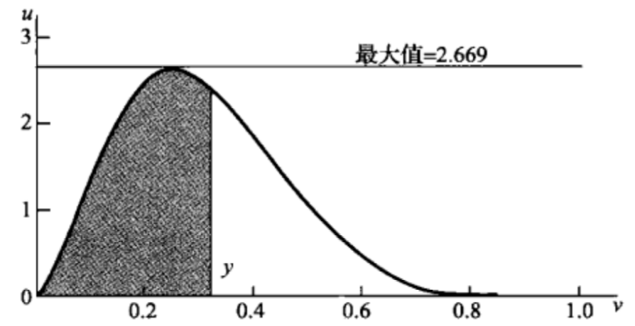  
The core idea can always relate to geometry, we uniformly sample points from a rectangular which has its length and width uniformly ranged in \[0, 1\], and then discard points outside of target distribution region. i.e. we are trying to cover target distribution's integral region with sampling points falling in it.
e.g. Box-Muller method for generating samples from Gaussian Distribution
In order to cut the sample size, we need to shrink the rectangular as tight as with target distribution. i.e.
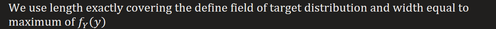

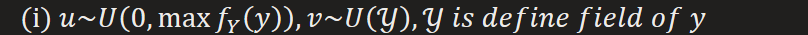
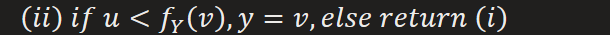

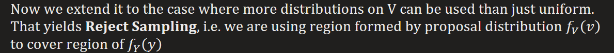
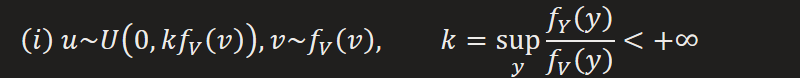
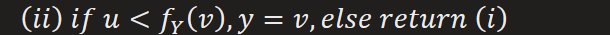  
Proof:  

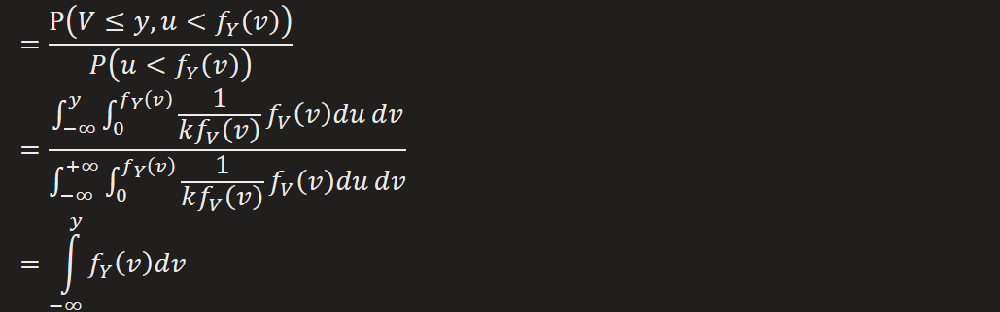
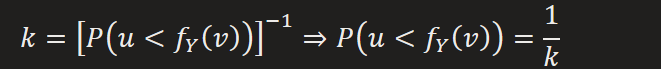
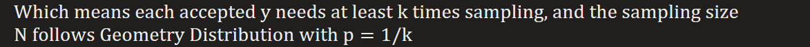

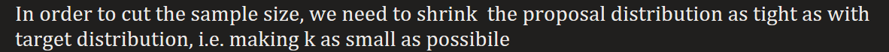

But there exist a shortage preventing it from adapting to high dimensional case:
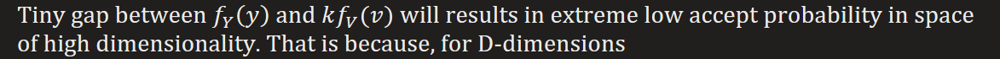
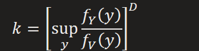
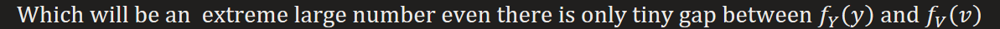

**Importance Sampling**  
It focus on approximating moment estimation in (iii) of section Problem & Analysis but not itself provide a mechanism for drawing samples from target distribution
It has its simple idea that sampling on proposal distribution where points are easily drew, comparing to its target counterpart which is hard to sample but evaluable.
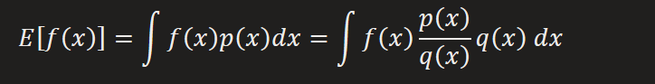
By law of weak large number
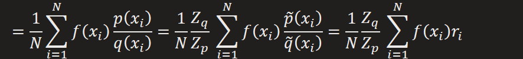
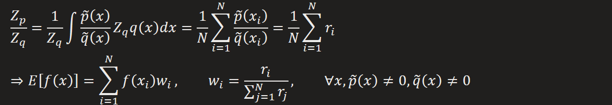
The major drawback is that it may produce results that are arbitrarily error and with no diagnostic indication.
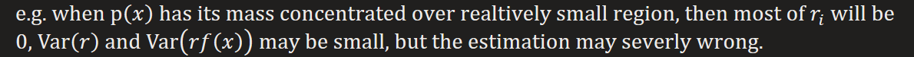

**Sampling-importance-resampling**  
Turning Importance Sampling method available for drawing samples
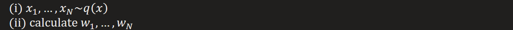
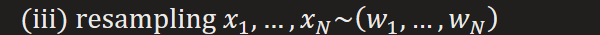
  
Proof:  
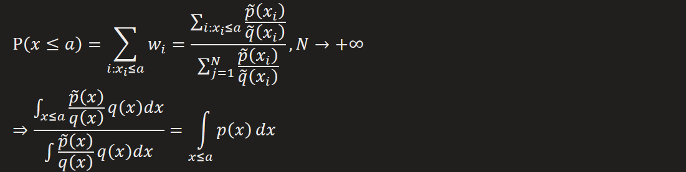

Sampling Method + EM = IP, inspiration of Data Augmentation Algorithm (todo)

[**MCMC**](https://towardsdatascience.com/langevin-dynamics-29bbb9407b47)  
Resource: <https://bjlkeng.io/posts/markov-chain-monte-carlo-mcmc-and-the-metropolis-hastings-algorithm/>  
Base on the idea of accept/reject, we can simplify sampling method into two component,
First we sample from a proposal distribution, Second we accept it or reject it according to same rule which will prefer sampling points staying in high density region of target distribution.
But in the aforementioned methods in which directly sampling a point perfectly sitting in high density region of target distribution is so hard, MCMC tries firstly to explore the target region by sampling a sequence from proposal and transitional according to acceptance rate.
So the exploration will eventually lead it to the sketch of target distribution and upon which a sampling trajectory leading to high density region will be built.
So the key point is to find suitable accept/reject rule keeping sampling point in high density region. But it also induce same drawbacks:
1.  To explore the region of target distribution, we may need to iterate the whole data several times
2.  Only high density region(where data samples are gathered densely) has high accept rate, resulting ignorance for rare events(border region of target distribution)
3.  Random walk issue may drag the efficient of sampling(exploration), causing slow convergence. (since a small moving step will be adapted to avoid high rejection rate)

It samples a sequence from proposal slowly converging to target distribution.
Promise of convergence of sampling on Markov Chain
we know that transition matrix T has maximum eigenvalue 1, so the iterative multiplication will eventually converges to its eigenvector of eigenvalue 1, i.e. invariant(target) distribution, provided T satisfies some weak restrictions

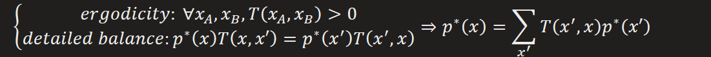
This is equivalent to **guided** walk in region of target distribution
Allow sampling from large classes of distribution and scale well in high dimensionality

[**Metropolis-Hastings Algorithm**](https://natan-katz.medium.com/metropolis-hastings-review-2dfeb0c3d0eb)  
\(i\) initialize  
  
\(ii\) Iterate  
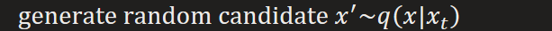

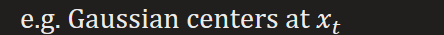

calculate acceptance probability

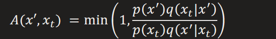

Accept or reject according to uniform sampling

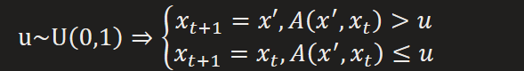  
Note that when proposal distribution is symmetric, it reduces to **Metropolis Algorithm**  
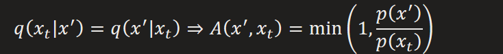
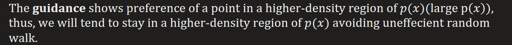  
Proof of converge:  

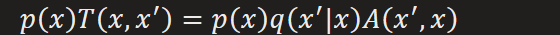

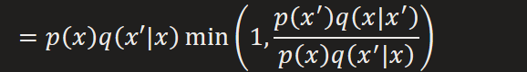

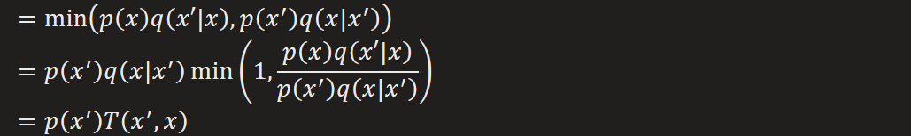

This is exactly detailed balance, so convergence is assured

**Gibbs Sampling**  
Special case of Metropolis-Hastings with fold line trajectory sampling path for multivariate variable  
\(i\) initialize  
  
\(ii\) iterate  

…

[**Hamiltonian Monte Carlo**](https://bjlkeng.io/posts/hamiltonian-monte-carlo/)

"The main idea behind HMC is that we're going to use Hamiltonian dynamics to simulate moving around our target distribution's density. The analogy used in \[1\] is imagine a puck moving along a frictionless 2D surface[2](https://bjlkeng.io/posts/hamiltonian-monte-carlo/#id4). It slides up and down hills, losing or gaining velocity (i.e. kinetic energy) based on the gradient of the hill (i.e. potential energy)"

That is, we are simulating a trajectory of particle on surface vertically flipped from our target distribution where high density region correspond to the valley absorbing particle to stay in for most of the time.
Note that the introduce of momentum is for randomness, which simulates interaction with heat bath, without it, any particle will only follow the only optimal trajectory leading to valley. This is as expected because the particle will get "pulled" into the dips while the momentum could vary by the interaction with the heat bath. So we may also get little chances of particle showing in low density region.
So the all possible states(canonical ensemble) a particle in the system can be caught by a probability distribution, i.e. canonical distribution, which can be set as Boltzman distribution.
PS. This can be related to gradient descent algorithm with momentum which is designed to jump out of local optimal by adding more randomness

Analog
<table>
<colgroup>
<col style="width: 49%" />
<col style="width: 50%" />
</colgroup>
<thead>
<tr class="header">
<th>Physic</th>
<th>MCMC</th>
</tr>
</thead>
<tbody>
<tr class="odd">
<td></td>
<td>
Variable of target distribution

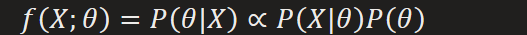

</td>
</tr>
<tr class="even">
<td></td>
<td></td>
</tr>
<tr class="odd">
<td>

simulate both the particle moving around as well as the random changes in direction that occur when it interacts with the heat bath.
</td>
<td>
Randomness when sampling

Guidance for sampling (both direction and magnitude)
</td>
</tr>
<tr class="even">
<td>

</td>
<td>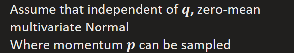</td>
</tr>
<tr class="odd">
<td></td>
<td>Can be used to model canonical distribution</td>
</tr>
</tbody>
</table>

Classical Mechanics: Net force  
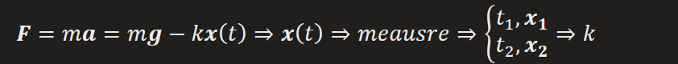
  
Lagrangian Mechanics: Total energy  
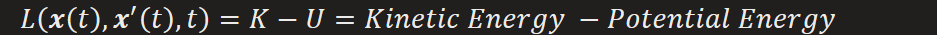

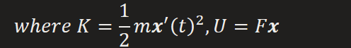

phase space:= {(position(state), momentum(direction & magnitude))}
Hamiltonian and Hamilton's Equations: System energy under phase space  

  
Using phase space coordinate by introducing generalized momentum  

at the peril of discretization error, to mitigate such error we can use Modified Euler Method

Or further, Leapfrog Method(Simpson Method)

Guarantees for fast convergence  
\(1\) Conservation of the Hamiltonian: The overall energy of the combined system(heat bath and internal system) is conserved.
  
\(2\) Volume preservation  

So the random walk (transition of state) will be bounded in limited volume

And we can only focus on an infinitesimal region of state where associated quantities (density, Hamiltonian, etc.) can be treated as constants. That greatly eases the way to proof detailed balance and correct probability according to canonical distribution built on that

  
So the whole process is essentially the same structure as MH but using Hamiltonian dynamics to find new proposal sample.
Step 1: Simulation of random interaction with heat bath  

So we have

  
Note that if we were able to simulate Hamiltonian dynamics exactly, recall that the Hamiltonian is constant along a trajectory ([Conservation of the Hamiltonian](onenote:#Sampling%20Method&section-id={7C05A5A2-335F-4120-B309-F2C7D1ABD289}&page-id={4F341C3A-CF66-4855-B9B3-DA4571AC8699}&object-id={ADC9A1B0-44DE-0EC9-0325-78F34E1AD9E3}&A3&base-path=https://d.docs.live.net/276cf4f2e18c3166/文档/寿枫%20的笔记本/Blog.one)), i.e.  

Then we would get 100% acceptance rate as we mentioned in premises of "[Guarantees for fast convergence]  (onenote:#Sampling%20Method&section-id={7C05A5A2-335F-4120-B309-F2C7D1ABD289}&page-id={4F341C3A-CF66-4855-B9B3-DA4571AC8699}&object-id={ADC9A1B0-44DE-0EC9-0325-78F34E1AD9E3}&A1&base-path=https://d.docs.live.net/276cf4f2e18c3166/文档/寿枫%20的笔记本/Blog.one)"  
But the discretization error will not get us there so we need the MH step (reject & accept)  
Limitation
1.  Sampling is only available for continuous distribution
Recall that Hamiltonian equations are built upon derivatives
2.  A evaluable function proportional to target distribution is needed, and derivatives can be computed in any non-zero region of the distribution
3.  Hyperparameters need careful tuning, including

These can be tuned according to index of autocorrection between sampling points

\(b\) momentum, variance for Gaussian distribution

Too low momentum may ignore tails of target distribution

Too high momentum may lead to low acceptance rates

[**LMC**](https://bjlkeng.io/posts/bayesian-learning-via-stochastic-gradient-langevin-dynamics-and-bayes-by-backprop/)  
Langevin Monte Carlo (LMC)[\[Radford2012\]](https://bjlkeng.io/posts/bayesian-learning-via-stochastic-gradient-langevin-dynamics-and-bayes-by-backprop/#radford2012)is a special case of HMC where we only take asinglestep in the simulation to propose a new state (versus multiple steps in a typical HMC algorithm)  

  
This is known as Langevin Equation, and can be re-write in the form of stochastic gradient descent with

  
We can get
  
SGLD: SGD + LMC  
Stochastic Gradient Langevin Dynamics  
This is simply the LMC applied on mini-batch data  

  
To make sure the new update rule still leading to solution of LMC, i.e. posterior distribution, one must prove that the overall randomness was dominated by injected gaussian noise
This is equivalent to prove that scale of variance of gaussian noise is larger than that of mini-batch data

**Why it can converges to target distribution ?**  
If we simply just sample along maximal gradient without injected noise, we can only reach to mode of target distribution
But with random perturbation, we can reach a set around the mode following the distribution of target one.
Imagine that each sampling will be on different path that leads to different points, all these samples forms the sample space of target distribution, and the tendency that towards them corresponding to their probability in the target distribution,

PS: estimation of PDF is always the first problem before sampling from it.
The basic density estimation thoughts can date back to histogram, which has a logical and clear chain of thoughts in [here](https://milania.de/blog/Introduction_to_kernel_density_estimation_(Parzen_window_method)).

But described as forms of step function often fails to real application, so in the call of continuous form of pdf, Parzen Window Estimator, alas Kernel density estimation, was introduced by simply modified the form of bins with more complicated kernel function

  
IMO, There is also a strong connection between PWE and posterior estimation if we take the pursued pdf as a posterior, then following the rules of Bayesian laws  

  
If we assume that any sample can be uniformly sampled from a bin, then we'll have
  
And the likelihood is approximately quantity estimated in a bin, which for simple histogram is

for PWE is

Provided with assumption that
  
We can infer that kernel function can be function of exponential form, e.g. Gaussian kernel function, which equals to add Gaussian noise to sample points, so the overall pdf is the combination of Gaussian distributions centering at different data points. This also sounds bits of outter interpolation.  

\[1\] Implicit Maximum Likelihood Estimation  
\[2\] Learning in Implicit Generative Models
