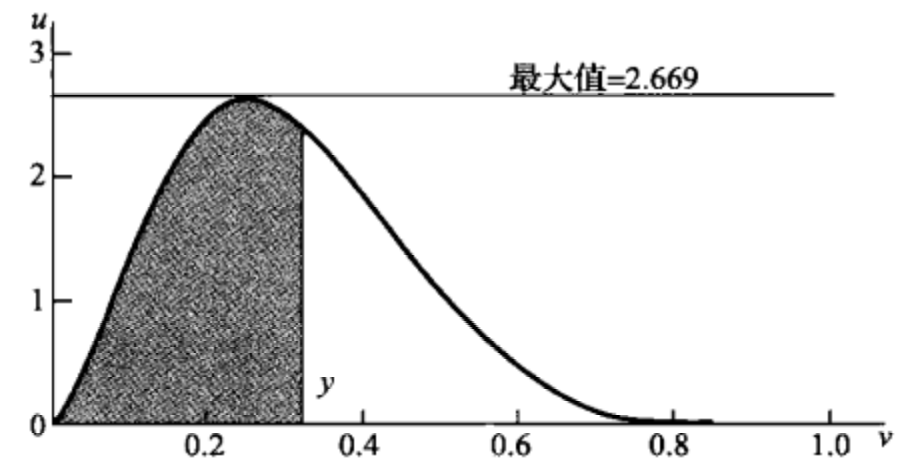
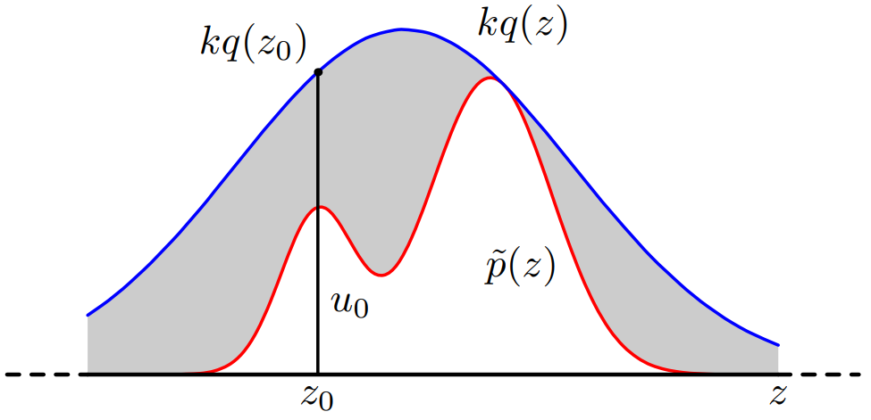

## Preliminary
PS: estimation of PDF is always the first problem before sampling from it.  
The basic density estimation thoughts can date back to histogram, which has a logical and clear chain of thoughts in [here](https://milania.de/blog/Introduction_to_kernel_density_estimation_(Parzen_window_method)).

$$
\widehat{p}\left(x\right)=\frac{1}{hN}{b}_{i}1\left[x\ falls\ into\ the\ bin\ i\right]
$$

  Where ${b}_{i}$ is count of samples falling into the bin i
But described as forms of step function often fails to real application, so in the call of continuous form of pdf, Parzen Window Estimator, alas Kernel density estimation, was introduced by simply modified the form of bins with more complicated kernel function

$$
\widehat{p}\left(x\right)=\frac{1}{hN}{\sum}_{i=1}^{N}K\left(\frac{{x}_{i}-x}{h}\right)
$$

  Where $h$ is bin width, N is number of samples
IMO, There is also a strong connection between PWE and posterior estimation if we take the pursued pdf as a posterior, then following the rules of Bayesian laws

$$
\widehat{p}\left(x\right)=p\left(x|X\right)=\frac{p\left(x\right)p\left(X|x\right)}{p\left(X\right)}
$$

  Where $X=\left\{{x}_{1},{x}_{2},\dots ,{x}_{N}\right\}$
If we assume that any sample can be uniformly sampled from a bin, then we'll have

$$
p\left(x\right)=\frac{1}{h}
$$

And the likelihood is approximately quantity estimated in a bin, which for simple histogram is

$$
p\left(X|x\right)=\frac{{b}_{i}}{N}
$$

for PWE is

$$
p\left(X|x\right)=\frac{{\sum}_{i=1}^{N}K\left(\frac{{x}_{i}-x}{h}\right)}{N}
$$

Provided with assumption that

$$
p\left(X|x\right)={\prod}_{i=1}^{N}p\left({x}_{i}|x\right)
$$

We can infer that kernel function can be function of exponential form, e.g. Gaussian kernel function, which equals to add Gaussian noise to sample points, so the overall pdf is the combination of Gaussian distributions centering at different data points. This also sounds bits of outter interpolation.
As for $p\left(X\right)$, we can simply set it equal to 1
-----


This topic also has its connection to** Statistical Inference** in **Chapter 5.6**  
## Problem & Analysis  
We are usually interested at how to use properties of PDF ${p}_{X}\left(x|\mathit{\theta}\right)$ to describe behavoir of random variables after observation from ${X}_{1},{X}_{2},\dots ,{X}_{n}$
But in scenario of "Sampling Method", we focus on the reverse problem, that is how to generate random samples from given PDF ${p}_{X}\left(x|\mathit{\theta}\right)$
In more specific case, we are doing a series of trial

$$
{X}_{1},{X}_{2},\dots ,{X}_{n}\sim {p}_{X}\left(x\right).i.i.d
$$

We want to know the probability of event based on n trials

$$
{\mathrm{Y}}_{n}=g\left({X}_{1},\dots ,{X}_{n}\right),\ \ \ P\left({Y}_{n}\ satisfies\ some\ property\right)=\ ?
$$

It would be too difficult to directly do numeric computation
i.e. solving out the CDF of ${\mathrm{Y}}_{n}$ in the form of ${p}_{X}\left(x\right)$, then do integration.
The more simple way is(Monte Carlo Sampling)
(i) generate n random samples from ${p}_{X}\left(x\right)$
(ii) one sample of ${\mathrm{Y}}_{n}$ can directly calculate by n samples of $\mathrm{X}$
(iii) the moment of ${\mathrm{Y}}_{n}$ can be approximated after obsevering m samples of ${\mathrm{Y}}_{n}$

$$
\frac{1}{m}{\sum}_{i=1}^{m}h\left({Y}_{ni}\right)\to P\to E\left[h\left({Y}_{n}\right)\right],\ \ according\ to\ law\ of\ weak\ large\ number
$$

Note that accurate solution for moment is also hard to reach, so some approximation method can be applied, e.g. Taylor series approximation
(iv) further, the probability of event could be directly estimated by central limit theorem
So in the core is how to generate random samples. Actually, we already have lots algorithms that can generate random samples from uniform distribution, so now we only need to care about how to get arbitrary random variable from uniform one.
Actually, lots sampling methods can date back from the thoughts of Implicit Probabilistic\[1,2\], "which are defined most naturally in terms of a (simple) sampling procedure"
1. Sample $\mathbf{z}\sim \mathrm{q}\left(\bm{z}\right)$
2. Return $\bm{x}\sim {T}_{\mathit{\theta}}\left(\bm{z}\right),\ \ {T}_{\mathit{\theta}}:{R}^{m}\to {R}^{d}$

$$
{\mathrm{q}}_{\mathit{\theta}}\left(\bm{x}\right)=\frac{\mathit{\partial}}{\mathit{\partial}{x}_{1}}\frac{\mathit{\partial}}{\mathit{\partial}{x}_{2}}\dots \frac{\mathit{\partial}}{\mathit{\partial}{x}_{d}}\underset{\left\{{T}_{\mathit{\theta}}\left(\bm{z}\right)\le \bm{x}\right\}}{\int}q\left(\bm{z}\right)d\bm{z}
$$

Where ${T}_{\mathit{\theta}}\left(\bullet \right)$ can be a deterministic parameterized transformation like a neural net.
e.g. generator in GAN
Obviously, IPM doesn’t have a tractable likelihood function, so it can only learn in likelihood-free way, like adversarial or contrastive way of learning.  
## Directly From uniform to arbitrary distribution
Target distribution of Y can be transformed uniform one by a specific function

$$
z\sim \mathrm{U}\left(0,1\right),y=f\left(z\right)
$$

$$
{f}_{Y}\left(y\right)={f}_{Z}\left(z\right)\left|\frac{dz}{dy}\right|=\left|\frac{dz}{dy}\right|
$$

$$
\Rightarrow \int {f}_{Y}\left(y\right)dy={F}_{Y}\left(y\right)=z\Rightarrow y={F}_{Y}^{-1}\left(z\right)
$$

We can get random variable Y transformed from Z with a function which is the inverse of Y's CDF
Also, we see that any random variable has its CDF value a uniform distribution

$$
\mathrm{Z}={\mathrm{F}}_{Y}\left(Y\right)\sim U\left(0,1\right)
$$

Note that for multivariant case

$$
{f}_{\bm{Y}}\left(\bm{y}\right)={f}_{\bm{Z}}\left(\bm{z}\right)\mathrm{det}\left(\bm{J}\left(\bm{z},\bm{y}\right)\right)={f}_{\bm{Z}}\left(\bm{z}\right)\left|\frac{\mathit{\partial}\left({z}_{1},\dots ,{z}_{n}\right)}{\mathit{\partial}\left({y}_{1},\dots ,{y}_{m}\right)}\right|
$$

The sampling process on Y is then
Continuous Case:

$$
y\sim {f}_{Y}\left(y\right)\equiv z\sim U\left(0,1\right),y={F}_{Y}^{-1}\left(z\right)
$$

Discrete Case:

$$
y\sim {p}_{Y}\left(y\right)\equiv z\sim U\left(0,1\right),if\ {F}_{Y}\left({y}_{i}\right)<z\le {F}_{Y}\left({y}_{i+1}\right),\ then\ y={y}_{i+1}
$$

$$
{\mathrm{y}}_{0}=-\infty ,{F}_{Y}\left({y}_{0}\right)=0
$$


But the above method failed when CDF has no analytical expression  
**Indirectly From uniform to arbitrary distribution**  

The core idea can always relate to geometry, we uniformly sample points from a rectangular which has its length and width uniformly ranged in \[0, 1\], and then discard points outside of target distribution region. i.e. we are trying to cover target distribution's integral region with sampling points falling in it.
e.g. Box-Muller method for generating samples from Gaussian Distribution
In order to cut the sample size, we need to shrink the rectangular as tight as with target distribution. i.e.
We use length exactly covering the define field of target distribution and width equal to maximum of ${f}_{Y}\left(y\right)$
Or, from the above picture, in other words, we are trying to make ${f}_{V}\left(y\right)$ similar to ${f}_{Y}\left(y\right)$
(i) $u\sim U\left(0,\mathrm{max}{f}_{Y}\left(y\right)\right),v\sim U\left(\mathcal{Y}\right),\mathcal{Y}\ is\ define\ field\ of\ y$
(ii)$\ if\ u<{f}_{Y}\left(v\right),\ y=v,\ else\ return\ \left(i\right)$

Now we extend it to the case where more distributions on $\mathrm{V}$ can be used than just uniform. That yields **Reject Sampling**, i.e. we are using region formed by proposal distribution ${f}_{V}\left(v\right)$ to cover region of ${f}_{Y}\left(y\right)$
(i) $u\sim U\left(0,{kf}_{V}\left(v\right)\right),v\sim {f}_{V}\left(v\right),\ \ k=\underset{y}{\mathrm{sup}}\frac{{f}_{Y}\left(y\right)}{{f}_{V}\left(y\right)}<+\infty $
(ii) $if\ u<{f}_{Y}\left(v\right),y=v,\ else\ return\ \left(i\right)$
Proof:

$$
\mathrm{P}\left(Y\le y\right)=P\left(V\le y|u<{f}_{Y}\left(v\right)\right)
$$

$$
=\frac{\mathrm{P}\left(V\le y,u<{f}_{Y}\left(v\right)\right)}{P\left(u<{f}_{Y}\left(v\right)\right)}
$$

$$
=\frac{\underset{-\infty}{\overset{y}{\int}}\underset{0}{\overset{{f}_{Y}\left(v\right)}{\int}}\frac{1}{k{f}_{V}\left(v\right)}{f}_{V}\left(v\right)dudv}{\underset{-\infty}{\overset{+\infty}{\int}}\underset{0}{\overset{{f}_{Y}\left(v\right)}{\int}}\frac{1}{k{f}_{V}\left(v\right)}{f}_{V}\left(v\right)dudv}
$$

$$
=\underset{-\infty}{\overset{y}{\int}}{f}_{Y}\left(v\right)dv
$$

$$
k={\left[P\left(u<{f}_{Y}\left(v\right)\right)\right]}^{-1}\Rightarrow P\left(u<{f}_{Y}\left(v\right)\right)=\frac{1}{k}
$$

Which means each accepted y needs at least k times sampling, and the sampling size
$\mathrm{N}$ follows Geometry Distribution with $\mathrm{p}=1/\mathrm{k}$
In order to cut the sample size, we need to shrink the proposal distribution as tight as with target distribution, i.e. making $\mathrm{k}$ as small as possibile
But there exist a shortage preventing it from adapting to high dimensional case:
Tiny gap between ${f}_{Y}\left(y\right)$ and $k{f}_{V}\left(v\right)$ will results in extreme low accept probability in space of high dimensionality. That is because, for D-dimensions

$$
k={\left[\underset{y}{\mathrm{sup}}\frac{{f}_{Y}\left(y\right)}{{f}_{V}\left(y\right)}\right]}^{D}
$$

Which will be an extreme large number even there is only tiny gap between ${f}_{Y}\left(y\right)$ and ${f}_{V}\left(v\right)$  
## Importance Sampling  
It focus on approximating moment estimation in (iii) of section Problem & Analysis but not itself provide a mechanism for drawing samples from target distribution
It has its simple idea that sampling on proposal distribution where points are easily drew, comparing to its target counterpart which is hard to sample but evaluable.

$$
E\left[f\left(x\right)\right]=\int f\left(x\right)p\left(x\right)dx=\int f\left(x\right)\frac{p\left(x\right)}{q\left(x\right)}q\left(x\right)\ dx
$$

By law of weak large number $x_i \sim q(x)$

$$
=\frac{1}{N}{\sum}_{i=1}^{N}f\left({x}_{i}\right)\frac{p\left({x}_{i}\right)}{q\left({x}_{i}\right)}=\frac{1}{N}\frac{{Z}_{q}}{{Z}_{p}}\ {\sum}_{i=1}^{N}f\left({x}_{i}\right)\frac{\stackrel{\sim }{p}\left({x}_{i}\right)}{\stackrel{\sim }{q}\left({x}_{i}\right)}=\frac{1}{N}\frac{{Z}_{q}}{{Z}_{p}}\ {\sum}_{i=1}^{N}f\left({x}_{i}\right){r}_{i}
$$

$$
\frac{{Z}_{p}}{{Z}_{q}}=\frac{1}{{Z}_{q}}\int \frac{\stackrel{\sim }{p}\left(x\right)}{\stackrel{\sim }{q}\left(x\right)}{Z}_{q}q\left(x\right)dx=\frac{1}{N}{\sum}_{i=1}^{N}\frac{\stackrel{\sim }{p}\left({x}_{i}\right)}{\stackrel{\sim }{q}\left({x}_{i}\right)}=\frac{1}{N}{\sum}_{i=1}^{N}{r}_{i}
$$

$$
\Rightarrow E\left[f\left(x\right)\right]={\sum}_{i=1}^{N}f\left({x}_{i}\right){w}_{i},\ \ {w}_{i}=\frac{{r}_{i}}{{\sum}_{j=1}^{N}{r}_{j}},\ \ \forall x,\stackrel{\sim }{p}\left(x\right)\ne 0,\stackrel{\sim }{q}\left(x\right)\ne 0
$$

The major drawback is that it may produce results that are arbitrarily error and with no diagnostic indication.
e.g. when $\mathrm{p}\left(x\right)$ has its mass concentrated over realtively small region, then most of ${r}_{i}$ will be 0, $\mathrm{Var}\left(r\right)$ and $\mathrm{Var}\left(rf\left(x\right)\right)$ may be small, but the estimation may severly wrong.  
### Sampling-importance-resampling  
Turning Importance Sampling method available for drawing samples
(i) ${x}_{1},\dots ,{x}_{N}\sim q\left(x\right)$
(ii) calculate ${w}_{1},\dots ,{w}_{N}$
(iii) resampling ${x}_{1},\dots ,{x}_{N}\sim \left({w}_{1},\dots ,{w}_{N}\right)$
  Note ${w}_{i}$ is approximation of $\mathrm{p}\left({x}_{i}\right)$, so this is equivalent to draw points from $\mathrm{p}\left(x\right)$
Proof:

$$
\mathrm{P}\left(x\le a\right)={\sum}_{i:{x}_{i}\le a}{w}_{i}=\frac{{\sum}_{i:{x}_{i}\le a}\frac{\stackrel{\sim }{p}\left({x}_{i}\right)}{\stackrel{\sim }{q}\left({x}_{i}\right)}}{{\sum}_{j=1}^{N}\frac{\stackrel{\sim }{p}\left({x}_{i}\right)}{\stackrel{\sim }{q}\left({x}_{i}\right)}},N\to +\infty 
$$

$$
\Rightarrow \frac{\underset{x\le a}{\int}\frac{\stackrel{\sim }{p}\left(x\right)}{q\left(x\right)}q\left(x\right)dx}{\int \frac{\stackrel{\sim }{p}\left(x\right)}{q\left(x\right)}q\left(x\right)dx}=\underset{x\le a}{\int}p\left(x\right)dx
$$

```
def importance_sampling():
    Setup:
    Target distribution p (want samples from here)
    
    Proposal distribution q (have samples from here)
    vocabulary = [0, 1, 2, 3]
    p = [0.1, 0.2, 0.3, 0.4]
    q = [0.4, 0.3, 0.2, 0.1]
    # 1. Sample from q
    n = 100
    samples = np.random.choice(vocabulary, p=q, size = n)  # @inspect samples
    Samples (q): [0 2 0 2 1 1 0 1 0 1 0 0 0 0 1 1 0 3 1 1 1 1 1 1 3 1 0 2 0 1 3 0 2 1 1 2 0 0 0 3 2 1 1 0 1 1 0 3 2 0 2 0 1 0 1 2 2 2 0 0 0 0 2 1 0 2 0 1 3 0 0 0 0 0 0 0 1 1 2 2 2 1 0 1 1 0 1 0 1 0 1 1 3 3 0 1 0 0 2 0]
    # 2. Compute weights over samples (w \propto p/q)
    w = [p[x] / q[x] for x in samples]  # @inspect w
    z = sum(w)  # @inspect z
    w = [w_i / z for w_i in w]  # @inspect w
    # 3. Resample
    samples = np.random.choice(samples, p=w, size=n)  # @inspect samples
    Resampled (p): [2 2 1 3 3 2 0 3 3 2 1 0 3 2 0 3 3 1 3 1 3 2 3 2 3 2 3 1 0 3 2 2 2 0 2 1 2 0 3 1 1 1 3 1 3 3 3 1 0 2 3 1 2 1 2 2 2 2 1 1 0 2 1 1 0 2 3 2 1 3 2 3 1 2 3 2 3 2 1 1 3 3 3 1 1 3 2 1 3 1 3 1 0 3 1 1 2 3 2 1]
```

Sampling Method + EM = IP, inspiration of Data Augmentation Algorithm (todo)  
Application: Data Selection for Language Models via Importance Resampling ([DSIR](https://arxiv.org/abs/2302.03169))
## [**MCMC**](https://towardsdatascience.com/langevin-dynamics-29bbb9407b47)  
Resource: [https://bjlkeng.io/posts/markov-chain-monte-carlo-mcmc-and-the-metropolis-hastings-algorithm/](https://bjlkeng.io/posts/markov-chain-monte-carlo-mcmc-and-the-metropolis-hastings-algorithm/)
Base on the idea of accept/reject, we can simplify sampling method into two component,
First we sample from a proposal distribution, Second we accept it or reject it according to same rule which will prefer sampling points staying in high density region of target distribution.
But in the aforementioned methods in which directly sampling a point perfectly sitting in high density region of target distribution is so hard, MCMC tries firstly to explore the target region by sampling a sequence from proposal and transitional according to acceptance rate.
So the exploration will eventually lead it to the sketch of target distribution and upon which a sampling trajectory leading to high density region will be built.
So the key point is to find suitable accept/reject rule keeping sampling point in high density region. But it also induce same drawbacks:
1. To explore the region of target distribution, we may need to iterate the whole data several times
2. Only high density region(where data samples are gathered densely) has high accept rate, resulting ignorance for rare events(border region of target distribution)
3. Random walk issue may drag the efficient of sampling(exploration), causing slow convergence. (since a small moving step will be adapted to avoid high rejection rate)
It samples a sequence from proposal slowly converging to target distribution.
Promise of convergence of sampling on Markov Chain
  we know that transition matrix T has maximum eigenvalue 1, so the iterative multiplication will eventually converges to its eigenvector of eigenvalue 1, i.e. invariant(target) distribution, provided T satisfies some weak restrictions

$$
\left\{\begin{array}{c}ergodicity:\ \forall {x}_{A},{x}_{B},T\left({x}_{A},{x}_{B}\right)>0\\ detailed\ balance:{p}^{\ast}\left(x\right)T\left(x,x\prime \right)={p}^{\ast}\left({x}^{\prime}\right)T\left({x}^{\prime},x\right)\end{array}\right.\Rightarrow {p}^{\ast}\left(x\right)={\sum}_{{x}^{\prime}}T\left({x}^{\prime},x\right){p}^{\ast}\left(x\prime \right)
$$

This is equivalent to **guided** walk in region of target distribution
Allow sampling from large classes of distribution and scale well in high dimensionality  
### [**Metropolis-Hastings Algorithm**](https://natan-katz.medium.com/metropolis-hastings-review-2dfeb0c3d0eb)  
(i) initialize
  Pick an initial state ${x}_{0}$ with t = 0
(ii) Iterate
  generate random candidate ${x}^{\prime}\sim q\left(x|{x}_{t}\right)$
  e.g. Gaussian centers at ${x}_{t}$
  calculate acceptance probability

$$
A(x\prime ,\ {x}_{t})\ =\mathrm{min}\left(1,\frac{p\left({x}^{\prime}\right)q\left({x}_{t}|{x}^{\prime}\right)}{p\left({x}_{t}\right)q\left({x}^{\prime}|{x}_{t}\right)}\right)
$$

  Accept or reject according to uniform sampling

$$
\mathrm{u}\sim \mathrm{U}\left(0,1\right)\Rightarrow \left\{\begin{array}{c}{x}_{t+1}=x\prime ,\ A\left({x}^{\prime},\ {x}_{t}\right)>u\\ {x}_{t+1}={x}_{t},A\left({x}^{\prime},\ {x}_{t}\right)\le u\end{array}\right.
$$

Note that when proposal distribution is symmetric, it reduces to **Metropolis Algorithm**

$$
q\left({x}_{t}|{x}^{\prime}\right)=q\left({x}^{\prime}|{x}_{t}\right)\Rightarrow A\left({x}^{\prime},\ {x}_{t}\right)=\mathrm{min}\left(1,\frac{p\left({x}^{\prime}\right)}{p\left({x}_{t}\right)}\right)
$$

The **guidance** shows preference of a point in a higher-density region of $p\left(x\right)$(large $\mathrm{p}\left(x\right)$), thus, we will tend to stay in a higher-density region of $p\left(x\right)$ avoiding uneffecient random walk.
Proof of converge:

$$
\mathrm{T}\left(x,{x}^{\prime}\right)=q\left({x}^{\prime}|x\right)A\left({x}^{\prime},x\right)
$$

$$
p\left(x\right)T\left(x,{x}^{\prime}\right)=p\left(x\right)q\left({x}^{\prime}|x\right)A\left({x}^{\prime},x\right)
$$

$$
=p\left(x\right)q\left(x\prime |x\right)\mathrm{min}\left(1,\frac{p\left({x}^{\prime}\right)q\left(x|{x}^{\prime}\right)}{p\left(x\right)q\left({x}^{\prime}|x\right)}\right)
$$

$$
=\mathrm{min}\left(p\left(x\right)q\left(x\prime |x\right),p\left({x}^{\prime}\right)q\left(x|{x}^{\prime}\right)\right)
$$

$$
=p\left({x}^{\prime}\right)q\left(x|{x}^{\prime}\right)\mathrm{min}\left(1,\frac{p\left(x\right)q\left(x\prime |x\right)}{p\left({x}^{\prime}\right)q\left(x|{x}^{\prime}\right)}\right)
$$

$$
=p\left({x}^{\prime}\right)T\left({x}^{\prime},x\right)
$$

  This is exactly detailed balance, so convergence is assured

### Gibbs Sampling  
Special case of Metropolis-Hastings with fold line trajectory sampling path for multivariate variable  
(i) initialize  
  Pick an initial state ${\bm{x}}^{\left(0\right)}=\left({x}_{1}^{\left(0\right)},\dots ,{x}_{M}^{\left(0\right)}\right)$ with t = 0  
(ii) iterate  
  Sample ${x}_{1}^{\left(t+1\right)}\sim p\left({x}_{1}|{x}_{2}^{\left(t\right)},\dots ,{x}_{M}^{\left(t\right)}\right)$
  Sample ${x}_{2}^{\left(t+1\right)}\sim p\left({x}_{2}|{x}_{1}^{\left(t+1\right)},{x}_{3}^{\left(t\right)}\dots ,{x}_{M}^{\left(t\right)}\right)$
  …
  Sample ${x}_{M}^{\left(t+1\right)}\sim p\left({x}_{M}|{x}_{1}^{\left(t+1\right)},{x}_{2}^{\left(t+1\right)},\dots ,{x}_{M-1}^{\left(t+1\right)}\right)$  

### [**Hamiltonian Monte Carlo**](https://bjlkeng.io/posts/hamiltonian-monte-carlo/)  
"The main idea behind HMC is that we're going to use Hamiltonian dynamics to simulate moving around our target distribution's density. The analogy used in \[1\] is imagine a puck moving along a frictionless 2D surface [^2^](https://bjlkeng.io/posts/hamiltonian-monte-carlo/#id4). It slides up and down hills, losing or gaining velocity (i.e. kinetic energy) based on the gradient of the hill (i.e. potential energy)"
That is, we are simulating a trajectory of particle on surface vertically flipped from our target distribution where high density region correspond to the valley absorbing particle to stay in for most of the time.
Note that the introduce of momentum is for randomness, which simulates interaction with heat bath, without it, any particle will only follow the only optimal trajectory leading to valley. This is as expected because the particle will get "pulled" into the dips while the momentum could vary by the interaction with the heat bath. So we may also get little chances of particle showing in low density region.
So the all possible states(canonical ensemble) a particle in the system can be caught by a probability distribution, i.e. canonical distribution, which can be set as Boltzman distribution.
PS. This can be related to gradient descent algorithm with momentum which is designed to jump out of local optimal by adding more randomness
Analog
|Physic|MCMC|
|------|----|
|Position $\bm{q}$|Variable of target distribution <br> $ f(X; \theta) = P(\theta \mid X) \propto P(X \mid \theta) P(\theta)$<br>|
|Potential energy $U\left(\bm{q}\right)$|NLL $-\mathrm{log}f\left(X;\mathit{\theta}\right)$|
|Momentum $\bm{p}$<br>simulate both the particle moving around as well as the random changes in direction that occur when it interacts with the heat bath.|Randomness when sampling<br>Guidance for sampling (both direction and magnitude)|
|Kinetic energy $\bm{K}\left(\bm{p}\right)$<br>|Assume that independent of $\bm{q}$, zero-mean multivariate Normal<br>Where momentum $\bm{p}$ can be sampled|
|Overall energy at specified state $H\left(\bm{q},\bm{p}\right)$|Can be used to model canonical distribution|

Classical Mechanics: Net force

$$
\bm{F}=m\bm{a}=m\bm{g}-k\bm{x}\left(t\right)\Rightarrow \bm{x}\left(t\right)\Rightarrow meausre\Rightarrow \left\{\begin{array}{c}{t}_{1},{\bm{x}}_{1}\\ {t}_{2},{\bm{x}}_{2}\end{array}\right.\Rightarrow k
$$

 $\downarrow $ extent to integration
Lagrangian Mechanics: Total energy

$$
L\left(\bm{x}\left(t\right),{\bm{x}}^{\prime}\left(t\right),t\right)=K-U=Kinetic\ Energy\ -Potential\ Energy
$$

$$
where\ K=\frac{1}{2}m{\bm{x}}^{\prime}{\left(t\right)}^{2},U=F\bm{x}
$$

  Using Euler-Lagrange Equations to find optimal $\bm{x}\left(t\right)$, which will leads to Newton second law (Classical Mechanics)
 $\downarrow $ extent to different coordinates(especially phase space) and multi-dimension

$$
{x}_{i}:={x}_{i}\left({q}_{1},\dots ,{q}_{N};t\right)
$$

  phase space:= {(position(state), momentum(direction & magnitude))}
Hamiltonian and Hamilton's Equations: System energy under phase space

$$
E=\left({\sum}_{i=1}^{N}\frac{\mathit{\partial}L}{\mathit{\partial}{q}_{i}^{\prime}}{q}_{i}^{\prime}\right)-L
$$

  e.g.$\ N=1\Rightarrow E=K+U$
Using phase space coordinate by introducing generalized momentum  
  e.g. linear momentum: $\bm{p}=m{\bm{x}}^{\prime}\left(t\right)$
Rewriting energy in terms of only $\bm{q},\bm{p}$***, ***which is the **Hamiltonian**

$$
E=H\left(\bm{q},\bm{p}\right)=\left({\sum}_{i=1}^{N}{p}_{i}{q}_{i}^{\prime}\left({q}_{i},{p}_{i}\right)\right)-L\left(\bm{q},{\bm{q}}^{\prime}\left(\bm{q},\bm{p}\right)\right)
$$

Also, solving Hamilton's Equations for $\bm{x}\left(t\right)$ can lead to Newton second law

$$
H\left(\bm{x},\bm{p}\right)=\frac{{\bm{p}}^{2}}{2m}-m\bm{g}\bm{x}+\frac{1}{2}k{\bm{x}}^{2}
$$

$$
\Rightarrow \left\{\begin{array}{c}\frac{\mathit{\partial}H}{\mathit{\partial}\bm{p}}=\frac{\bm{p}}{m}={\bm{x}}^{\prime}\\ \frac{\mathit{\partial}H}{\mathit{\partial}\bm{x}}=-m\bm{g}+k\bm{x}=-{\bm{p}}^{\prime}\end{array}\right.\Rightarrow m{\bm{x}}^{\prime \prime}\left(t\right)=m\bm{g}-k\bm{x}\left(t\right)
$$

Hamilton's Equations, show the motion from $\left({\bm{q}}_{\bm{t}},{\bm{p}}_{\bm{t}}\right)$ to $\left({\bm{q}}_{\bm{t}+1},{\bm{p}}_{\bm{t}+1}\right)$ and the reverse (since its motion is completely and unqiuely determined by momentum for all time. This also leads to reversible Markov Chain)

$$
\left\{\begin{array}{c}\frac{\mathit{\partial}H}{\mathit{\partial}\bm{p}}={\bm{q}}^{\prime}\\ \frac{\mathit{\partial}H}{\mathit{\partial}\bm{q}}=-{\bm{p}}^{\prime}\end{array}\right.\Rightarrow \left\{\begin{array}{c}{\bm{p}}_{\bm{t}+\mathit{\epsilon}}={\bm{p}}_{\bm{t}}+\mathit{\epsilon}{\bm{p}}^{\prime}\\ {\bm{q}}_{\bm{t}+\mathit{\epsilon}}={\bm{q}}_{\bm{t}}+\mathit{\epsilon}{\bm{q}}^{\prime}\end{array}\right.,Euler\ Method
$$

  at the peril of discretization error, to mitigate such error we can use Modified Euler Method

$$
\left\{\begin{array}{c}{\bm{p}}_{\bm{t}+\mathit{\epsilon}}={\bm{p}}_{\bm{t}}+\mathit{\epsilon}{\bm{p}}^{\prime}={\bm{p}}_{\bm{t}}-\mathit{\epsilon}\frac{\mathit{\partial}H\left({\bm{q}}_{\bm{t}},{\bm{p}}_{\bm{t}}\right)}{\mathit{\partial}\bm{q}}\\ {\bm{q}}_{\bm{t}+\mathit{\epsilon}}={\bm{q}}_{\bm{t}}+\mathit{\epsilon}{\bm{q}}^{\prime}={\bm{q}}_{\bm{t}}+\mathit{\epsilon}\frac{\mathit{\partial}H\left({\bm{q}}_{\bm{t}},{\bm{p}}_{\bm{t}+\mathit{\epsilon}}\right)}{\mathit{\partial}\bm{p}}\end{array}\right.\equiv \left[\begin{array}{c}{\bm{p}}_{\bm{t}+\mathit{\epsilon}}\\ {\bm{q}}_{\bm{t}}\end{array}\right]=\bm{f}\left(\left[\begin{array}{c}{\bm{p}}_{\bm{t}}\\ {\bm{q}}_{\bm{t}}\end{array}\right]\right)
$$

  Or further, Leapfrog Method(Simpson Method)

$$
\left\{\begin{array}{c}{\bm{p}}_{\bm{t}+\frac{\mathit{\epsilon}}{2}}={\bm{p}}_{\bm{t}}-\frac{\mathit{\epsilon}}{2}\frac{\mathit{\partial}H\left({\bm{q}}_{\bm{t}},{\bm{p}}_{\bm{t}}\right)}{\mathit{\partial}\bm{q}}\\ {\bm{q}}_{\bm{t}+\mathit{\epsilon}}={\bm{q}}_{\bm{t}}+\mathit{\epsilon}{\bm{q}}^{\prime}={\bm{q}}_{\bm{t}}+\mathit{\epsilon}\frac{\mathit{\partial}H\left({\bm{q}}_{\bm{t}},{\bm{p}}_{\bm{t}+\frac{\mathit{\epsilon}}{2}}\right)}{\mathit{\partial}\bm{p}}\\ {\bm{p}}_{t+\mathit{\epsilon}}={\bm{p}}_{t+\frac{\mathit{\epsilon}}{2}}-\frac{\mathit{\epsilon}}{2}\frac{\mathit{\partial}H\left({\bm{q}}_{\bm{t}+\mathit{\epsilon}},{\bm{p}}_{\bm{t}+\mathit{\epsilon}}\right)}{\mathit{\partial}\bm{q}}\end{array}\right.
$$

Guarantees for fast convergence
(1) Conservation of the Hamiltonian: The overall energy of the combined system(heat bath and internal system) is conserved.

$$
\frac{dH}{dt}=0,leading\ to\ 100\%\ acceptance\ rate
$$

(2) Volume preservation

$$
\left|\mathrm{det}\left({\bm{J}}_{\bm{f}}\right)\right|=\left|\left[\begin{array}{cc}\frac{\mathit{\partial}\bm{f}}{\mathit{\partial}{\bm{p}}_{\bm{t}}}& \frac{\mathit{\partial}\bm{f}}{\mathit{\partial}{\bm{q}}_{\bm{t}}}\end{array}\right]\right|=1\Rightarrow d{\bm{p}}_{\bm{t}+\bm{\epsilon}}d{\bm{q}}_{\bm{t}}=\left|\mathrm{det}\left({\bm{J}}_{\bm{f}}\right)\right|d{\bm{p}}_{\bm{t}}d{\bm{q}}_{\bm{t}}=d{\bm{p}}_{\bm{t}}d{\bm{q}}_{\bm{t}}
$$

  So the random walk (transition of state) will be bounded in limited volume
  And we can only focus on an infinitesimal region of state where associated quantities (density, Hamiltonian, etc.) can be treated as constants. That greatly eases the way to proof detailed balance and correct probability according to canonical distribution built on that

Build connection to probability by estimating probability of the internal system state being in a particular microstate, i.e. canonical distribution $\mathrm{P}\left(\bm{q},\bm{p}\right)$
But our target distribution, also the one we want to sample from is $P\left(\bm{q}\right)$

$$
{p}_{i}=\frac{{e}^{\frac{{E}_{i}}{KT}}}{Z},Boltzman\ distribution\Rightarrow P\left(\bm{q},\bm{p}\right)=\frac{{e}^{\frac{H\left(\bm{q},\bm{p}\right)}{KT}}}{Z}
$$

$$
H\left(q,p\right)=K\left(\bm{p}\right)+U\left(\bm{q}\right)={\sum}_{i=1}^{N}\frac{{p}_{i}^{2}}{2{m}_{i}}-\mathrm{log}\left[f\left(\bm{q}\right)\right]
$$

$$
\Rightarrow P\left(\bm{q},\bm{p}\right)=\frac{\mathrm{exp}\left(-\mathrm{log}\left[f\left(\bm{q}\right)\right]\right)}{{Z}_{1}}\frac{\mathrm{exp}\left({\sum}_{i=1}^{N}\frac{{p}_{i}^{2}}{2{m}_{i}}\right)}{{Z}_{2}}
$$

$$
\ \ \ \ \ \ \ \ \ =P\left(\bm{q}\right)P\left(\bm{p}\right)
$$

$$
\ \ \ \ \ \ \ \ \ \Rightarrow P\left(\bm{q}\right)\propto f\left(\bm{q}\right)
$$

By simulating the dynamics of the system, the transition of microstate (via the Hamilton's Equations and random interaction with the heat bath), we would essentially simulating exactly $P\left(\bm{q},\bm{p}\right)$, which leads us directly to simulating $P\left(\bm{q}\right)$
So the whole process is essentially the same structure as MH but using Hamiltonian dynamics to find new proposal sample.  
Step 1: Simulation of random interaction with heat bath

$$
\bm{p}\sim P\left(\bm{p}\right):=\mathcal{N}\left(0,\bm{d}\bm{i}\bm{a}\bm{g}\left(\bm{m}\right)\right)
$$

Step 2: Sampling L steps with step size $\epsilon$ from state $\left(\bm{q},\bm{p}\right)$. This simulates the particle moving without interactions with the heat bath, which is a deterministic process (such property contributes acceleration of sampling)

$$
P\left({\bm{q}}^{\ast},{\bm{p}}^{\ast}|\bm{q},\bm{p}\right)=1
$$


Step 3: Sampling point $\left({\bm{q}}^{\ast},{\bm{p}}^{\ast}\right)$ at L step will be decided whether as next proposal state according to acceptance rate

$$
A\left({\bm{q}}^{\ast},{\bm{p}}^{\ast}\right)=\mathrm{min}\left[1,\frac{f\left({\bm{q}}^{\ast},-{\bm{p}}^{\ast}\right)g\left(\bm{q},\bm{p}|{\bm{q}}^{\ast},-{\bm{p}}^{\ast}\right)}{f\left(\bm{q},\bm{p}\right)g\left(\bm{q}{,}^{\ast}-{\bm{p}}^{\ast}|\bm{q},\bm{p}\right)}\right]
$$

Note that negation was applied to momentum variable to ensure symmetric transition distribution $g$. i.e. we can go back to $\left(\bm{q},\bm{p}\right)$ by running L step again from proposal state $\left({\bm{q}}^{\ast},{\bm{p}}^{\ast}\right)$ at inverse direction, which indicated by $-{\bm{p}}^{\ast}$**, **under the deterministicality of L-step sampling (without interactions with the heat bath).
So we have

$$
A\left({\bm{q}}^{\ast},{\bm{p}}^{\ast}\right)=\mathrm{min}\left[1,\frac{f\left({\bm{q}}^{\ast},-{\bm{p}}^{\ast}\right)}{f\left(\bm{q},\bm{p}\right)}\right]
$$

$$
\ \ \ \ \ \ \ \ \ \ \ \ \ \ \ \ \ \ \ =\mathrm{min}\left[1,\frac{f\left({\bm{q}}^{\ast},{\bm{p}}^{\ast}\right)}{f\left(\bm{q},\bm{p}\right)}\right],using\ \bm{p}\sim \mathcal{N}\left(0,\bm{d}\bm{i}\bm{a}\bm{g}\left(\bm{m}\right)\right)
$$

$$
\ \ \ \ \ \ \ \ \ \ \ \ \ \ \ \ \ \ \ =\mathrm{min}\left[1,\mathrm{exp}\left(H\left(\bm{q},\bm{p}\right)-H\left({\bm{q}}^{\ast},{\bm{p}}^{\ast}\right)\right)\right]
$$

$$
\ \ \ \ \ \ \ \ \ \ \ \ \ \ \ \ \ \ \ =\mathrm{min}\left[1,\mathrm{exp}\left(-U\left({\bm{q}}^{\ast}\right)+U\left(\bm{q}\right)-K\left({\bm{p}}^{\ast}\right)+K\left(\bm{p}\right)\right)\right]
$$

Note that if we were able to simulate Hamiltonian dynamics exactly, recall that the Hamiltonian is constant along a trajectory ([Conservation of the Hamiltonian](onenote:#Sampling%20Method&section-id={7C05A5A2-335F-4120-B309-F2C7D1ABD289}&page-id={4F341C3A-CF66-4855-B9B3-DA4571AC8699}&object-id={ADC9A1B0-44DE-0EC9-0325-78F34E1AD9E3}&A3&base-path=https://d.docs.live.net/276cf4f2e18c3166/文档/寿枫%20的笔记本/Blog.one)), i.e.

$$
H\left(\bm{q},\bm{p}\right)=H\left({\bm{q}}^{\ast},{\bm{p}}^{\ast}\right)
$$

Then we would get 100% acceptance rate as we mentioned in premises of "[Guarantees for fast convergence](onenote:#Sampling%20Method&section-id={7C05A5A2-335F-4120-B309-F2C7D1ABD289}&page-id={4F341C3A-CF66-4855-B9B3-DA4571AC8699}&object-id={ADC9A1B0-44DE-0EC9-0325-78F34E1AD9E3}&A1&base-path=https://d.docs.live.net/276cf4f2e18c3166/文档/寿枫%20的笔记本/Blog.one)"
But the discretization error will not get us there so we need the MH step (reject & accept)
Limitation
1. Sampling is only available for continuous distribution
Recall that Hamiltonian equations are built upon derivatives
2. A evaluable function proportional to target distribution is needed, and derivatives can be computed in any non-zero region of the distribution
3. Hyperparameters need careful tuning, including
(a) step size $\epsilon$, number of steps L
These can be tuned according to index of autocorrection between sampling points
(b) momentum, variance for Gaussian distribution
Too low momentum may ignore tails of target distribution
Too high momentum may lead to low acceptance rates

### [**LMC**](https://bjlkeng.io/posts/bayesian-learning-via-stochastic-gradient-langevin-dynamics-and-bayes-by-backprop/)  
Langevin Monte Carlo (LMC) [\[Radford2012\]](https://bjlkeng.io/posts/bayesian-learning-via-stochastic-gradient-langevin-dynamics-and-bayes-by-backprop/#radford2012) is a special case of HMC where we only take a single step in the simulation to propose a new state (versus multiple steps in a typical HMC algorithm)
And in each new state, only position $\bm{q}$ was kept, since $\bm{p}$ will be resampled from a gaussian distribution in each step. So we only need to execute half of the leap method at the point new $\bm{q}$ was yielded

$$
{\bm{q}}_{\bm{t}+\mathit{\epsilon}}={\bm{q}}_{\bm{t}}+\mathit{\epsilon}\frac{\mathit{\partial}H\left({\bm{q}}_{\bm{t}},{\bm{p}}_{\bm{t}+\frac{\mathit{\epsilon}}{2}}\right)}{\mathit{\partial}\bm{p}}
$$

$$
\ \ \ \ \ \ \ \ \ \ ={\bm{q}}_{\bm{t}}+\mathit{\epsilon}\frac{\mathit{\partial}\left[U\left({\bm{q}}_{\bm{t}}\right)+K\left({\bm{p}}_{\bm{t}+\frac{\mathit{\epsilon}}{2}}\right)\right]}{\mathit{\partial}\bm{p}},\ \ K\left(\bm{p}\right)=\frac{1}{2}\sum {p}_{i}^{2}
$$

$$
\ \ \ \ \ \ \ \ \ \ ={\bm{q}}_{\bm{t}}+\mathit{\epsilon}{\bm{p}}_{\bm{t}+\frac{\mathit{\epsilon}}{2}},\ \ taylor\ expansion
$$

$$
\ \ \ \ \ \ \ \ \ \ ={\bm{q}}_{\bm{t}}+\mathit{\epsilon}\left({\bm{p}}_{\bm{t}}+\frac{\mathit{\epsilon}}{2}{\bm{p}}_{\bm{t}}^{\prime}\right),\ \ using\ Hamiltonian\ Equations
$$

$$
\ \ \ \ \ \ \ \ \ \ ={\bm{q}}_{\bm{t}}+\mathit{\epsilon}\left[{\bm{p}}_{\bm{t}}-\frac{\mathit{\epsilon}}{2}\frac{\mathit{\partial}H\left({\bm{q}}_{\bm{t}},{\bm{p}}_{\bm{t}}\right)}{\mathit{\partial}{\bm{q}}_{\bm{t}}}\right]
$$

$$
\ \ \ \ \ \ \ \ \ \ ={\bm{q}}_{\bm{t}}-\frac{{\mathit{\epsilon}}^{2}}{2}\frac{\mathit{\partial}H\left({\bm{q}}_{\bm{t}},{\bm{p}}_{\bm{t}}\right)}{\mathit{\partial}{\bm{q}}_{\bm{t}}}+\mathit{\epsilon}{\bm{p}}_{\bm{t}}
$$

$$
\ \ \ \ \ \ \ \ \ \ ={\bm{q}}_{\bm{t}}-\frac{{\mathit{\epsilon}}^{2}}{2}\frac{\mathit{\partial}U\left({\bm{q}}_{\bm{t}}\right)}{\mathit{\partial}{\bm{q}}_{\bm{t}}}+\mathit{\epsilon}{\bm{p}}_{\bm{t}}
$$

This is known as Langevin Equation, and can be re-write in the form of stochastic gradient descent with

$$
{\bm{q}}_{\bm{t}}\to {\bm{\theta}}_{\bm{t}},\ \ {\bm{q}}_{\bm{t}+\bm{\epsilon}}\to {\bm{\theta}}_{t+1}
$$

$$
U\left({\bm{q}}_{\bm{t}}\right)\to -\mathrm{log}p\left({\bm{\theta}}_{\bm{t}}\right)-{\sum}_{i=1}^{N}\mathrm{log}p\left({x}_{i}|{\bm{\theta}}_{\bm{t}}\right)
$$

We can get

$$
\Delta\theta_{t}=\frac{{\mathit{\epsilon}}^{2}}{2}\left(\nabla \mathrm{log}p\left({\bm{\theta}}_{\bm{t}}\right)+{\sum}_{i=1}^{N}\nabla \mathrm{log}p\left({x}_{i}|{\bm{\theta}}_{\bm{t}}\right)\right)+\mathit{\epsilon}{\bm{p}}_{\bm{t}}
$$

$$
\ \ \ \ \ \ \ \ =\frac{{\mathit{\epsilon}}^{2}}{2}\left(\nabla \mathrm{log}p\left({\bm{\theta}}_{\bm{t}}\right)+{\sum}_{i=1}^{N}\nabla \mathrm{log}p\left({x}_{i}|{\bm{\theta}}_{\bm{t}}\right)\right)+\mathit{\epsilon},\ \ \mathit{\epsilon}\sim \mathcal{N}\left(0,{\mathit{\epsilon}}^{2}\right)
$$

SGLD: SGD + LMC
Stochastic Gradient Langevin Dynamics
This is simply the LMC applied on mini-batch data

$$
\Delta\theta_{t}=\frac{{\mathit{\epsilon}}_{t}^{2}}{2}\left(\nabla \mathrm{log}p\left({\bm{\theta}}_{\bm{t}}\right)+\frac{N}{n}{\sum}_{i=1}^{n}\nabla \mathrm{log}p\left({x}_{i}|{\bm{\theta}}_{\bm{t}}\right)\right)+{\mathit{\eta}}_{t},\ \ {\mathit{\eta}}_{t}\sim \mathcal{N}\left(0,{\mathit{\epsilon}}_{t}^{2}\right)
$$

   $\mathrm{n}$ is batch size
To make sure the new update rule still leading to solution of LMC, i.e. posterior distribution, one must prove that the overall randomness was dominated by injected gaussian noise
This is equivalent to prove that scale of variance of gaussian noise is larger than that of mini-batch data  
**Why it can converges to target distribution ?**  
If we simply just sample along maximal gradient without injected noise, we can only reach to mode of target distribution
But with random perturbation, we can reach a set around the mode following the distribution of target one.
Imagine that each sampling will be on different path that leads to different points, all these samples forms the sample space of target distribution, and the tendency that towards them corresponding to their probability in the target distribution,

