**Problem & Analysis**  
The target of Statistical Inference is to estimate parameters (or model) of interest according to relevant observable samples. By applying specific metric on the approximation between estimator to desired one, this problem can transform to an optimization problem.

**The role of Statistical Inference in Pattern Recognition**  
Statistical Inference tells us whether a pattern is a good estimator that can generalize to out-of-distribution case
e.g. modeling pattern a relationship between gender and phone number is not a good choice than gender and height, but how can we measure the quality of pattern ?
By constructing estimator base on observation, and how good is the estimator concentrate to its expectation, how stable is the estimator against infinitesimal perturbation applied on observation.
We know that model equipped with bad pattern maybe chance level when practicing even though it 100% fit on training data(overfit)
In that perspective, Statistical Inference is a useful tool to design a good estimator which can help us find good pattern

**Fisher Information**  
From [Wikipedia](https://en.wikipedia.org/wiki/Fisher_information):
The Fisher information is a way of measuring the amount of information that an observable[random variable](https://en.wikipedia.org/wiki/Random_variable)carries about an unknown[parameter](https://en.wikipedia.org/wiki/Parameter)upon which the probability ofdepends.
[Low Fisher information therefore indicates that the maximum appears "blunt", that is, the maximum is shallow and there are many nearby values with a similar log-likelihood. Conversely, high Fisher information indicates that the maximum is sharp.](https://en.wikipedia.org/wiki/Fisher_information#Definition)

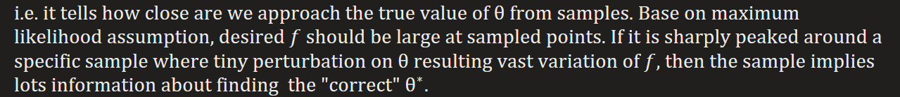
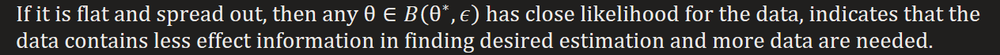

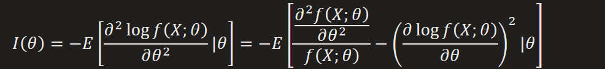
  
Since  
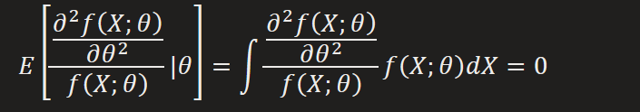

**Converge in probability & almost surely**  
**Converge in probability: law of weak large number**  
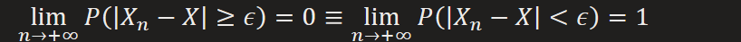  
It would be more easy to understand by making an analog to converge of series

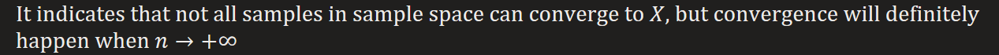

**Converge almost surely: law of strong large number**  
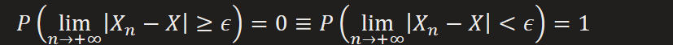

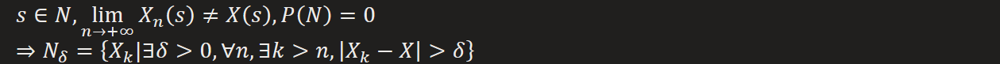  
Proof(see 5.8.4):  
If we make an informal analogy to converge of series, it's similar to
  
We can reach limit value from any where

Note: in large number form
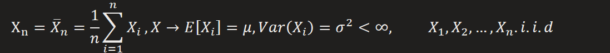

**Connection**  
Converge almost surely implies Converge in probability, actually, sequence of CIP implies sub sequence of CAS, this is also similar to series

**Data Simplification : Statistics**  
What is statistics ?  
It's a mapping from sample space to a real number

So it's a division on sample space

In that sense

In more general way, any regression and classification(learning from data) is a process of finding corresponding statistic

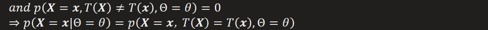

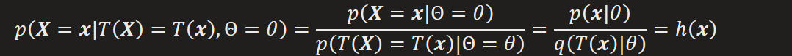

How to find it ? By factorizing the joint distribution (**proof 6.2.6**)

(Bijective)Function of sufficient statistic is still a sufficient statistic

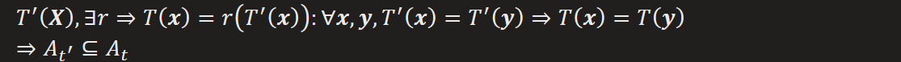

How to find it ?

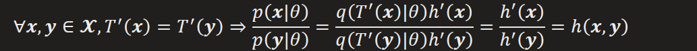

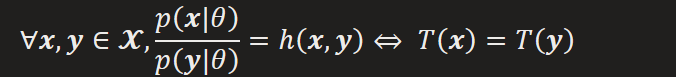

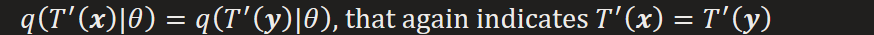

Proof:

  
[**Complete Statistic**](https://stats.stackexchange.com/questions/196601/what-is-the-intuition-behind-defining-completeness-in-a-statistic-as-being-impos):

What's it for ?

"[WhenTis in addition complete, there can only be one unbiased estimator based onT](https://stats.stackexchange.com/questions/44086/intuition-behind-completeness/44135#44135)"

Recall that a unbiased estimator satisfies:

Proof for uniqueness:

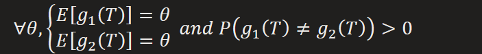

Also, any complete statistic is minimal sufficient statistic if there exist one
Basu Theorem: Ancillary statistic is independent to Complete statistic  

e.g. [Order Statistic](https://en.wikipedia.org/wiki/Order_statistic#Notation_and_examples)

It's a **sufficient statistic**

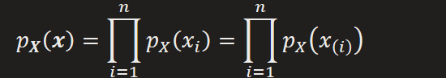

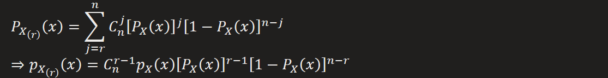

Joint Density Distribution

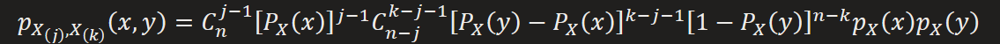

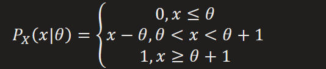

Replaced with

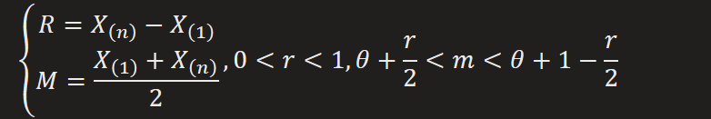

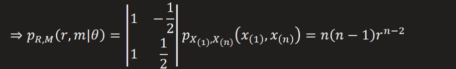

(R,M) is **minimal sufficient statistic**.

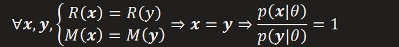

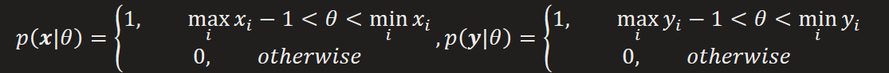

Also, we can find that function of minimal sufficient statistic is still a minimal sufficient statistic

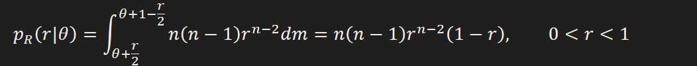

Further, we can test its completeness

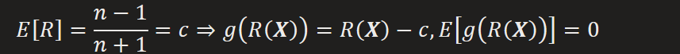

Which is a unbiased estimator of zero

But it is not identically zero

So it's **not a complete statistic**

**Connection between Statistic and Estimate**  
If a statistic is a sufficient one, which means it contains all the information for inference of parameters of interest, then it's statistical form, a function of observation random variables, can be acted as an estimator of the parameters we cared. When real values were observed, an estimate or estimation can be evaluated from estimator.
In more general way, statistic is more like an estimator and estimate is a statistic for specific samples

**Estimator & Estimation / Estimate**  
Estimator: a random variable that we are interested at has its form as a function of observable random variable, different functions(rules) result in different estimator

It's a way of simplifying data where we can extract key features of samples
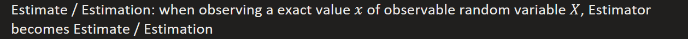
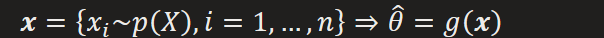

There exists two perspectives solving this problem.  
**(1) Bayesian Perspective**  
Treating parameters of desired as random variable, all estimation work is basing on posterior probability distribution
Given

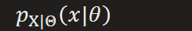  
Yield  
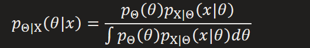  
[The procedure of finding posterior can be an iterative process](onenote:#Regression&section-id={7C05A5A2-335F-4120-B309-F2C7D1ABD289}&page-id={15B84857-BF9F-44AC-822C-CD1C7CABB718}&object-id={1B433145-811F-4084-9CB0-2ED0EA324946}&65&base-path=https://d.docs.live.net/276cf4f2e18c3166/文档/寿枫%20的笔记本/Blog.one)
Estimator under Bayesian  

"""Informally, the max posterior rule can be seen as max rule, while LMS as average

So we can have max posterior estimator and conditional expectation estimator"""

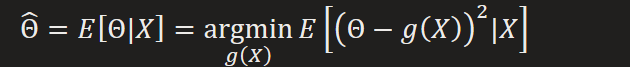

  
Respectively, we can have max posterior estimation and conditional expectation estimation

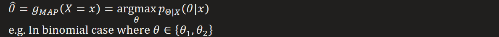

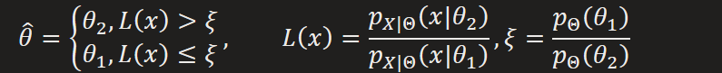

**Special case: linear regression(least square method)**

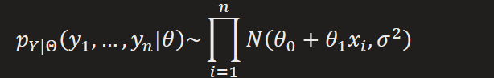

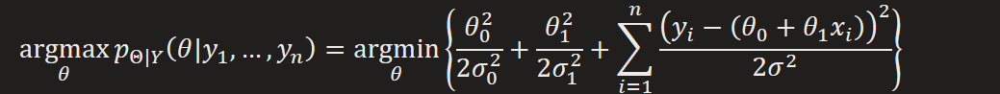

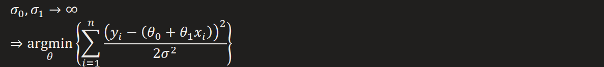

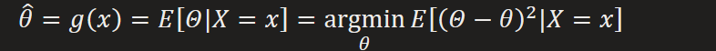

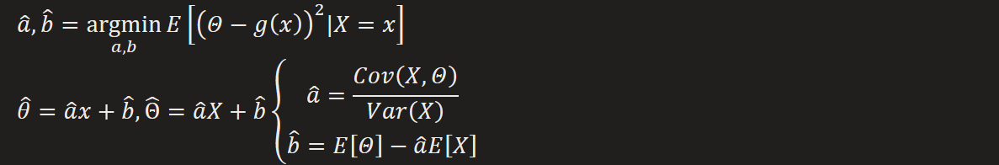

**Special case: linear regression(least square method)**

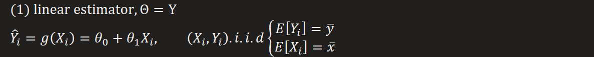

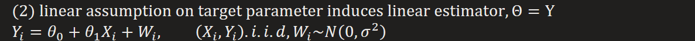

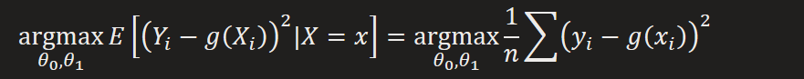

This will link to [our discussion on regression](onenote:#Regression&section-id={7C05A5A2-335F-4120-B309-F2C7D1ABD289}&page-id={15B84857-BF9F-44AC-822C-CD1C7CABB718}&object-id={E7CD12D4-253C-4FF9-9030-43CEB80DE0CC}&2B&base-path=https://d.docs.live.net/276cf4f2e18c3166/文档/寿枫%20的笔记本/Blog.one)

  
Actually, we can make an analogy to classification accuracy metric

|  | True | False |
|----|----|----|
| Positive |  |  |
| Negative |  |  |
  
What we interest :
How good is our decision

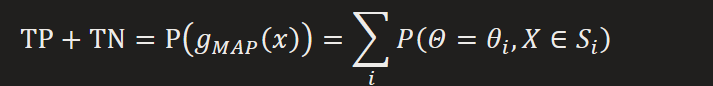

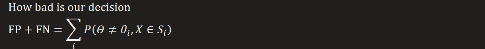
e.g. for binomial case
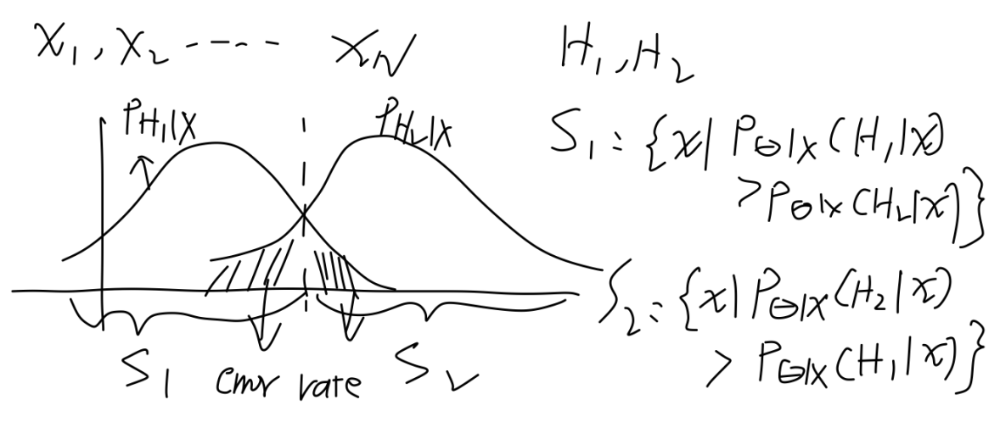

**(2) Classical Perspective**  
Treating parameters of fix constant, we can make an analogy from Bayesian
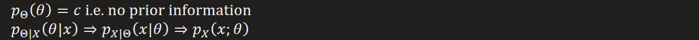

**Transformation from MAP to ML**  

Estimator under Classical  
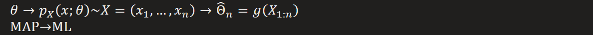

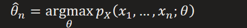

**Special case: linear regression(least square method)**

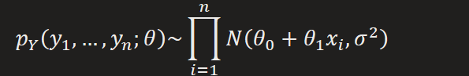

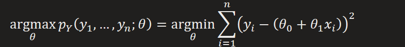

This is equivalent to no prior case of Bayesian linear regression
Error Estimator  
  
Bias Estimator  
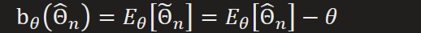

  
An important property of ML Estimator ---- approximately close to Normal
Provided  
  
Yield  
  
This property plays an crucial role in finding **Confidence Interval** and **Rejection threshold**

  
e.g. Confidence Interval  

  
e.g. Hypothesis Test  
  
e.g. Significant Test  

**Classical simple hypothesis test can make analogy from Bayesian's one**  
We now only consider binomial case, as an example shown in Bayesian  

  
Base on ML code, we want to know how confidence is our decision  

**More general adaption: significant test (with complex alternative hypothesis)**  
Definition of significance  
With lower significant level a un-support observation shows up, the higher significant confidence that the hypothesis should be rejected, i.e. when such case of test shows up, we are confident enough to reject the null hypothesis.  
Now we only care **when** should we reject null hypothesis, and with **how possible(significance)** such case will happen

  
Observe  
  
Estimator  

  
Significant level of rejection(p-value)  

i.e. the frequency of when test fall in rejection area

  
Find threshold value to match significant level
Recall the estimator's property of approximately close to Normal in Confidence Interval, which comes into handy to find the matching threshold

So the key is to design estimator with such excellent property

e.g. set estimator as ratio of likelihoods

Note: we can think back to the case in simple hypothesis test

Since maximum likelihood has minimum significant level, i.e. has minimum rate of making error rejection, according to Neyman-Pearson lemma.

Assume that we use other estimate

That means when a rejection happened under ML case, it must happen in other cases

So it gives us the most tight rejection area matching the required significant level
