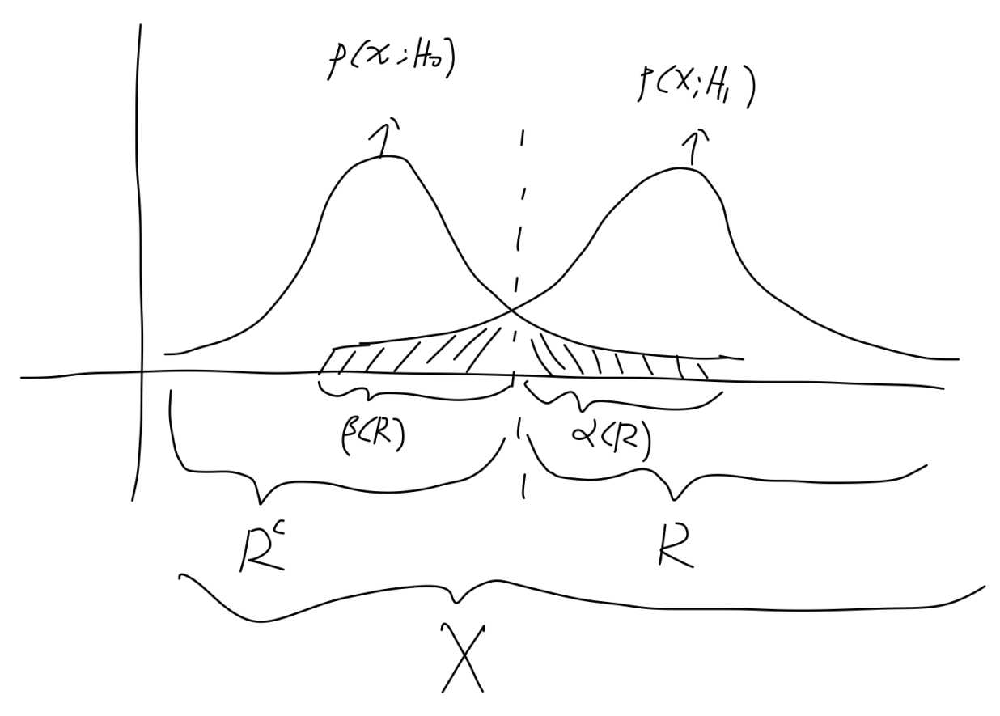
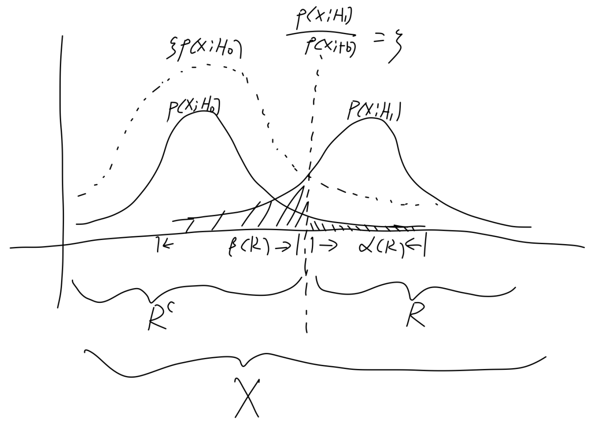

**Problem & Analysis**  
The target of Statistical Inference is to estimate parameters (or model) of interest according to relevant observable samples. By applying specific metric on the approximation between estimator to desired one, this problem can transform to an optimization problem.  
**The role of Statistical Inference in Pattern Recognition**  
Statistical Inference tells us whether a pattern is a good estimator that can generalize to out-of-distribution case
e.g. modeling pattern a relationship between gender and phone number is not a good choice than gender and height, but how can we measure the quality of pattern ?
By constructing estimator base on observation, and how good is the estimator concentrate to its expectation, how stable is the estimator against infinitesimal perturbation applied on observation.
We know that model equipped with bad pattern maybe chance level when practicing even though it 100% fit on training data(overfit)
In that perspective, Statistical Inference is a useful tool to design a good estimator which can help us find good pattern  
**Fisher Information**  
From [Wikipedia](https://en.wikipedia.org/wiki/Fisher_information):
The Fisher information is a way of measuring the amount of information that an observable [random variable](https://en.wikipedia.org/wiki/Random_variable) carries about an unknown [parameter](https://en.wikipedia.org/wiki/Parameter) upon which the probability of depends.  
[Low Fisher information therefore indicates that the maximum appears "blunt", that is, the maximum is shallow and there are many nearby values with a similar log-likelihood. Conversely, high Fisher information indicates that the maximum is sharp.](https://en.wikipedia.org/wiki/Fisher_information#Definition)  
i.e. it tells how close are we approach the true value of $\theta $ from samples. Base on maximum likelihood assumption, desired $f$ should be large at sampled points. If it is sharply peaked around a specific sample where tiny perturbation on $\theta $ resulting vast variation of $f$, then the sample implies lots information about finding the "correct" ${\theta}^{\ast}$.
If it is flat and spread out, then any $\theta \in B\left({\theta}^{\ast},\mathit{\epsilon}\right)$ has close likelihood for the data, indicates that the data contains less effect information in finding desired estimation and more data are needed.<equation>
The degree of sharp in X can be described by second-order derivative of $f$

$$
\mathrm{Score}:\ \mathrm{S}\left(X;\mathit{\theta}\right)=\frac{\mathit{\partial}\mathrm{log}f\left(X;\mathit{\theta}\right)}{\mathit{\partial}\mathit{\theta}},\ \ f\left(X;\mathit{\theta}\right):=p\left(X|\mathit{\theta}\right)
$$

$$
I\left(\mathit{\theta}\right)=-E\left[\frac{{\mathit{\partial}}^{2}\mathrm{log}f\left(X;\mathit{\theta}\right)}{\mathit{\partial}{\mathit{\theta}}^{2}}|\mathit{\theta}\right]=-E\left[\frac{\frac{{\mathit{\partial}}^{2}f\left(X;\mathit{\theta}\right)}{\mathit{\partial}{\mathit{\theta}}^{2}}}{f\left(X;\mathit{\theta}\right)}-{\left(\frac{\mathit{\partial}\mathrm{log}f\left(X;\mathit{\theta}\right)}{\mathit{\partial}\mathit{\theta}}\right)}^{2}|\mathit{\theta}\right]
$$

$$
=E\left[S{\left(X;\mathit{\theta}\right)}^{2}|\mathit{\theta}\right]=Var\left(\mathrm{S}\left(X;\mathit{\theta}\right)|\mathit{\theta}\right)
$$

Since

$$
E\left[\frac{\frac{{\mathit{\partial}}^{2}f\left(X;\mathit{\theta}\right)}{\mathit{\partial}{\mathit{\theta}}^{2}}}{f\left(X;\mathit{\theta}\right)}|\mathit{\theta}\right]=\int \frac{\frac{{\mathit{\partial}}^{2}f\left(X;\mathit{\theta}\right)}{\mathit{\partial}{\mathit{\theta}}^{2}}}{f\left(X;\mathit{\theta}\right)}f\left(X;\mathit{\theta}\right)dX=0
$$

**Converge in probability & almost surely**  
**Converge in probability: law of weak large number**  

$$
\underset{n\to +\infty}{\mathrm{lim}}P\left(\left|{X}_{n}-X\right|\ge \mathit{\epsilon}\right)=0\equiv \underset{n\to +\infty}{\mathrm{lim}}P\left(\left|{X}_{n}-X\right|<\mathit{\epsilon}\right)=1
$$

It would be more easy to understand by making an analog to converge of series

$$
\forall \mathit{\epsilon}>0,\ \exists N>0,n>N,\left|{a}_{n}-A\right|<\mathit{\epsilon}\Rightarrow \underset{n\to +\infty}{\mathrm{lim}}{a}_{n}=A\equiv \underset{n\to +\infty}{\mathrm{lim}}\left|{a}_{n}-A\right|=0
$$

It indicates that not all samples in sample space can converge to $X$, but convergence will definitely happen when $n\to +\infty $  
**Converge almost surely: law of strong large number**  

$$
P\left(\underset{n\to +\infty}{\mathrm{lim}}\left|{X}_{n}-X\right|\ge \mathit{\epsilon}\right)=0\equiv P\left(\underset{n\to +\infty}{\mathrm{lim}}\left|{X}_{n}-X\right|<\mathit{\epsilon}\right)=1
$$

It indicates almost all samples in sample space can converge to $X$, i.e.

$$
\forall s\in {\mathrm{\Omega}}_{\backslash \mathrm{N}},N\subset \mathrm{\Omega},\underset{n\to +\infty}{\mathrm{lim}}{X}_{n}\left(s\right)=X\left(s\right)\Rightarrow \left\{{X}_{n}\right\}\stackrel{1}{\to}X,
$$

$$
s\in N,\underset{n\to +\infty}{\mathrm{lim}}{X}_{n}\left(s\right)\ne X\left(s\right),P\left(N\right)=0
$$

$$
\Rightarrow {N}_{\mathit{\delta}}=\left\{{X}_{k}|\exists \mathit{\delta}>0,\forall n,\exists k>n,\left|{X}_{k}-X\right|>\mathit{\delta}\right\}
$$

Proof(see 5.8.4):
If we make an informal analogy to converge of series, it's similar to

$$
{a}_{n}=1,n\ge 0,\underset{n\to +\infty}{\mathrm{lim}}{a}_{n}=1
$$

We can reach limit value from any where
Note: in large number form

$$
{\mathrm{X}}_{\mathrm{n}}={\stackrel{-}{X}}_{n}=\frac{1}{n}{\sum}_{i=1}^{n}{X}_{i},X\to E\left[{X}_{i}\right]=\mathit{\mu},\ Var\left({X}_{i}\right)={\mathit{\sigma}}^{2}<\infty ,\ \ \ {X}_{1},{X}_{2},\dots ,{X}_{n}.i.i.d
$$

**Connection**  
Converge almost surely implies Converge in probability, actually, sequence of CIP implies sub sequence of CAS, this is also similar to series  
**Data Simplification : Statistics**  
What is statistics ?
  It's a mapping from sample space to a real number

$$
T:X\to \mathcal{T},\ \ \mathcal{T}=\left\{t:\exists \bm{x}\in X,t=T\left(\bm{x}\right)\right\}
$$

$$
random\ variable\ \bm{X}:\mathbf{\Omega}\to X
$$

  So it's a division on sample space

$$
{\mathrm{A}}_{t}:\left\{\bm{x}:t=T\left(\bm{x}\right)\right\},t\in \mathcal{T}\Rightarrow {\cup}_{t}{A}_{t}=X,{A}_{t}\cap {A}_{{t}^{\prime}}=\varnothing 
$$

  In that sense
    a hyperplane represented by $T\left(\bm{x}\right)$ on sample space is a statistic
    k-mean, as a division on sample space, can also described by $T\left(\bm{x}\right)$
  In more general way, any regression and classification(learning from data) is a process of finding corresponding statistic
**Sufficient Statistic**: simplify data while keeping information about $\mathrm{\Theta}$ in still, conditional independence

$$
\forall \mathit{\theta},p\left(\bm{X}=\bm{x}|T\left(\bm{X}\right)=T\left(\bm{x}\right),\mathrm{\Theta}=\mathit{\theta}\right)=p\left(\bm{X}=\bm{x}|T\left(\bm{X}\right)=T\left(\bm{x}\right)\right)=h\left(x\right)
$$

  and 

$$
 P\left(\mathbf{X} = \mathbf{x}, T(\mathbf{X}) \neq T(\mathbf{x}), \Theta = \theta\right) = 0
$$

$$
\Rightarrow p\left(\bm{X}=\bm{x}|\mathrm{\Theta}=\mathit{\theta}\right)=p\left(\bm{X}=\bm{x},T\left(\bm{X}\right)=T\left(\bm{x}\right),\mathrm{\Theta}=\mathit{\theta}\right)
$$

$$
p\left(\bm{X}=\bm{x}|T\left(\bm{X}\right)=T\left(\bm{x}\right),\mathrm{\Theta}=\mathit{\theta}\right)=\frac{p\left(\bm{X}=\bm{x}|\mathrm{\Theta}=\mathit{\theta}\right)}{p\left(T\left(\bm{X}\right)=T\left(\bm{x}\right)|\mathrm{\Theta}=\mathit{\theta}\right)}=\frac{p\left(\bm{x}|\mathit{\theta}\right)}{q\left(T\left(\bm{x}\right)|\mathit{\theta}\right)}=h\left(\bm{x}\right)
$$

  How to find it ? By factorizing the joint distribution (**proof 6.2.6**)
  **To find a ** $T\left(\bm{X}\right)$ **that meets the equation**

$$
T\left(\bm{X}\right)\ is\ sufficient\ statistic\iff \exists g\left(t|\mathit{\theta}\right),h\left(\bm{x}\right),\ \forall \bm{x}\in X,p\left(\bm{x}|\mathit{\theta}\right)=g\left(T\left(x\right)|\mathit{\theta}\right)h\left(\bm{x}\right)
$$

  (Bijective)Function of sufficient statistic is still a sufficient statistic

$$
{T}^{\ast}\left(\bm{x}\right)=r\left(T\left(\bm{x}\right)\right)\Rightarrow p\left(\bm{x}|\mathit{\theta}\right)=g\left({r}^{-1}\left({T}^{\ast}\left(\bm{x}\right)\right)|\mathit{\theta}\right)h\left(\bm{x}\right)={g}^{\ast}\left({T}^{\ast}\left(\bm{x}\right)|\mathit{\theta}\right)h\left(\bm{x}\right)
$$

**Minimal Sufficient Statistic**: maximal simplification of data while keeping information of $\mathrm{\Theta}$ in still
   $T\left(\bm{X}\right)$ is minimal sufficient statistic:

$$
{T}^{\prime}\left(\bm{X}\right),\exists r\Rightarrow T\left(\bm{x}\right)=r\left({T}^{\prime}\left(\bm{x}\right)\right):\forall \bm{x},\bm{y},{T}^{\prime}\left(\bm{x}\right)={T}^{\prime}\left(\bm{y}\right)\Rightarrow T\left(\bm{x}\right)=T\left(\bm{y}\right)
$$

$$
\Rightarrow {A}_{t^{\prime}}\subseteq {A}_{t}
$$

  How to find it ?
  **To find a **$T\left(\bm{X}\right)$ **that meets the equation**

$$
\forall \bm{x}\in X,\mathit{\theta},p\left(\bm{x}|\mathit{\theta}\right)>0
$$

$$
\forall \bm{x},\bm{y}\in X,{T}^{\prime}\left(\bm{x}\right)={T}^{\prime}\left(\bm{y}\right)\Rightarrow \frac{p\left(\bm{x}|\mathit{\theta}\right)}{p\left(\bm{y}|\mathit{\theta}\right)}=\frac{q\left({T}^{\prime}\left(\bm{x}\right)|\mathit{\theta}\right){h}^{\prime}\left(\bm{x}\right)}{q\left({T}^{\prime}\left(\bm{y}\right)|\mathit{\theta}\right){h}^{\prime}\left(\bm{y}\right)}=\frac{{h}^{\prime}\left(\bm{x}\right)}{h^{\prime}\left(\bm{y}\right)}=h\left(\bm{x},\bm{y}\right)
$$

$$
\forall \bm{x},\bm{y}\in X,\frac{p\left(\bm{x}|\mathit{\theta}\right)}{p\left(\bm{y}|\mathit{\theta}\right)}=h\left(\bm{x},\bm{y}\right)\iff \ T\left(\bm{x}\right)=T\left(\bm{y}\right)
$$

  Since only $q\left({T}^{\prime}\left(\bm{x}\right)|\mathit{\theta}\right)$ contains $\mathit{\theta}$, so $\frac{p\left(\bm{x}|\mathit{\theta}\right)}{p\left(\bm{y}|\mathit{\theta}\right)}$ is a constant function w.r.t $\mathit{\theta}$ means that
  $q\left({T}^{\prime}\left(\bm{x}\right)|\mathit{\theta}\right)=q\left({T}^{\prime}\left(\bm{y}\right)|\mathit{\theta}\right)$, that again indicates ${T}^{\prime}\left(\bm{x}\right)={T}^{\prime}\left(\bm{y}\right)$
  Since $T\left(\bm{x}\right)=r\left({T}^{\prime}\left(\bm{x}\right)\right)$, so yields $T\left(\bm{x}\right)=T\left(\bm{y}\right)$, telling that $T$ is a coarserest division
  Proof:
  (1) Prove that $T\left(x\right)$ is sufficient statistic
  (2) Prove that $T\left(x\right)$ is minimal sufficient statistic
**Ancillary Statistic**: doesn't contain any information about $\mathrm{\Theta}$

$$
p\left(T\left(\bm{X}\right)=T\left(\bm{x}\right)|\mathrm{\Theta}=\mathit{\theta}\right)=p\left(T\left(\bm{X}\right)=T\left(x\right)\right)
$$

  But it can provide complementary information when combined with information from $\mathrm{\Theta}$
[**Complete Statistic**](https://stats.stackexchange.com/questions/196601/what-is-the-intuition-behind-defining-completeness-in-a-statistic-as-being-impos):
   $T\left(\bm{X}\right)$ is complete statistic if any unbiased estimator of zero based on $T$ is identically zero:

$$
T\left(\bm{X}\right)~p\left(T\left(\bm{X}\right)=t|\mathrm{\Theta}=\mathit{\theta}\right)\ satisfies:
$$

  For family of $T$'s distribution

$$
uniquely\ \exists g,\forall \mathit{\theta},\ {E}_{\mathit{\theta}}\left[g\left(T\right)\right]=0\Rightarrow p\left(g\left(T\right)=0|\mathrm{\Theta}=\mathit{\theta}\right)=1
$$

   $g\left(T\right)$ is unbiased estimator of zero
  What's it for ?
    "[When T is in addition complete, there can only be one unbiased estimator based on T](https://stats.stackexchange.com/questions/44086/intuition-behind-completeness/44135#44135)"
  Recall that a unbiased estimator satisfies:

$$
E\left[f\left(\bm{X}\right)\right]=\mathit{\theta}
$$

    So $f\left(\bm{X}\right)$ is a unbiased estimate of $\mathit{\theta}$
  Proof for uniqueness:
  Suppose for sufficient statistic $T$, we have two unbiased estimators of $\mathit{\theta}$ based on $T$

$$
\forall \mathit{\theta},\left\{\begin{array}{c}E\left[{g}_{1}\left(T\right)\right]=\mathit{\theta}\\ E\left[{g}_{2}\left(T\right)\right]=\mathit{\theta}\end{array}\right.\ and\ P\left({g}_{1}\left(T\right)\ne {g}_{2}\left(T\right)\right)>0
$$

     $\Rightarrow E\left[{g}_{1}\left(T\right)-{g}_{2}\left(T\right)\right]=0\Rightarrow T$ is not complete statistic
  So, completeness of an sufficient statistic assures unique unbiased estimator on $T$  
  Also, any complete statistic is minimal sufficient statistic if there exist one
Basu Theorem: Ancillary statistic is independent to Complete statistic
  $T\left(\bm{X}\right)$: complete statistic, $S\left(\bm{X}\right)$: ancillary statistic

$$
P\left(S\left(\bm{X}\right)=s|T\left(\bm{X}\right)=t\right)=P\left(S\left(\bm{X}\right)=s\right)
$$

e.g. [Order Statistic](https://en.wikipedia.org/wiki/Order_statistic#Notation_and_examples)

$$
{X}_{1},\dots ,{X}_{n}~{p}_{X}\left(x\right).i.i.d,\ \ T\left(\bm{X}\right)=\left({X}_{\left(1\right)},\dots ,{X}_{\left(n\right)}\right),\ \ {x}_{\left(1\right)}\le {x}_{\left(2\right)}\le \dots \le {x}_{\left(n\right)}
$$

  It's a **sufficient statistic**

$$
{p}_{\bm{X}}\left(\bm{x}\right)={\prod}_{i=1}^{n}{p}_{X}\left({x}_{i}\right)={\prod}_{i=1}^{n}{p}_{X}\left({x}_{\left(i\right)}\right)
$$

  Cumulative Distribution for ${X}_{\left(r\right)}$ can be seen as $\mathrm{B}\left(n,r\right)\ with\ p={P}_{X}\left(x\right)$
  Where we have r values: $x\le {x}_{\left(r\right)}$ and n-r values: $x>{x}_{\left(r\right)}$

$$
{P}_{{X}_{\left(r\right)}}\left(x\right)={\sum}_{j=r}^{n}{C}_{n}^{j}{\left[{P}_{X}\left(x\right)\right]}^{j}{\left[1-{P}_{X}\left(x\right)\right]}^{n-j}
$$

$$
\Rightarrow {p}_{{X}_{\left(r\right)}}\left(x\right)={C}_{n}^{r-1}{p}_{X}\left(x\right){\left[{P}_{X}\left(x\right)\right]}^{r-1}{\left[1-{P}_{X}\left(x\right)\right]}^{n-r}
$$

  Joint Density Distribution
  Where we have j values: $x\le {x}_{\left(j\right)}$, k-j values: ${x}_{\left(j\right)}<x\le {x}_{\left(k\right)}$, n-k values: $x>{x}_{\left(k\right)}$

$$
{p}_{{X}_{\left(j\right)},{X}_{\left(k\right)}}\left(x,y\right)={C}_{n}^{j-1}{\left[{P}_{X}\left(x\right)\right]}^{j-1}{C}_{n-j}^{k-j-1}{\left[{P}_{X}\left(y\right)-{P}_{X}\left(x\right)\right]}^{k-j-1}{\left[1-{P}_{X}\left(y\right)\right]}^{n-k}{p}_{X}\left(x\right){p}_{X}\left(y\right)
$$

$$
\Rightarrow {p}_{{X}_{\left(1\right)},{X}_{\left(n\right)}}\left({x}_{\left(1\right)},{x}_{\left(n\right)}\right)=n\left(n-1\right){\left[{P}_{X}\left({x}_{\left(n\right)}\right)-{P}_{X}\left({x}_{\left(1\right)}\right)\right]}^{n-2}{p}_{X}\left({x}_{\left(1\right)}\right){p}_{X}\left({x}_{\left(n\right)}\right)
$$

  When ${p}_{X}\left(x|\mathit{\theta}\right)=U\left(\mathit{\theta},\mathit{\theta}+1\right),\mathit{\theta}<{x}_{\left(1\right)}<{x}_{\left(n\right)}<\mathit{\theta}+1$

$$
{P}_{X}\left(x|\mathit{\theta}\right)=\left\{\begin{array}{c}0,x\le \mathit{\theta}\\ x-\mathit{\theta},\mathit{\theta}<x<\mathit{\theta}+1\\ 1,x\ge \mathit{\theta}+1\end{array}\right.
$$

$$
\Rightarrow {p}_{{X}_{\left(1\right)},{X}_{\left(n\right)}}\left({x}_{\left(1\right)},{x}_{\left(n\right)}|\mathit{\theta}\right)=n\left(n-1\right){\left({x}_{\left(n\right)}-{x}_{\left(1\right)}\right)}^{n-2}
$$

  Replaced with

$$
\left\{\begin{array}{c}R={X}_{\left(n\right)}-{X}_{\left(1\right)}\\ M=\frac{{X}_{\left(1\right)}+{X}_{\left(n\right)}}{2}\end{array}\right.,0<r<1,\mathit{\theta}+\frac{r}{2}<m<\mathit{\theta}+1-\frac{r}{2}
$$

  Note that r is constraint indirectly with $\theta $, so it's still a function of $\theta $

$$
\Rightarrow {p}_{R,M}\left(r,m|\mathit{\theta}\right)=\left|\begin{array}{cc}1& -\frac{1}{2}\\ 1& \frac{1}{2}\end{array}\right|{p}_{{X}_{\left(1\right)},{X}_{\left(n\right)}}\left({x}_{\left(1\right)},{x}_{\left(n\right)}\right)=n\left(n-1\right){r}^{n-2}
$$

  (R,M) is **minimal sufficient statistic**.

$$
\forall \bm{x},\bm{y},\left\{\begin{array}{c}R\left(\bm{x}\right)=R\left(y\right)\\ M\left(\bm{x}\right)=M\left(\bm{y}\right)\end{array}\right.\Rightarrow \bm{x}=\bm{y}\Rightarrow \frac{p\left(\bm{x}|\mathit{\theta}\right)}{p\left(\bm{y}|\mathit{\theta}\right)}=1
$$

  Actually, $T\left(\bm{X}\right)=\left({X}_{\left(1\right)},{X}_{\left(n\right)}\right)$ is already a minimal statistic

$$
p\left(\bm{x}|\mathit{\theta}\right)=\left\{\begin{array}{c}1,\ \ \underset{i}{\mathrm{max}}{x}_{i}-1<\mathit{\theta}<\underset{i}{\mathrm{min}}{x}_{i}\\ 0,\ \ otherwise\end{array}\right.,p\left(\bm{y}|\mathit{\theta}\right)=\left\{\begin{array}{c}1,\ \ \underset{i}{\mathrm{max}}{y}_{i}-1<\mathit{\theta}<\underset{i}{\mathrm{min}}{y}_{i}\\ 0,\ \ otherwise\end{array}\right.
$$

$$
\mathrm{For}\ \mathrm{same}\ \mathit{\theta},\left\{\begin{array}{c}\underset{i}{\mathrm{max}}{x}_{i}=\underset{i}{\mathrm{max}}{y}_{i}\\ \underset{i}{\mathrm{min}}{x}_{i}=\underset{i}{\mathrm{min}}{y}_{i}\end{array}\right.\iff \frac{p\left(\bm{x}|\mathit{\theta}\right)}{p\left(\bm{y}|\mathit{\theta}\right)}=1
$$

$$
\mathrm{Note}\ \mathrm{that}\ \mathrm{when}\ \left\{\begin{array}{c}\underset{i}{\mathrm{max}}{x}_{i}\ne \underset{i}{\mathrm{max}}{y}_{i}\\ \underset{i}{\mathrm{min}}{x}_{i}\ne \underset{i}{\mathrm{min}}{y}_{i}\end{array}\right.\Rightarrow \exists \frac{p\left(\bm{x}|\mathit{\theta}\right)}{p\left(\bm{y}|\mathit{\theta}\right)}=0\ or\pm \infty 
$$

  Since there will be illegal parts of $p\left(\bm{x}|\mathit{\theta}\right)=0$ when their bounds didn't match
  Also, we can find that function of minimal sufficient statistic is still a minimal sufficient statistic
   $\mathrm{R}$ alone is an **ancillary statistic**

$$
{p}_{R}\left(r|\mathit{\theta}\right)={\int}_{\mathit{\theta}+\frac{r}{2}}^{\mathit{\theta}+1-\frac{r}{2}}n\left(n-1\right){r}^{n-2}dm=n\left(n-1\right){r}^{n-2}\left(1-r\right),\ \ 0<r<1
$$

  Which is a constant function w.r.t $\mathit{\theta}$
  Further, we can test its completeness

$$
E\left[R\right]=\frac{n-1}{n+1}=c\Rightarrow g\left(R\left(\bm{X}\right)\right)=R\left(\bm{X}\right)-c,E\left[g\left(R\left(\bm{X}\right)\right)\right]=0
$$

    Which is a unbiased estimator of zero
  But it is not identically zero

$$
P\left(g\left(R\left(\bm{X}\right)\right)\ne 0\right)>0
$$

  So it's **not a complete statistic**

**Connection between Statistic and Estimate**  
If a statistic is a sufficient one, which means it contains all the information for inference of parameters of interest, then it's statistical form, a function of observation random variables, can be acted as an estimator of the parameters we cared. When real values were observed, an estimate or estimation can be evaluated from estimator.
In more general way, statistic is more like an estimator and estimate is a statistic for specific samples  
**Estimator & Estimation / Estimate**  
Estimator: a random variable that we are interested at has its form as a function of observable random variable, different functions(rules) result in different estimator

$$
\widehat{\mathrm{\Theta}}=g\left(\bm{X}\right),\bm{X}={X}_{1},\dots ,{X}_{n}
$$

  It's a way of simplifying data where we can extract key features of samples
Estimate / Estimation: when observing a exact value $x$ of observable random variable $X$, Estimator becomes Estimate / Estimation

$$
\bm{x}=\left\{{x}_{i}~p\left(X\right),i=1,\dots ,n\right\}\Rightarrow \widehat{\mathit{\theta}}=g\left(\bm{x}\right)
$$

There exists two perspectives solving this problem.  
**(1) Bayesian Perspective**  
Treating parameters of desired as random variable, all estimation work is basing on posterior probability distribution
Given

$$
{p}_{\mathrm{\Theta}}\left(\mathit{\theta}\right)
$$

$$
{p}_{\mathrm{X}|\mathrm{\Theta}}\left(x|\mathit{\theta}\right)
$$

Yield

$$
{p}_{\mathrm{\Theta}|\mathrm{X}}\left(\mathit{\theta}|x\right)=\frac{{p}_{\mathrm{\Theta}}\left(\mathit{\theta}\right){p}_{\mathrm{X}|\mathrm{\Theta}}\left(x|\mathit{\theta}\right)}{\int {p}_{\mathrm{\Theta}}\left(\mathit{\theta}\right){p}_{\mathrm{X}|\mathrm{\Theta}}\left(x|\mathit{\theta}\right)d\mathit{\theta}}
$$

[The procedure of finding posterior can be an iterative process](onenote:#Regression&section-id={7C05A5A2-335F-4120-B309-F2C7D1ABD289}&page-id={15B84857-BF9F-44AC-822C-CD1C7CABB718}&object-id={1B433145-811F-4084-9CB0-2ED0EA324946}&65&base-path=https://d.docs.live.net/276cf4f2e18c3166/文档/寿枫%20的笔记本/Blog.one)  
Estimator under Bayesian
   $g$ for estimator can be max posterior or conditional expectation(LMS)
  """Informally, the max posterior rule can be seen as max rule, while LMS as average
  So we can have max posterior estimator and conditional expectation estimator"""

$$
\widehat{\mathrm{\Theta}}={g}_{MAP}\left(X\right)
$$

$$
\widehat{\mathrm{\Theta}}=E\left[\mathrm{\Theta}|X\right]=\underset{g\left(X\right)}{\mathrm{argmin}}E\left[{\left(\mathrm{\Theta}-g\left(X\right)\right)}^{2}|X\right]
$$

  Note: if we define $\stackrel{~}{\mathrm{\Theta}}=\widehat{\mathrm{\Theta}}-\mathrm{\Theta}$, we have

$$
\mathrm{E}\left[{\stackrel{~}{\mathrm{\Theta}}}^{2}\right]={E}^{2}\left[\stackrel{~}{\mathrm{\Theta}}\right]+Var\left(\stackrel{~}{\mathrm{\Theta}}\right)=Var\left(\widehat{\mathrm{\Theta}}\right)-Var\left(\mathrm{\Theta}\right)
$$

$$
Var\left(\mathrm{\Theta}\right)=Var\left(\widehat{\mathrm{\Theta}}\right)+Var\left(\stackrel{~}{\mathrm{\Theta}}\right)
$$

After observing a sample of $x~p\left(X\right)$
  Respectively, we can have max posterior estimation and conditional expectation estimation

$$
\widehat{\mathit{\theta}}={g}_{MAP}\left(X=x\right)=\underset{\mathit{\theta}}{\mathrm{argmax}}{p}_{\mathrm{\Theta}|X}\left(\mathit{\theta}|x\right)\ \ 
$$

e.g. In binomial case where $\mathit{\theta}\in \left\{{\mathit{\theta}}_{1},{\mathit{\theta}}_{2}\right\}$

$$
\widehat{\mathit{\theta}}=\left\{\begin{array}{c}{\mathit{\theta}}_{2},L\left(x\right)>\mathit{\xi}\\ {\mathit{\theta}}_{1},L\left(x\right)\le \mathit{\xi}\end{array}\right.,\ \ L\left(x\right)=\frac{{p}_{X|\mathrm{\Theta}}\left(x|{\mathit{\theta}}_{2}\right)}{{p}_{X|\mathrm{\Theta}}\left(x|{\mathit{\theta}}_{1}\right)},\mathit{\xi}=\frac{{p}_{\mathrm{\Theta}}\left({\mathit{\theta}}_{1}\right)}{{p}_{\mathrm{\Theta}}\left({\mathit{\theta}}_{2}\right)}
$$

  **Special case: linear regression(least square method)**
   $\mathrm{\Theta}=\left({\mathrm{\Theta}}_{0},{\mathrm{\Theta}}_{1}\right),Y=\left({Y}_{1},\dots ,{Y}_{n}\right)$ is observable random variable vector

$$
{Y}_{i}={\mathrm{\Theta}}_{0}+{\mathrm{\Theta}}_{1}{x}_{i}+{W}_{i},\ \ {W}_{i}~N\left(0,{\mathit{\sigma}}^{2}\right),{\mathrm{\Theta}}_{0}~N\left(0,{\mathit{\sigma}}_{0}^{2}\right),,{\mathrm{\Theta}}_{1}~N\left(0,{\mathit{\sigma}}_{1}^{2}\right)
$$

$$
{p}_{Y|\mathrm{\Theta}}\left({y}_{1},\dots ,{y}_{n}|\mathit{\theta}\right)~{\prod}_{i=1}^{n}N\left({\mathit{\theta}}_{0}+{\mathit{\theta}}_{1}{x}_{i},{\mathit{\sigma}}^{2}\right)
$$

$$
\underset{\mathit{\theta}}{\mathrm{argmax}}{p}_{\mathrm{\Theta}|Y}\left(\mathit{\theta}|{y}_{1},\dots ,{y}_{n}\right)=\underset{\mathit{\theta}}{\mathrm{argmin}}\left\{\frac{{\mathit{\theta}}_{0}^{2}}{2{\mathit{\sigma}}_{0}^{2}}+\frac{{\mathit{\theta}}_{1}^{2}}{2{\mathit{\sigma}}_{1}^{2}}+{\sum}_{i=1}^{n}\frac{{\left({y}_{i}-\left({\mathit{\theta}}_{0}+{\mathit{\theta}}_{1}{x}_{i}\right)\right)}^{2}}{2{\mathit{\sigma}}^{2}}\right\}
$$

$$
{\mathit{\sigma}}_{0},{\mathit{\sigma}}_{1}\to \infty 
$$

$$
\Rightarrow \underset{\mathit{\theta}}{\mathrm{argmin}}\left\{{\sum}_{i=1}^{n}\frac{{\left({y}_{i}-\left({\mathit{\theta}}_{0}+{\mathit{\theta}}_{1}{x}_{i}\right)\right)}^{2}}{2{\mathit{\sigma}}^{2}}\right\}
$$

$$
\widehat{\mathit{\theta}}=g\left(x\right)=E\left[\mathit{\Theta}|X=x\right]=\underset{\mathit{\theta}}{\mathrm{argmin}}E\left[{\left(\mathit{\Theta}-\mathit{\theta}\right)}^{2}|X=x\right]
$$

  When $g$ is linear function: $g\left(x\right)=ax+b$

$$
\widehat{a},\widehat{b}=\underset{a,b}{\mathrm{argmin}}E\left[{\left(\mathit{\Theta}-g\left(x\right)\right)}^{2}|X=x\right]
$$

$$
\widehat{\mathit{\theta}}=\widehat{a}x+\widehat{b},\ \widehat{\mathrm{\Theta}}=\widehat{a}X+\widehat{b}\left\{\begin{array}{c}\widehat{a}=\frac{Cov\left(X,\mathit{\Theta}\right)}{Var\left(X\right)}\\ \widehat{b}=E\left[\mathit{\Theta}\right]-\widehat{a}E\left[X\right]\end{array}\right.
$$

  **Special case: linear regression(least square method)**
  (1) linear estimator$,\mathrm{\Theta}=\mathrm{Y}$

$$
{\widehat{Y}}_{i}=g\left({X}_{i}\right)={\mathit{\theta}}_{0}+{\mathit{\theta}}_{1}{X}_{i},\ \ \left({X}_{i},{Y}_{i}\right).i.i.d\left\{\begin{array}{c}E\left[{Y}_{i}\right]=\stackrel{-}{y}\\ E\left[{X}_{i}\right]=\stackrel{-}{x}\end{array}\right.
$$

  (2) linear assumption on target parameter induces linear estimator$,\mathrm{\Theta}=\mathrm{Y}$

$$
{Y}_{i}={\mathit{\theta}}_{0}+{\mathit{\theta}}_{1}{X}_{i}+{W}_{i},\ \ \left({X}_{i},{Y}_{i}\right).i.i.d,{W}_{i}~N\left(0,{\mathit{\sigma}}^{2}\right)
$$

$$
{\widehat{Y}}_{i}=g\left({X}_{i}\right)=E\left[{Y}_{i}|{X}_{i}\right]={\mathit{\theta}}_{0}+{\mathit{\theta}}_{1}{X}_{i}
$$

  By law of weak large number, $\mathrm{n}\to +\infty $

$$
\underset{{\mathit{\theta}}_{0},{\mathit{\theta}}_{1}}{\mathrm{argmax}}E\left[{\left({Y}_{i}-g\left({X}_{i}\right)\right)}^{2}|X=x\right]=\underset{{\mathit{\theta}}_{0},{\mathit{\theta}}_{1}}{\mathrm{argmax}}\frac{1}{n}\sum {\left({y}_{i}-g\left({x}_{i}\right)\right)}^{2}
$$

  This will link to [our discussion on regression](onenote:#Regression&section-id={7C05A5A2-335F-4120-B309-F2C7D1ABD289}&page-id={15B84857-BF9F-44AC-822C-CD1C7CABB718}&object-id={E7CD12D4-253C-4FF9-9030-43CEB80DE0CC}&2B&base-path=https://d.docs.live.net/276cf4f2e18c3166/文档/寿枫%20的笔记本/Blog.one)  
**Confidence of choice of **$\widehat{\bm{\theta}}$** : hypothesis test**  

$$
{H}_{i}:\left\{\mathrm{\Theta}={\mathit{\theta}}_{i}\right\}\Rightarrow {p}_{\mathrm{\Theta}|X}\left({H}_{i}|x\right)
$$

Actually, we can make an analogy to classification accuracy metric
For null hypothesis ${H}_{1}$
||True|False|
|-|----|-----|
|Positive|TP=correctly accept $H_{0}$|FP=wrongly accept $H_{0}$|
|Negative|TN=correctly reject $H_{0}$|FN=wrongly reject $H_{0}$|

Base on MAP code, we want to know how confidence is our decision

$$
{\mathrm{S}}_{i}=\left\{x|max\ {p}_{\mathrm{\Theta}|X}\left({H}_{i}|x\right)\right\}
$$

What we interest :
  How good is our decision

$$
\mathrm{TP}+\mathrm{TN}=\mathrm{P}\left({g}_{MAP}\left(x\right)\right)={\sum}_{i}P\left(\mathit{\Theta}={\mathit{\theta}}_{i},X\in {S}_{i}\right)
$$

  How bad is our decision

$$
\mathrm{FP}+\mathrm{FN}={\sum}_{i}P\left(\mathit{\Theta}\ne {\mathit{\theta}}_{i},X\in {S}_{i}\right)
$$

e.g. for binomial case

$$
\mathrm{TP}+\mathrm{TN}={p}_{\mathrm{\Theta}|X}\left({H}_{1}|X\in {S}_{1}\right)+{p}_{\mathrm{\Theta}|X}\left({H}_{2}|{X\in S}_{2}\right)
$$

$$
\mathrm{FP}+\mathrm{FN}={p}_{\mathrm{\Theta}|X}\left({H}_{2}|X\in \ {S}_{1}\right)+{p}_{\mathrm{\Theta}|X}\left({H}_{1}|X\in {S}_{2}\right)
$$

**(2) Classical Perspective**  
Treating parameters of fix constant, we can make an analogy from Bayesian
${p}_{\mathrm{\Theta}}\left(\mathit{\theta}\right)=c\ $i.e. no prior information

$$
{p}_{\mathrm{\Theta}|X}\left(\mathit{\theta}|x\right)\Rightarrow {p}_{X|\mathrm{\Theta}}\left(x|\mathit{\theta}\right)\Rightarrow {p}_{X}\left(x;\mathit{\theta}\right)
$$

**Transformation from MAP to ML**  

$$
\mathrm{MAP}:\underset{\mathit{\theta}}{\mathrm{argmax}}{p}_{\mathrm{\Theta}|X}\left(\mathit{\theta}|x\right)=\underset{\mathit{\theta}}{\mathrm{argmax}}{p}_{\mathrm{\Theta}}\left(\mathit{\theta}\right){p}_{X|\mathrm{\Theta}}\left(x|\mathit{\theta}\right)
$$

With ${p}_{\mathrm{\Theta}}\left(\mathit{\theta}\right)=c$ i.e. no prior information, equal to

$$
\mathrm{ML}:\ \underset{\mathit{\theta}}{\mathrm{argmax}}{p}_{X|\mathrm{\Theta}}\left(x|\mathit{\theta}\right)=\underset{\mathit{\theta}}{\mathrm{argmax}}{p}_{X}\left(x;\mathit{\theta}\right)
$$

Estimator under Classical

$$
\mathit{\theta}\to {p}_{X}\left(x;\mathit{\theta}\right)~X=\left({x}_{1},\dots ,{x}_{n}\right)\to {\widehat{\mathrm{\Theta}}}_{n}=g\left({X}_{1:n}\right)
$$

MAP$\to $ML

$$
{\widehat{\mathit{\theta}}}_{n}=\underset{\mathit{\theta}}{\mathrm{argmax}}{p}_{X}\left({x}_{1},\dots ,{x}_{n};\mathit{\theta}\right)
$$

  **Special case: linear regression(least square method)**
   $\mathit{\theta}=\left({\mathit{\theta}}_{0},{\mathit{\theta}}_{1}\right),\ Y=\left({Y}_{1},\dots ,{Y}_{n}\right)$ is observable random variable vector

$$
{Y}_{i}={\mathit{\theta}}_{0}+{\mathit{\theta}}_{1}{x}_{i}+{W}_{i},\ \ {W}_{i}~N\left(0,\ {\mathit{\sigma}}^{2}\right)
$$

$$
{p}_{Y}\left({y}_{1},\dots ,{y}_{n};\mathit{\theta}\right)~{\prod}_{i=1}^{n}N\left({\mathit{\theta}}_{0}+{\mathit{\theta}}_{1}{x}_{i},{\mathit{\sigma}}^{2}\right)
$$

$$
\underset{\mathit{\theta}}{\mathrm{argmax}}{p}_{Y}\left({y}_{1},\dots ,{y}_{n};\mathit{\theta}\right)=\underset{\mathit{\theta}}{\mathrm{argmin}}{\sum}_{i=1}^{n}{\left({y}_{i}-\left({\mathit{\theta}}_{0}+{\mathit{\theta}}_{1}{x}_{i}\right)\right)}^{2}
$$

  This is equivalent to no prior case of Bayesian linear regression
Error Estimator

$$
{\stackrel{~}{\mathrm{\Theta}}}_{n}={\widehat{\mathrm{\Theta}}}_{n}-\mathit{\theta}
$$

Bias Estimator

$$
{\mathrm{b}}_{\mathit{\theta}}\left({\widehat{\mathrm{\Theta}}}_{n}\right)={E}_{\mathit{\theta}}\left[{\stackrel{~}{\mathrm{\Theta}}}_{n}\right]={E}_{\mathit{\theta}}\left[{\widehat{\mathrm{\Theta}}}_{n}\right]-\mathit{\theta}
$$

  Note ${E}_{\mathit{\theta}}\left[{\stackrel{~}{\mathrm{\Theta}}}_{n}^{2}\right]={\mathrm{b}}_{\mathit{\theta}}^{2}\left({\widehat{\mathrm{\Theta}}}_{n}\right)+Var\left({\widehat{\mathrm{\Theta}}}_{n}\right)$ [bias-variance trade-off](onenote:#Regression&section-id={7C05A5A2-335F-4120-B309-F2C7D1ABD289}&page-id={15B84857-BF9F-44AC-822C-CD1C7CABB718}&object-id={E7CD12D4-253C-4FF9-9030-43CEB80DE0CC}&2B&base-path=https://d.docs.live.net/276cf4f2e18c3166/文档/寿枫%20的笔记本/Blog.one)
An important property of ML Estimator ---- approximately close to Normal
Provided

$$
{p}_{X}\left(x;\mathit{\theta}\right)~{X}_{1:n}.i.i.d\ and\ limited\ E\left[X\right],Var\left(X\right)
$$

Yield

$$
\frac{{\widehat{\mathrm{\Theta}}}_{n}-\mathit{\theta}}{Var\left({\widehat{\mathrm{\Theta}}}_{n}\right)}~N\left(0,1\right),n\to +\infty 
$$

This property plays an crucial role in finding **Confidence Interval** and **Rejection threshold**
**Statement about probabilities relating to **$\bm{\theta}$
Since $\mathit{\theta}$ is not a random variable, we can not say How possibale our estimate about $\mathit{\theta}$ is true, instead, we can say there are partial tests (observation of X) from total support that $\mathit{\theta}$ is true.
e.g. Confidence Interval

$$
P\left(\frac{\left|\widehat{\Theta}_{n}-\theta\right|}{\sqrt{\mathrm{Var}\left(\widehat{\Theta}_{n}\right)}} \leq \xi\right) = 1 - \frac{\alpha}{2} \Rightarrow P\left(\widehat{\Theta}_{n}^{-} \leq \theta \leq \widehat{\Theta}_{n}^{+}\right) = 1 - \frac{\alpha}{2}
$$

It's unproper to say that $\mathit{\theta}$ has chance of $1-\frac{\mathit{\alpha}}{2}$ falling into $\left[{\widehat{\mathrm{\Theta}}}_{n}^{-},{\widehat{\mathrm{\Theta}}}_{n}^{+}\right]$, instead, we can say after observing N samples of X, yielding N intervals

$$
x\sim{P}_{X}\left(x;\mathit{\theta}\right),\ \ \left[{\widehat{\mathrm{\Theta}}}_{n}^{-},{\widehat{\mathrm{\Theta}}}_{n}^{+}\right]\Rightarrow \left[{\widehat{\mathit{\theta}}}_{n}^{-},{\widehat{\mathit{\theta}}}_{n}^{+}\right]
$$

There may be $\left(1-\frac{\mathit{\alpha}}{2}\right)\ast N$ intervals containing $\mathit{\theta}$
e.g. Hypothesis Test
 $\alpha \left(R\right)$ indicates after observing N samples of X, there may be $\alpha \left(R\right)\ast N$ samples were wrongly rejected, same as $\mathit{\beta}\left(R\right)$
e.g. Significant Test
The significant level $\alpha $ indicates there may be $\alpha \ast \mathrm{N}$ samples support rejection for null hypothesis  
**Classical simple hypothesis test can make analogy from Bayesian's one**  
We now only consider binomial case, as an example shown in Bayesian

$$
{H}_{0}:\left\{\mathrm{\Theta}={\mathit{\theta}}_{0}\right\}\Rightarrow {p}_{X}\left(x;{H}_{0}\right)
$$

$$
{H}_{1}:\left\{\mathrm{\Theta}={\mathit{\theta}}_{1}\right\}\Rightarrow {p}_{X}\left(x;{H}_{2}\right)
$$

And our metric shifts from MAP to ML, For null hypothesis ${H}_{0}$
Base on ML code, we want to know how confidence is our decision

$$
\left\{\begin{array}{c}Aecept\ region:{S}_{1}\Rightarrow {R}^{C}=\left\{x\in X|{p}_{X}\left(x;{H}_{0}\right)\ge {p}_{X}\left(x;{H}_{1}\right)\right\}\\ Reject\ region:\ {S}_{2}\Rightarrow R=\left\{x\in X|{p}_{X}\left(x;{H}_{0}\right)<{p}_{X}\left(x;{H}_{1}\right)\right\}\end{array}\right.
$$

$$
\Rightarrow \left\{\begin{array}{c}{R}^{C}=\left\{x\in X|L\left(x\right)\le 1\right\}\\ R=\left\{x\in X|L\left(x\right)>1\right\}\end{array}\right.,L\left(x\right)=\frac{{p}_{X}\left(x;{H}_{1}\right)}{{p}_{X}\left(x;{H}_{0}\right)}
$$

$$
\mathrm{TN}=1-\mathit{\beta}\left(R\right)={\mathrm{p}}_{X}\left(x\in R;{H}_{1}\right)={\mathrm{p}}_{X}\left(L\left(x\right)\ge 1;{H}_{1}\right)
$$

$$
\mathrm{FP}=1-\alpha \left(R\right)={\mathrm{p}}_{X}\left(x\in {R}^{C};{H}_{0}\right)={\mathrm{p}}_{X}\left(L\left(x\right)<1;{H}_{0}\right)
$$

How bad is our decision

$$
\mathrm{FN}=\alpha \left(R\right)={\mathrm{p}}_{X}\left(x\in R;{H}_{0}\right)={\mathrm{p}}_{X}\left(L\left(x\right)<1;{H}_{0}\right)
$$

$$
\mathrm{FP}=\mathit{\beta}\left(R\right)={\mathrm{p}}_{X}\left(x\in {R}^{C};{H}_{1}\right)={\mathrm{p}}_{X}\left(L\left(x\right)\ge 1;{H}_{1}\right)
$$

Further, by introducing a threshold $\mathit{\xi}$, we can adjust our decision and rearange the confidence of good and bad.

e.g. as described in the picture, an $\mathit{\xi}>1$ shrinks the region of $\mathrm{R}$ so as to cut the chance of wrongly placing ${\mathrm{R}}^{\mathrm{C}}$ 's samples into $\mathrm{R}$, i.e. $\alpha \left(R\right)$  
**More general adaption: significant test (with complex alternative hypothesis)**  
Definition of significance
With lower significant level a un-support observation shows up, the higher significant confidence that the hypothesis should be rejected, i.e. when such case of test shows up, we are confident enough to reject the null hypothesis.
Now we only care **when** should we reject null hypothesis, and with **how possible(significance) **such case will happen

$$
{H}_{0}:\left\{\mathrm{\Theta}={\mathit{\theta}}_{0}\right\}
$$

$$
{H}_{1}:\left\{\mathrm{\Theta}\ne {\mathit{\theta}}_{0}\right\}\ or\ \left\{\mathrm{\Theta}\ge {\mathit{\theta}}_{0}\right\}
$$

Observe

$$
\mathrm{X}=\left({X}_{1},\dots ,{X}_{n}\right)
$$

Estimator

$$
{\widehat{\mathrm{\Theta}}}_{n}=g\left(X\right)
$$

When should we reject ${\mathrm{H}}_{0}$

$$
\left\{\begin{array}{c}\left|{\widehat{\mathrm{\Theta}}}_{n}-{\mathit{\theta}}_{0}\right|>\mathit{\xi},\ \ for\ \ {H}_{1}:\left\{\mathrm{\Theta}\ne {\mathit{\theta}}_{0}\right\}\\ {\widehat{\mathrm{\Theta}}}_{n}-{\mathit{\theta}}_{0}>\mathit{\xi},\ \ \ for\ \ {H}_{1}:\left\{\mathrm{\Theta}\ge {\mathit{\theta}}_{0}\right\}\end{array}\right.
$$

Significant level of rejection(p-value)

$$
\mathit{\alpha}=\mathrm{P}\left(reject\ {H}_{0};{H}_{1}\ happened\right)=\left\{\begin{array}{c}P\left(\left|{\widehat{\mathrm{\Theta}}}_{n}-{\mathit{\theta}}_{0}\right|>\mathit{\xi}\right),\ \ for\ \ {H}_{1}:\left\{\mathrm{\Theta}\ne {\mathit{\theta}}_{0}\right\}\\ P\left({\widehat{\mathrm{\Theta}}}_{n}-{\mathit{\theta}}_{0}>\mathit{\xi}\right),\ \ \ for\ \ {H}_{1}:\left\{\mathrm{\Theta}\ge {\mathit{\theta}}_{0}\right\}\end{array}\right.
$$

  i.e. the frequency of when test fall in rejection area

$$
x~X\Rightarrow {\widehat{\mathit{\theta}}}_{n}~{\widehat{\mathrm{\Theta}}}_{n}\ and\ \left\{\begin{array}{c}\left|{\widehat{\mathit{\theta}}}_{n}-{\mathit{\theta}}_{0}\right|>\mathit{\xi},\ \ for\ \ {H}_{1}:\left\{\mathrm{\Theta}\ne {\mathit{\theta}}_{0}\right\}\\ {\widehat{\mathit{\theta}}}_{n}-{\mathit{\theta}}_{0}>\mathit{\xi},\ \ \ for\ \ {H}_{1}:\left\{\mathrm{\Theta}\ge {\mathit{\theta}}_{0}\right\}\end{array}\right.
$$

Find threshold value to match significant level
  Recall the estimator's property of approximately close to Normal in Confidence Interval, which comes into handy to find the matching threshold

$$
\left\{\begin{array}{c}P\left(\frac{\left|{\widehat{\mathrm{\Theta}}}_{n}-{\mathit{\theta}}_{0}\right|}{Var\left({\widehat{\mathrm{\Theta}}}_{n}\right)}>\frac{\mathit{\xi}}{Var\left({\widehat{\mathrm{\Theta}}}_{n}\right)}\right)=1-\frac{\mathit{\alpha}}{2},\ \ for\ \ {H}_{1}:\left\{\mathrm{\Theta}\ne {\mathit{\theta}}_{0}\right\}\\ P\left(\frac{{\widehat{\mathrm{\Theta}}}_{n}-{\mathit{\theta}}_{0}}{Var\left({\widehat{\mathrm{\Theta}}}_{n}\right)}>\frac{\mathit{\xi}}{Var\left({\widehat{\mathrm{\Theta}}}_{n}\right)}\right)=1-\mathit{\alpha},\ \ \ for\ \ {H}_{1}:\left\{\mathrm{\Theta}\ge {\mathit{\theta}}_{0}\right\}\end{array}\right.
$$

  So the key is to design estimator with such excellent property
  e.g. set estimator as ratio of likelihoods

$$
{H}_{0}:\left\{\mathrm{\Theta}={\mathit{\theta}}^{\ast}\ \right\},{\mathit{\theta}}^{\ast}=\left({\mathit{\theta}}_{1}^{\ast},\dots ,{\mathit{\theta}}_{m}^{\ast}\right)
$$

$$
{H}_{1}:\left\{\mathrm{\Theta}\ne {\mathit{\theta}}^{\ast}\ \right\}\ 
$$

$$
\widehat{\mathit{\theta}}=\underset{\mathit{\theta}}{\mathrm{argmax}}{p}_{X}\left({x}_{1},\dots ,{x}_{n};\mathit{\theta}\right)
$$

$$
{\widehat{\mathrm{\Theta}}}_{n}=\frac{{p}_{X}\left({x}_{1},\dots ,{x}_{n};\widehat{\mathit{\theta}}\right)}{{p}_{X}\left({x}_{1},\dots ,{x}_{n};{\mathit{\theta}}^{\ast}\right)}
$$

$$
\mathit{\alpha}=P\left({\widehat{\mathrm{\Theta}}}_{n}>\mathit{\xi};{H}_{0}\right)
$$

  Note: we can think back to the case in simple hypothesis test
  Since maximum likelihood has minimum significant level, i.e. has minimum rate of making error rejection, according to Neyman-Pearson lemma.
  Assume that we use other estimate

$$
\forall {\mathit{\theta}}^{\prime}\in {H}_{1}
$$

$$
{\widehat{\mathrm{\Theta}}}_{n}^{\left({\mathit{\theta}}^{\prime}\right)}=\frac{{p}_{X}\left({x}_{1},\dots ,{x}_{n};{\mathit{\theta}}^{\prime}\right)}{{p}_{X}\left({x}_{1},\dots ,{x}_{n};{\mathit{\theta}}^{\ast}\right)}
$$

  Since $\widehat{\mathit{\theta}}$ has minimum error rate, which means

$$
\forall x\in R\left(rejection\ area\right),{p}_{X}\left(x;{\mathit{\theta}}^{\prime}\right)>{p}_{X}\left(x;\widehat{\mathit{\theta}}\right)
$$

$$
\Rightarrow {\widehat{\mathrm{\Theta}}}_{n}^{\left({\mathit{\theta}}^{\prime}\right)}>{\widehat{\mathrm{\Theta}}}_{n}
$$

  That means when a rejection happened under ML case, it must happen in other cases
  So it gives us the most tight rejection area matching the required significant level
  p-value $\ =\mathrm{min}\left\{\mathit{\alpha}|\mathit{\alpha}=P\left({\widehat{\mathrm{\Theta}}}_{n}>\mathit{\xi};{H}_{0}\right)\right\}$,which describe the most tight rejection area (with minimum significant level)
