**Problem & Analysis**  
What is stochastic calculus ? And What problems it can apply ?  
First let's start from our familiar standard calculus, i.e. [Riemannian integral](https://en.wikipedia.org/wiki/Riemann_integral), but do it more precisely
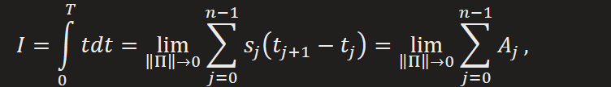

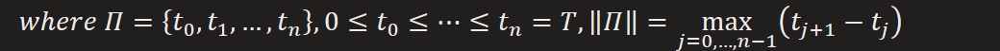

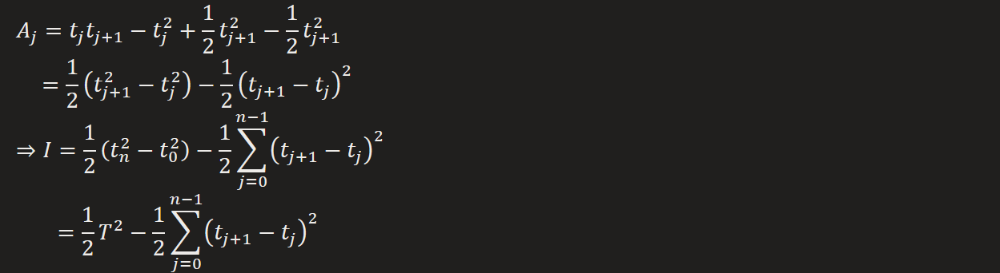
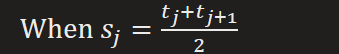
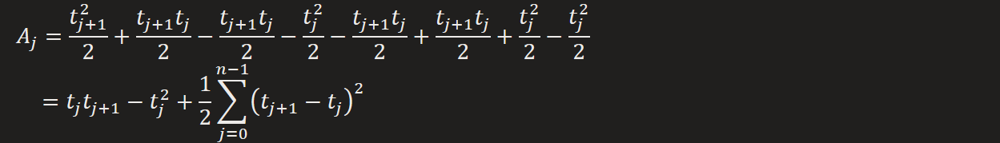

We know that

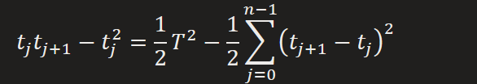

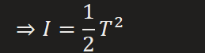  
And that's exactly matches the rules of Riemannian integral, except we need to prove that the **Quadratic variation** is 0  
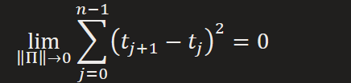

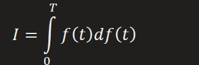  
And we can have same form of Quadratic variation  
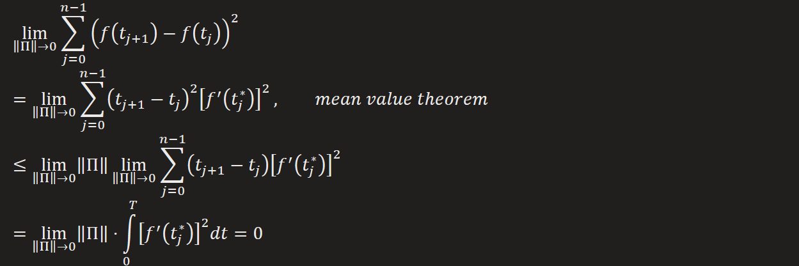  
So in case of derivable integrator, we can just use the standard rules of calculus that we all know and love. But what happen if the integrator is not derivable.  
The rules of Riemannian integral will collide on different integrant, that is  
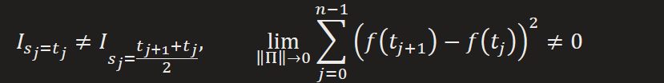
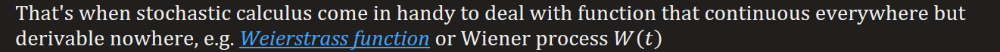

So informal way stochastic calculus can be seen as calculus over stochastic process, which is collection of random variables(a function over sample space) indexed by continuous time.  
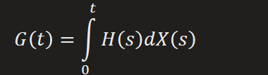

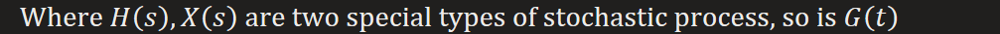  
The slight differences to Riemannian integral is how to deal with integrator of stochastic process, which is indeterministic and so its underivable.  
Why it's underivable w.r.t time ?  
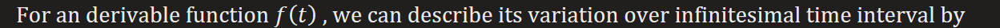

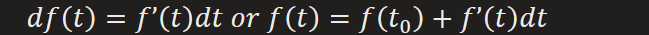

It means the increment, or path, between infinitesimal time interval is deterministic, but which is not true for a stochastic process, since the variation over infinitesimal time is randomly distributed

So without existence of deterministic description for variation, nor stochastic process is derivable

Further, such property, later we’ll see, is inherited from symmetric random walk.
Underivable stochastic process leads to non-zero quadratic variation, which results in divergent integral limits due to different integrant. That’s why the standard rules of calculus fails over it.
Note that Riemannian integral works out only when we have convergent integral limits regardless of different integrant.

To figure out what stochastic calculus is doing, we can make an comparison between regular integral and stochastic integral
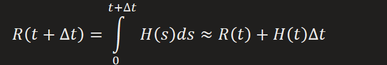

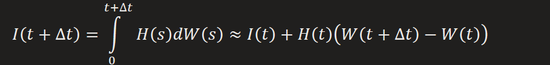
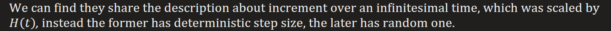  
So the output from stochastic calculus is accumulation of random increments, which is also a stochastic process.
That is a stochastic process can be a function of another one, and so is its statistics (mean, variance).
Provided statistics of its "x-stochastic-process" are known, so is its distribution, from which state at specific time can be determined.

Actually, there is **idea** works beneath the conversion from randomness to determinist or consistency between them.
Recall that stochastic process is underivable, but that is only established in deterministic space, can it be derivable in random space ?  
First let's take a look at the definition of the regular derivative  
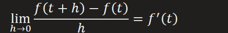  
But such limit does not exist for stochastic process, since it's also a random variable following some distribution
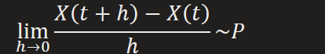  
Note that a random variable converges to its mean almost surely if its variance converges to 0  
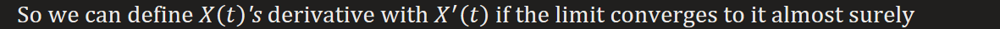
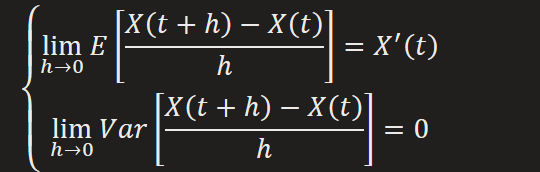

Or equivalently

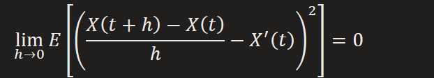  
Under the support of probabilistic tools, the definition in deterministic space can also be established in stochastic space and so is the conversion from indeterminist to determinist

**Stochastic Process**  
Let's start from a simple instance of **one dimensional symmetric random walk**, which is a discrete value, discrete time stochastic process.  
Here is the deal:  
An easy way to think of it is: starting at 0, at each time step, flip a fair coin and move up (+1) if heads, otherwise move down (-1).
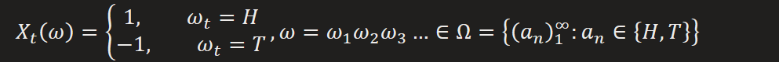
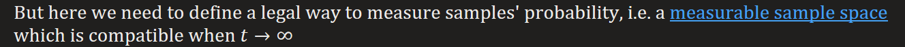

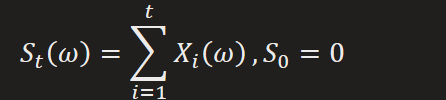  
Increment between any pairs of time step are independent, since any increment can be summation of independent Bernoulli random variable within.  
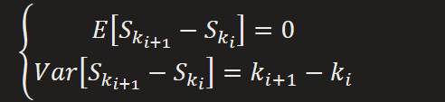  
So the state at any time step may have expectation stay at origin, but with deviation (variance) accumulating at a rate of one unit per time step.

The next is to consider a **scaled symmetric random walk** extended from its simple sibling  
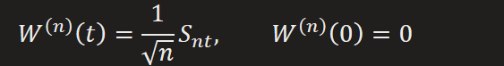
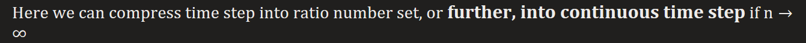
And it follows the same properties as simple random walk
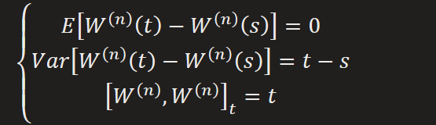

It has non-zero Quadratic variation  

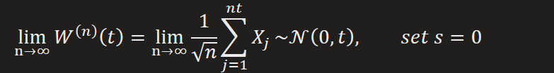

By taking the limit of scaled symmetric random walk, we can arrive at the definition of **Wiener process** , a continuous time real-valued stochastic process, which is inherited from the scaled symmetric random walk  
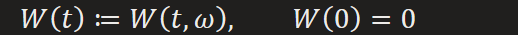 
All increments are identical independent distributed  
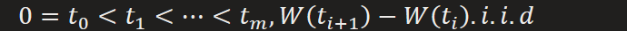

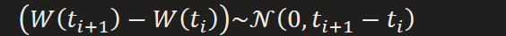
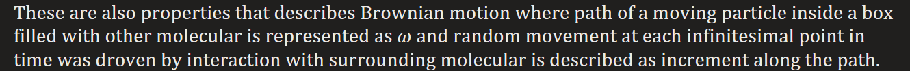  
Most importantly, quadratic variation follows consistently  
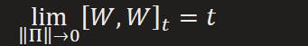  
This is at the core of stochastic calculus so that we can describe stochastic integral with its statistics  
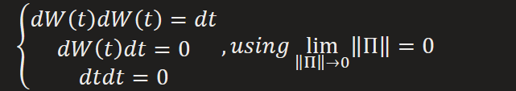

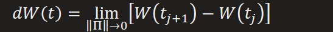

Due to some special properties(independent increment) of Weier process, any continuous time stochastic process can be written as function of it:  
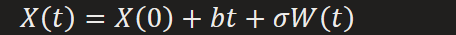
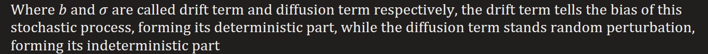

**Relationship between Gaussian white noise and Wiener process**  
Using the [definition of derivative in probabilistic space](onenote:#Stochastic%20Calculus&section-id={7C05A5A2-335F-4120-B309-F2C7D1ABD289}&page-id={B902F5EC-F124-4DA3-A095-4D81332902CE}&object-id={AE9D6B8B-1D99-0A05-0AA7-DE6ECE92FC4B}&C8&base-path=https://d.docs.live.net/276cf4f2e18c3166/文档/寿枫%20的笔记本/Blog.one), white noise is the derivative of Wiener process  
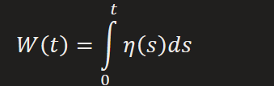  
Note that Gaussian white noise(also a stochastic process) has zero mean and Dirac delta time correlation, it can be proved that derivative of Wiener process possesses same properties  
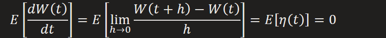

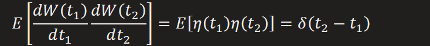
So we have
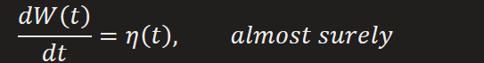

**Solving Stochastic Calculus**  
It's quite a tangent from where we start, but with a depth diving into Wiener process, the building block for any continuous real-valued stochastic process, now we can move on.  
Replace back into stochastic calculus  
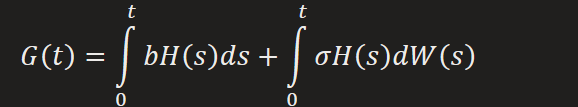
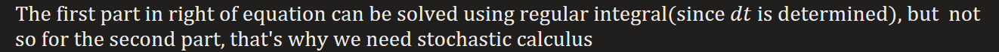

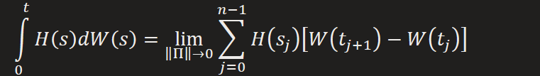
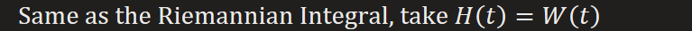

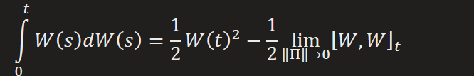

  
This is the subtle difference from regular integral that a biased integrant will result in biased stochastic process. So the solution for stochastic calculus dependents on the assumption on practical problems.
e.g. when modeling stock price at time, it will be inappropriate to pick integrant in the time interval, since the information from future is unreachable, so we can only use information at current time.

  
Replace back into stochastic calculus  
  
Which has same form as function of Wiener process  
  
[An instance of applicaiton](https://bjlkeng.io/posts/an-introduction-to-stochastic-calculus/#id20)

**Stochastic Differential Equations**  
Differential form of stochastic calculus  

  
Note that Gaussian white noise is derivative of Wiener process almost surely
  
This will leads to its SDE  
  
In paper "SCORE-BASED GENERATIVE MODELING THROUGH STOCHASTIC DIFFERENTIAL EQUATIONS", SGLD and DDPM can be described by corresponding SDEs where the integral form all involving addition with Normal noise.
This is resulted from integral property of Dirac delta function  

When analytical solution exists, stochastic calculus can work, otherwise, numerical method had to be used to solve them out
e.g. Monte Carlo Simulation and Partial Differential Equation

When stochastic process has form  
  
It can get back to similar form by using Taylor second-order expansion  

**Dynamics, a stochastic process too**  
From a birds fly view, we can roughly split a stochastic process into deterministic and non-deterministic parts, similar to [HMC](onenote:#Sampling%20Method&section-id={7C05A5A2-335F-4120-B309-F2C7D1ABD289}&page-id={4F341C3A-CF66-4855-B9B3-DA4571AC8699}&object-id={8918F406-FA6B-0184-0AFC-EF8E34924A96}&B&base-path=https://d.docs.live.net/276cf4f2e18c3166/文档/寿枫%20的笔记本/Blog.one), which simulates a Hamiltonian Dynamics to make sampling process converge to target distribution.

