**Fundamental question to texture**  
*"What features and statistics are characteristic of a texture pattern, so that texture pairs that share the same features and statistics cannot be told apart by pre-attentive human visual perception" by Julesz*

**Major challenges of texture modeling**  
1.  Psychology and neurobiology
What features and statistics are the basic elements in human texture perception?

\(i\) the basic texture statistics
2.  Mathematics and statistics
Given a set of consistent statistics, how do we generate random texture images with the identical statistics?

\(ii\) a method for mixing the exactly amount of statistics in a given recipe

**Juesz ensemble**  
*"The visual system discriminates between different textures based on the average responses of certain image filters" by Julesz*  
Definition of texture  
A family of visual pattern that share certain local statistical regularities.  

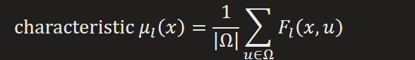

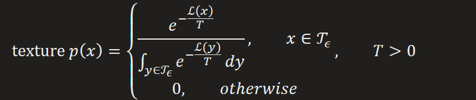

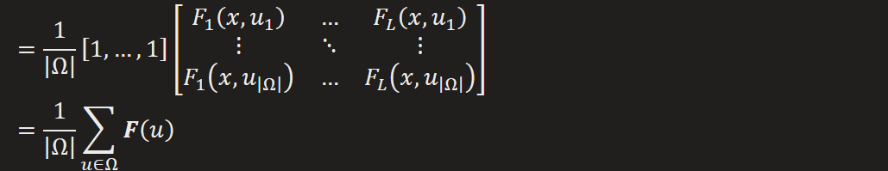

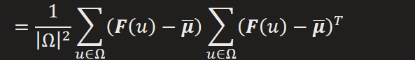

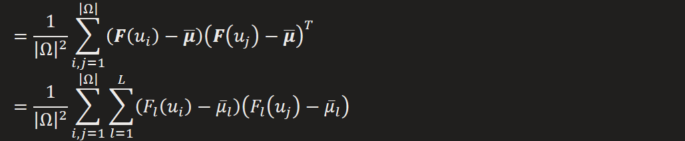

**Texture Generation**  
Learn network that draw samples from the Julesz ensemble modeling a texture
1.  Generation-by-minimization  
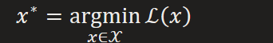  
2.  Generation-by-sampling  
  
3.  Maximum Mean Discrepancy  

  
4.  GAN

**Style Transfer**  
Indicators: visual fidelity and diversity
Generate image has style close to style image and content close to content image
1.  Stylization-by-optimization  
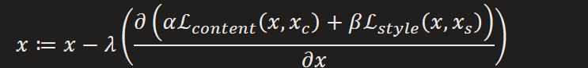

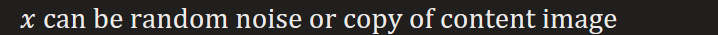

e.g. paper "Image Style Transfer Using Convolution Neural Networks"
2.  Stylization by feed-forward generator network  
For specific style

  
3.  Stylization by sampling
Paper "Improved Texture Networks: Maximizing Quality and Diversity in feed-forward Stylization and Texture Synthesis"

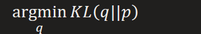

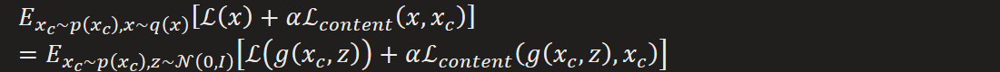

The first term measures visual fidelity, the second term measures diversity(large T)

From TetureNetV1 "*In fact, our qualitative results degraded using too many example images.*"

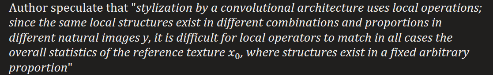

The explain is quite obscure, but we can focus on filter applied in convolution and batch normalization following.

Since only these operations are applied on multiple example images.

\(1\) Filters: Note that a specific filter only active to a specific pattern, or local structure,

With larger batch size, the more variate proportion of same local structure in a content image will be, but such variation is randomness, since our batch samples are randomly chosen, and style objective is measured by filter responses from multiple image examples and one style image, it would be so hard for filter to match all response from different content images with variate proportions of same local structure to a response from style image "where structures exist in a fixed arbitrary proportion"

\(2\) Batch Normalization: The key difference between batch normalization and

Instance(contrast) normalization is the average along batch dimension.

As discussed in TextureV2

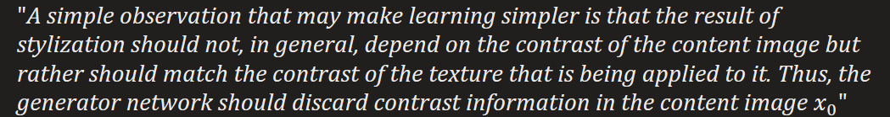

The variate proportions of same local structure in different content images may result from different contrast in different images, since contrast is the difference in luminance or color that makes an object distinguishable from other objects within the same field of view, resulting the diversity of content images.

Since images in a batch have their content quite far away from each other, the BN may only discard contrast information they share, which maybe variate from batch to batch, the remain diversity part still affect the process of stylization, i.e. the filter is struggling in between contrast of content images and style image.

Extra gain from Instance normalization (by discarding contrast information of content image)  
4.  GAN
