Tensor Product (Generalization of outer product to higher order products)  
  
Connectionist representations are patterns of activity over connectionist networks

Main topics
1.  Distributed representation of Symbolic Structures in Connectionist Systems  

Mapping structured objects to vector space  
2.  Variable Binding  
Binding a value(filler) to a variable(role, or placeholder, slot)

Representing structured objects  
Analysis of Structure
1.  (Structure)Role Decomposition  

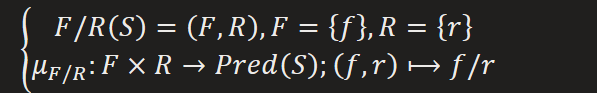

So the filler/role representation of S **induced** by the role decomposition can be

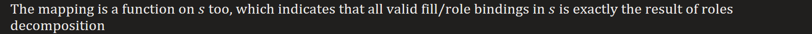

  
2.  Representing conjunctions, predicate of role decomposition for structure  
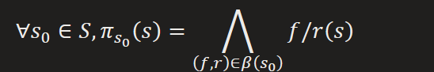

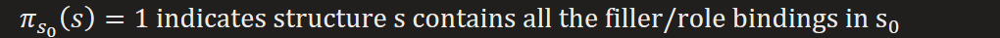

Conjunction in connectionist models is pattern superposition, i.e. vector addition

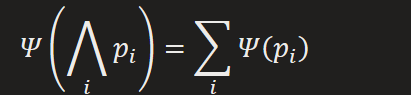  
3.  Representing variable/value bindings in Connectionist model  

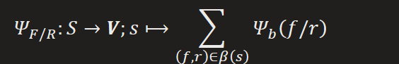

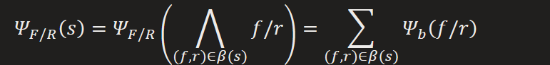

Tensor product representation for filler/role bindings

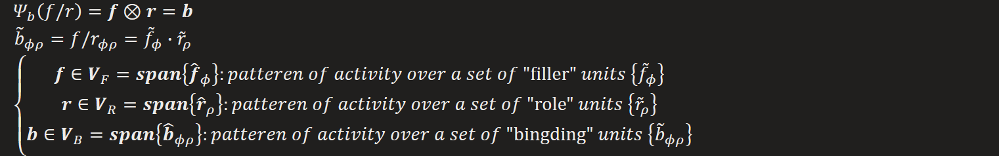

Putting all together

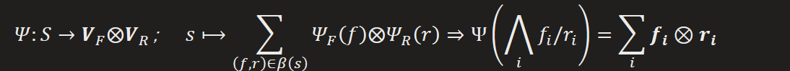

From local representation to distributed representation  
1.  Local representations  
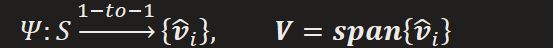

  
2.  Semi-local (or role register) representations  
  
3.  Fully distributed representations  

For composite role, which is also a symbolic object

  
4.  Their relations  
[Isomorphism under linearity](onenote:#PDP%20(Parallel%20distributed%20processing)&section-id={7C05A5A2-335F-4120-B309-F2C7D1ABD289}&page-id={1D6B13CF-A9E2-4773-A853-3E16E748BA28}&object-id={43DA6FD2-BC44-0926-369A-4EC96652250D}&E7&base-path=https://d.docs.live.net/276cf4f2e18c3166/文档/寿枫%20的笔记本/Blog.one) (PDP)

Properties of tensor product Representation  
Unbinding: extract filler for a particular role from tensor product representation

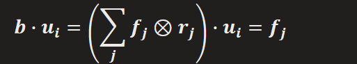

For linear dependent case, there will be intrusion from other roles

The intrusion of role j into role i, is

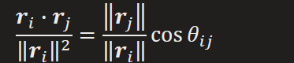

Unbinding result will be

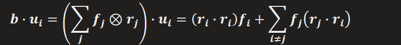

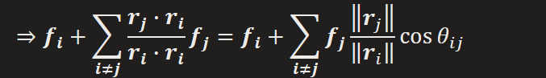

For no-single-valued case, unbinding result will be superposition of all fillers bound to that role, and vice versa

Unbounded size of structures represented in fixed connectionist network leads to saturate gracefully e.g. collapse of K-V cache

First let's define case of unbounded sensitivity(capacity)

Extension from continuous and infinite to discrete and finite cases

Properties of Variable Binding
Binding operation performed in a connectionist network

Generating independent to maintaining bindings

Extraction of constituents of structure in a connectionist network

Recursive variable binding: using value as variable

Representation can be used recursively

Retrieval of representation of structured data stored in connectionist memories

Optimality of representation and learning algorithm

