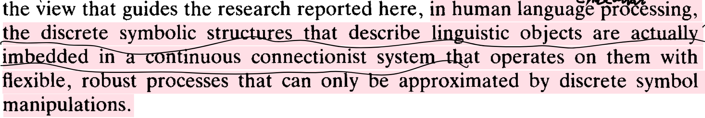

Tensor Product (Generalization of outer product to higher order products)  

$$
\bm{v}\in {R}^{n},\bm{w}\in {R}^{m},\bm{v}\otimes \bm{w}\in {R}^{nm}
$$

Connectionist representations are patterns of activity over connectionist networks
Main topics
1. Distributed representation of Symbolic Structures in Connectionist Systems

Mapping structured objects to vector space
2. Variable Binding
Binding a value(filler) to a variable(role, or placeholder, slot)

Representing structured objects
  Analysis of Structure
  1. (Structure)Role Decomposition
  activity states of a connectionist nework $\bm{V}=\bm{s}\bm{p}\bm{a}\bm{n}\left\{{\bm{v}}_{\bm{i}}\right\}$
  connectionist representation: $\mathit{\Psi}:S\to \bm{V},\ S$ is a set of symbolic structures

$$
\mathbf{f}\mathbf{a}\mathbf{i}\mathbf{t}\mathbf{h}\mathbf{f}\mathbf{u}\mathbf{l}\ \mathit{\Psi}:\ S\stackrel{1-to-1}{\to}\bm{V},\nexists {s}_{i}\in S,\mathit{\Psi}\left({s}_{i}\right)={\left[0\right]}_{v\_dim}
$$

$$
\begin{cases}
F/R(S) = (F, R), & F = \{f\}, \quad R = \{r\}, \\
\mu_{F/R} \colon F \times R \to \mathrm{Pred}(S); \quad (f, r) \longmapsto f/r.
\end{cases}
$$

   $f/r$ denotes the binding of filler f to tole r
  The mapping is a predicate function on $s\in S$*, *i.e. ${\mathit{\mu}}_{F/R}\left(f,r\right)\left(s\right)=f/r\left(s\right)=\{0,1\}$
  1 means $f$ fills role $r$, so $\mathrm{s}$ 's decomposition including role $r$ with filler $f$

$$
\mathbf{s}\mathbf{i}\mathbf{n}\mathbf{g}\mathbf{l}\mathbf{e}-\mathbf{v}\mathbf{a}\mathbf{l}\mathbf{u}\mathbf{e}\mathbf{d}\ \mathrm{roles}:\ \forall s\in S,r\in R,only\ \exists f\in F\Rightarrow f/r\left(s\right)=1
$$

  So the filler/role representation of S **induced** by the role decomposition can be

$$
\beta :S\to {2}^{F\times R};s\longmapsto\left\{\left(f,r\right)|f/r\left(s\right)=1\right\}
$$

  The mapping is a function on $s$ too, which indicates that all valid fill/role bindings in $s$ is exactly the result of roles decomposition
  Role decomposition is **recursive**: $F=S$
  Role decomposition is **faithful**: $\beta $ is 1-to-1 mapping
  Role decomposition is *finite*: $\forall s\in S,\left|\beta \left(s\right)\right|\ne \infty $
2. Representing conjunctions, predicate of role decomposition for structure

$$
\forall {s}_{0}\in S,{\mathit{\pi}}_{{s}_{0}}\left(s\right)={\bigwedge}_{\left(f,r\right)\in \mathit{\beta}\left({s}_{0}\right)}f/r\left(s\right)
$$

 ${\mathit{\pi}}_{{s}_{0}}\left(s\right)=1$ indicates structure s contains all the filler/role bindings in ${\mathrm{s}}_{0}$
If role decomposition is **faithful**, then $\mathrm{s}={\mathrm{s}}_{0}$, i.e. we can recover ${\mathrm{s}}_{0}$ from the predicate ${\mathit{\pi}}_{{s}_{0}}$
Conjunction in connectionist models is pattern superposition, i.e. vector addition

$$
\mathit{\Psi}\left({\bigwedge}_{i}{p}_{i}\right)={\sum}_{i}\mathit{\Psi}\left({p}_{i}\right)
$$

3. Representing variable/value bindings in Connectionist model

$$
{\mathit{\Psi}}_{b}:\left\{f/r|f\in F,r\in R\right\}\to \bm{V}
$$

Induced by role decomposition, we can have connectionist representation of $\mathrm{S}$

$$
{\mathit{\Psi}}_{F/R}:S\to \bm{V};s\longmapsto{\sum}_{\left(f,r\right)\in \mathit{\beta}\left(s\right)}{\mathit{\Psi}}_{b}\left(f/r\right)
$$

$$
{\mathit{\Psi}}_{F/R}\left(s\right)={\mathit{\Psi}}_{F/R}\left({\bigwedge}_{\left(f,r\right)\in \mathit{\beta}\left(s\right)}f/r\right)={\sum}_{\left(f,r\right)\in \mathit{\beta}\left(s\right)}{\mathit{\Psi}}_{b}\left(f/r\right)
$$

Tensor product representation for filler/role bindings

$$
\begin{array}{c}{\mathit{\Psi}}_{b}\left(f/r\right)=\bm{f}\otimes \bm{r}=\bm{b}\\ {\stackrel{~}{b}}_{\mathit{\phi}\mathit{\rho}}=f/{r}_{\mathit{\phi}\mathit{\rho}}={\stackrel{~}{f}}_{\mathit{\phi}}\bullet {\stackrel{~}{r}}_{\mathit{\rho}}\end{array}
$$

$$
\left\{
\begin{array}{l}
\bm{f} \in \bm{V}_F = \mathrm{span}\left\{ \widehat{\bm{f}}_\phi \right\}: 
\text{pattern of activity over a set of } \text{``filler''} \text{ units } \left\{ \tilde{f}_\phi \right\}, \\
\bm{r} \in \bm{V}_R = \mathrm{span}\left\{ \widehat{\bm{r}}_\rho \right\}: 
\text{pattern of activity over a set of } \text{``role''} \text{ units } \left\{ \tilde{r}_\rho \right\}, \\
\bm{b} \in \bm{V}_B = \mathrm{span}\left\{ \widehat{\bm{b}}_{\phi\rho} \right\}: 
\text{pattern of activity over a set of } \text{``binding''} \text{ units } \left\{ \tilde{b}_{\phi\rho} \right\}.
\end{array}
\right.
$$

$$
{\mathit{\Psi}}_{F}:F\to {\bm{V}}_{F},\ \ {\mathit{\Psi}}_{R}:R\to {\bm{V}}_{R}
$$

$$
{\mathit{\Psi}}_{b}:\left\{f/r|f\in F,r\in R\right\}\to {\bm{V}}_{F}\otimes {\bm{V}}_{R};\ \ f/r\longmapsto{\mathit{\Psi}}_{F}\left(f\right)\otimes {\mathit{\Psi}}_{R}\left(r\right)
$$

Putting all together

$$
\mathit{\Psi}:S\to {\bm{V}}_{F}\otimes {\bm{V}}_{R};\ \ s\longmapsto{\sum}_{\left(f,r\right)\in \mathit{\beta}\left(s\right)}{\mathit{\Psi}}_{F}\left(f\right)\otimes {\mathit{\Psi}}_{R}\left(r\right)\Rightarrow \mathrm{\Psi}\left({\bigwedge}_{i}{f}_{i}/{r}_{i}\right)={\sum}_{i}{\bm{f}}_{\bm{i}}\otimes {\bm{r}}_{\bm{i}}
$$

  From local representation to distributed representation
  1. Local representations

$$
\mathit{\Psi}:S\stackrel{1-to-1}{\to}\left\{{\widehat{\bm{v}}}_{i}\right\},\ \ \bm{V}=\bm{s}\bm{p}\bm{a}\bm{n}\left\{{\widehat{\bm{v}}}_{i}\right\}
$$

  For both ${\mathit{\Psi}}_{F}$ and ${\mathit{\Psi}}_{R}$
2. Semi-local (or role register) representations
 ${\mathit{\Psi}}_{F}$ is distributed and ${\mathit{\Psi}}_{R}$ is local
3. Fully distributed representations
both ${\mathit{\Psi}}_{F}$ and ${\mathit{\Psi}}_{R}$ are distributed
For composite role, which is also a symbolic object
e.g. ${\mathrm{r}}_{a\_b}$, its pattern come from tensor product (binding) of sub roles and fillers

$$
{\mathit{\Psi}}_{b}\left(a/{r}_{left\ neighbor}\right)+{\mathit{\Psi}}_{b}\left(b/{r}_{right\ neighbor}\right)
$$

4. Their relations  
[Isomorphism under linearity](onenote:#PDP%20(Parallel%20distributed%20processing)&section-id={7C05A5A2-335F-4120-B309-F2C7D1ABD289}&page-id={1D6B13CF-A9E2-4773-A853-3E16E748BA28}&object-id={43DA6FD2-BC44-0926-369A-4EC96652250D}&E7&base-path=https://d.docs.live.net/276cf4f2e18c3166/文档/寿枫%20的笔记本/Blog.one) (PDP)  
Properties of tensor product Representation
  Unbinding: extract filler for a particular role from tensor product representation  

$$
\Rightarrow \forall r\in R,\exists Op,\ Op\left({\mathit{\Psi}}_{F/r}\left(s\right),r\right)=f,f/r\left(s\right)=1
$$

This is because we can use orthogonality of 

$$
\bm{U}_i (\bm{r}_j) = \bm{u}_i \cdot \bm{r}_j = 
\begin{cases} 
1, & \text{if } i = j, \\ 
0, & \text{if } i \neq j.
\end{cases}
$$

The unbind operation $\mathrm{Op}$ can be implemented by using a unbinding vector ${\bm{u}}_{i}$

$$
\bm{b}\bullet {\bm{u}}_{\bm{i}}=\left({\sum}_{\bm{j}}{\bm{f}}_{\bm{j}}\otimes {\bm{r}}_{\bm{j}}\right)\bullet {\bm{u}}_{\bm{i}}={\bm{f}}_{\bm{j}}
$$

Self-addressing unbinding procedure: ${\bm{u}}_{i}={\bm{r}}_{i}$ (no requirement of linearly independent)
    For linear dependent case, there will be intrusion from other roles

$$
{\bm{r}}_{i}\bullet {\bm{r}}_{j}=\Vert {\bm{r}}_{i}\Vert \Vert {\bm{r}}_{j}\Vert \mathrm{cos}{\mathit{\theta}}_{ij},i\ne j
$$

The intrusion of role j into role i, is

$$
\frac{{\bm{r}}_{i}\bullet {\bm{r}}_{j}}{{\Vert {\bm{r}}_{i}\Vert}^{2}}=\frac{\Vert {\bm{r}}_{j}\Vert}{\Vert {\bm{r}}_{i}\Vert}\mathrm{cos}{\mathit{\theta}}_{ij}
$$

Unbinding result will be

$$
\bm{b}\bullet {\bm{u}}_{\bm{i}}=\left({\sum}_{\bm{j}}{\bm{f}}_{\bm{j}}\otimes {\bm{r}}_{\bm{j}}\right)\bullet {\bm{u}}_{\bm{i}}=\left({\bm{r}}_{\bm{i}}\bullet {\bm{r}}_{\bm{i}}\right){\bm{f}}_{\bm{i}}+{\sum}_{\bm{i}\ne \bm{j}}{\bm{f}}_{\bm{j}}\left({\bm{r}}_{\bm{j}}\bullet {\bm{r}}_{\bm{i}}\right)
$$

$$
\Rightarrow {\bm{f}}_{\bm{i}}+{\sum}_{\bm{i}\ne \bm{j}}\frac{{\bm{r}}_{\bm{j}}\bullet {\bm{r}}_{\bm{i}}}{{\bm{r}}_{\bm{i}}\bullet {\bm{r}}_{\bm{i}}}{\bm{f}}_{\bm{j}}={\bm{f}}_{\bm{i}}+{\sum}_{\bm{i}\ne \bm{j}}{\bm{f}}_{\bm{j}}\frac{\Vert {\bm{r}}_{j}\Vert}{\Vert {\bm{r}}_{i}\Vert}\mathrm{cos}{\mathit{\theta}}_{ij}
$$

For no-single-valued case, unbinding result will be superposition of all fillers bound to that role, and vice versa  
  Unbounded size of structures represented in fixed connectionist network leads to saturate gracefully e.g. collapse of K-V cache
    First let's define case of unbounded sensitivity(capacity)

$$
\mathrm{for}\ \mathrm{arbitratrily}\ \mathrm{large}\ \mathrm{n},\ \mathrm{\Psi}\left({\bigwedge}_{i}{f}_{i}/{r}_{i}\right)\ varies\ as\ {f}_{i}\ varies,\ for\ i=1,2,\dots ,n
$$

Like collide case of hash map, when faithful was broken, $\mathrm{\Psi}$ saturates
    If $\mathrm{\Psi}$ has **unbounded sensitivity and saturates**, it possesses graceful saturation  
  Extension from continuous and infinite to discrete and finite cases  

Properties of Variable Binding

  Binding operation performed in a connectionist network  

  Generating independent to maintaining bindings  
  Extraction of constituents of structure in a connectionist network  
  Recursive variable binding: using value as variable  
  Representation can be used recursively  
  Retrieval of representation of structured data stored in connectionist memories

Optimality of representation and learning algorithm
